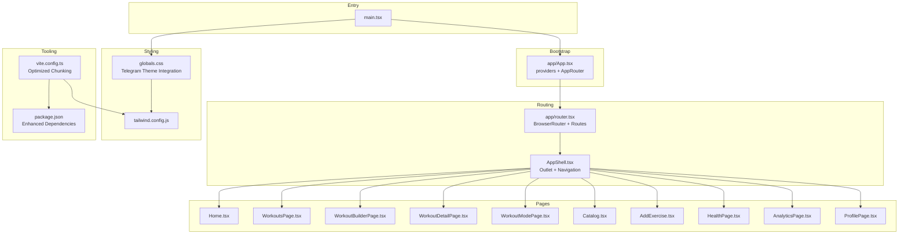
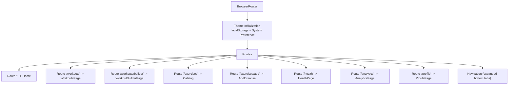
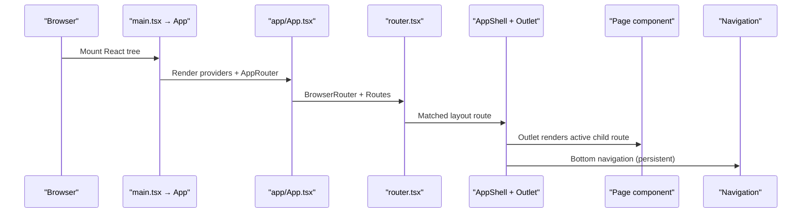
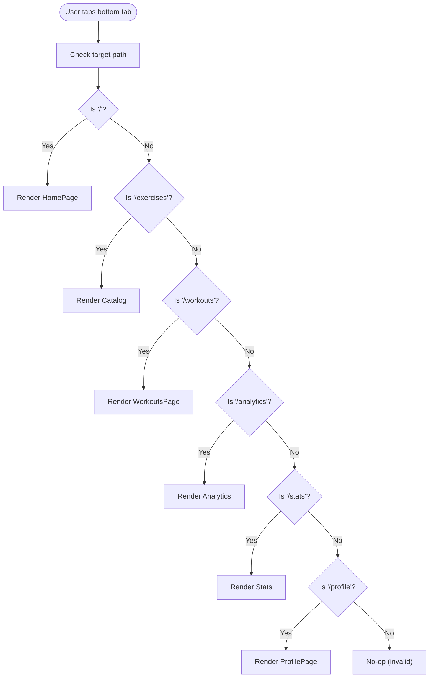
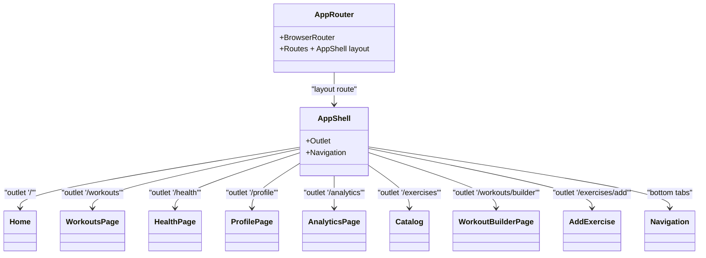
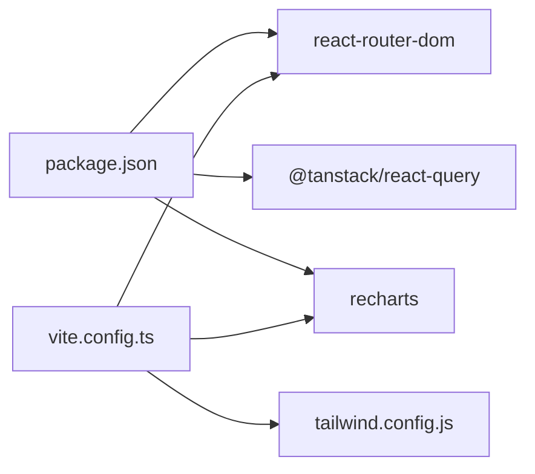

# Application Structure & Routing

<cite>
**Referenced Files in This Document**
- [main.tsx](file://frontend/src/main.tsx)
- [App.tsx](file://frontend/src/App.tsx)
- [app/App.tsx](file://frontend/src/app/App.tsx)
- [router.tsx](file://frontend/src/app/router.tsx)
- [AppShell.tsx](file://frontend/src/app/layouts/AppShell.tsx)
- [Navigation.tsx](file://frontend/src/components/common/Navigation.tsx)
- [Home.tsx](file://frontend/src/pages/Home.tsx)
- [HomePage.tsx](file://frontend/src/pages/HomePage.tsx)
- [WorkoutsPage.tsx](file://frontend/src/pages/WorkoutsPage.tsx)
- [HealthPage.tsx](file://frontend/src/pages/HealthPage.tsx)
- [ProfilePage.tsx](file://frontend/src/pages/ProfilePage.tsx)
- [Analytics.tsx](file://frontend/src/pages/Analytics.tsx)
- [Catalog.tsx](file://frontend/src/pages/Catalog.tsx)
- [WorkoutBuilder.tsx](file://frontend/src/pages/WorkoutBuilder.tsx)
- [AddExercise.tsx](file://frontend/src/pages/AddExercise.tsx)
- [globals.css](file://frontend/src/styles/globals.css)
- [package.json](file://frontend/package.json)
- [vite.config.ts](file://frontend/vite.config.ts)
- [tailwind.config.js](file://frontend/tailwind.config.js)
</cite>

## Update Summary
**Changes Made**
- **Profile routing:** `/profile` maps to a single canonical screen module `ProfilePage.tsx` (legacy `Profile.tsx` and the re-export-only `ProfilePage` stub were merged). Imports and routes use `@pages/ProfilePage` from `frontend/src/app/router.tsx`.
- **Router module:** `BrowserRouter`, `Routes`, nested `AppShell`, and all page `Route` declarations live in `frontend/src/app/router.tsx`; `frontend/src/app/App.tsx` wraps providers (`QueryProvider`, `ThemeProvider`, `TelegramProvider`) and renders `AppRouter`.
- Updated routing system to include robust theme initialization during application startup
- Expanded routing configuration to include new `/exercises/add` route for exercise creation
- Enhanced theme management with proper system preference detection and storage persistence
- Added comprehensive analytics functionality with advanced charting capabilities
- Improved navigation structure with expanded bottom tab system

## Table of Contents
1. [Introduction](#introduction)
2. [Project Structure](#project-structure)
3. [Core Components](#core-components)
4. [Architecture Overview](#architecture-overview)
5. [Detailed Component Analysis](#detailed-component-analysis)
6. [Dependency Analysis](#dependency-analysis)
7. [Performance Considerations](#performance-considerations)
8. [Troubleshooting Guide](#troubleshooting-guide)
9. [Conclusion](#conclusion)

## Introduction
This document explains the FitTracker Pro frontend application's structure and routing system: **`src/app/router.tsx`** owns `BrowserRouter`, the **`AppShell`** layout (`Outlet` + bottom navigation), and nested **`Route`** declarations (including `/profile` → **`ProfilePage`**). Providers (`QueryProvider`, `ThemeProvider`, `TelegramProvider`) mount in **`src/app/App.tsx`**. The guide also covers the entry point (`main.tsx`), global styling, and mobile-first patterns.

## Project Structure
FitTracker Pro follows a feature-based frontend structure under the frontend directory. Key areas include:
- Entry in `main.tsx` (mounts root `App`; global CSS import)
- Providers and router mount in `src/app/App.tsx` (React Query, theme, Telegram context → `AppRouter`)
- **Route table** in `src/app/router.tsx` (`BrowserRouter`, `Routes`, `AppShell`, per-path `Route` children)
- Layout `src/app/layouts/AppShell.tsx` renders `<Outlet />` and bottom `Navigation`
- Page components under `src/pages` (including `ProfilePage.tsx` for `/profile`)
- Shared UI and common components under src/components
- Global styles and design tokens under src/styles with comprehensive Telegram theme integration
- Build tooling and aliases via Vite and Tailwind with optimized chunking strategy

**Diagram sources**
- [main.tsx:1-11](file://frontend/src/main.tsx#L1-L11)
- [app/App.tsx:1-14](file://frontend/src/app/App.tsx#L1-L14)
- [router.tsx:1-34](file://frontend/src/app/router.tsx#L1-L34)
- [AppShell.tsx:1-12](file://frontend/src/app/layouts/AppShell.tsx#L1-L12)
- [Navigation.tsx:1-38](file://frontend/src/components/common/Navigation.tsx#L1-L38)
- [globals.css:1-581](file://frontend/src/styles/globals.css#L1-L581)
- [tailwind.config.js:1-349](file://frontend/tailwind.config.js#L1-L349)
- [vite.config.ts:1-40](file://frontend/vite.config.ts#L1-L40)
- [package.json:1-61](file://frontend/package.json#L1-L61)

**Section sources**
- [main.tsx:1-11](file://frontend/src/main.tsx#L1-L11)
- [app/App.tsx:1-14](file://frontend/src/app/App.tsx#L1-L14)
- [router.tsx:14-30](file://frontend/src/app/router.tsx#L14-L30)
- [vite.config.ts:1-40](file://frontend/vite.config.ts#L1-L40)
- [tailwind.config.js:1-349](file://frontend/tailwind.config.js#L1-L349)

## Core Components
- **Application shell and routing**: `app/App.tsx` composes providers and renders `AppRouter` from `app/router.tsx`. The router defines `BrowserRouter`, `Routes`, a parent `Route` with `AppShell` (outlet + bottom navigation), and nested routes including **`/profile` → `ProfilePage`**.
- **Enhanced navigation**: `Navigation.tsx` lives inside `AppShell` and provides the bottom tab bar aligned to the route table in `router.tsx`.
- **Comprehensive page components**: Each path maps to a page module under `src/pages` (workouts builder/detail/mode, catalog, add exercise, health, analytics, profile, etc.).
- **Entry point**: `main.tsx` mounts the root `App` component and imports global styles; React Query and theme providers wrap the tree from `app/App.tsx`.
- **Global styles**: globals.css integrates Tailwind layers, Telegram theme variables, and utility classes for responsive and mobile-first design with enhanced dark mode support.

**Updated** Enhanced routing system with proper theme initialization and expanded analytics functionality

Key routing highlights:
- Root path "/" renders `Home`
- "/workouts" renders `WorkoutsPage`
- "/workouts/builder" renders `WorkoutBuilderPage`
- "/workouts/mode/:mode" renders `WorkoutModePage`
- "/workouts/:id" renders `WorkoutDetailPage`
- "/exercises" renders `Catalog`
- "/exercises/add" renders `AddExercise`
- "/health" renders `HealthPage`
- "/analytics" renders `AnalyticsPage`
- "/profile" renders **`ProfilePage`** (single canonical profile module)

**Section sources**
- [router.tsx:14-30](file://frontend/src/app/router.tsx#L14-L30)
- [Navigation.tsx:5-11](file://frontend/src/components/common/Navigation.tsx#L5-L11)
- [main.tsx:7-22](file://frontend/src/main.tsx#L7-L22)
- [globals.css:88-118](file://frontend/src/styles/globals.css#L88-L118)

## Architecture Overview
The routing architecture centers on a robust single-page application pattern with enhanced theme management:
- BrowserRouter provides routing context with automatic theme initialization
- Routes define static paths mapped to page components with optimized chunking
- Navigation component offers an expanded persistent bottom tab bar for quick switching
- Global styles and design tokens unify look-and-feel across pages with comprehensive Telegram integration
- React Query provides optimized data fetching with intelligent caching strategies

**Diagram sources**
- [app/App.tsx:1-14](file://frontend/src/app/App.tsx#L1-L14)
- [Navigation.tsx:13-37](file://frontend/src/components/common/Navigation.tsx#L13-L37)

**Section sources**
- [router.tsx:14-30](file://frontend/src/app/router.tsx#L14-L30)
- [Navigation.tsx:13-37](file://frontend/src/components/common/Navigation.tsx#L13-L37)

## Detailed Component Analysis

### Enhanced Routing Configuration and Layout
- **app/App.tsx** wraps the tree with `QueryProvider`, `ThemeProvider`, and `TelegramProvider`, then renders **`AppRouter`** (see `app/router.tsx`).
- Theme persistence and Telegram-aware styling are handled inside the provider layer (not in the root re-export `src/App.tsx`).
- **router.tsx** defines `BrowserRouter`, top-level `Routes`, the layout route that renders **`AppShell`** (which contains `<Outlet />` and **`Navigation`**), and nested routes for each path.

**Updated** Added robust theme initialization during application startup with localStorage persistence and system preference detection

**Diagram sources**
- [app/App.tsx:1-14](file://frontend/src/app/App.tsx#L1-L14)
- [Navigation.tsx:13-37](file://frontend/src/components/common/Navigation.tsx#L13-L37)

**Section sources**
- [app/App.tsx:1-14](file://frontend/src/app/App.tsx#L1-L14)

### Enhanced Navigation Flow and Bottom Tabs
- Navigation.tsx defines six bottom tab items: Home, Catalog, Workouts, Analytics, Stats, and Profile. Each tab maps to a route path and uses NavLink to reflect active state.
- The component applies Tailwind utility classes for consistent sizing, spacing, and active/inactive styling with enhanced Telegram theme integration.
- The expanded navigation provides better organization of fitness tracking features with Analytics now prominently featured alongside other core features.

**Updated** Enhanced navigation with expanded bottom tab system including Analytics and Stats tabs

**Diagram sources**
- [Navigation.tsx:5-11](file://frontend/src/components/common/Navigation.tsx#L5-L11)
- [router.tsx:18-28](file://frontend/src/app/router.tsx#L18-L28)

**Section sources**
- [Navigation.tsx:13-37](file://frontend/src/components/common/Navigation.tsx#L13-L37)

### Enhanced Page Components and Rendering Patterns
- **HomePage**: A lightweight dashboard-style page with stats and recent items, optimized for fast loading.
- **Home**: A feature-rich home page with widgets, pull-to-refresh, and interactive elements.
- **WorkoutsPage**: Lists workout types and recent entries with filtering and enhanced workout management.
- **HealthPage**: Displays health metrics with trend indicators and quick log actions.
- **ProfilePage**: User profile and settings menu with enhanced customization options.
- **Analytics**: Advanced data visualization with charts, export capabilities, and comprehensive fitness metrics.
- **Catalog**: Exercise catalog with filters, search, and detail modals for exercise discovery.
- **WorkoutBuilder**: Drag-and-drop builder for workout templates with autosave and modal flows.
- **AddExercise**: Comprehensive exercise creation form with validation, media upload, and community submission features.

**Updated** Added advanced analytics functionality and exercise creation capabilities

Rendering patterns:
- Each page component is self-contained and styled with Tailwind utility classes.
- Many pages use Telegram theme variables for consistent theming with enhanced dark mode support.
- Some pages implement internal navigation via programmatic navigation or modal-driven flows.
- Analytics page includes sophisticated charting with Recharts and comprehensive data export options.

**Section sources**
- [HomePage.tsx:16-86](file://frontend/src/pages/HomePage.tsx#L16-L86)
- [Home.tsx:22-276](file://frontend/src/pages/Home.tsx#L22-L276)
- [WorkoutsPage.tsx:21-112](file://frontend/src/pages/WorkoutsPage.tsx#L21-L112)
- [HealthPage.tsx:24-123](file://frontend/src/pages/HealthPage.tsx#L24-L123)
- [ProfilePage.tsx:274-780](file://frontend/src/pages/ProfilePage.tsx#L274-L780)
- [Analytics.tsx:641-800](file://frontend/src/pages/Analytics.tsx#L641-L800)
- [Catalog.tsx:1-200](file://frontend/src/pages/Catalog.tsx#L1-L200)
- [WorkoutBuilder.tsx:267-531](file://frontend/src/pages/WorkoutBuilder.tsx#L267-L531)
- [AddExercise.tsx:124-845](file://frontend/src/pages/AddExercise.tsx#L124-L845)

### Component Hierarchy and Composition
- **app/App.tsx** composes providers and **`AppRouter`**.
- **router.tsx** composes `BrowserRouter`, `Routes`, the `AppShell` layout route, and nested routes (including `/profile` → `ProfilePage`).
- **AppShell** composes the main `<Outlet />` and bottom **Navigation**.
- Each matched child route renders a page component; pages compose shared UI (cards, inputs, chips, modals).

**Updated** Enhanced component hierarchy with expanded routing and theme management

**Diagram sources**
- [router.tsx:18-28](file://frontend/src/app/router.tsx#L18-L28)
- [Navigation.tsx:13-37](file://frontend/src/components/common/Navigation.tsx#L13-L37)

**Section sources**
- [router.tsx:18-28](file://frontend/src/app/router.tsx#L18-L28)

## Dependency Analysis
- **Routing library**: react-router-dom is used for BrowserRouter, Routes, Route, and NavLink with enhanced navigation support.
- **State/data fetching**: @tanstack/react-query is configured in `app/providers/QueryProvider.tsx` (default 5-minute stale time, 1 retry) and mounted from `app/App.tsx`.
- **Advanced analytics**: recharts provides sophisticated charting capabilities for the Analytics page with responsive data visualization.
- **Tooling and bundling**: Vite resolves aliases for @components, @pages, @hooks, @stores, @services, @types, @utils, @styles with optimized chunking strategy.
- **Styling pipeline**: Tailwind processes content from index.html and src/**/*.{js,ts,jsx,tsx}, extending design tokens and animations with comprehensive Telegram theme integration.

**Updated** Enhanced dependencies with advanced analytics and optimized chunking strategy

**Diagram sources**
- [package.json:16-35](file://frontend/package.json#L16-L35)
- [vite.config.ts:9-21](file://frontend/vite.config.ts#L9-L21)
- [tailwind.config.js:3-7](file://frontend/tailwind.config.js#L3-L7)

**Section sources**
- [package.json:16-35](file://frontend/package.json#L16-L35)
- [vite.config.ts:9-21](file://frontend/vite.config.ts#L9-L21)
- [tailwind.config.js:3-7](file://frontend/tailwind.config.js#L3-L7)

## Performance Considerations
- **Route-level lazy loading**: Enhanced code-splitting per route to reduce initial bundle size with optimized chunking for heavy pages like Analytics and Catalog.
- **Query caching**: React Query defaultOptions cache queries for 5 minutes with retry=1; optimized per route needs (Analytics may benefit from longer cache or background refetch).
- **Theme optimization**: Theme initialization runs once during app mount, avoiding unnecessary re-renders and improving startup performance.
- **Rendering**: Large lists (Catalog, Analytics) leverage virtualization or pagination to improve scroll performance with enhanced data handling.
- **Assets**: Prefer lazy imports for heavy libraries (recharts) inside route components with optimized chunking strategy.
- **Chunk optimization**: Vite's manualChunks groups vendor libraries with optimized chunking for Telegram SDK, React vendor libraries, and charting components.

**Updated** Enhanced performance considerations with theme optimization and chunking improvements

[No sources needed since this section provides general guidance]

## Troubleshooting Guide
Common issues and remedies:
- **Routes not matching**: Verify exact path strings in `router.tsx` and `Navigation.tsx` `navItems`, especially for new routes like `/exercises/add`.
- **Navigation not highlighting**: Ensure NavLink isActive classes align with current route and that the bottom nav paths match route paths, including the expanded tab system.
- **Theme not applying**: Confirm theme initialization function runs during app mount and localStorage theme preferences are properly detected.
- **Analytics not rendering**: Verify recharts dependencies are properly installed and Analytics page components render correctly.
- **Styles not applying**: Confirm globals.css is imported in main.tsx and Tailwind content globs include page directories with enhanced Telegram theme integration.
- **Build errors after alias changes**: Update vite.config.ts aliases and restart dev server with optimized chunking configuration.

**Updated** Enhanced troubleshooting guide with theme and analytics considerations

**Section sources**
- [router.tsx:18-28](file://frontend/src/app/router.tsx#L18-L28)
- [Navigation.tsx:18-28](file://frontend/src/components/common/Navigation.tsx#L18-L28)
- [main.tsx:5](file://frontend/src/main.tsx#L5)
- [vite.config.ts:9-21](file://frontend/vite.config.ts#L9-L21)

## Conclusion
FitTracker Pro uses React Router with a dedicated **`app/router.tsx`** module: `BrowserRouter`, nested **`AppShell`** routes, and page components under `src/pages`. **`app/App.tsx`** wraps the router with React Query, theme, and Telegram providers (the root `src/App.tsx` file only re-exports the app implementation). **`ProfilePage.tsx`** is the single module behind `/profile`. Global styles and Tailwind tokens keep Telegram Mini App theming consistent. For production readiness, consider route-level code splitting, tuned React Query defaults in `QueryProvider`, and performance work on heavy pages such as Analytics and Catalog.