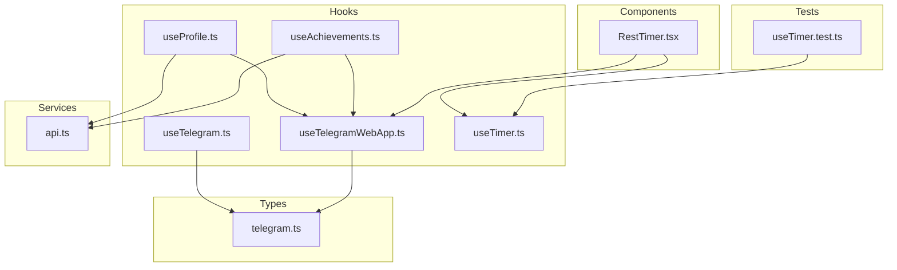
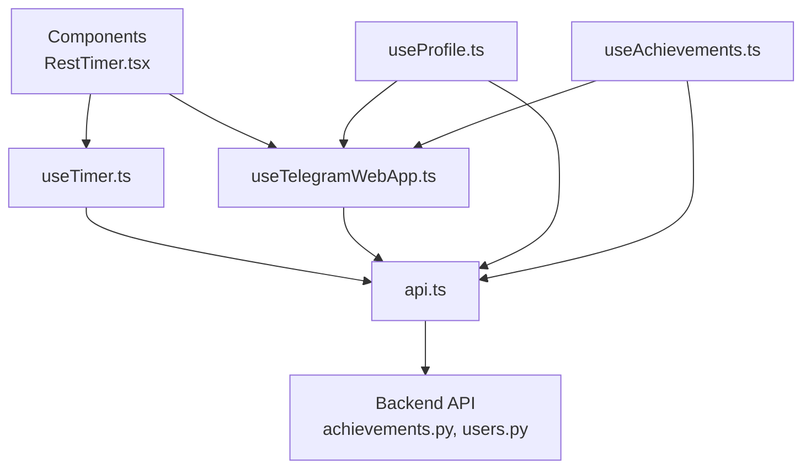
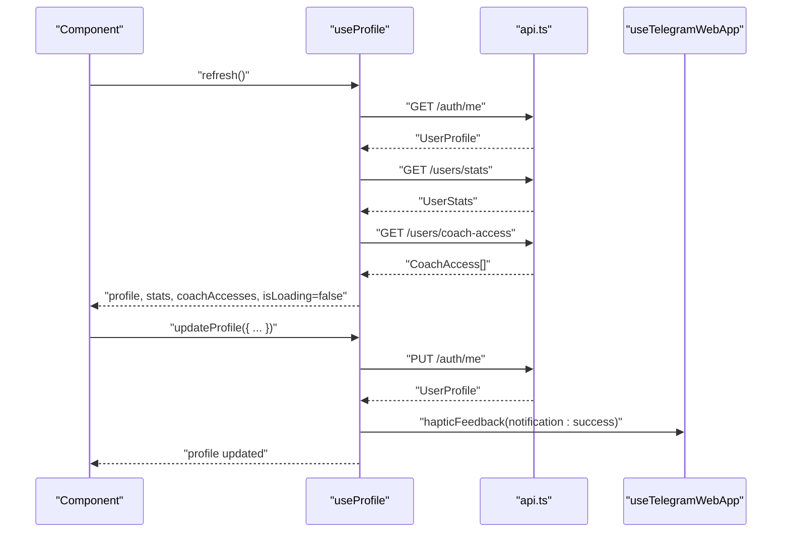
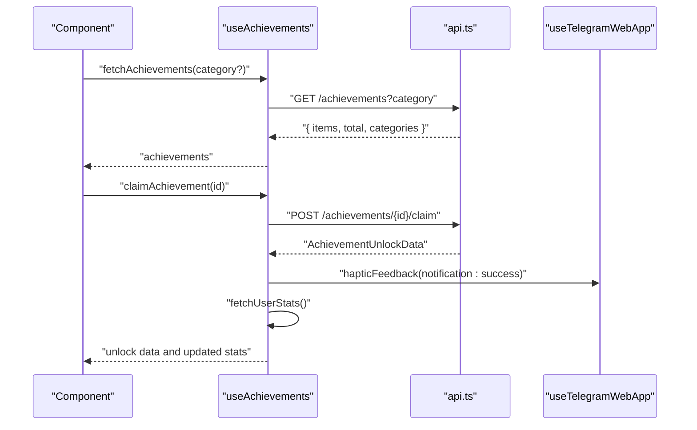
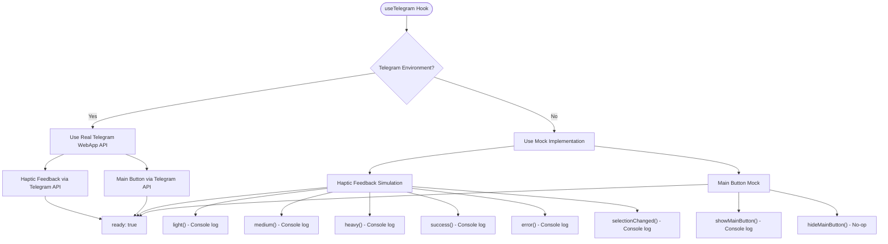
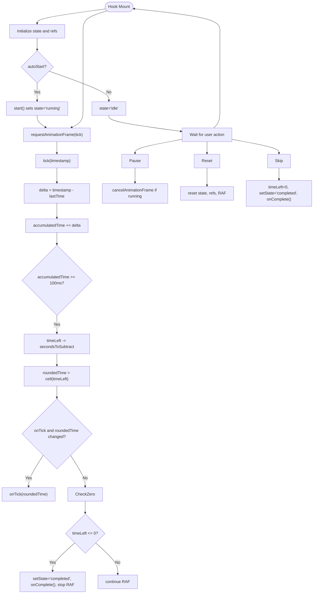
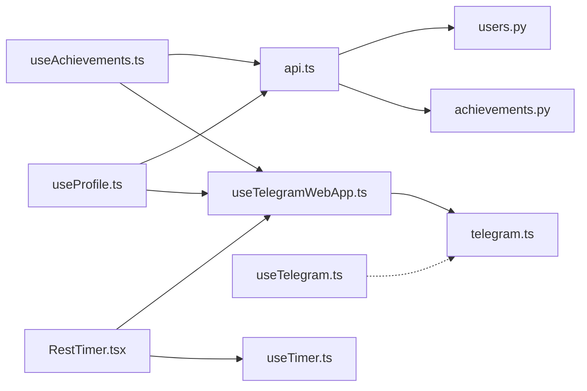

# Custom Hooks System

<cite>
**Referenced Files in This Document**
- [useProfile.ts](file://frontend/src/hooks/useProfile.ts)
- [useAchievements.ts](file://frontend/src/hooks/useAchievements.ts)
- [useTelegram.ts](file://frontend/src/hooks/useTelegram.ts)
- [useTelegramWebApp.ts](file://frontend/src/hooks/useTelegramWebApp.ts)
- [useTimer.ts](file://frontend/src/hooks/useTimer.ts)
- [api.ts](file://frontend/src/services/api.ts)
- [telegram.ts](file://frontend/src/types/telegram.ts)
- [index.ts](file://frontend/src/hooks/index.ts)
- [RestTimer.tsx](file://frontend/src/components/workout/RestTimer.tsx)
- [useTimer.test.ts](file://frontend/src/__tests__/hooks/useTimer.test.ts)
- [achievements.py](file://backend/app/api/achievements.py)
- [users.py](file://backend/app/api/users.py)
</cite>

## Update Summary
**Changes Made**
- Enhanced useTelegram hook documentation to reflect comprehensive mock implementations for standalone browser usage
- Updated haptic feedback capabilities and main button management features
- Added detailed coverage of fallback mechanisms and Telegram Mini App compatibility
- Expanded usage patterns and integration examples

## Table of Contents
1. [Introduction](#introduction)
2. [Project Structure](#project-structure)
3. [Core Components](#core-components)
4. [Architecture Overview](#architecture-overview)
5. [Detailed Component Analysis](#detailed-component-analysis)
6. [Dependency Analysis](#dependency-analysis)
7. [Performance Considerations](#performance-considerations)
8. [Troubleshooting Guide](#troubleshooting-guide)
9. [Conclusion](#conclusion)
10. [Appendices](#appendices)

## Introduction
This document explains the custom hooks system used across the frontend of the Fit Tracker Pro application. It focuses on five key hooks:
- useProfile: Manages user profile, statistics, settings, coach access, and data export.
- useAchievements: Handles achievement retrieval, progress checks, unlocking, and real-time notifications.
- useTelegram: Provides a comprehensive mock Telegram integration for standalone environments while maintaining Telegram Mini App compatibility.
- useTelegramWebApp: Integrates with the Telegram WebApp SDK for rich UI controls, haptic feedback, and cloud storage.
- useTimer: Implements a high-precision timer optimized for workout rest periods with requestAnimationFrame and background operation support.

The documentation covers purpose, parameters, return values, side effects, usage patterns, external API integrations, state management, composition patterns, dependency management, performance considerations, testing strategies, and best practices.

## Project Structure
The hooks are located under frontend/src/hooks and integrate with:
- Services: frontend/src/services/api.ts for HTTP requests.
- Types: frontend/src/types/telegram.ts for Telegram WebApp typings.
- Components: frontend/src/components for usage examples (e.g., RestTimer.tsx).
- Tests: frontend/src/__tests__/hooks for unit tests (e.g., useTimer.test.ts).



**Diagram sources**
- [useProfile.ts:128-324](file://frontend/src/hooks/useProfile.ts#L128-L324)
- [useAchievements.ts:67-274](file://frontend/src/hooks/useAchievements.ts#L67-L274)
- [useTelegram.ts:36-116](file://frontend/src/hooks/useTelegram.ts#L36-L116)
- [useTelegramWebApp.ts:119-504](file://frontend/src/hooks/useTelegramWebApp.ts#L119-L504)
- [useTimer.ts:57-290](file://frontend/src/hooks/useTimer.ts#L57-L290)
- [api.ts:6-68](file://frontend/src/services/api.ts#L6-L68)
- [telegram.ts:251-328](file://frontend/src/types/telegram.ts#L251-L328)
- [RestTimer.tsx:115-189](file://frontend/src/components/workout/RestTimer.tsx#L115-L189)
- [useTimer.test.ts:1-114](file://frontend/src/__tests__/hooks/useTimer.test.ts#L1-L114)

**Section sources**
- [index.ts:1-13](file://frontend/src/hooks/index.ts#L1-L13)

## Core Components
- useProfile
  - Purpose: Centralized user profile management with profile updates, settings, weight tracking, coach access, and data export.
  - Key return values: profile, stats, coachAccesses, isLoading, error, plus action methods.
  - Side effects: HTTP requests to /auth/me, /users/stats, /users/coach-access, and /users/export; haptic feedback via Telegram WebApp.
  - Usage patterns: Load on mount, batch refresh, and targeted updates for profile/settings/weight.
- useAchievements
  - Purpose: Achievement catalog, user progress, claiming, and real-time unlock notifications.
  - Key return values: achievements, userStats, isLoading, error, plus fetch and claim methods.
  - Side effects: Polling for new unlocks; haptic feedback; event subscriptions.
  - Usage patterns: Initial load, periodic polling, manual progress checks, and unlock callbacks.
- useTelegram **Updated**
  - Purpose: Comprehensive mock Telegram integration for standalone environments while maintaining Telegram Mini App compatibility.
  - Key return values: sdk (null), initData (null), user (null), hapticFeedback (with six feedback types), showMainButton, hideMainButton, ready (always true).
  - Side effects: Uses Telegram WebApp API when available; falls back to console logging for main button actions; no-op for haptic feedback outside Telegram.
  - Usage patterns: Primary fallback for local development and testing; maintains compatibility with Telegram Mini App environment.
- useTelegramWebApp
  - Purpose: Full Telegram WebApp SDK integration including theme, haptics, UI controls, and cloud storage.
  - Key return values: webApp, isReady, user, theme, colorScheme, and numerous control methods.
  - Side effects: Subscribes to themeChanged events; initializes WebApp on mount.
  - Usage patterns: Initialize on app start; use haptic feedback; manage main/back buttons; access cloud storage.
- useTimer
  - Purpose: High-precision timer using requestAnimationFrame for workout rest periods with background operation support.
  - Key return values: timeLeft, duration, state, progress, isWarning, formattedTime, plus control methods.
  - Side effects: Animation frame scheduling; visibility change handling; optional sound generation and haptic feedback.
  - Usage patterns: Configure callbacks (onComplete, onTick, onWarning); autoStart; manage state transitions.

**Section sources**
- [useProfile.ts:128-324](file://frontend/src/hooks/useProfile.ts#L128-L324)
- [useAchievements.ts:67-274](file://frontend/src/hooks/useAchievements.ts#L67-L274)
- [useTelegram.ts:36-116](file://frontend/src/hooks/useTelegram.ts#L36-L116)
- [useTelegramWebApp.ts:119-504](file://frontend/src/hooks/useTelegramWebApp.ts#L119-L504)
- [useTimer.ts:57-290](file://frontend/src/hooks/useTimer.ts#L57-L290)

## Architecture Overview
The hooks follow a layered architecture:
- UI Layer: Components consume hooks (e.g., RestTimer uses useTimer and useTelegramWebApp).
- Hook Layer: Business logic encapsulated in custom hooks; each hook manages its own state and side effects.
- Service Layer: api.ts centralizes HTTP requests with interceptors for auth tokens and error handling.
- External SDK Layer: Telegram WebApp SDK integration via useTelegramWebApp; fallback via useTelegram.



**Diagram sources**
- [RestTimer.tsx:115-189](file://frontend/src/components/workout/RestTimer.tsx#L115-L189)
- [useTimer.ts:57-290](file://frontend/src/hooks/useTimer.ts#L57-L290)
- [useTelegramWebApp.ts:119-504](file://frontend/src/hooks/useTelegramWebApp.ts#L119-L504)
- [useProfile.ts:128-324](file://frontend/src/hooks/useProfile.ts#L128-L324)
- [useAchievements.ts:67-274](file://frontend/src/hooks/useAchievements.ts#L67-L274)
- [api.ts:6-68](file://frontend/src/services/api.ts#L6-L68)
- [achievements.py:25-88](file://backend/app/api/achievements.py#L25-L88)
- [users.py:47-54](file://backend/app/api/users.py#L47-L54)

## Detailed Component Analysis

### useProfile Hook
- Purpose: Provide comprehensive user profile management with profile, stats, settings, coach access, and data export.
- Parameters: None (returns a hook with methods).
- Return values:
  - profile: UserProfile | null
  - stats: UserStats | null
  - coachAccesses: CoachAccess[]
  - isLoading: boolean
  - error: string | null
  - Methods: updateProfile, updateSettings, updateWeight, getWeightProgress, generateCoachCode, revokeCoachAccess, exportData, refresh
- Side effects:
  - Fetches profile, stats, and coach access lists on mount.
  - Updates profile/settings via PUT to /auth/me.
  - Exports data via GET to /users/export and triggers download.
  - Triggers haptic feedback on successful operations.
- Usage patterns:
  - Initial load via refresh() called in useEffect.
  - Weight progress calculation helpers for UI rendering.
  - Batch refresh using Promise.all for concurrent loads.



**Diagram sources**
- [useProfile.ts:128-324](file://frontend/src/hooks/useProfile.ts#L128-L324)
- [api.ts:47-65](file://frontend/src/services/api.ts#L47-L65)
- [useTelegramWebApp.ts:199-215](file://frontend/src/hooks/useTelegramWebApp.ts#L199-L215)

**Section sources**
- [useProfile.ts:128-324](file://frontend/src/hooks/useProfile.ts#L128-L324)

### useAchievements Hook
- Purpose: Manage achievement catalog, user progress, and unlock notifications.
- Parameters: None (returns a hook with methods).
- Return values:
  - achievements: Achievement[]
  - userStats: UserAchievementStats | null
  - isLoading: boolean
  - error: string | null
  - Methods: fetchAchievements, fetchUserStats, claimAchievement, checkProgress, getAchievementById, getUserAchievement, onAchievementUnlocked, checkForNewAchievements
- Side effects:
  - Periodic polling (every 30 seconds) to detect new unlocks.
  - Subscribable unlock notifications via callback registry.
  - Haptic feedback on successful claims.
- Usage patterns:
  - Initial load on mount.
  - Manual progress checks and category filtering.
  - Subscribe to unlock events for UI notifications.



**Diagram sources**
- [useAchievements.ts:67-274](file://frontend/src/hooks/useAchievements.ts#L67-L274)
- [api.ts:47-65](file://frontend/src/services/api.ts#L47-L65)
- [useTelegramWebApp.ts:199-215](file://frontend/src/hooks/useTelegramWebApp.ts#L199-L215)

**Section sources**
- [useAchievements.ts:67-274](file://frontend/src/hooks/useAchievements.ts#L67-L274)

### useTelegram Hook **Updated**
- Purpose: Comprehensive mock Telegram integration for standalone environments while maintaining Telegram Mini App compatibility.
- Parameters: None.
- Return values:
  - sdk: null (always null for mock implementation)
  - initData: null (always null for mock implementation)
  - user: null (always null for mock implementation)
  - hapticFeedback: Object with six feedback types (light, medium, heavy, success, error, selectionChanged)
  - showMainButton: Function to show main button with text and click handler
  - hideMainButton: Function to hide main button
  - ready: boolean (always true for mock implementation)
- Side effects:
  - Attempts to call Telegram WebApp APIs if available; otherwise falls back to console logging.
  - Uses try-catch blocks to prevent errors in non-Telegram environments.
  - Provides haptic feedback simulation using Telegram WebApp HapticFeedback API when available.
  - Manages main button state with proper Telegram API integration.
- Usage patterns:
  - Primary fallback for local development and testing environments.
  - Maintains compatibility with Telegram Mini App by checking for window.Telegram.WebApp availability.
  - Ensures components do not crash outside Telegram Mini App environment.
  - Provides consistent API surface regardless of execution environment.

**Updated** Enhanced with comprehensive haptic feedback simulation and main button management for both Telegram and standalone environments.



**Diagram sources**
- [useTelegram.ts:36-116](file://frontend/src/hooks/useTelegram.ts#L36-L116)

**Section sources**
- [useTelegram.ts:36-116](file://frontend/src/hooks/useTelegram.ts#L36-L116)

### useTelegramWebApp Hook
- Purpose: Integrate with Telegram WebApp SDK for UI controls, haptics, and cloud storage.
- Parameters: None.
- Return values:
  - webApp: WebApp | null
  - isReady: boolean
  - user: TelegramUser | null
  - theme: ThemeParams | null
  - colorScheme: 'light' | 'dark' | null
  - Methods: init, getUser, getTheme, hapticFeedback, close, expand, show/hide main/back buttons, set colors, show alerts/confirm/popup, sendData, open links, enable/disable closing confirmation, cloudStorage methods.
- Side effects:
  - Initializes WebApp on mount; subscribes to themeChanged events.
  - Provides cloud storage wrappers with promises.
- Usage patterns:
  - Initialize on app start; manage UI controls; use haptic feedback; persist small data via cloud storage.

**Section sources**
- [useTelegramWebApp.ts:119-504](file://frontend/src/hooks/useTelegramWebApp.ts#L119-L504)
- [telegram.ts:251-328](file://frontend/src/types/telegram.ts#L251-L328)

### useTimer Hook
- Purpose: High-precision timer optimized for workout rest periods using requestAnimationFrame and background operation support.
- Parameters:
  - initialDuration?: number
  - onComplete?: () => void
  - onTick?: (remaining: number) => void
  - onWarning?: () => void
  - autoStart?: boolean
  - enableSound?: boolean
  - enableHaptic?: boolean
- Return values:
  - timeLeft: number
  - duration: number
  - state: 'idle' | 'running' | 'paused' | 'completed'
  - progress: number
  - isWarning: boolean
  - formattedTime: string
  - Methods: start, pause, reset, setDuration, skip, addTime
- Side effects:
  - Animation frame scheduling; visibility change handling to continue timing in background.
  - Optional sound generation and haptic feedback triggers.
- Usage patterns:
  - Configure callbacks for UI updates and notifications.
  - Auto-start for seamless UX.
  - Manage warning state and skip/extend actions.



**Diagram sources**
- [useTimer.ts:57-290](file://frontend/src/hooks/useTimer.ts#L57-L290)

**Section sources**
- [useTimer.ts:57-290](file://frontend/src/hooks/useTimer.ts#L57-L290)

## Dependency Analysis
- Internal dependencies:
  - useProfile depends on useTelegramWebApp for haptic feedback and on api.ts for HTTP operations.
  - useAchievements depends on useTelegramWebApp for haptic feedback and on api.ts for HTTP operations.
  - useTimer does not depend on external hooks; it uses requestAnimationFrame and browser APIs.
  - useTelegram is a standalone mock; useTelegramWebApp integrates with Telegram SDK.
- External dependencies:
  - Telegram WebApp SDK via window.Telegram.WebApp.
  - Axios for HTTP requests with interceptors for auth tokens and error logging.
- Backend endpoints:
  - Profile and user stats: /auth/me, /users/stats, /users/coach-access, /users/export.
  - Achievements: /achievements, /achievements/user, /achievements/{id}/claim, /achievements/check-progress.



**Diagram sources**
- [useProfile.ts:128-324](file://frontend/src/hooks/useProfile.ts#L128-L324)
- [useAchievements.ts:67-274](file://frontend/src/hooks/useAchievements.ts#L67-L274)
- [useTelegram.ts:36-116](file://frontend/src/hooks/useTelegram.ts#L36-L116)
- [useTelegramWebApp.ts:119-504](file://frontend/src/hooks/useTelegramWebApp.ts#L119-L504)
- [useTimer.ts:57-290](file://frontend/src/hooks/useTimer.ts#L57-L290)
- [RestTimer.tsx:115-189](file://frontend/src/components/workout/RestTimer.tsx#L115-L189)
- [api.ts:6-68](file://frontend/src/services/api.ts#L6-L68)
- [achievements.py:25-88](file://backend/app/api/achievements.py#L25-L88)
- [users.py:47-54](file://backend/app/api/users.py#L47-L54)

**Section sources**
- [api.ts:6-68](file://frontend/src/services/api.ts#L6-L68)
- [telegram.ts:251-328](file://frontend/src/types/telegram.ts#L251-L328)

## Performance Considerations
- useTimer
  - Uses requestAnimationFrame for smooth UI updates while maintaining accurate second-level decrements.
  - Accumulates time deltas and updates state every ~100ms to balance precision and performance.
  - Cancels animation frames on pause/reset/skip and on component unmount to prevent memory leaks.
  - Handles visibility change to continue timing in background and resume animation loop.
- useProfile and useAchievements
  - Batch concurrent fetches during refresh to minimize load time.
  - Debounce or throttle frequent operations; use caching where appropriate.
- useTelegram **Updated**
  - Mock implementation uses useCallback for all methods to prevent unnecessary re-renders.
  - Try-catch blocks prevent performance issues from API calls in non-Telegram environments.
  - Console logging provides minimal overhead for fallback scenarios.
- Telegram WebApp
  - Initialize once and reuse instances; avoid repeated DOM queries.
  - Use haptic feedback sparingly to prevent user fatigue.
- API layer
  - Centralized interceptors reduce duplication and improve error handling.
  - Consider adding retry logic and exponential backoff for transient failures.

## Troubleshooting Guide
- Authentication errors
  - Ensure localStorage contains a valid auth token; api.ts adds Authorization header automatically.
  - Verify backend routes for /auth/me and /users/stats are implemented.
- Telegram WebApp not available **Updated**
  - Outside Telegram Mini App, useTelegram provides comprehensive mock implementations; useTelegramWebApp returns null webApp.
  - Components should guard against null webApp before invoking methods.
  - useTelegram always returns ready: true and provides fallback haptic feedback and main button functionality.
- Timer not updating
  - Confirm autoStart is enabled or start() is called.
  - Check visibility change handling; ensure RAF is scheduled after coming back from background.
- Achievement unlock notifications not firing
  - Verify periodic polling interval is active and checkForNewAchievements is invoked.
  - Ensure onAchievementUnlocked subscribers are registered before unlock events.

**Section sources**
- [api.ts:21-44](file://frontend/src/services/api.ts#L21-L44)
- [useTelegram.ts:36-116](file://frontend/src/hooks/useTelegram.ts#L36-L116)
- [useTelegramWebApp.ts:119-142](file://frontend/src/hooks/useTelegramWebApp.ts#L119-L142)
- [useTimer.ts:244-274](file://frontend/src/hooks/useTimer.ts#L244-L274)
- [useAchievements.ts:248-259](file://frontend/src/hooks/useAchievements.ts#L248-L259)

## Conclusion
The custom hooks system provides a cohesive, composable foundation for user profile management, gamification, Telegram integration, and precise timing. The enhanced useTelegram hook now offers comprehensive mock implementations that maintain full compatibility with Telegram Mini App while providing robust fallback functionality for standalone browser usage. By encapsulating state, side effects, and external integrations, the hooks simplify component logic and promote reusability. Following the documented patterns ensures consistent behavior, robust error handling, and optimal performance across environments.

## Appendices

### Hook Composition Patterns
- useProfile and useAchievements both depend on useTelegramWebApp for haptic feedback, demonstrating shared integration patterns.
- RestTimer composes useTimer and useTelegramWebApp to deliver rich workout experiences with sound and haptic cues.
- useTelegram provides fallback functionality for components that need Telegram integration but may run outside Telegram environment.

**Section sources**
- [useProfile.ts:128-129](file://frontend/src/hooks/useProfile.ts#L128-L129)
- [useAchievements.ts:67-68](file://frontend/src/hooks/useAchievements.ts#L67-L68)
- [RestTimer.tsx:115-189](file://frontend/src/components/workout/RestTimer.tsx#L115-L189)

### Testing Strategies
- useTimer
  - Use fake timers to simulate time progression and assert state transitions.
  - Test start, pause, reset, skip, and onComplete callbacks.
- useTelegram **Updated**
  - Test fallback behavior by mocking window.Telegram as undefined.
  - Verify haptic feedback methods don't throw errors in non-Telegram environments.
  - Test main button show/hide functionality with console logging verification.
- General patterns
  - Mock external dependencies (Telegram SDK, API) using Jest.
  - Test side effects (HTTP calls, haptic feedback) via spies and assertions.

**Section sources**
- [useTimer.test.ts:1-114](file://frontend/src/__tests__/hooks/useTimer.test.ts#L1-L114)

### Backend API Endpoints Used by Hooks
- Profile and user data
  - GET /auth/me
  - GET /users/stats
  - GET /users/coach-access
  - POST /users/coach-access/generate
  - DELETE /users/coach-access/{id}
  - GET /users/export
  - PUT /auth/me
- Achievements
  - GET /achievements
  - GET /achievements/user
  - POST /achievements/{id}/claim
  - POST /achievements/check-progress

**Section sources**
- [users.py:47-54](file://backend/app/api/users.py#L47-L54)
- [achievements.py:25-88](file://backend/app/api/achievements.py#L25-L88)
- [achievements.py:91-171](file://backend/app/api/achievements.py#L91-L171)

### Enhanced useTelegram Usage Examples
- Basic haptic feedback in components:
  ```typescript
  const { hapticFeedback } = useTelegram()
  hapticFeedback.medium() // Works in both Telegram and standalone modes
  ```
- Main button management:
  ```typescript
  const { showMainButton, hideMainButton } = useTelegram()
  useEffect(() => {
    if (hasData) {
      showMainButton('Save Data', () => saveData())
    } else {
      hideMainButton()
    }
  }, [hasData])
  ```

**Section sources**
- [Home.tsx:22-23](file://frontend/src/pages/Home.tsx#L22-L23)
- [WorkoutCardio.tsx:560](file://frontend/src/pages/WorkoutCardio.tsx#L560)