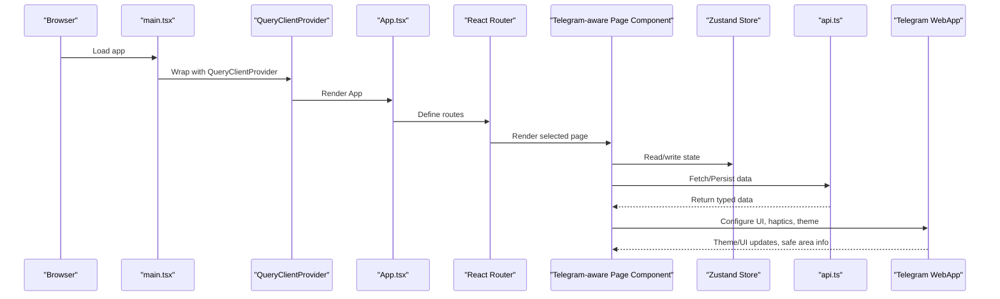
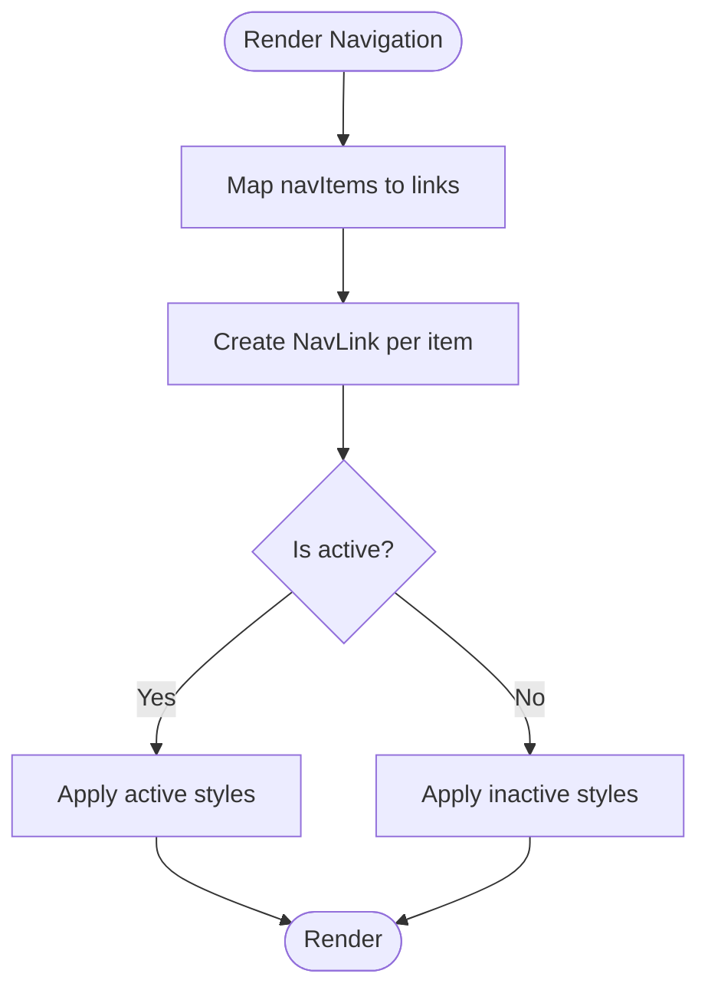
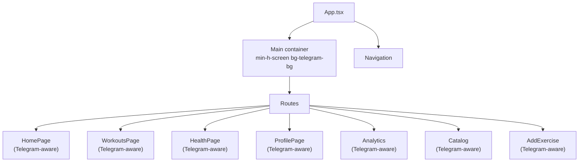
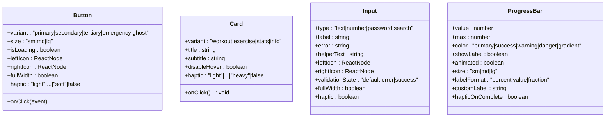
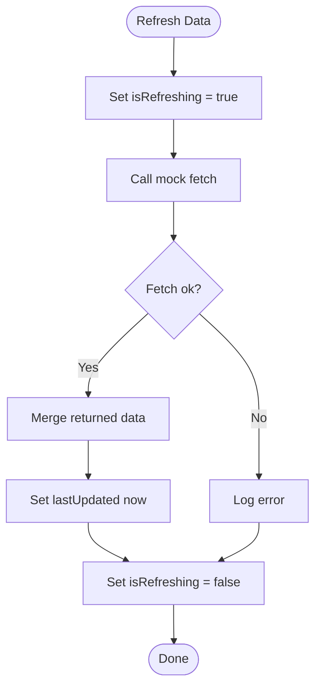
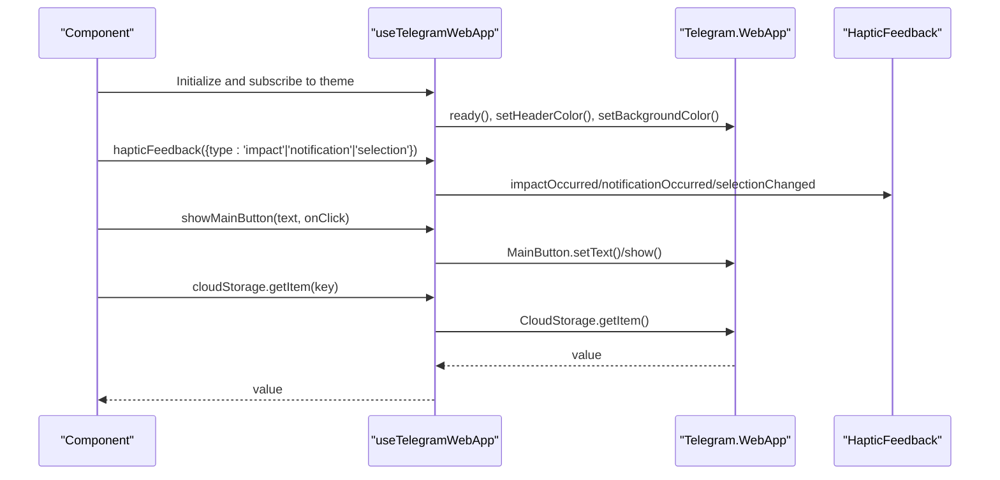
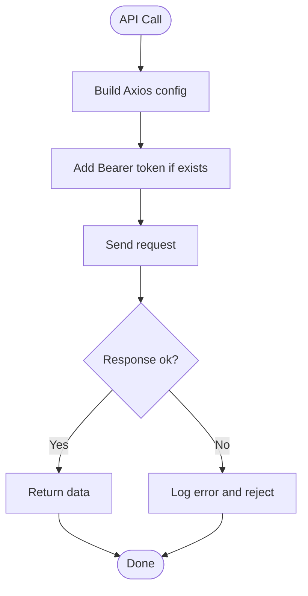
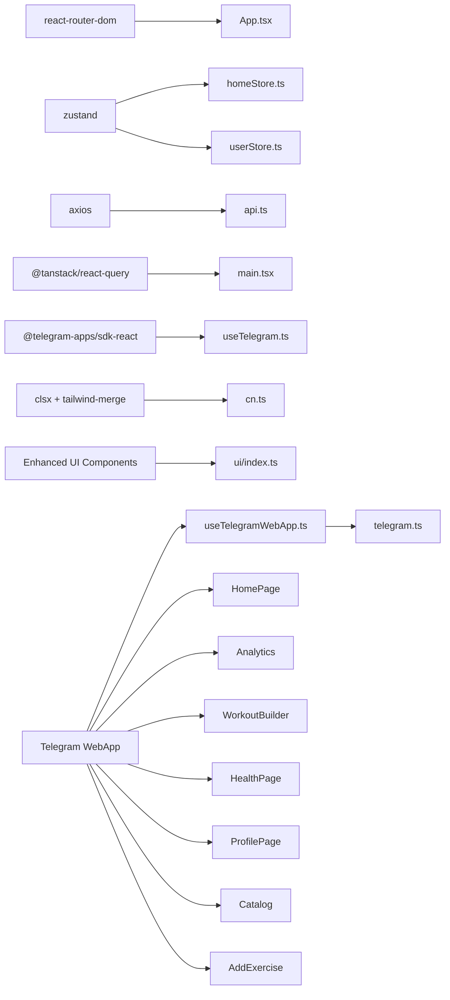

# Frontend Component Architecture

<cite>
**Referenced Files in This Document**
- [App.tsx](file://frontend/src/App.tsx)
- [main.tsx](file://frontend/src/main.tsx)
- [Navigation.tsx](file://frontend/src/components/common/Navigation.tsx)
- [homeStore.ts](file://frontend/src/stores/homeStore.ts)
- [userStore.ts](file://frontend/src/stores/userStore.ts)
- [index.ts](file://frontend/src/components/ui/index.ts)
- [Button.tsx](file://frontend/src/components/ui/Button.tsx)
- [Card.tsx](file://frontend/src/components/ui/Card.tsx)
- [Input.tsx](file://frontend/src/components/ui/Input.tsx)
- [ProgressBar.tsx](file://frontend/src/components/ui/ProgressBar.tsx)
- [api.ts](file://frontend/src/services/api.ts)
- [useTelegram.ts](file://frontend/src/hooks/useTelegram.ts)
- [useTelegramWebApp.ts](file://frontend/src/hooks/useTelegramWebApp.ts)
- [telegram.ts](file://frontend/src/types/telegram.ts)
- [cn.ts](file://frontend/src/utils/cn.ts)
- [HomePage.tsx](file://frontend/src/pages/HomePage.tsx)
- [Analytics.tsx](file://frontend/src/pages/Analytics.tsx)
- [WorkoutBuilder.tsx](file://frontend/src/pages/WorkoutBuilder.tsx)
- [WorkoutsPage.tsx](file://frontend/src/pages/WorkoutsPage.tsx)
- [HealthPage.tsx](file://frontend/src/pages/HealthPage.tsx)
- [ProfilePage.tsx](file://frontend/src/pages/ProfilePage.tsx)
- [router.tsx](file://frontend/src/app/router.tsx)
- [Catalog.tsx](file://frontend/src/pages/Catalog.tsx)
- [AddExercise.tsx](file://frontend/src/pages/AddExercise.tsx)
</cite>

## Update Summary
**Changes Made**
- **Profile screen:** one canonical `ProfilePage.tsx` for `/profile` (removed duplicate `Profile.tsx` + thin re-export file)
- Enhanced Telegram WebApp integration with comprehensive haptic feedback system
- Added safe area handling and improved navigation patterns across all pages
- Implemented Telegram-specific UI elements with proper theme synchronization
- Expanded component prop interfaces with Telegram-specific variants
- Updated state management patterns with improved error handling
- Enhanced accessibility with proper ARIA attributes and keyboard navigation

## Table of Contents
1. [Introduction](#introduction)
2. [Project Structure](#project-structure)
3. [Core Components](#core-components)
4. [Architecture Overview](#architecture-overview)
5. [Detailed Component Analysis](#detailed-component-analysis)
6. [Dependency Analysis](#dependency-analysis)
7. [Performance Considerations](#performance-considerations)
8. [Troubleshooting Guide](#troubleshooting-guide)
9. [Conclusion](#conclusion)
10. [Appendices](#appendices)

## Introduction
This document describes the FitTracker Pro frontend component architecture built with React and TypeScript. It covers the application structure, routing and navigation, page layouts, component composition patterns, the internal design system (Button, Card, Input, ProgressBar), state management using Zustand stores and custom hooks, integration with Telegram WebApp SDK, API services, and best practices for responsiveness and accessibility.

**Updated** Enhanced with comprehensive Telegram WebApp integration including haptic feedback, safe area handling, and improved navigation patterns across all page components.

## Project Structure
The frontend is organized around a clear separation of concerns with enhanced Telegram integration:
- Pages: route-driven screens with Telegram-specific UI elements such as HomePage, WorkoutsPage, HealthPage, ProfilePage, Analytics, Catalog, and AddExercise
- Components: reusable UI building blocks grouped by domain (common, ui, health, workout, etc.) with Telegram-aware variants
- Stores: state containers powered by Zustand for user and home-related state
- Hooks: Telegram WebApp integration and shared utilities with comprehensive haptic feedback support
- Services: API client with interceptors and typed error handling
- Utilities: Tailwind-based class merging helper

```mermaid
graph TB
subgraph "Entry Point"
MAIN["main.tsx"]
APP["App.tsx"]
END
subgraph "Routing"
ROUTES["Routes & Paths"]
NAV["Navigation.tsx"]
END
subgraph "Telegram Pages"
HOME["HomePage.tsx"]
WORKOUTS["WorkoutsPage.tsx"]
HEALTH["HealthPage.tsx"]
PROFILE["ProfilePage.tsx"]
ANALYTICS["Analytics.tsx"]
CATALOG["Catalog.tsx"]
ADD_EXERCISE["AddExercise.tsx"]
END
subgraph "Common Components"
NAVCOMP["Navigation.tsx"]
END
subgraph "Enhanced UI Library"
BTN["Button.tsx (Telegram-aware)"]
CARD["Card.tsx (Telegram-aware)"]
INPUT["Input.tsx (Telegram-aware)"]
PROGRESS["ProgressBar.tsx (Telegram-aware)"]
UILIB["ui/index.ts"]
END
subgraph "State Management"
HOMESTORE["homeStore.ts"]
USERSTORE["userStore.ts"]
END
subgraph "Enhanced Integrations"
TGHOOK["useTelegramWebApp.ts (Comprehensive)"]
TYPES["telegram.ts (Enhanced Types)"]
API["api.ts"]
END
MAIN --> APP
APP --> ROUTES
ROUTES --> HOME
ROUTES --> WORKOUTS
ROUTES --> HEALTH
ROUTES --> PROFILE
ROUTES --> ANALYTICS
ROUTES --> CATALOG
ROUTES --> ADD_EXERCISE
APP --> NAVCOMP
NAVCOMP --> NAV
UILIB --> BTN
UILIB --> CARD
UILIB --> INPUT
UILIB --> PROGRESS
HOMESTORE --> HOME
USERSTORE --> PROFILE
TGHOOK --> APP
TYPES --> TGHOOK
API --> HOME
```

**Diagram sources**
- [main.tsx:1-23](file://frontend/src/main.tsx#L1-L23)
- [App.tsx:1-35](file://frontend/src/App.tsx#L1-L35)
- [Navigation.tsx:1-38](file://frontend/src/components/common/Navigation.tsx#L1-L38)
- [homeStore.ts:1-206](file://frontend/src/stores/homeStore.ts#L1-L206)
- [userStore.ts:1-31](file://frontend/src/stores/userStore.ts#L1-L31)
- [index.ts:1-25](file://frontend/src/components/ui/index.ts#L1-L25)
- [Button.tsx:1-184](file://frontend/src/components/ui/Button.tsx#L1-L184)
- [Card.tsx:1-175](file://frontend/src/components/ui/Card.tsx#L1-L175)
- [Input.tsx:1-301](file://frontend/src/components/ui/Input.tsx#L1-L301)
- [ProgressBar.tsx:1-225](file://frontend/src/components/ui/ProgressBar.tsx#L1-L225)
- [useTelegramWebApp.ts:1-508](file://frontend/src/hooks/useTelegramWebApp.ts#L1-L508)
- [telegram.ts:1-390](file://frontend/src/types/telegram.ts#L1-L390)
- [api.ts:1-69](file://frontend/src/services/api.ts#L1-L69)
- [HomePage.tsx:1-195](file://frontend/src/pages/HomePage.tsx#L1-L195)
- [Analytics.tsx:1-800](file://frontend/src/pages/Analytics.tsx#L1-L800)
- [WorkoutBuilder.tsx:1-800](file://frontend/src/pages/WorkoutBuilder.tsx#L1-L800)
- [WorkoutsPage.tsx:1-151](file://frontend/src/pages/WorkoutsPage.tsx#L1-L151)
- [HealthPage.tsx:1-159](file://frontend/src/pages/HealthPage.tsx#L1-L159)
- [ProfilePage.tsx:274-780](file://frontend/src/pages/ProfilePage.tsx#L274-L780)
- [Catalog.tsx:1-800](file://frontend/src/pages/Catalog.tsx#L1-L800)
- [AddExercise.tsx:1-800](file://frontend/src/pages/AddExercise.tsx#L1-L800)

**Section sources**
- [main.tsx:1-23](file://frontend/src/main.tsx#L1-L23)
- [App.tsx:1-35](file://frontend/src/App.tsx#L1-L35)

## Core Components
This section documents the internal design system and key state management patterns with enhanced Telegram integration.

- **Enhanced UI Library exports and types**:
  - Button, Card, Input, ProgressBar, Chip, Modal, Timer are exported from the UI library index
  - Each component defines Telegram-aware variants with haptic feedback integration
  - Components support Telegram-specific styling classes (telegram-bg, telegram-text, etc.)

- **Enhanced State management**:
  - Zustand stores encapsulate domain-specific state and actions
  - Persistence is applied selectively to avoid bloating local storage
  - Stores expose typed setters and derived actions (e.g., refreshers) to keep components decoupled from data fetching

- **Comprehensive Telegram integration**:
  - Two complementary hooks provide different levels of abstraction:
    - A lightweight hook wraps the official SDK to configure UI and expose haptic feedback and main button controls
    - A comprehensive hook exposes the full Telegram WebApp API surface with typed events, cloud storage, and UI controls
  - Enhanced haptic feedback system with impact styles, notification types, and selection changes
  - Safe area handling and theme synchronization across all components

- **Enhanced API service**:
  - Axios-based client with request/response interceptors for auth tokens and error logging
  - Typed error shape enables consistent error handling across components

**Section sources**
- [index.ts:1-25](file://frontend/src/components/ui/index.ts#L1-L25)
- [Button.tsx:1-184](file://frontend/src/components/ui/Button.tsx#L1-L184)
- [Card.tsx:1-175](file://frontend/src/components/ui/Card.tsx#L1-L175)
- [Input.tsx:1-301](file://frontend/src/components/ui/Input.tsx#L1-L301)
- [ProgressBar.tsx:1-225](file://frontend/src/components/ui/ProgressBar.tsx#L1-L225)
- [homeStore.ts:1-206](file://frontend/src/stores/homeStore.ts#L1-L206)
- [userStore.ts:1-31](file://frontend/src/stores/userStore.ts#L1-L31)
- [useTelegram.ts:1-47](file://frontend/src/hooks/useTelegram.ts#L1-L47)
- [useTelegramWebApp.ts:1-508](file://frontend/src/hooks/useTelegramWebApp.ts#L1-L508)
- [telegram.ts:1-390](file://frontend/src/types/telegram.ts#L1-L390)
- [api.ts:1-69](file://frontend/src/services/api.ts#L1-L69)

## Architecture Overview
The runtime architecture centers on React Router for navigation, Zustand for state, and comprehensive Telegram WebApp APIs for immersive UI integration. The Query Client provider enables caching and optimistic updates for data-heavy pages.



**Diagram sources**
- [main.tsx:1-23](file://frontend/src/main.tsx#L1-L23)
- [App.tsx:1-35](file://frontend/src/App.tsx#L1-L35)
- [homeStore.ts:147-206](file://frontend/src/stores/homeStore.ts#L147-L206)
- [userStore.ts:15-31](file://frontend/src/stores/userStore.ts#L15-L31)
- [api.ts:6-69](file://frontend/src/services/api.ts#L6-L69)
- [useTelegramWebApp.ts:160-176](file://frontend/src/hooks/useTelegramWebApp.ts#L160-L176)

## Detailed Component Analysis

### Enhanced Navigation System
The bottom navigation bar provides five primary destinations: Home, Catalog, Workouts, Stats, and Profile. It uses React Router's NavLink to reflect active routes and applies Tailwind-based active/inactive styles. The Navigation component is fixed at the bottom and overlays page content.



**Diagram sources**
- [Navigation.tsx:5-38](file://frontend/src/components/common/Navigation.tsx#L5-L38)

**Section sources**
- [Navigation.tsx:1-38](file://frontend/src/components/common/Navigation.tsx#L1-L38)
- [App.tsx:17-29](file://frontend/src/App.tsx#L17-L29)

### Enhanced Page Layouts and Composition Patterns
- App wraps all pages in a single-page layout with a fixed bottom navigation bar
- Pages are route-driven and rendered inside the Routes container
- Composition follows a pattern where domain-specific pages import UI components from the design system and consume Zustand stores
- All pages integrate with Telegram WebApp for consistent theme handling and haptic feedback



**Diagram sources**
- [App.tsx:12-32](file://frontend/src/App.tsx#L12-L32)

**Section sources**
- [App.tsx:1-35](file://frontend/src/App.tsx#L1-L35)

### Enhanced Design System: Button, Card, Input, ProgressBar
These components share consistent patterns with comprehensive Telegram integration:
- Props define variants, sizes, and optional accessibility attributes
- Internal state handles interactive behaviors (e.g., password reveal, loading spinners)
- **Enhanced** Haptic feedback integrates with Telegram WebApp for mobile touch interactions with configurable intensity levels
- **Enhanced** Accessibility: roles, ARIA attributes, keyboard support for interactive elements
- **Enhanced** Telegram-specific styling classes (telegram-bg, telegram-text, telegram-secondary-bg) for consistent theming



**Diagram sources**
- [Button.tsx:4-22](file://frontend/src/components/ui/Button.tsx#L4-L22)
- [Card.tsx:4-21](file://frontend/src/components/ui/Card.tsx#L4-L21)
- [Input.tsx:4-26](file://frontend/src/components/ui/Input.tsx#L4-L26)
- [ProgressBar.tsx:4-25](file://frontend/src/components/ui/ProgressBar.tsx#L4-L25)

**Section sources**
- [Button.tsx:1-184](file://frontend/src/components/ui/Button.tsx#L1-L184)
- [Card.tsx:1-175](file://frontend/src/components/ui/Card.tsx#L1-L175)
- [Input.tsx:1-301](file://frontend/src/components/ui/Input.tsx#L1-L301)
- [ProgressBar.tsx:1-225](file://frontend/src/components/ui/ProgressBar.tsx#L1-L225)

### Enhanced State Management with Zustand
- Home store manages user health metrics, hydration goals, workout templates, and loading states. It includes a refresh action that simulates data fetching and updates last-updated timestamps.
- User store manages authentication state, loading, and errors with a logout action.
- Both stores use persistence to maintain small subsets of state across sessions.



**Diagram sources**
- [homeStore.ts:180-193](file://frontend/src/stores/homeStore.ts#L180-L193)

**Section sources**
- [homeStore.ts:1-206](file://frontend/src/stores/homeStore.ts#L1-L206)
- [userStore.ts:1-31](file://frontend/src/stores/userStore.ts#L1-L31)

### Comprehensive Telegram WebApp Integration
Two hooks provide Telegram integration with enhanced capabilities:
- useTelegram: minimal wrapper around the official SDK to configure UI and expose haptic feedback and main button helpers.
- **Enhanced** useTelegramWebApp: comprehensive hook exposing the full Telegram WebApp API surface, including theme events, cloud storage, UI controls, and safe area handling.



**Diagram sources**
- [useTelegramWebApp.ts:160-176](file://frontend/src/hooks/useTelegramWebApp.ts#L160-L176)
- [useTelegramWebApp.ts:200-216](file://frontend/src/hooks/useTelegramWebApp.ts#L200-L216)
- [useTelegramWebApp.ts:235-245](file://frontend/src/hooks/useTelegramWebApp.ts#L235-L245)
- [useTelegramWebApp.ts:404-426](file://frontend/src/hooks/useTelegramWebApp.ts#L404-L426)
- [telegram.ts:251-328](file://frontend/src/types/telegram.ts#L251-L328)

**Section sources**
- [useTelegram.ts:1-47](file://frontend/src/hooks/useTelegram.ts#L1-L47)
- [useTelegramWebApp.ts:1-508](file://frontend/src/hooks/useTelegramWebApp.ts#L1-L508)
- [telegram.ts:1-390](file://frontend/src/types/telegram.ts#L1-L390)

### Enhanced API Services
The API service centralizes HTTP requests with:
- Base URL from environment variables
- Request interceptor adding Authorization header when present
- Response interceptor logging errors and propagating typed errors
- Convenience methods for GET, POST, PUT, DELETE



**Diagram sources**
- [api.ts:21-45](file://frontend/src/services/api.ts#L21-L45)
- [api.ts:47-65](file://frontend/src/services/api.ts#L47-L65)

**Section sources**
- [api.ts:1-69](file://frontend/src/services/api.ts#L1-L69)

### Enhanced Component Prop Interfaces and Event Handling Patterns
- **Enhanced** Button: supports variants, sizes, icons, loading states, and comprehensive haptic feedback with configurable intensity levels. Uses forwardRef and merges Tailwind classes via a helper.
- **Enhanced** Card: supports click handlers, haptic feedback, and accessibility roles for keyboard navigation with Telegram-specific styling.
- **Enhanced** Input: supports validation states, left/right icons, password reveal, and ARIA attributes for labeling and error reporting with Telegram-aware focus handling.
- **Enhanced** ProgressBar: supports animated fills, haptic feedback on completion, and multiple label formats with Telegram-specific styling.

**Enhanced** Reusability guidelines:
- Prefer variant and size props to minimize duplication
- Centralize styling with a class merging helper to avoid conflicts
- Expose minimal, focused props; compose higher-order wrappers for domain-specific behaviors
- **Enhanced** Leverage Telegram-specific styling classes for consistent theming across components

**Enhanced** Accessibility considerations:
- Use ARIA attributes (aria-invalid, aria-describedby, role="progressbar") where applicable
- Provide keyboard support for interactive elements (Enter/Space activation)
- Ensure sufficient color contrast and focus indicators
- **Enhanced** Support for Telegram WebApp theme changes and safe area handling

**Section sources**
- [Button.tsx:1-184](file://frontend/src/components/ui/Button.tsx#L1-L184)
- [Card.tsx:1-175](file://frontend/src/components/ui/Card.tsx#L1-L175)
- [Input.tsx:1-301](file://frontend/src/components/ui/Input.tsx#L1-L301)
- [ProgressBar.tsx:1-225](file://frontend/src/components/ui/ProgressBar.tsx#L1-L225)
- [cn.ts:1-7](file://frontend/src/utils/cn.ts#L1-L7)

### Enhanced Page-Specific Implementations

#### HomePage Enhancement
The HomePage now includes comprehensive Telegram integration with:
- Dynamic user greeting based on time of day
- Telegram user profile integration with photo fallback
- Main button setup for quick workout initiation with haptic feedback
- Enhanced stat cards with Telegram styling
- Quick action buttons with proper haptic feedback
- Platform information display for Telegram WebApp

**Section sources**
- [HomePage.tsx:1-195](file://frontend/src/pages/HomePage.tsx#L1-L195)

#### Analytics Enhancement
The Analytics page features advanced Telegram integration:
- Custom tooltip components with Telegram styling
- Export functionality with Telegram WebApp integration
- Period selector with Telegram-specific styling
- Exercise selector with Telegram-aware UI
- Key metrics cards with Telegram styling
- Point details modal with Telegram styling
- Enhanced chart components with theme-aware coloring

**Section sources**
- [Analytics.tsx:1-800](file://frontend/src/pages/Analytics.tsx#L1-L800)

#### WorkoutBuilder Enhancement
The WorkoutBuilder includes comprehensive Telegram integration:
- Back button setup for proper navigation
- Drag-and-drop with haptic feedback for item rearrangement
- Exercise selector with Telegram styling
- Configurable blocks with proper haptic feedback
- Template saving with Telegram WebApp integration
- Auto-save functionality with Telegram-aware UI

**Section sources**
- [WorkoutBuilder.tsx:1-800](file://frontend/src/pages/WorkoutBuilder.tsx#L1-L800)

#### WorkoutsPage Enhancement
The WorkoutsPage features Telegram-specific enhancements:
- Header and background color setup for Telegram
- Filter chips with proper haptic feedback
- Add workout button with Telegram styling
- Workout list with Telegram-aware styling
- Navigation integration with Telegram WebApp

**Section sources**
- [WorkoutsPage.tsx:1-151](file://frontend/src/pages/WorkoutsPage.tsx#L1-L151)

#### HealthPage Enhancement
The HealthPage includes Telegram integration:
- Header and background color setup for Telegram
- Metric cards with Telegram styling
- Trend indicators with proper haptic feedback
- Quick log functionality with Telegram WebApp alerts
- History visualization with Telegram styling

**Section sources**
- [HealthPage.tsx:1-159](file://frontend/src/pages/HealthPage.tsx#L1-L159)

#### ProfilePage Enhancement
The `/profile` route renders a single **`ProfilePage.tsx`** module (legacy duplicate `Profile.tsx` / stub re-export removed). Telegram integration includes:
- `useTelegramWebApp` for header/background colors, user photo/name, and haptic feedback on successful saves
- Achievement preview via `useAchievements` / `ProfileShowcase`
- Card-based layout using Telegram theme utility classes
- Coach access modal, data export, and logout (redirect to `/login`)

**Section sources**
- [ProfilePage.tsx:274-780](file://frontend/src/pages/ProfilePage.tsx#L274-L780)
- [router.tsx:28](file://frontend/src/app/router.tsx#L28)

#### Catalog Enhancement
The Catalog includes comprehensive Telegram integration:
- Exercise cards with Telegram styling
- Detailed exercise modals with Telegram styling
- Filtering system with Telegram-aware UI
- Exercise search with Telegram styling
- Similar exercises with Telegram styling

**Section sources**
- [Catalog.tsx:1-800](file://frontend/src/pages/Catalog.tsx#L1-L800)

#### AddExercise Enhancement
The AddExercise page features advanced Telegram integration:
- Form validation with Telegram-aware error handling
- Media upload with progress indication
- Haptic feedback for all interactions
- Back button setup for proper navigation
- Success modal with Telegram styling
- File validation with Telegram-aware error messages

**Section sources**
- [AddExercise.tsx:1-800](file://frontend/src/pages/AddExercise.tsx#L1-L800)

## Dependency Analysis
Key dependencies and their roles with enhanced Telegram integration:
- Routing: react-router-dom for declarative navigation
- State: zustand for lightweight, typed stores with optional persistence
- UI: lucide-react for icons; Tailwind CSS for styling; clsx/tailwind-merge for class composition
- Networking: axios with interceptors
- **Enhanced** Telegram: @telegram-apps/sdk-react and comprehensive WebApp hook with full API surface
- Querying: @tanstack/react-query for caching and optimistic updates



**Diagram sources**
- [App.tsx:1-10](file://frontend/src/App.tsx#L1-L10)
- [homeStore.ts:1-2](file://frontend/src/stores/homeStore.ts#L1-L2)
- [userStore.ts:1-2](file://frontend/src/stores/userStore.ts#L1-L2)
- [api.ts:1](file://frontend/src/services/api.ts#L1)
- [main.tsx:3](file://frontend/src/main.tsx#L3)
- [useTelegram.ts:1](file://frontend/src/hooks/useTelegram.ts#L1)
- [useTelegramWebApp.ts:1-13](file://frontend/src/hooks/useTelegramWebApp.ts#L1-L13)
- [telegram.ts:1-4](file://frontend/src/types/telegram.ts#L1-L4)
- [cn.ts:1-7](file://frontend/src/utils/cn.ts#L1-L7)
- [index.ts:1-25](file://frontend/src/components/ui/index.ts#L1-L25)

**Section sources**
- [App.tsx:1-35](file://frontend/src/App.tsx#L1-L35)
- [main.tsx:1-23](file://frontend/src/main.tsx#L1-L23)
- [homeStore.ts:1-206](file://frontend/src/stores/homeStore.ts#L1-L206)
- [userStore.ts:1-31](file://frontend/src/stores/userStore.ts#L1-L31)
- [api.ts:1-69](file://frontend/src/services/api.ts#L1-L69)
- [useTelegram.ts:1-47](file://frontend/src/hooks/useTelegram.ts#L1-L47)
- [useTelegramWebApp.ts:1-508](file://frontend/src/hooks/useTelegramWebApp.ts#L1-L508)
- [telegram.ts:1-390](file://frontend/src/types/telegram.ts#L1-L390)
- [cn.ts:1-7](file://frontend/src/utils/cn.ts#L1-L7)
- [index.ts:1-25](file://frontend/src/components/ui/index.ts#L1-L25)

## Performance Considerations
- Use React Query for caching and background refetching to reduce network overhead
- Persist only essential slices of state in stores to minimize local storage usage
- Keep component props minimal and reuse variants to reduce re-renders
- **Enhanced** Defer non-critical UI updates (e.g., haptic feedback) to avoid blocking interactions
- **Enhanced** Lazy-load heavy pages or components when appropriate
- **Enhanced** Leverage Telegram WebApp's native performance optimizations

## Troubleshooting Guide
- Navigation not highlighting:
  - Verify NavLink paths match route paths and that the active class is applied conditionally
- **Enhanced** Telegram UI not updating:
  - Ensure WebApp is initialized and theme change listeners are attached
  - Check that Telegram-specific styling classes are being applied correctly
- **Enhanced** Haptic feedback not triggering:
  - Confirm Telegram WebApp is available and HapticFeedback methods are supported
  - Verify haptic prop values are valid ('light', 'medium', 'heavy', etc.)
- **Enhanced** Safe area issues:
  - Ensure proper padding/margins are applied for Telegram WebApp safe areas
  - Check viewport height calculations and safe area insets
- API errors:
  - Inspect response interceptor logs and ensure Authorization header is present when tokens are stored

**Section sources**
- [Navigation.tsx:17-33](file://frontend/src/components/common/Navigation.tsx#L17-L33)
- [useTelegramWebApp.ts:160-176](file://frontend/src/hooks/useTelegramWebApp.ts#L160-L176)
- [api.ts:35-44](file://frontend/src/services/api.ts#L35-L44)

## Conclusion
FitTracker Pro's frontend leverages a clean, modular architecture with a strong design system, robust state management, and comprehensive Telegram WebApp integration. The combination of route-driven pages, reusable UI components, and typed stores ensures maintainability and scalability. Following the documented patterns and guidelines will help preserve consistency and improve developer productivity.

**Updated** The enhanced Telegram integration provides seamless user experience across all page components with proper haptic feedback, theme synchronization, and safe area handling.

## Appendices
- **Enhanced** Responsive design:
  - Use Tailwind utilities for responsive breakpoints and adaptive spacing
  - Test navigation and forms across device sizes; ensure touch targets meet minimum sizes
  - **Enhanced** Leverage Telegram WebApp's viewport calculations for optimal layout
- **Enhanced** Accessibility:
  - Maintain ARIA attributes and keyboard navigation support
  - Provide clear focus states and sufficient color contrast
  - **Enhanced** Support for Telegram WebApp's accessibility features
- **Enhanced** Telegram-specific considerations:
  - Implement proper theme synchronization across all components
  - Use Telegram-aware styling classes consistently
  - Handle safe area insets and viewport changes gracefully
  - Provide meaningful haptic feedback for user interactions