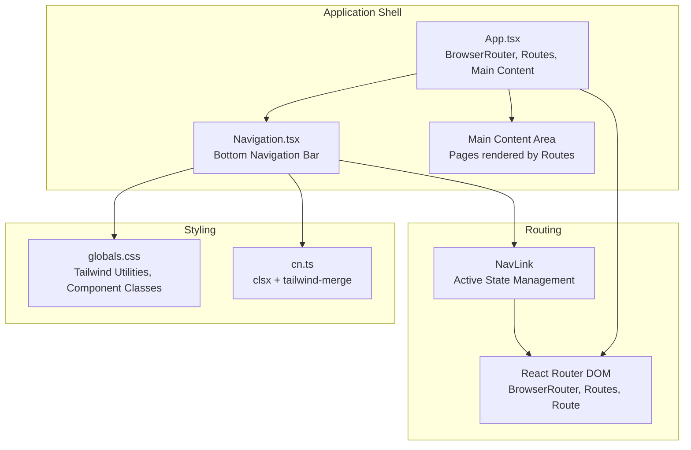
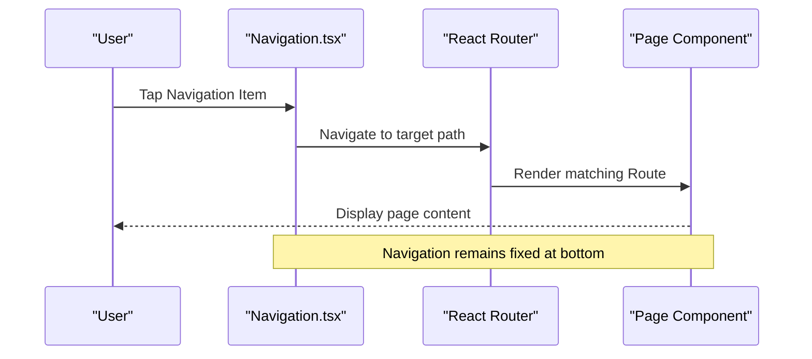
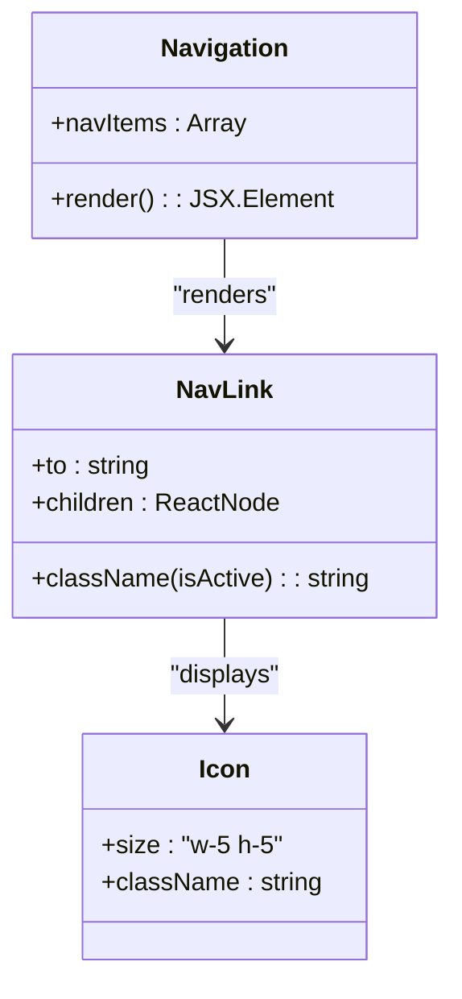
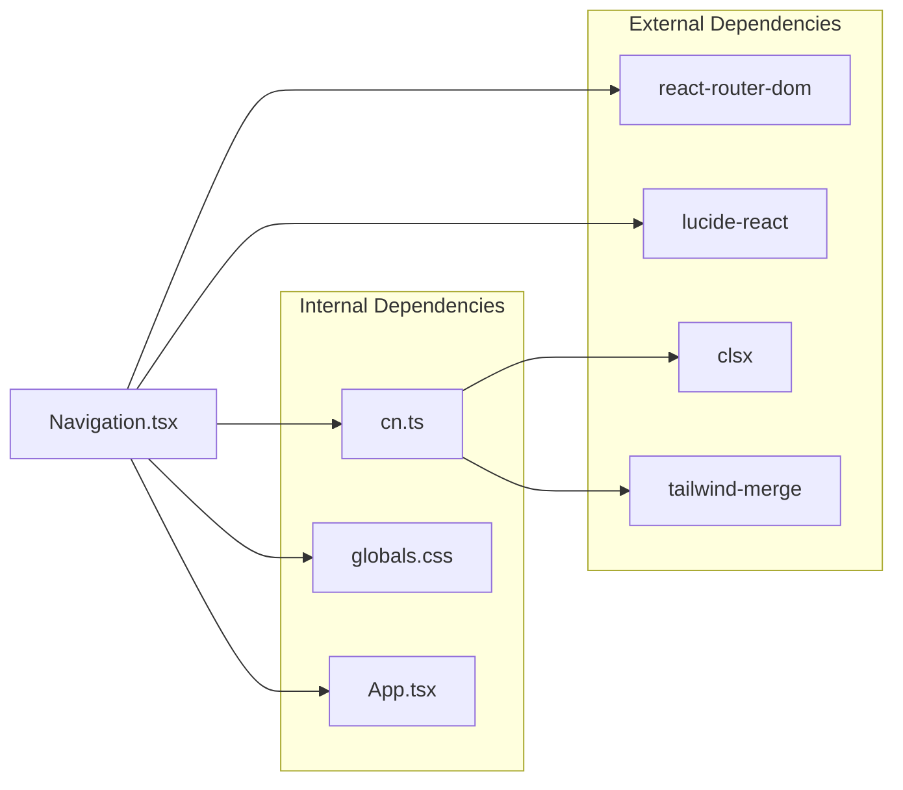

# Navigation System

<cite>
**Referenced Files in This Document**
- [Navigation.tsx](file://frontend/src/components/common/Navigation.tsx)
- [App.tsx](file://frontend/src/App.tsx)
- [main.tsx](file://frontend/src/main.tsx)
- [globals.css](file://frontend/src/styles/globals.css)
- [cn.ts](file://frontend/src/utils/cn.ts)
- [package.json](file://frontend/package.json)
- [HomePage.tsx](file://frontend/src/pages/HomePage.tsx)
- [WorkoutsPage.tsx](file://frontend/src/pages/WorkoutsPage.tsx)
- [ProfilePage.tsx](file://frontend/src/pages/ProfilePage.tsx)
</cite>

## Table of Contents
1. [Introduction](#introduction)
2. [Project Structure](#project-structure)
3. [Core Components](#core-components)
4. [Architecture Overview](#architecture-overview)
5. [Detailed Component Analysis](#detailed-component-analysis)
6. [Dependency Analysis](#dependency-analysis)
7. [Performance Considerations](#performance-considerations)
8. [Troubleshooting Guide](#troubleshooting-guide)
9. [Conclusion](#conclusion)

## Introduction
This document provides comprehensive documentation for the navigation system component in the Fit Tracker Pro application. It explains the implementation of the Navigation component, the bottom navigation bar layout, active state management, and integration with React Router. It also covers styling patterns, responsive behavior, accessibility considerations, and practical examples for customization. The navigation system is designed specifically for Telegram Mini App environments and mobile touch interactions.

## Project Structure
The navigation system is implemented as a reusable bottom navigation component integrated into the main application shell. The component is placed at the bottom of the screen and provides quick access to core application routes.

**Diagram sources**
- [App.tsx:12-32](file://frontend/src/App.tsx#L12-L32)
- [Navigation.tsx:13-37](file://frontend/src/components/common/Navigation.tsx#L13-L37)
- [globals.css:293-302](file://frontend/src/styles/globals.css#L293-L302)
- [cn.ts:4-6](file://frontend/src/utils/cn.ts#L4-L6)

**Section sources**
- [App.tsx:12-32](file://frontend/src/App.tsx#L12-L32)
- [Navigation.tsx:13-37](file://frontend/src/components/common/Navigation.tsx#L13-L37)
- [globals.css:293-302](file://frontend/src/styles/globals.css#L293-L302)
- [cn.ts:4-6](file://frontend/src/utils/cn.ts#L4-L6)

## Core Components
The navigation system consists of a single, focused component responsible for rendering a bottom navigation bar with five primary destinations. It leverages React Router for navigation and Tailwind CSS for styling, with a utility function for merging class names.

Key characteristics:
- Bottom-fixed layout with z-index for proper stacking
- Five navigation items with icons and labels
- Active state highlighting via React Router's NavLink
- Responsive sizing and spacing for mobile touch targets
- Integration with Telegram Mini App theme variables

**Section sources**
- [Navigation.tsx:5-11](file://frontend/src/components/common/Navigation.tsx#L5-L11)
- [Navigation.tsx:13-37](file://frontend/src/components/common/Navigation.tsx#L13-L37)
- [App.tsx:17-26](file://frontend/src/App.tsx#L17-L26)

## Architecture Overview
The navigation system participates in the application's routing architecture. The main App component sets up React Router with BrowserRouter and defines all application routes. The Navigation component is rendered outside the routing context to remain persistent across page navigations.

**Diagram sources**
- [App.tsx:14-31](file://frontend/src/App.tsx#L14-L31)
- [Navigation.tsx:18-28](file://frontend/src/components/common/Navigation.tsx#L18-L28)

**Section sources**
- [App.tsx:14-31](file://frontend/src/App.tsx#L14-L31)
- [Navigation.tsx:18-28](file://frontend/src/components/common/Navigation.tsx#L18-L28)

## Detailed Component Analysis

### Navigation Component Implementation
The Navigation component is a pure functional component that renders a bottom navigation bar containing five predefined items. Each item uses React Router's NavLink to manage active state and handle navigation.

Implementation highlights:
- Static navigation item definition with path, icon, and label
- Dynamic active state detection via NavLink's isActive callback
- Utility-based class name composition for responsive styling
- Fixed positioning at the bottom of the viewport

**Diagram sources**
- [Navigation.tsx:5-11](file://frontend/src/components/common/Navigation.tsx#L5-L11)
- [Navigation.tsx:18-32](file://frontend/src/components/common/Navigation.tsx#L18-L32)

**Section sources**
- [Navigation.tsx:13-37](file://frontend/src/components/common/Navigation.tsx#L13-L37)

### Menu Structure and Route Configuration
The navigation menu structure is defined statically within the component. Each menu item corresponds to a specific route in the application's routing configuration.

Menu structure:
- Home (/): Dashboard and overview
- Catalog (/exercises): Exercise catalog
- Workouts (/workouts): Workout management
- Analytics (/analytics): Statistics and insights
- Profile (/profile): User profile and settings

Integration with routing:
- Routes are defined in App.tsx with corresponding page components
- Navigation links match route paths exactly
- Active state reflects current route

**Section sources**
- [Navigation.tsx:5-11](file://frontend/src/components/common/Navigation.tsx#L5-L11)
- [App.tsx:17-26](file://frontend/src/App.tsx#L17-L26)

### Active State Management
Active state is managed declaratively through React Router's NavLink component. The component receives an isActive callback that determines styling based on the current route.

Active state behavior:
- Visual indication changes text color to blue-500
- Hover states provide additional visual feedback
- Transitions ensure smooth state changes
- No manual state management required

**Section sources**
- [Navigation.tsx:21-28](file://frontend/src/components/common/Navigation.tsx#L21-L28)

### Route Linking and Navigation Flow
The navigation system integrates seamlessly with React Router's programmatic navigation. Each navigation item creates a direct link to its corresponding route, maintaining the SPA behavior while providing persistent navigation.

Navigation flow:
- User taps a bottom navigation item
- NavLink triggers route change
- React Router renders appropriate page component
- Navigation maintains fixed position during transitions

**Section sources**
- [Navigation.tsx:18-21](file://frontend/src/components/common/Navigation.tsx#L18-L21)
- [App.tsx:17-26](file://frontend/src/App.tsx#L17-L26)

### Styling Patterns and Design System Integration
The navigation component leverages the application's design system through Tailwind CSS utilities and custom component classes. The styling follows established patterns for consistent visual hierarchy and responsive behavior.

Styling approach:
- Fixed bottom positioning with z-index for overlay behavior
- Flexbox layout for equal-width navigation items
- Responsive typography with small text sizing
- Theme-aware color application
- Transition effects for interactive states

**Section sources**
- [Navigation.tsx:15-16](file://frontend/src/components/common/Navigation.tsx#L15-L16)
- [Navigation.tsx:23-27](file://frontend/src/components/common/Navigation.tsx#L23-L27)
- [globals.css:293-302](file://frontend/src/styles/globals.css#L293-L302)

### Accessibility Features
The navigation system incorporates several accessibility considerations appropriate for mobile touch interfaces:

Accessibility features:
- Large touch targets suitable for mobile interaction
- Clear visual hierarchy with icon plus label
- Sufficient color contrast for active/inactive states
- Focus management through programmatic navigation
- Semantic HTML structure with anchor elements

**Section sources**
- [Navigation.tsx:30-31](file://frontend/src/components/common/Navigation.tsx#L30-L31)
- [Navigation.tsx:25-26](file://frontend/src/components/common/Navigation.tsx#L25-L26)

### Responsive Behavior
The navigation component is designed for mobile-first responsive behavior, with considerations for various device sizes and orientations.

Responsive characteristics:
- Fixed bottom positioning adapts to viewport height
- Equal-width flex items distribute space evenly
- Touch-friendly sizing accommodates finger interaction
- Safe area insets considered for modern devices
- Typography scales appropriately for small screens

**Section sources**
- [Navigation.tsx:15-16](file://frontend/src/components/common/Navigation.tsx#L15-L16)
- [globals.css:335-337](file://frontend/src/styles/globals.css#L335-L337)

### Mobile Navigation Patterns and Touch Interaction Design
The navigation system implements mobile-specific patterns optimized for touch interaction and Telegram Mini App environments.

Mobile patterns:
- Bottom navigation placement for thumb-friendly access
- Persistent navigation across all pages
- Minimal cognitive load with familiar icons
- Immediate visual feedback on interaction
- Integration with Telegram Mini App safe areas

**Section sources**
- [Navigation.tsx:15-16](file://frontend/src/components/common/Navigation.tsx#L15-L16)
- [globals.css:335-337](file://frontend/src/styles/globals.css#L335-L337)

### Component Props and Configuration
The Navigation component currently uses a static configuration approach. While it does not accept external props, it can be adapted for dynamic configuration.

Current configuration:
- navItems array defines all navigation entries
- Each item requires path, icon, and label
- Icons imported from lucide-react library
- No runtime prop configuration

Dynamic configuration approach:
- Accept navItems as prop
- Support custom icon components
- Allow conditional item visibility
- Enable runtime route modification

**Section sources**
- [Navigation.tsx:5-11](file://frontend/src/components/common/Navigation.tsx#L5-L11)

### Examples of Navigation Configuration and Custom Items
The following examples demonstrate how to customize the navigation system for different use cases:

Basic customization example:
- Modify existing navItems array
- Change icon components
- Adjust label text
- Update route paths

Advanced customization example:
- Create dynamic navItems based on user permissions
- Conditionally render navigation items
- Integrate with authentication state
- Support multi-language labels

Note: These examples reference configuration patterns without reproducing code content.

**Section sources**
- [Navigation.tsx:5-11](file://frontend/src/components/common/Navigation.tsx#L5-L11)

## Dependency Analysis
The navigation system has minimal external dependencies and integrates cleanly with the application's architecture.

External dependencies:
- react-router-dom: Provides routing and active state management
- lucide-react: Delivers SVG iconography
- clsx and tailwind-merge: Utility for class name composition
- Tailwind CSS: Styling framework and utilities

Internal dependencies:
- cn utility function for class merging
- globals.css for shared styling patterns
- App.tsx for routing integration

**Diagram sources**
- [Navigation.tsx:1-3](file://frontend/src/components/common/Navigation.tsx#L1-L3)
- [cn.ts:1-6](file://frontend/src/utils/cn.ts#L1-L6)
- [package.json:16-35](file://frontend/package.json#L16-L35)

**Section sources**
- [Navigation.tsx:1-3](file://frontend/src/components/common/Navigation.tsx#L1-L3)
- [cn.ts:1-6](file://frontend/src/utils/cn.ts#L1-L6)
- [package.json:16-35](file://frontend/package.json#L16-L35)

## Performance Considerations
The navigation system is optimized for performance with minimal re-renders and efficient rendering patterns.

Performance characteristics:
- Stateless component with no local state
- Pure rendering based on props and router state
- Efficient class name composition with utility function
- Minimal DOM nodes per navigation item
- No unnecessary subscriptions or side effects

Optimization opportunities:
- Memoize navItems array if dynamically generated
- Consider lazy loading for heavy icon components
- Implement virtualization for large navigation menus
- Optimize CSS for paint and layout performance

## Troubleshooting Guide
Common issues and solutions for the navigation system:

Navigation not working:
- Verify route paths match between navigation and App.tsx routes
- Check that BrowserRouter is properly configured
- Ensure NavLink components are used within Router context

Styling issues:
- Confirm Tailwind CSS is properly configured
- Verify globals.css is imported in main.tsx
- Check that z-index values don't conflict with other overlays

Active state problems:
- Ensure React Router version compatibility
- Verify isActive callback usage in className function
- Check for conflicting CSS rules affecting active states

Responsive behavior:
- Test on various device sizes and orientations
- Verify safe area insets are properly applied
- Check viewport units and mobile-specific CSS

**Section sources**
- [App.tsx:14-31](file://frontend/src/App.tsx#L14-L31)
- [Navigation.tsx:18-28](file://frontend/src/components/common/Navigation.tsx#L18-L28)
- [globals.css:142-146](file://frontend/src/styles/globals.css#L142-L146)

## Conclusion
The navigation system in Fit Tracker Pro provides a robust, mobile-first solution for application navigation. Its implementation demonstrates clean separation of concerns, effective integration with React Router, and adherence to design system principles. The component's simplicity and focused responsibility make it maintainable and extensible for future enhancements while providing excellent user experience for Telegram Mini App users.