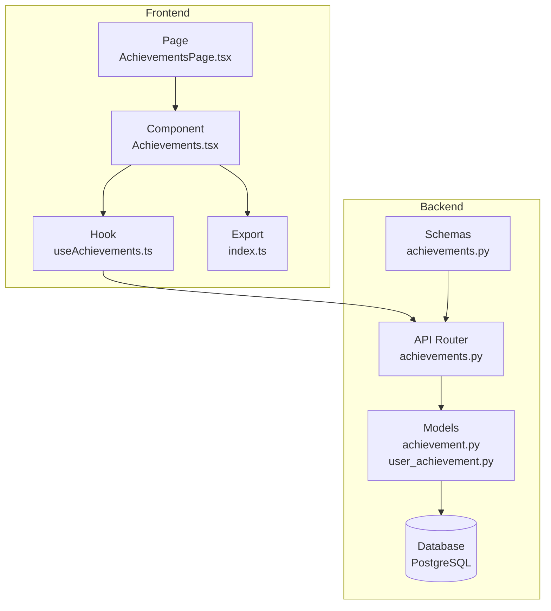
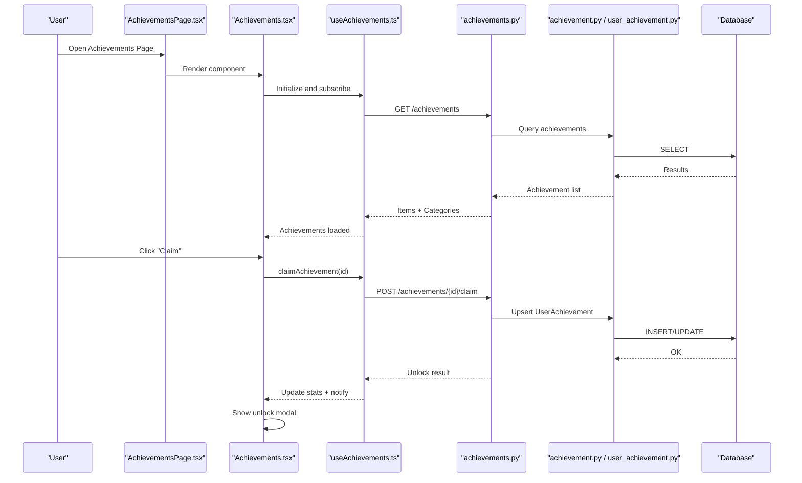
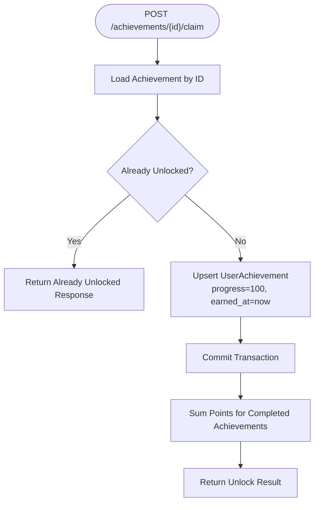
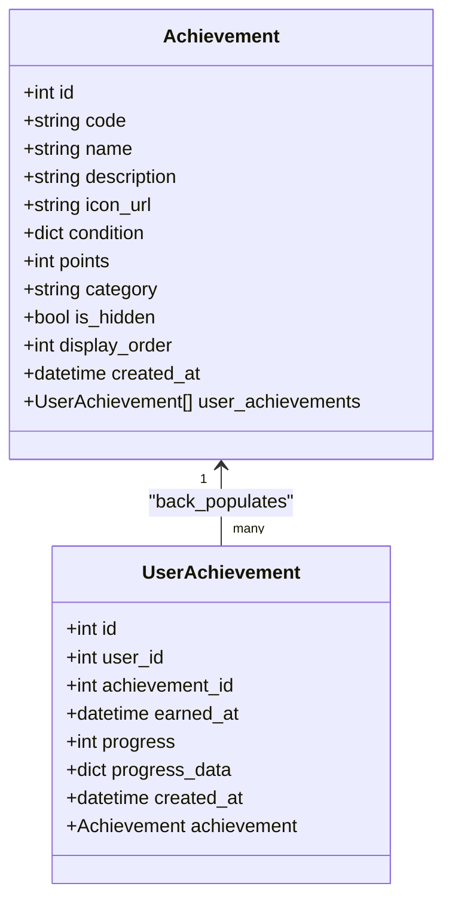
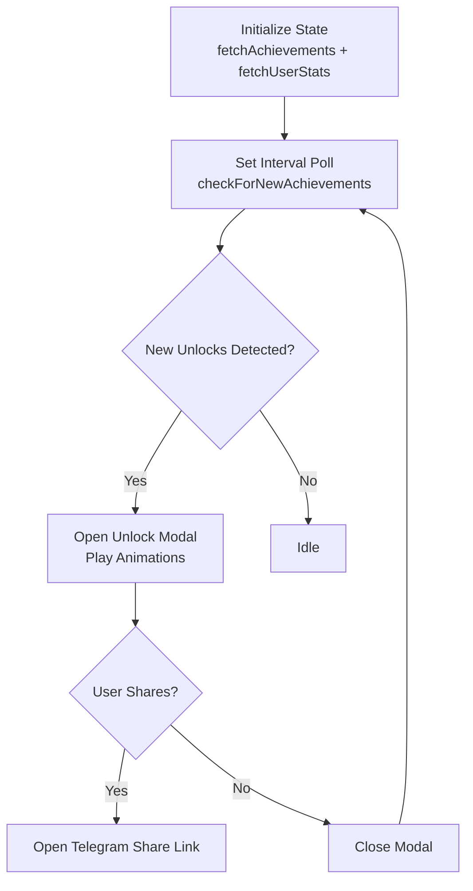
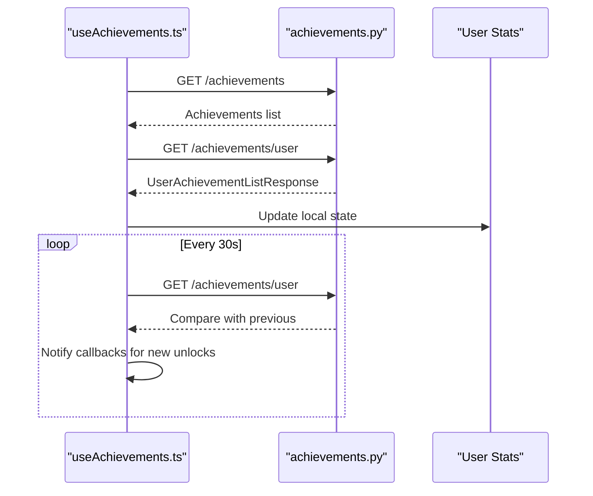
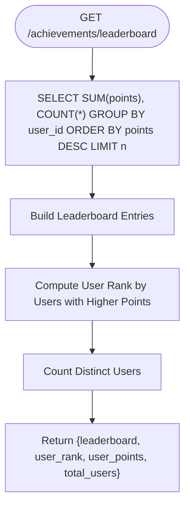
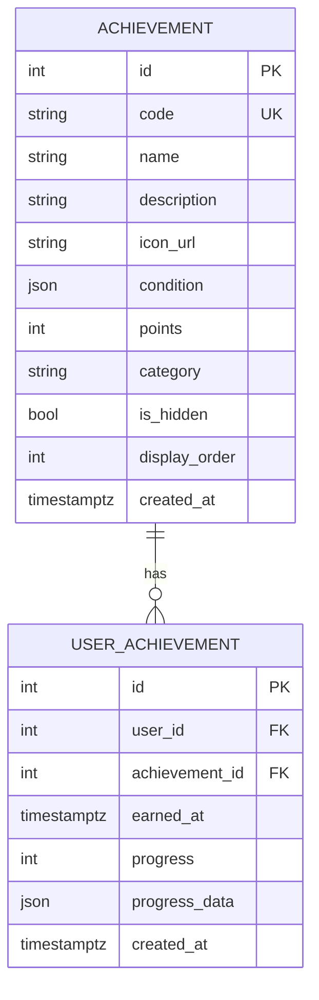
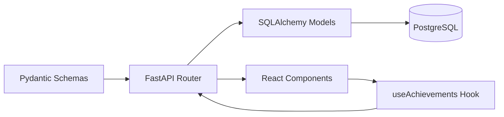

# Achievements Page

<cite>
**Referenced Files in This Document**
- [achievements.py](file://backend/app/api/achievements.py)
- [achievement.py](file://backend/app/models/achievement.py)
- [user_achievement.py](file://backend/app/models/user_achievement.py)
- [achievements.py](file://backend/app/schemas/achievements.py)
- [Achievements.tsx](file://frontend/src/components/gamification/Achievements.tsx)
- [useAchievements.ts](file://frontend/src/hooks/useAchievements.ts)
- [AchievementsPage.tsx](file://frontend/src/pages/AchievementsPage.tsx)
- [index.ts](file://frontend/src/components/gamification/index.ts)
- [schema_v2.sql (legacy archive)](file://docs/db/legacy/schema_v2.sql)
</cite>

## Table of Contents
1. [Introduction](#introduction)
2. [Project Structure](#project-structure)
3. [Core Components](#core-components)
4. [Architecture Overview](#architecture-overview)
5. [Detailed Component Analysis](#detailed-component-analysis)
6. [Dependency Analysis](#dependency-analysis)
7. [Performance Considerations](#performance-considerations)
8. [Troubleshooting Guide](#troubleshooting-guide)
9. [Conclusion](#conclusion)

## Introduction
This document describes the Achievements Page and gamification system in FitTracker Pro. It covers the achievement display interface, progress tracking visualization, badge collection system, and reward mechanisms. It also documents achievement criteria calculation, progress monitoring, unlock notifications, integration with achievement hooks, progress data synchronization, and leaderboard functionality. Additional topics include achievement categorization, difficulty levels, seasonal challenges, social sharing of achievements, progress comparison features, and community engagement aspects.

## Project Structure
The gamification system spans backend API endpoints, SQLAlchemy models, Pydantic schemas, and frontend components and hooks. The backend exposes endpoints for listing achievements, retrieving user-specific progress, claiming achievements, and generating leaderboards. The frontend renders achievement cards, progress bars, unlock modals, and profile showcases, and integrates with hooks for real-time updates and notifications.

**Diagram sources**
- [achievements.py:25-420](file://backend/app/api/achievements.py#L25-L420)
- [achievement.py:17-105](file://backend/app/models/achievement.py#L17-L105)
- [user_achievement.py:18-71](file://backend/app/models/user_achievement.py#L18-L71)
- [Achievements.tsx:626-934](file://frontend/src/components/gamification/Achievements.tsx#L626-L934)
- [useAchievements.ts:67-278](file://frontend/src/hooks/useAchievements.ts#L67-L278)
- [AchievementsPage.tsx:11-28](file://frontend/src/pages/AchievementsPage.tsx#L11-L28)
- [index.ts:5-18](file://frontend/src/components/gamification/index.ts#L5-L18)

**Section sources**
- [achievements.py:25-420](file://backend/app/api/achievements.py#L25-L420)
- [achievement.py:17-105](file://backend/app/models/achievement.py#L17-L105)
- [user_achievement.py:18-71](file://backend/app/models/user_achievement.py#L18-L71)
- [Achievements.tsx:626-934](file://frontend/src/components/gamification/Achievements.tsx#L626-L934)
- [useAchievements.ts:67-278](file://frontend/src/hooks/useAchievements.ts#L67-L278)
- [AchievementsPage.tsx:11-28](file://frontend/src/pages/AchievementsPage.tsx#L11-L28)
- [index.ts:5-18](file://frontend/src/components/gamification/index.ts#L5-L18)

## Core Components
- Backend API router for achievements with endpoints to list achievements, retrieve user progress, claim achievements, and compute leaderboards.
- SQLAlchemy models representing achievement definitions and user progress/unlocks.
- Pydantic schemas for request/response validation and serialization.
- Frontend component rendering achievement cards, progress bars, unlock modal, and profile showcase.
- Frontend hook managing achievement data fetching, progress checks, unlock notifications, and periodic polling.
- Database seed script defining default achievements with conditions, points, categories, and display orders.

Key capabilities:
- Achievement display with icons, descriptions, points, and progress bars.
- User progress tracking per achievement with completion thresholds.
- Unlock notifications with animations and social sharing integration.
- Leaderboard computation by total points and counts.
- Category filtering and compact profile showcase.

**Section sources**
- [achievements.py:25-420](file://backend/app/api/achievements.py#L25-L420)
- [achievement.py:17-105](file://backend/app/models/achievement.py#L17-L105)
- [user_achievement.py:18-71](file://backend/app/models/user_achievement.py#L18-L71)
- [achievements.py:10-81](file://backend/app/schemas/achievements.py#L10-L81)
- [Achievements.tsx:24-71](file://frontend/src/components/gamification/Achievements.tsx#L24-L71)
- [useAchievements.ts:67-278](file://frontend/src/hooks/useAchievements.ts#L67-L278)
- [schema_v2.sql:412-575](file://docs/db/legacy/schema_v2.sql#L412-L575)

## Architecture Overview
The system follows a client-server architecture:
- Frontend pages and components trigger actions (fetch, claim, poll).
- Hooks coordinate data fetching and state updates.
- API endpoints validate requests, query the database, and return structured responses.
- Models define persistence and relationships; schemas enforce input/output contracts.
- Leaderboard computations aggregate user progress and points.

**Diagram sources**
- [AchievementsPage.tsx:11-28](file://frontend/src/pages/AchievementsPage.tsx#L11-L28)
- [Achievements.tsx:654-709](file://frontend/src/components/gamification/Achievements.tsx#L654-L709)
- [useAchievements.ts:129-153](file://frontend/src/hooks/useAchievements.ts#L129-L153)
- [achievements.py:216-310](file://backend/app/api/achievements.py#L216-L310)
- [achievement.py:17-105](file://backend/app/models/achievement.py#L17-L105)
- [user_achievement.py:18-71](file://backend/app/models/user_achievement.py#L18-L71)

## Detailed Component Analysis

### Backend API: Achievements Endpoints
- GET /achievements: Lists all available achievements, optionally filtered by category, ordered by display order and category.
- GET /achievements/user: Returns current user’s achievements with computed totals, counts, and recent unlocks.
- GET /achievements/user/{achievement_id}: Retrieves a specific user achievement with details.
- POST /achievements/{achievement_id}/claim: Claims an achievement for the current user; currently auto-claims for demonstration and calculates new total points.
- GET /achievements/leaderboard: Computes leaderboard by total points and counts, and determines user rank and total users.

**Diagram sources**
- [achievements.py:216-310](file://backend/app/api/achievements.py#L216-L310)

**Section sources**
- [achievements.py:25-420](file://backend/app/api/achievements.py#L25-L420)

### Backend Models: Achievement and UserAchievement
- Achievement: Defines achievement metadata (code, name, description, icon_url, condition as JSON, points, category, hidden flag, display order) and relationships to user achievements.
- UserAchievement: Tracks user-specific progress and unlocks (user_id, achievement_id, earned_at, progress percentage, progress_data JSON), with foreign keys to users and achievements.

**Diagram sources**
- [achievement.py:17-105](file://backend/app/models/achievement.py#L17-L105)
- [user_achievement.py:18-71](file://backend/app/models/user_achievement.py#L18-L71)

**Section sources**
- [achievement.py:17-105](file://backend/app/models/achievement.py#L17-L105)
- [user_achievement.py:18-71](file://backend/app/models/user_achievement.py#L18-L71)

### Frontend Component: Achievements
- AchievementCard: Renders individual achievement with icon, name, description, points badge, progress bar for in-progress, and unlock date for completed.
- AchievementUnlockModal: Displays unlock animation, confetti, and share button; triggers Telegram WebApp share link.
- ProfileShowcase: Shows total points, completed count, progress bar, and recent rare badges.
- Filtering and grouping: Supports category filter and grouped display by category.
- Haptic feedback and animations: Integrates with Telegram WebApp for haptic and visual feedback.

**Diagram sources**
- [Achievements.tsx:688-743](file://frontend/src/components/gamification/Achievements.tsx#L688-L743)

**Section sources**
- [Achievements.tsx:24-934](file://frontend/src/components/gamification/Achievements.tsx#L24-L934)

### Frontend Hook: useAchievements
- Provides methods to fetch achievements, fetch user stats, claim achievements, check progress, subscribe to unlock events, and poll for new unlocks.
- Maintains internal state for achievements, user stats, loading, and errors.
- Uses Telegram WebApp haptic feedback on successful claims.
- Periodically polls for new unlocks every 30 seconds.

**Diagram sources**
- [useAchievements.ts:84-124](file://frontend/src/hooks/useAchievements.ts#L84-L124)
- [useAchievements.ts:202-240](file://frontend/src/hooks/useAchievements.ts#L202-L240)

**Section sources**
- [useAchievements.ts:67-278](file://frontend/src/hooks/useAchievements.ts#L67-L278)

### Leaderboard Functionality
- Backend computes top users by sum of points and count of completed achievements, then derives user rank and total users.
- Frontend displays leaderboard entries with rank, username, total points, and achievements count.

**Diagram sources**
- [achievements.py:312-420](file://backend/app/api/achievements.py#L312-L420)

**Section sources**
- [achievements.py:312-420](file://backend/app/api/achievements.py#L312-L420)

### Achievement Criteria and Difficulty Levels
- Criteria are defined as JSON in the condition field with types such as workout_count, streak_days, calories_burned, glucose_logs, wellness_streak, sleep_score, challenge_created, template_shared.
- Points reflect difficulty and rarity; frontend maps points to rarity tiers and visual gradients.
- Categories include workouts, health, streaks, social, and general.

**Diagram sources**
- [achievement.py:17-105](file://backend/app/models/achievement.py#L17-L105)
- [user_achievement.py:18-71](file://backend/app/models/user_achievement.py#L18-L71)

**Section sources**
- [schema_v2.sql:412-575](file://docs/db/legacy/schema_v2.sql#L412-L575)
- [Achievements.tsx:217-229](file://frontend/src/components/gamification/Achievements.tsx#L217-L229)
 

### Social Sharing and Community Engagement
- AchievementUnlockModal includes a share action that opens a Telegram WebApp share link with preformatted text including achievement name, description, and points.
- Leaderboard view allows users to compare progress against peers.
- Profile showcase highlights recent rare achievements to encourage sharing.

**Section sources**
- [Achievements.tsx:734-743](file://frontend/src/components/gamification/Achievements.tsx#L734-L743)
- [achievements.py:312-420](file://backend/app/api/achievements.py#L312-L420)

## Dependency Analysis
- Backend depends on SQLAlchemy ORM for models and FastAPI for routing and schemas for validation.
- Frontend depends on React hooks, custom components (ProgressBar, Modal, Button), and Telegram WebApp integration.
- Data flows from database through models and schemas to API responses and then to frontend components.

**Diagram sources**
- [achievements.py:10-81](file://backend/app/schemas/achievements.py#L10-L81)
- [achievements.py:25-420](file://backend/app/api/achievements.py#L25-L420)
- [achievement.py:17-105](file://backend/app/models/achievement.py#L17-L105)
- [user_achievement.py:18-71](file://backend/app/models/user_achievement.py#L18-L71)
- [Achievements.tsx:626-934](file://frontend/src/components/gamification/Achievements.tsx#L626-L934)
- [useAchievements.ts:67-278](file://frontend/src/hooks/useAchievements.ts#L67-L278)

**Section sources**
- [achievements.py:25-420](file://backend/app/api/achievements.py#L25-L420)
- [achievement.py:17-105](file://backend/app/models/achievement.py#L17-L105)
- [user_achievement.py:18-71](file://backend/app/models/user_achievement.py#L18-L71)
- [achievements.py:10-81](file://backend/app/schemas/achievements.py#L10-L81)
- [Achievements.tsx:626-934](file://frontend/src/components/gamification/Achievements.tsx#L626-L934)
- [useAchievements.ts:67-278](file://frontend/src/hooks/useAchievements.ts#L67-L278)

## Performance Considerations
- API queries use ordering and indexing on category, display_order, and foreign keys to optimize list retrieval and leaderboard aggregation.
- Frontend uses memoization for grouping and calculating recent rare achievements to reduce re-renders.
- Periodic polling for new unlocks occurs every 30 seconds; adjust interval based on user activity and server capacity.
- Consider adding pagination for large achievement lists and limiting leaderboard size to reduce payload sizes.

## Troubleshooting Guide
Common issues and resolutions:
- Achievement list fails to load: Verify API endpoint availability and network connectivity; check error messages returned by the hook.
- Claim endpoint returns “already unlocked”: Ensure client-side logic prevents duplicate claims and handles response appropriately.
- Progress not updating: Confirm periodic polling is active and user stats are refreshed after claims; verify backend progress update endpoint exists.
- Leaderboard empty: Ensure users have completed achievements and points are summed correctly; confirm database aggregation queries execute.

**Section sources**
- [useAchievements.ts:97-102](file://frontend/src/hooks/useAchievements.ts#L97-L102)
- [achievements.py:264-271](file://backend/app/api/achievements.py#L264-L271)
- [useAchievements.ts:248-259](file://frontend/src/hooks/useAchievements.ts#L248-L259)

## Conclusion
The Achievements Page and gamification system integrates backend APIs, models, and schemas with robust frontend components and hooks. It supports achievement display, progress tracking, unlock notifications, social sharing, and leaderboard functionality. The modular design enables easy extension for new achievement types, categories, and community features while maintaining clear separation of concerns between presentation, data fetching, and persistence.