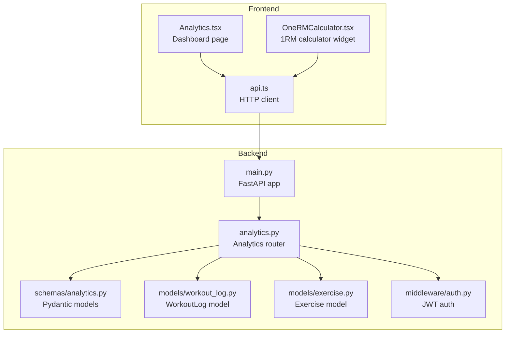
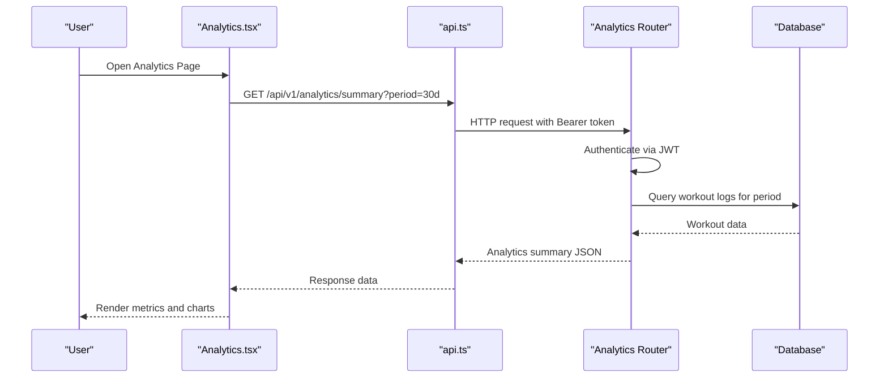
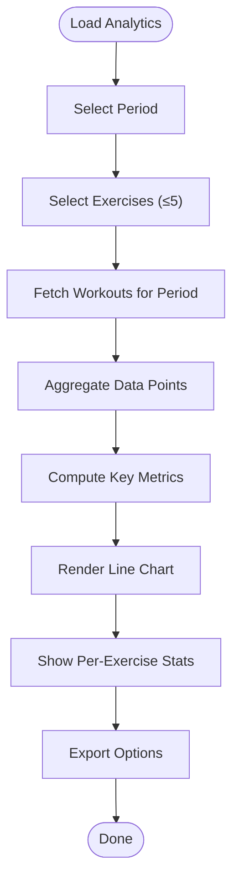
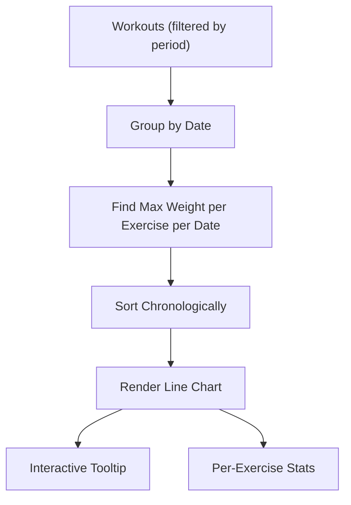
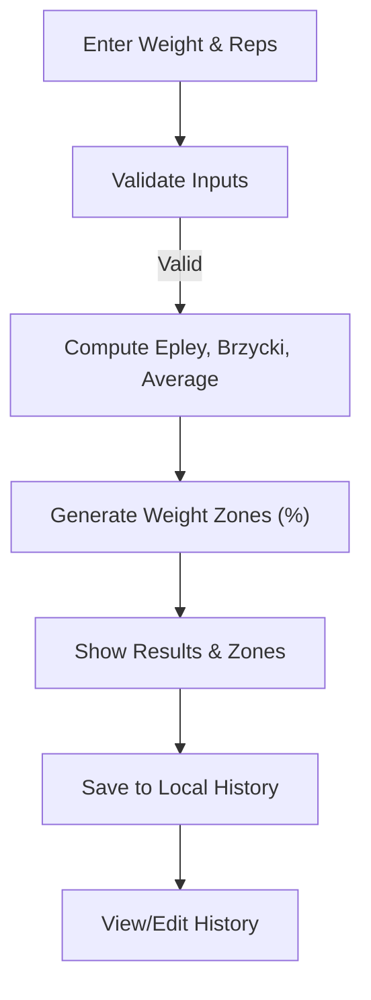
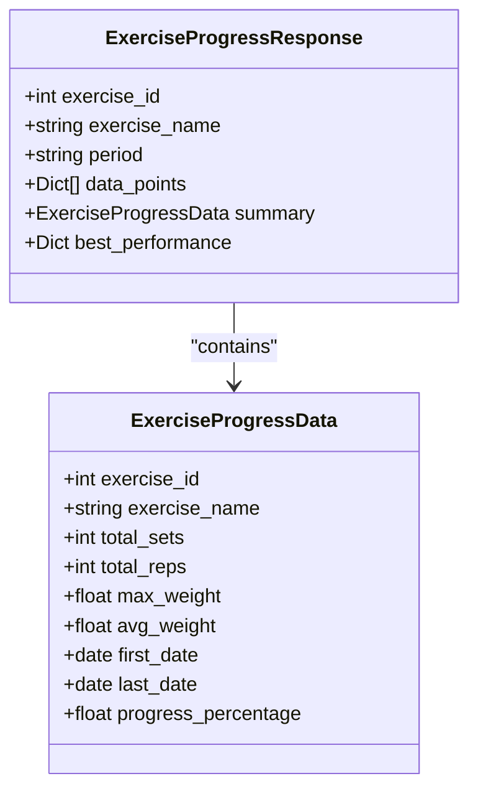
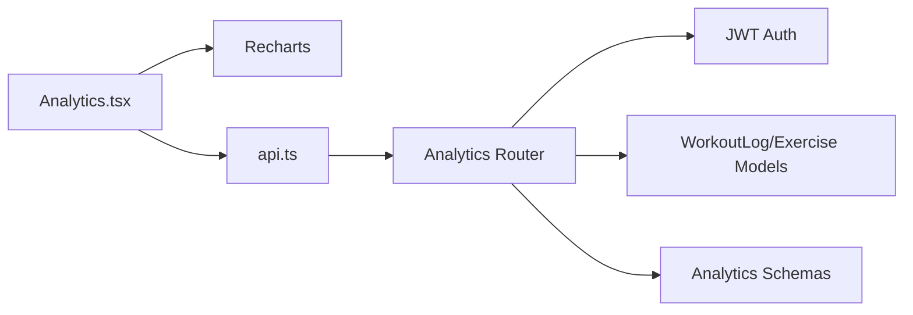

# Analytics Page

<cite>
**Referenced Files in This Document**
- [Analytics.tsx](file://frontend/src/pages/Analytics.tsx)
- [OneRMCalculator.tsx](file://frontend/src/components/analytics/OneRMCalculator.tsx)
- [analytics.py](file://backend/app/api/analytics.py)
- [analytics.py](file://backend/app/schemas/analytics.py)
- [workout_log.py](file://backend/app/models/workout_log.py)
- [exercise.py](file://backend/app/models/exercise.py)
- [main.py](file://backend/app/main.py)
- [auth.py](file://backend/app/middleware/auth.py)
- [api.ts](file://frontend/src/services/api.ts)
</cite>

## Table of Contents
1. [Introduction](#introduction)
2. [Project Structure](#project-structure)
3. [Core Components](#core-components)
4. [Architecture Overview](#architecture-overview)
5. [Detailed Component Analysis](#detailed-component-analysis)
6. [Dependency Analysis](#dependency-analysis)
7. [Performance Considerations](#performance-considerations)
8. [Troubleshooting Guide](#troubleshooting-guide)
9. [Conclusion](#conclusion)

## Introduction
This document describes the Analytics Page and performance tracking system for FitTracker Pro. It covers the analytics dashboard layout, workout statistics visualization, progress charts, and performance metrics display. It also explains the One Rep Max (1RM) calculator implementation, strength progression tracking, workout history analysis, data aggregation patterns, chart rendering components, and statistical analysis algorithms. Additionally, it documents export functionality for workout data, progress report generation, sharing capabilities, data privacy considerations, historical data management, and integration with external fitness platforms.

## Project Structure
The analytics system spans both frontend and backend components:
- Frontend: Analytics dashboard page, chart rendering, and interactive widgets
- Backend: Analytics API endpoints, data models, and schemas
- Shared: Authentication middleware and HTTP client service

**Diagram sources**
- [Analytics.tsx:641-996](file://frontend/src/pages/Analytics.tsx#L641-L996)
- [OneRMCalculator.tsx:397-711](file://frontend/src/components/analytics/OneRMCalculator.tsx#L397-L711)
- [api.ts:6-69](file://frontend/src/services/api.ts#L6-L69)
- [main.py:89-107](file://backend/app/main.py#L89-L107)
- [analytics.py:24-24](file://backend/app/api/analytics.py#L24-L24)
- [analytics.py:10-111](file://backend/app/schemas/analytics.py#L10-L111)
- [workout_log.py:19-112](file://backend/app/models/workout_log.py#L19-L112)
- [exercise.py:17-116](file://backend/app/models/exercise.py#L17-L116)
- [auth.py:133-203](file://backend/app/middleware/auth.py#L133-L203)

**Section sources**
- [Analytics.tsx:641-996](file://frontend/src/pages/Analytics.tsx#L641-L996)
- [OneRMCalculator.tsx:397-711](file://frontend/src/components/analytics/OneRMCalculator.tsx#L397-L711)
- [api.ts:6-69](file://frontend/src/services/api.ts#L6-L69)
- [main.py:89-107](file://backend/app/main.py#L89-L107)

## Core Components
- Analytics Dashboard (frontend): Provides period selection, exercise comparison, key metrics cards, interactive line charts, and statistics summaries. Supports exporting data to CSV, PDF, and Telegram.
- One Rep Max Calculator (frontend): Implements Epley, Brzycki, and averaged 1RM formulas, generates recommended weight zones, and maintains local history.
- Analytics API (backend): Exposes endpoints for exercise progress, workout calendar, analytics summary, and data export requests.
- Data Models (backend): Defines WorkoutLog and Exercise structures used for analytics computations.
- Authentication (backend): Enforces JWT-based access for protected analytics endpoints.

**Section sources**
- [Analytics.tsx:641-996](file://frontend/src/pages/Analytics.tsx#L641-L996)
- [OneRMCalculator.tsx:397-711](file://frontend/src/components/analytics/OneRMCalculator.tsx#L397-L711)
- [analytics.py:27-197](file://backend/app/api/analytics.py#L27-L197)
- [workout_log.py:19-112](file://backend/app/models/workout_log.py#L19-L112)
- [exercise.py:17-116](file://backend/app/models/exercise.py#L17-L116)
- [auth.py:133-203](file://backend/app/middleware/auth.py#L133-L203)

## Architecture Overview
The analytics architecture follows a client-server pattern:
- Frontend renders the dashboard and interacts with backend via HTTP client
- Backend validates JWT, queries analytics data, computes statistics, and returns structured responses
- Charts are rendered client-side using Recharts with responsive containers

**Diagram sources**
- [Analytics.tsx:641-996](file://frontend/src/pages/Analytics.tsx#L641-L996)
- [api.ts:47-55](file://frontend/src/services/api.ts#L47-L55)
- [analytics.py:385-517](file://backend/app/api/analytics.py#L385-L517)
- [auth.py:133-203](file://backend/app/middleware/auth.py#L133-L203)

## Detailed Component Analysis

### Analytics Dashboard Layout and Interactions
The dashboard organizes analytics into distinct sections:
- Period selector: Choose predefined windows (7d, 30d, 90d, 1y, all) or define a custom range
- Exercise selector: Multi-select exercises (up to 5) for comparison with color-coded lines
- Key metrics: Total workouts, average rest time, strength growth percentage, and personal records count
- Progress chart: Interactive line chart showing max weight per exercise over time
- Statistics summary: Per-exercise max/min/average and growth percentage
- Export menu: Download CSV, print PDF, or share via Telegram WebApp

**Diagram sources**
- [Analytics.tsx:641-996](file://frontend/src/pages/Analytics.tsx#L641-L996)

**Section sources**
- [Analytics.tsx:641-996](file://frontend/src/pages/Analytics.tsx#L641-L996)

### Workout Statistics Visualization and Progress Charts
- Data aggregation: For each workout in the selected period, the maximum weight lifted across all sets of each exercise is recorded per date. Duplicate dates are merged, and the final dataset is sorted chronologically.
- Chart rendering: Recharts LineChart displays multiple series with tooltips, legends, and responsive sizing. Clicking a point opens a modal with detailed sets and notes.
- Statistics computation: For each selected exercise, the component calculates max, min, average, and percentage growth from first to last data point.

**Diagram sources**
- [Analytics.tsx:664-730](file://frontend/src/pages/Analytics.tsx#L664-L730)

**Section sources**
- [Analytics.tsx:664-730](file://frontend/src/pages/Analytics.tsx#L664-L730)

### Performance Metrics Display
Key metrics computed client-side:
- Total workouts: Count of filtered workout sessions
- Average rest time: Mean of rest seconds across all sets
- Strength growth: Percentage change between first and last total volumes
- Personal records: Placeholder for future PR tracking

These metrics are displayed in compact info cards and updated reactively as filters change.

**Section sources**
- [Analytics.tsx:692-730](file://frontend/src/pages/Analytics.tsx#L692-L730)

### One Rep Max Calculator Implementation
The calculator implements three formulas:
- Epley: 1RM = weight × (1 + reps/30)
- Brzycki: 1RM = weight × (1 + 0.0333 × reps)
- Average: Mean of Epley and Brzycki

It also generates recommended weight zones based on percentages of 1RM and displays them in a table. Users can select an exercise, enter weight and repetitions, and save results to local storage with a timestamp. A history panel allows viewing, selecting, and deleting past calculations.

**Diagram sources**
- [OneRMCalculator.tsx:66-91](file://frontend/src/components/analytics/OneRMCalculator.tsx#L66-L91)
- [OneRMCalculator.tsx:96-109](file://frontend/src/components/analytics/OneRMCalculator.tsx#L96-L109)
- [OneRMCalculator.tsx:456-496](file://frontend/src/components/analytics/OneRMCalculator.tsx#L456-L496)

**Section sources**
- [OneRMCalculator.tsx:66-91](file://frontend/src/components/analytics/OneRMCalculator.tsx#L66-L91)
- [OneRMCalculator.tsx:96-109](file://frontend/src/components/analytics/OneRMCalculator.tsx#L96-L109)
- [OneRMCalculator.tsx:456-496](file://frontend/src/components/analytics/OneRMCalculator.tsx#L456-L496)

### Strength Progression Tracking
Backend analytics endpoints compute:
- Exercise progress: Time-series data points with max weight and reps per date, plus summary statistics (total sets, total reps, max weight, average weight, first/last date, progress percentage)
- Calendar view: Monthly workout calendar with counts, durations, and indicators for health metrics
- Summary: Totals, streaks, favorite exercises, and averages

**Diagram sources**
- [analytics.py:10-34](file://backend/app/schemas/analytics.py#L10-L34)

**Section sources**
- [analytics.py:27-197](file://backend/app/api/analytics.py#L27-L197)
- [analytics.py:10-34](file://backend/app/schemas/analytics.py#L10-L34)

### Workout History Analysis
The frontend dashboard supports drilling down into individual points on the chart to inspect sets, reps, rest times, and notes. The modal navigates to the workout edit page for further action.

**Section sources**
- [Analytics.tsx:733-767](file://frontend/src/pages/Analytics.tsx#L733-L767)
- [Analytics.tsx:980-990](file://frontend/src/pages/Analytics.tsx#L980-L990)

### Data Aggregation Patterns and Statistical Algorithms
Client-side aggregation:
- Map creation per date to merge multiple exercises
- Extract max weight per exercise per date
- Sort by date for chronological order
- Compute metrics (avg rest, strength growth) and per-exercise stats (max/min/avg/growth)

Backend aggregation:
- Query workouts within date range
- Iterate sets to build per-exercise datasets
- Compute progress percentage using first and last weights
- Generate calendar days grouped by date

**Section sources**
- [Analytics.tsx:664-730](file://frontend/src/pages/Analytics.tsx#L664-L730)
- [analytics.py:82-197](file://backend/app/api/analytics.py#L82-L197)

### Chart Rendering Components
The dashboard uses Recharts:
- Responsive container ensures adaptability across devices
- Line chart with configurable colors, dots, and legends
- Custom tooltip for contextual information
- Click handlers to open detailed modals

**Section sources**
- [Analytics.tsx:853-901](file://frontend/src/pages/Analytics.tsx#L853-L901)
- [Analytics.tsx:613-635](file://frontend/src/pages/Analytics.tsx#L613-L635)

### Export Functionality
Export options include:
- CSV export: Generates a CSV string from chart data and downloads a file
- PDF export: Uses browser print dialog for PDF generation
- Telegram sharing: Sends CSV data to Telegram WebApp if available

**Section sources**
- [Analytics.tsx:527-611](file://frontend/src/pages/Analytics.tsx#L527-L611)

### Progress Reports Generation
The backend provides analytics summary endpoints that can be consumed by the frontend to generate progress reports. These include totals, averages, streaks, and favorite exercises.

**Section sources**
- [analytics.py:385-517](file://backend/app/api/analytics.py#L385-L517)

### Sharing Capabilities
The frontend integrates with Telegram WebApp for sharing analytics exports directly to chats or conversations.

**Section sources**
- [Analytics.tsx:546-560](file://frontend/src/pages/Analytics.tsx#L546-L560)

### Data Privacy in Analytics
- Authentication: All analytics endpoints require a valid JWT Bearer token
- Authorization: Current user context is enforced per request
- Data scope: Analytics operate within the authenticated user’s workout logs

**Section sources**
- [auth.py:133-203](file://backend/app/middleware/auth.py#L133-L203)
- [analytics.py:27-32](file://backend/app/api/analytics.py#L27-L32)

### Historical Data Management
- Client-side: OneRM calculator persists history in local storage with automatic cleanup
- Server-side: Workout logs are stored with timestamps and can be queried by date ranges
- Future enhancements: Personal records tracking and export status management are marked as TODOs

**Section sources**
- [OneRMCalculator.tsx:417-426](file://frontend/src/components/analytics/OneRMCalculator.tsx#L417-L426)
- [workout_log.py:19-112](file://backend/app/models/workout_log.py#L19-L112)
- [analytics.py:310-383](file://backend/app/api/analytics.py#L310-L383)

### Integration with External Fitness Platforms
- Export endpoints support structured data exports (JSON/CVS/XLSX) for downstream processing
- Calendar endpoint can surface health metrics (glucose) for cross-platform insights
- Future integration: Export status retrieval and third-party platform synchronization are indicated for development

**Section sources**
- [analytics.py:310-383](file://backend/app/api/analytics.py#L310-L383)
- [analytics.py:200-307](file://backend/app/api/analytics.py#L200-L307)

## Dependency Analysis
The analytics system exhibits clear separation of concerns:
- Frontend depends on Recharts for visualization and an HTTP client for API communication
- Backend depends on SQLAlchemy for ORM, Pydantic for schema validation, and JWT middleware for authentication
- Data models encapsulate workout and exercise structures used across analytics computations

**Diagram sources**
- [Analytics.tsx:641-996](file://frontend/src/pages/Analytics.tsx#L641-L996)
- [api.ts:6-69](file://frontend/src/services/api.ts#L6-L69)
- [analytics.py:24-24](file://backend/app/api/analytics.py#L24-L24)
- [auth.py:133-203](file://backend/app/middleware/auth.py#L133-L203)
- [workout_log.py:19-112](file://backend/app/models/workout_log.py#L19-L112)
- [exercise.py:17-116](file://backend/app/models/exercise.py#L17-L116)
- [analytics.py:10-111](file://backend/app/schemas/analytics.py#L10-L111)

**Section sources**
- [main.py:89-107](file://backend/app/main.py#L89-L107)
- [auth.py:133-203](file://backend/app/middleware/auth.py#L133-L203)
- [analytics.py:24-24](file://backend/app/api/analytics.py#L24-L24)

## Performance Considerations
- Client-side filtering and aggregation: Efficient memoization prevents unnecessary recomputation when selections change
- Chart responsiveness: Responsive containers and lightweight tooltips minimize rendering overhead
- Backend pagination: For large datasets, consider paginated analytics endpoints and server-side aggregation
- Export processing: Asynchronous export tasks and status polling improve UX for large exports

## Troubleshooting Guide
Common issues and resolutions:
- Authentication failures: Ensure a valid Bearer token is present in Authorization headers
- Empty chart data: Verify the selected period and exercise filters; confirm workout logs exist for the chosen timeframe
- Export errors: Confirm browser supports Blob downloads and Telegram WebApp availability for sharing
- Missing export status: Export status retrieval is currently a TODO; expect updates in future releases

**Section sources**
- [auth.py:133-203](file://backend/app/middleware/auth.py#L133-L203)
- [Analytics.tsx:527-611](file://frontend/src/pages/Analytics.tsx#L527-L611)
- [analytics.py:368-383](file://backend/app/api/analytics.py#L368-L383)

## Conclusion
The Analytics Page provides a comprehensive, interactive view of user performance with robust visualization, practical calculators, and flexible export options. The backend delivers secure, schema-driven analytics with room for enhancement in personal records tracking and export status management. Together, these components support informed training decisions and seamless data sharing.