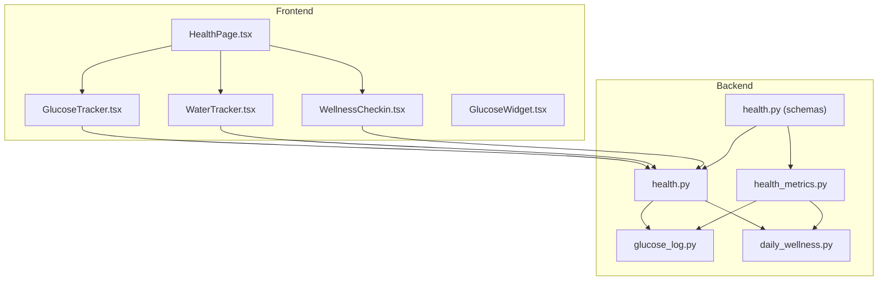
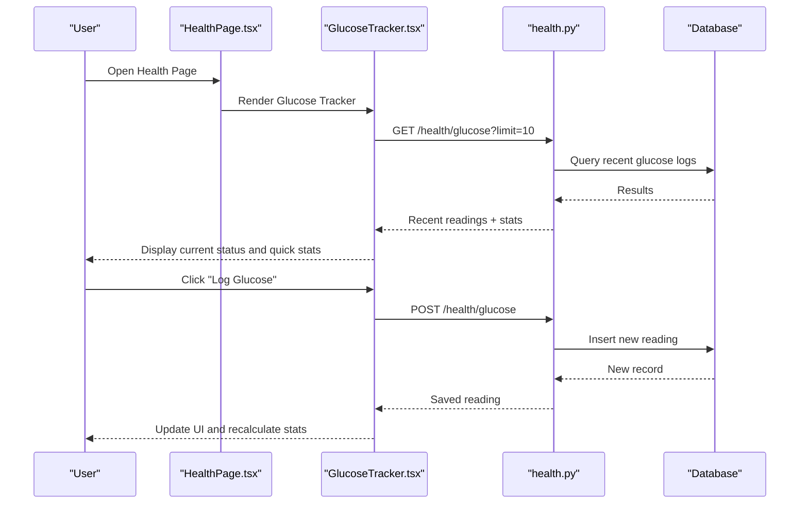
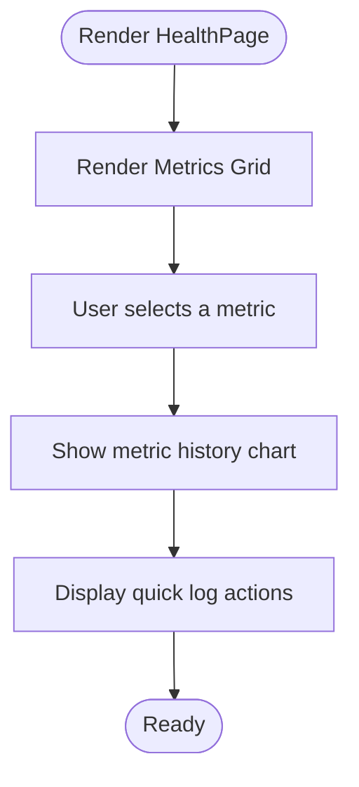
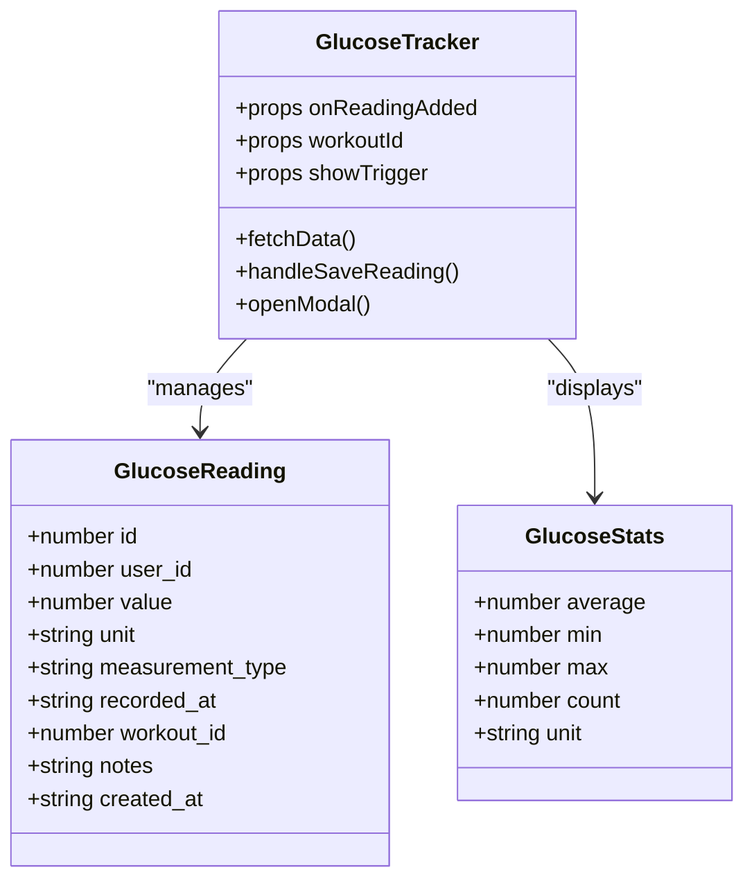
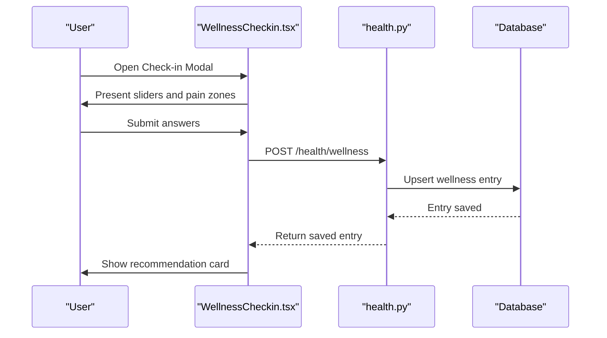
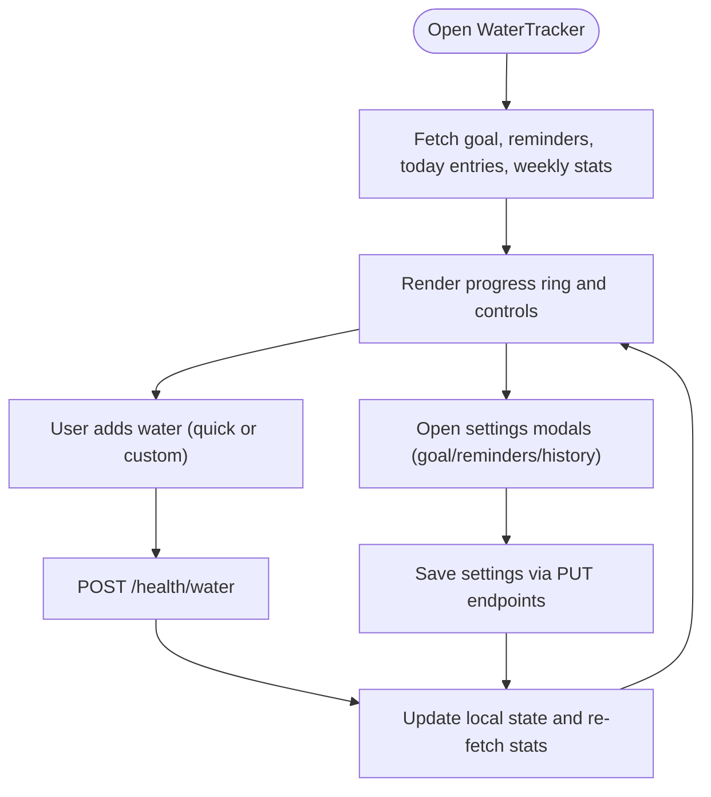
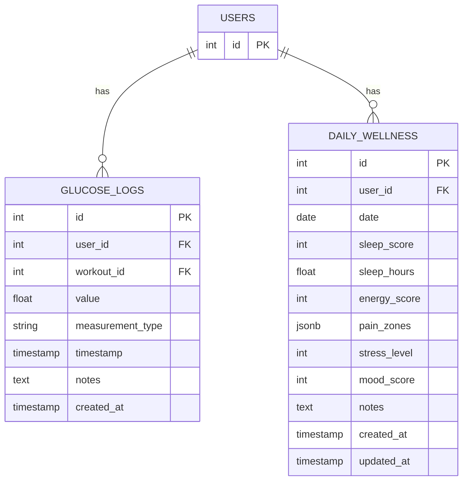
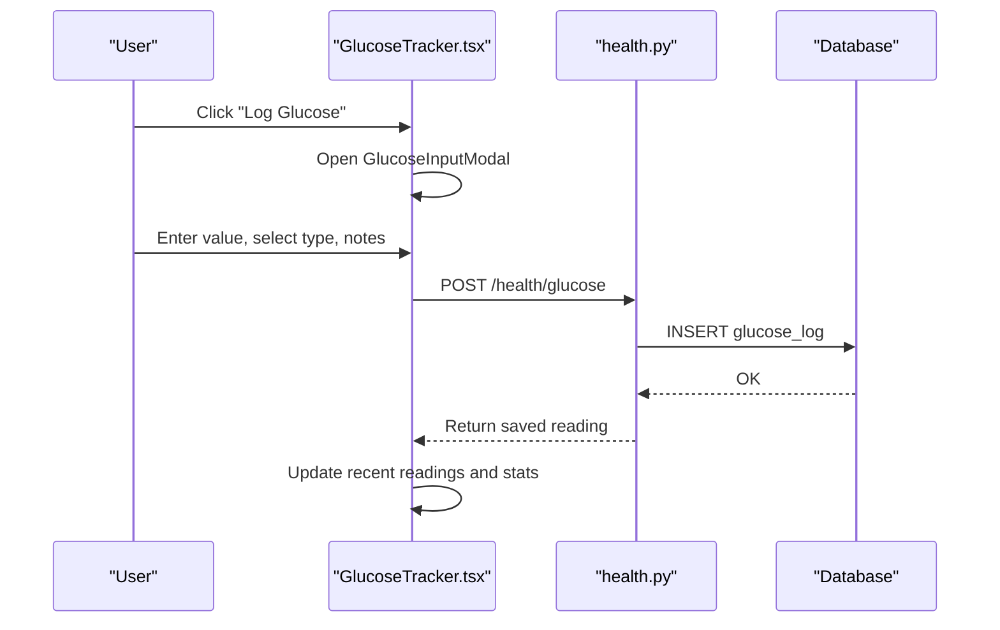
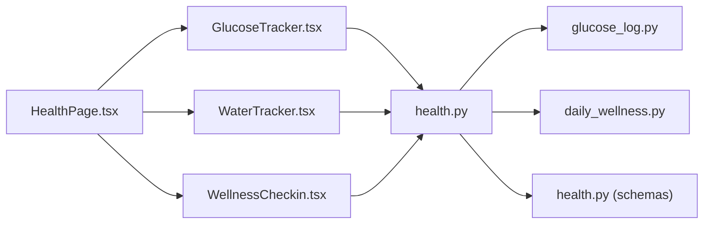

# Health Page

<cite>
**Referenced Files in This Document**
- [HealthPage.tsx](file://frontend/src/pages/HealthPage.tsx)
- [GlucoseTracker.tsx](file://frontend/src/components/health/GlucoseTracker.tsx)
- [WaterTracker.tsx](file://frontend/src/components/health/WaterTracker.tsx)
- [WellnessCheckin.tsx](file://frontend/src/components/health/WellnessCheckin.tsx)
- [GlucoseWidget.tsx](file://frontend/src/components/home/GlucoseWidget.tsx)
- [health.py](file://backend/app/api/health.py)
- [health_metrics.py](file://backend/app/api/health_metrics.py)
- [glucose_log.py](file://backend/app/models/glucose_log.py)
- [daily_wellness.py](file://backend/app/models/daily_wellness.py)
- [health.py (schemas)](file://backend/app/schemas/health.py)
- [README.md](file://README.md)
</cite>

## Table of Contents
1. [Introduction](#introduction)
2. [Project Structure](#project-structure)
3. [Core Components](#core-components)
4. [Architecture Overview](#architecture-overview)
5. [Detailed Component Analysis](#detailed-component-analysis)
6. [Dependency Analysis](#dependency-analysis)
7. [Performance Considerations](#performance-considerations)
8. [Troubleshooting Guide](#troubleshooting-guide)
9. [Conclusion](#conclusion)
10. [Appendices](#appendices)

## Introduction
This document provides comprehensive documentation for the Health Page and health tracking components. It covers the health dashboard layout, glucose tracking interface, wellness check-in system, and water intake monitoring. It explains health metric collection patterns, data visualization components, and trend analysis features. It also details the glucose logging workflow, wellness questionnaire implementation, and hydration tracking algorithms. Additionally, it outlines health data import/export capabilities, historical trend visualization, and health insights generation, while addressing privacy considerations for health data, data retention policies, and integration with external health devices.

## Project Structure
The health system spans both frontend and backend components:
- Frontend health components include the Health Page, Glucose Tracker, Water Tracker, and Wellness Check-in widgets/modals.
- Backend APIs expose endpoints for glucose logs, wellness entries, and health statistics.
- Data models define storage structures for glucose measurements and daily wellness entries.
- Schemas validate request/response payloads for health-related operations.

**Diagram sources**
- [HealthPage.tsx:1-124](file://frontend/src/pages/HealthPage.tsx#L1-L124)
- [GlucoseTracker.tsx:1-762](file://frontend/src/components/health/GlucoseTracker.tsx#L1-L762)
- [WaterTracker.tsx:1-1171](file://frontend/src/components/health/WaterTracker.tsx#L1-L1171)
- [WellnessCheckin.tsx:1-1207](file://frontend/src/components/health/WellnessCheckin.tsx#L1-L1207)
- [GlucoseWidget.tsx:1-85](file://frontend/src/components/home/GlucoseWidget.tsx#L1-L85)
- [health.py:1-615](file://backend/app/api/health.py#L1-L615)
- [health_metrics.py:1-98](file://backend/app/api/health_metrics.py#L1-L98)
- [glucose_log.py:1-80](file://backend/app/models/glucose_log.py#L1-L80)
- [daily_wellness.py:1-118](file://backend/app/models/daily_wellness.py#L1-L118)
- [health.py (schemas):1-134](file://backend/app/schemas/health.py#L1-L134)

**Section sources**
- [HealthPage.tsx:1-124](file://frontend/src/pages/HealthPage.tsx#L1-L124)
- [GlucoseTracker.tsx:1-762](file://frontend/src/components/health/GlucoseTracker.tsx#L1-L762)
- [WaterTracker.tsx:1-1171](file://frontend/src/components/health/WaterTracker.tsx#L1-L1171)
- [WellnessCheckin.tsx:1-1207](file://frontend/src/components/health/WellnessCheckin.tsx#L1-L1207)
- [GlucoseWidget.tsx:1-85](file://frontend/src/components/home/GlucoseWidget.tsx#L1-L85)
- [health.py:1-615](file://backend/app/api/health.py#L1-L615)
- [health_metrics.py:1-98](file://backend/app/api/health_metrics.py#L1-L98)
- [glucose_log.py:1-80](file://backend/app/models/glucose_log.py#L1-L80)
- [daily_wellness.py:1-118](file://backend/app/models/daily_wellness.py#L1-L118)
- [health.py (schemas):1-134](file://backend/app/schemas/health.py#L1-L134)

## Core Components
- Health Page: Displays a grid of health metrics (weight, steps, heart rate, sleep, water, calories) with quick selection and a history visualization area. Includes quick log actions for weight and water.
- Glucose Tracker: Manages glucose readings with unit conversion, status classification, visual scale, quick stats, and input modal. Integrates with workout context.
- Water Tracker: Manages daily water intake with progress ring visualization, goal settings, reminder configuration, and weekly history modal.
- Wellness Check-in: Provides a structured questionnaire for sleep, energy, and overall wellness, pain zone selection, automatic workout recommendations, and history view.
- Glucose Widget: Compact widget displaying current glucose status and value for quick access from the home screen.

**Section sources**
- [HealthPage.tsx:1-124](file://frontend/src/pages/HealthPage.tsx#L1-L124)
- [GlucoseTracker.tsx:1-762](file://frontend/src/components/health/GlucoseTracker.tsx#L1-L762)
- [WaterTracker.tsx:1-1171](file://frontend/src/components/health/WaterTracker.tsx#L1-L1171)
- [WellnessCheckin.tsx:1-1207](file://frontend/src/components/health/WellnessCheckin.tsx#L1-L1207)
- [GlucoseWidget.tsx:1-85](file://frontend/src/components/home/GlucoseWidget.tsx#L1-L85)

## Architecture Overview
The health system follows a client-server architecture:
- Frontend components communicate with backend APIs via HTTP requests.
- Backend exposes REST endpoints for glucose logs, wellness entries, and health statistics.
- Data models define database schema and relationships.
- Schemas validate incoming/outgoing data.

**Diagram sources**
- [HealthPage.tsx:1-124](file://frontend/src/pages/HealthPage.tsx#L1-L124)
- [GlucoseTracker.tsx:520-692](file://frontend/src/components/health/GlucoseTracker.tsx#L520-L692)
- [health.py:29-91](file://backend/app/api/health.py#L29-L91)
- [glucose_log.py:18-80](file://backend/app/models/glucose_log.py#L18-L80)

**Section sources**
- [GlucoseTracker.tsx:520-692](file://frontend/src/components/health/GlucoseTracker.tsx#L520-L692)
- [health.py:29-91](file://backend/app/api/health.py#L29-L91)
- [glucose_log.py:18-80](file://backend/app/models/glucose_log.py#L18-L80)

## Detailed Component Analysis

### Health Page Layout
The Health Page presents a responsive grid of health metrics with:
- Metric cards showing current value, unit, label, and trend direction.
- Interactive selection of a metric to view its history.
- Placeholder chart area for historical visualization.
- Quick log actions for immediate data entry.

**Diagram sources**
- [HealthPage.tsx:24-124](file://frontend/src/pages/HealthPage.tsx#L24-L124)

**Section sources**
- [HealthPage.tsx:1-124](file://frontend/src/pages/HealthPage.tsx#L1-L124)

### Glucose Tracking Interface
The Glucose Tracker provides:
- Current status card with unit conversion and status color coding.
- Visual scale for mmol/L values.
- Quick stats panel with average, min, max, and recent readings.
- Input modal with unit toggle, measurement type selection, value input, status recommendation, and notes.
- Integration with workout context via workoutId prop.

**Diagram sources**
- [GlucoseTracker.tsx:31-49](file://frontend/src/components/health/GlucoseTracker.tsx#L31-L49)
- [GlucoseTracker.tsx:520-692](file://frontend/src/components/health/GlucoseTracker.tsx#L520-L692)

**Section sources**
- [GlucoseTracker.tsx:1-762](file://frontend/src/components/health/GlucoseTracker.tsx#L1-L762)
- [glucose_log.py:18-80](file://backend/app/models/glucose_log.py#L18-L80)
- [health.py (schemas):10-50](file://backend/app/schemas/health.py#L10-L50)

### Wellness Check-in System
The Wellness Check-in includes:
- Morning check-in modal with three sliders for sleep, energy, and overall wellness.
- Pain zone selector for identifying discomfort areas.
- Automatic workout recommendation engine based on inputs.
- History view with weekly/monthly toggles and average ratings.
- Integration hook for workout filtering based on current wellness status.

**Diagram sources**
- [WellnessCheckin.tsx:424-628](file://frontend/src/components/health/WellnessCheckin.tsx#L424-L628)
- [health.py:259-337](file://backend/app/api/health.py#L259-L337)
- [daily_wellness.py:17-118](file://backend/app/models/daily_wellness.py#L17-L118)

**Section sources**
- [WellnessCheckin.tsx:1-1207](file://frontend/src/components/health/WellnessCheckin.tsx#L1-L1207)
- [daily_wellness.py:17-118](file://backend/app/models/daily_wellness.py#L17-L118)
- [health.py (schemas):66-96](file://backend/app/schemas/health.py#L66-L96)

### Water Intake Monitoring
The Water Tracker offers:
- Progress ring visualization with current amount vs. goal.
- Quick-add buttons and custom amount input.
- Goal settings modal with daily goal and workout increase.
- Reminder settings modal with enable/disable, interval, active hours, quiet hours, and Telegram notifications.
- Weekly history modal with average, best day, and daily completion.

**Diagram sources**
- [WaterTracker.tsx:746-1082](file://frontend/src/components/health/WaterTracker.tsx#L746-L1082)
- [health.py:1-615](file://backend/app/api/health.py#L1-L615)

**Section sources**
- [WaterTracker.tsx:1-1171](file://frontend/src/components/health/WaterTracker.tsx#L1-L1171)
- [health.py:1-615](file://backend/app/api/health.py#L1-L615)

### Health Metric Collection Patterns
- Data is collected through dedicated trackers and check-in forms.
- Backend validates inputs using Pydantic schemas and persists to PostgreSQL models.
- Historical data retrieval supports pagination, filtering, and statistical summaries.
- Trend analysis is supported via separate endpoints for metrics and wellness.

**Diagram sources**
- [glucose_log.py:18-80](file://backend/app/models/glucose_log.py#L18-L80)
- [daily_wellness.py:17-118](file://backend/app/models/daily_wellness.py#L17-L118)

**Section sources**
- [glucose_log.py:18-80](file://backend/app/models/glucose_log.py#L18-L80)
- [daily_wellness.py:17-118](file://backend/app/models/daily_wellness.py#L17-L118)
- [health_metrics.py:1-98](file://backend/app/api/health_metrics.py#L1-L98)

### Data Visualization Components
- Glucose Tracker: Visual scale for mmol/L values and status color coding.
- Water Tracker: SVG progress ring with animated transitions and goal badges.
- Health Page: Placeholder chart area for historical metric trends.
- Wellness: Average ratings display and history list with toggle between week/month.

**Section sources**
- [GlucoseTracker.tsx:175-222](file://frontend/src/components/health/GlucoseTracker.tsx#L175-L222)
- [WaterTracker.tsx:109-189](file://frontend/src/components/health/WaterTracker.tsx#L109-L189)
- [HealthPage.tsx:73-105](file://frontend/src/pages/HealthPage.tsx#L73-L105)
- [WellnessCheckin.tsx:639-785](file://frontend/src/components/health/WellnessCheckin.tsx#L639-L785)

### Trend Analysis Features
- Backend provides aggregated statistics for glucose and wellness over configurable periods.
- Metrics trends endpoint is defined for retrieving time-series data for specific metrics.
- Historical views in wellness and water components support time-windowed analysis.

**Section sources**
- [health.py:409-615](file://backend/app/api/health.py#L409-L615)
- [health_metrics.py:86-97](file://backend/app/api/health_metrics.py#L86-L97)
- [WellnessCheckin.tsx:639-785](file://frontend/src/components/health/WellnessCheckin.tsx#L639-L785)

### Glucose Logging Workflow
- User opens input modal from Glucose Tracker.
- Modal allows unit toggle, measurement type selection, value input, and notes.
- On submit, frontend posts to backend with workout association if applicable.
- Backend validates and persists the reading, then recalculates stats and updates UI.

**Diagram sources**
- [GlucoseTracker.tsx:320-514](file://frontend/src/components/health/GlucoseTracker.tsx#L320-L514)
- [health.py:29-91](file://backend/app/api/health.py#L29-L91)
- [glucose_log.py:18-80](file://backend/app/models/glucose_log.py#L18-L80)

**Section sources**
- [GlucoseTracker.tsx:320-514](file://frontend/src/components/health/GlucoseTracker.tsx#L320-L514)
- [health.py:29-91](file://backend/app/api/health.py#L29-L91)

### Wellness Questionnaire Implementation
- Three-slider interface for sleep, energy, and overall wellness.
- Pain zone selection with multi-select capability.
- Automatic recommendation engine with levels: full, reduced, rest, pain-specific.
- History view with weekly/monthly toggles and average calculations.

**Section sources**
- [WellnessCheckin.tsx:229-418](file://frontend/src/components/health/WellnessCheckin.tsx#L229-L418)
- [WellnessCheckin.tsx:424-628](file://frontend/src/components/health/WellnessCheckin.tsx#L424-L628)
- [WellnessCheckin.tsx:639-785](file://frontend/src/components/health/WellnessCheckin.tsx#L639-L785)

### Hydration Tracking Algorithms
- Effective goal calculation considers workout-day increases.
- Percentage-based progress visualization with threshold-based color changes.
- Achievement detection when goal is first reached in a day.
- Weekly statistics aggregation for best day and completion rates.

**Section sources**
- [WaterTracker.tsx:763-775](file://frontend/src/components/health/WaterTracker.tsx#L763-L775)
- [WaterTracker.tsx:109-189](file://frontend/src/components/health/WaterTracker.tsx#L109-L189)
- [WaterTracker.tsx:626-740](file://frontend/src/components/health/WaterTracker.tsx#L626-L740)

### Health Data Import/Export Capabilities
- Export endpoint is defined to request data exports with configurable formats and inclusion flags.
- Status polling endpoint is available to check export status.
- Note: Export implementation is marked as TODO in the analytics module.

**Section sources**
- [README.md:154-158](file://README.md#L154-L158)
- [analytics.py:310-384](file://backend/app/api/analytics.py#L310-L384)

### Historical Trend Visualization
- Wellness history supports weekly/monthly views with average ratings.
- Water tracker displays weekly completion and best day.
- Health metrics trends endpoint is defined for generic metric trend retrieval.

**Section sources**
- [WellnessCheckin.tsx:639-785](file://frontend/src/components/health/WellnessCheckin.tsx#L639-L785)
- [WaterTracker.tsx:626-740](file://frontend/src/components/health/WaterTracker.tsx#L626-L740)
- [health_metrics.py:86-97](file://backend/app/api/health_metrics.py#L86-L97)

### Health Insights Generation
- Glucose statistics include averages and in-range percentages.
- Wellness statistics include average sleep and energy scores over 7/30 days.
- Workout statistics include counts, durations, and favorite workout types.

**Section sources**
- [health.py:409-615](file://backend/app/api/health.py#L409-L615)
- [health.py (schemas):98-134](file://backend/app/schemas/health.py#L98-L134)

## Dependency Analysis
The frontend components depend on shared UI primitives and the API service. Backend APIs depend on SQLAlchemy models and schemas. There are no circular dependencies within the health domain.

**Diagram sources**
- [GlucoseTracker.tsx:1-762](file://frontend/src/components/health/GlucoseTracker.tsx#L1-L762)
- [WaterTracker.tsx:1-1171](file://frontend/src/components/health/WaterTracker.tsx#L1-L1171)
- [WellnessCheckin.tsx:1-1207](file://frontend/src/components/health/WellnessCheckin.tsx#L1-L1207)
- [HealthPage.tsx:1-124](file://frontend/src/pages/HealthPage.tsx#L1-L124)
- [health.py:1-615](file://backend/app/api/health.py#L1-L615)
- [glucose_log.py:1-80](file://backend/app/models/glucose_log.py#L1-L80)
- [daily_wellness.py:1-118](file://backend/app/models/daily_wellness.py#L1-L118)
- [health.py (schemas):1-134](file://backend/app/schemas/health.py#L1-L134)

**Section sources**
- [GlucoseTracker.tsx:1-762](file://frontend/src/components/health/GlucoseTracker.tsx#L1-L762)
- [WaterTracker.tsx:1-1171](file://frontend/src/components/health/WaterTracker.tsx#L1-L1171)
- [WellnessCheckin.tsx:1-1207](file://frontend/src/components/health/WellnessCheckin.tsx#L1-L1207)
- [HealthPage.tsx:1-124](file://frontend/src/pages/HealthPage.tsx#L1-L124)
- [health.py:1-615](file://backend/app/api/health.py#L1-L615)

## Performance Considerations
- Pagination and limits are enforced on health history endpoints to prevent large payloads.
- Indexes are defined on frequently queried columns (user_id, timestamp, measurement_type) to optimize queries.
- Client-side memoization is used for derived values (e.g., effective goal, percentage) to reduce recomputation.
- Asynchronous fetching prevents UI blocking during data loading.

[No sources needed since this section provides general guidance]

## Troubleshooting Guide
Common issues and resolutions:
- Glucose logging fails: Verify unit conversion and value range constraints; check workout association permissions.
- Wellness entry not found: Ensure correct date format and user ownership checks.
- Water goal not updating: Confirm PUT request payload matches WaterGoal schema.
- Export not available: Check export status endpoint and expiration policy.

**Section sources**
- [health.py:29-91](file://backend/app/api/health.py#L29-L91)
- [health.py:259-337](file://backend/app/api/health.py#L259-L337)
- [health.py:381-407](file://backend/app/api/health.py#L381-L407)
- [WaterTracker.tsx:844-866](file://frontend/src/components/health/WaterTracker.tsx#L844-L866)
- [analytics.py:368-384](file://backend/app/api/analytics.py#L368-L384)

## Conclusion
The Health Page and health tracking components provide a comprehensive foundation for managing glucose, hydration, and wellness metrics. The frontend offers intuitive interfaces with real-time feedback, while the backend ensures robust data validation, persistence, and statistical reporting. Future enhancements should focus on implementing missing endpoints for general health metrics, completing the export pipeline, and integrating with external health devices.

[No sources needed since this section summarizes without analyzing specific files]

## Appendices

### Privacy Considerations for Health Data
- Health data is user-specific and requires authentication.
- Data is stored in PostgreSQL with appropriate indexing and access controls.
- Consider implementing data minimization, encryption at rest, and secure deletion policies.

[No sources needed since this section provides general guidance]

### Data Retention Policies
- Define retention periods for glucose logs, wellness entries, and metrics.
- Implement automated cleanup jobs to remove outdated data beyond retention limits.

[No sources needed since this section provides general guidance]

### Integration with External Health Devices
- Expose endpoints for importing data from external devices (e.g., continuous glucose monitors, fitness trackers).
- Validate device-specific formats and map to internal schemas.
- Implement webhook or batch import mechanisms for recurring sync.

[No sources needed since this section provides general guidance]