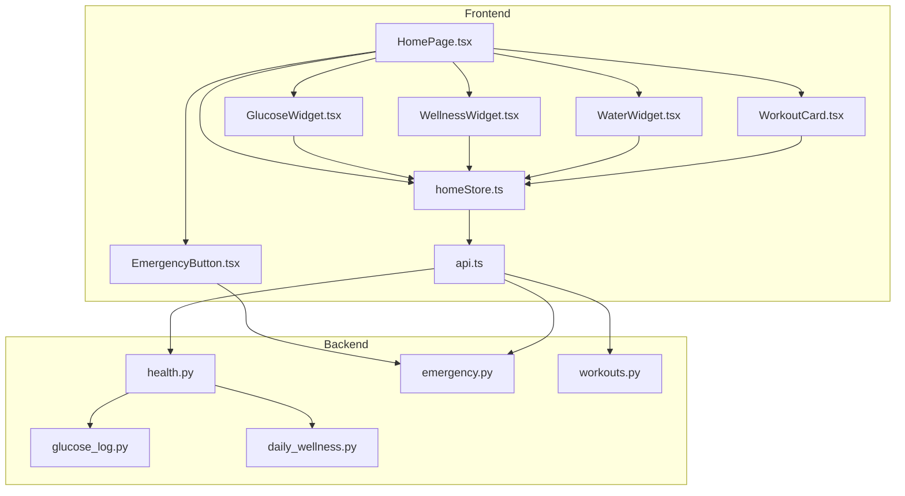
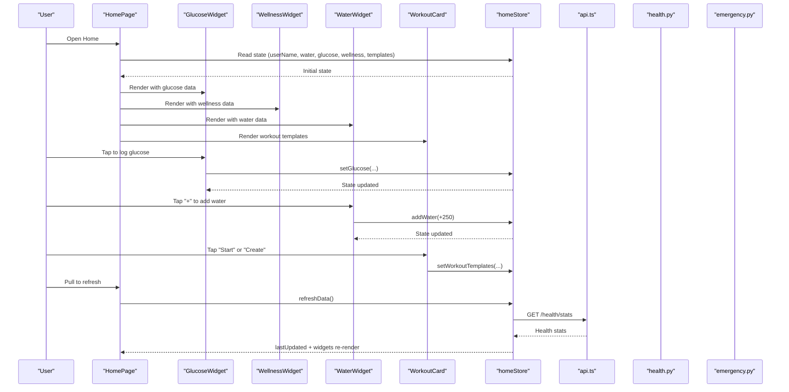
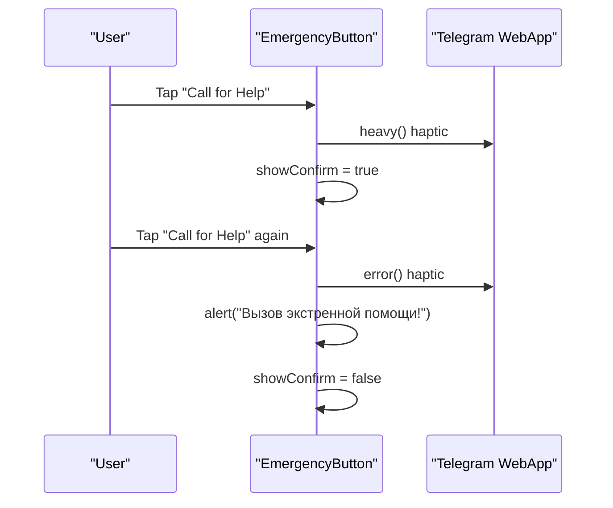
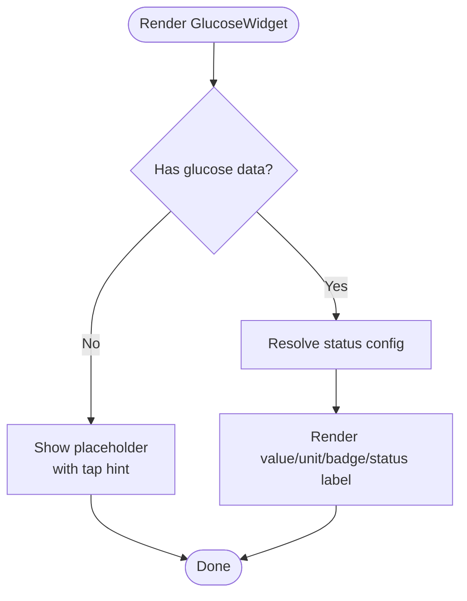
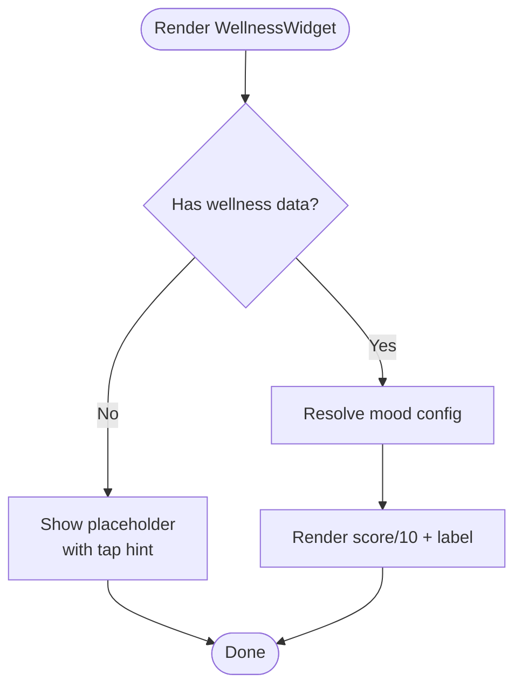
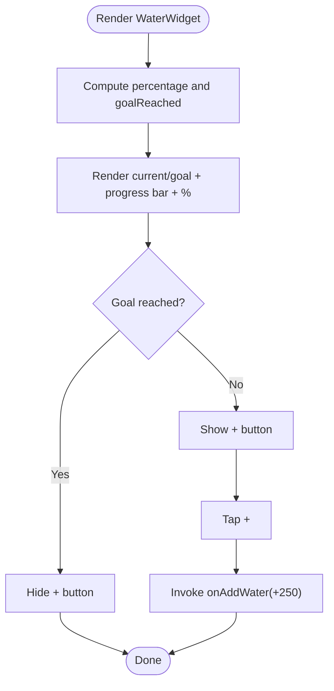
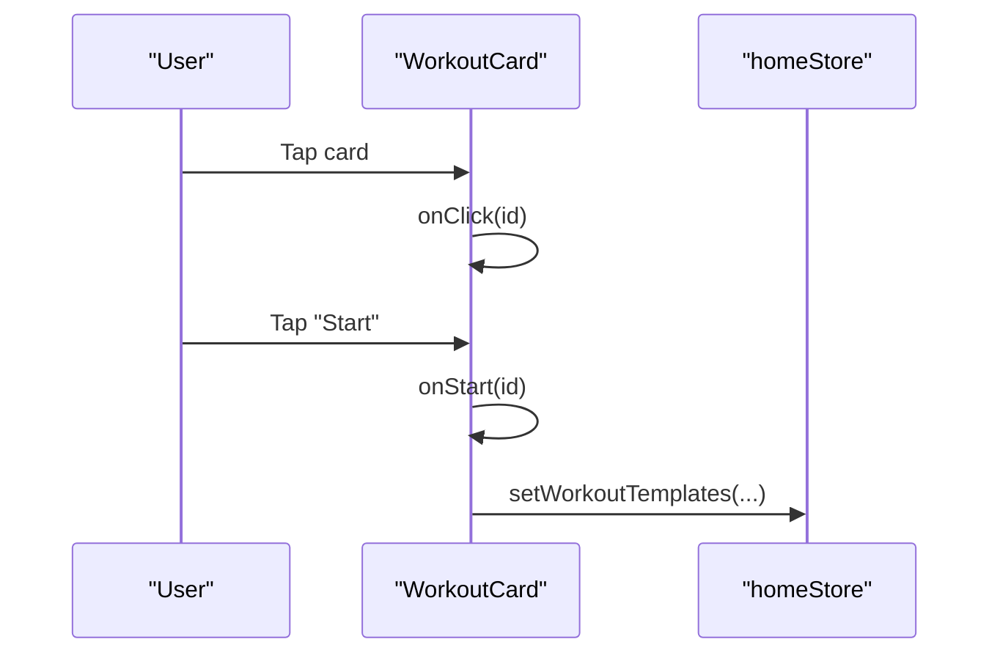
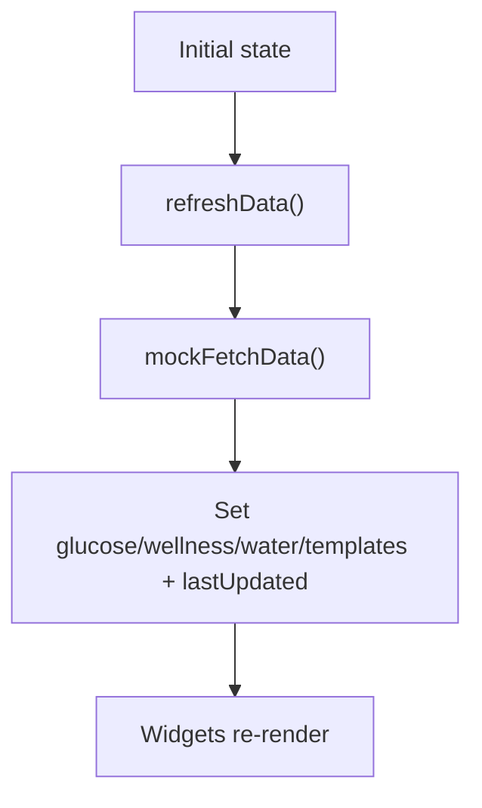
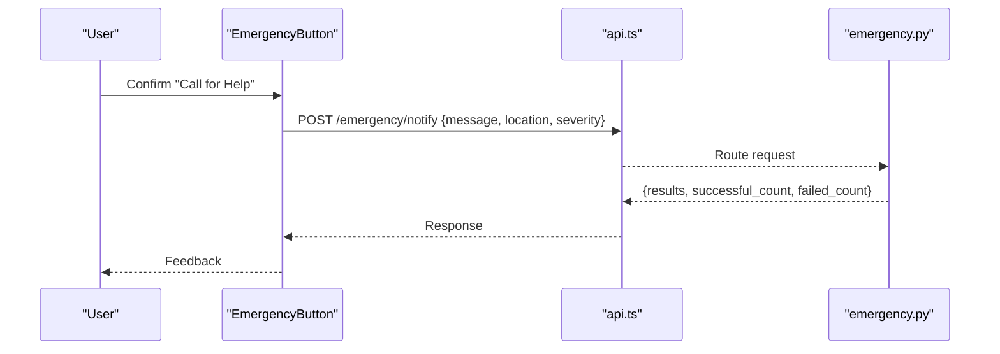
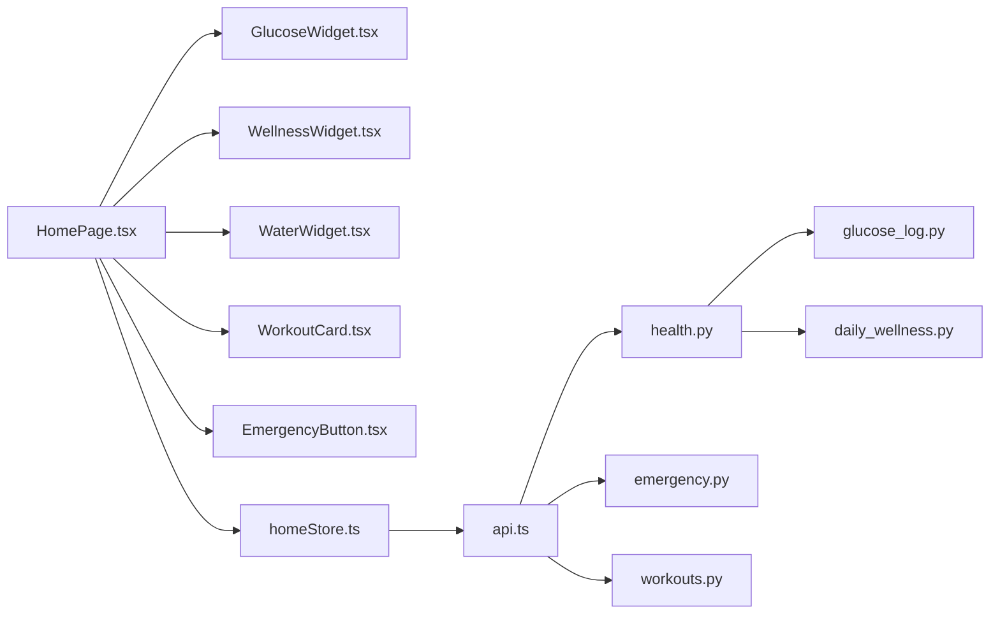

# Home Page

<cite>
**Referenced Files in This Document**
- [HomePage.tsx](file://frontend/src/pages/HomePage.tsx)
- [EmergencyButton.tsx](file://frontend/src/components/home/EmergencyButton.tsx)
- [GlucoseWidget.tsx](file://frontend/src/components/home/GlucoseWidget.tsx)
- [WellnessWidget.tsx](file://frontend/src/components/home/WellnessWidget.tsx)
- [WaterWidget.tsx](file://frontend/src/components/home/WaterWidget.tsx)
- [WorkoutCard.tsx](file://frontend/src/components/home/WorkoutCard.tsx)
- [homeStore.ts](file://frontend/src/stores/homeStore.ts)
- [api.ts](file://frontend/src/services/api.ts)
- [health.py](file://backend/app/api/health.py)
- [emergency.py](file://backend/app/api/emergency.py)
- [workouts.py](file://backend/app/api/workouts.py)
- [glucose_log.py](file://backend/app/models/glucose_log.py)
- [daily_wellness.py](file://backend/app/models/daily_wellness.py)
</cite>

## Table of Contents
1. [Introduction](#introduction)
2. [Project Structure](#project-structure)
3. [Core Components](#core-components)
4. [Architecture Overview](#architecture-overview)
5. [Detailed Component Analysis](#detailed-component-analysis)
6. [Dependency Analysis](#dependency-analysis)
7. [Performance Considerations](#performance-considerations)
8. [Troubleshooting Guide](#troubleshooting-guide)
9. [Conclusion](#conclusion)

## Introduction
This document describes the Home Page and its dashboard widgets for Fit Tracker Pro. It covers the main landing page layout, emergency button functionality, health widgets (glucose tracker, water intake, wellness check-in), and workout cards. It explains widget composition patterns, data fetching and state synchronization, real-time update strategies, and user interaction flows. It also documents emergency mode activation, health metric visualization, workout recommendation patterns, and responsive/mobile-first design with accessibility considerations.

## Project Structure
The Home Page integrates React components with a centralized Zustand store and a shared API service. Backend endpoints support health metrics, emergency notifications, and workout templates/history.

**Diagram sources**
- [HomePage.tsx:16-86](file://frontend/src/pages/HomePage.tsx#L16-L86)
- [EmergencyButton.tsx:10-108](file://frontend/src/components/home/EmergencyButton.tsx#L10-L108)
- [GlucoseWidget.tsx:41-84](file://frontend/src/components/home/GlucoseWidget.tsx#L41-L84)
- [WellnessWidget.tsx:43-82](file://frontend/src/components/home/WellnessWidget.tsx#L43-L82)
- [WaterWidget.tsx:11-71](file://frontend/src/components/home/WaterWidget.tsx#L11-L71)
- [WorkoutCard.tsx:27-99](file://frontend/src/components/home/WorkoutCard.tsx#L27-L99)
- [homeStore.ts:147-205](file://frontend/src/stores/homeStore.ts#L147-L205)
- [api.ts:6-68](file://frontend/src/services/api.ts#L6-L68)
- [health.py:26-614](file://backend/app/api/health.py#L26-L614)
- [emergency.py:24-542](file://backend/app/api/emergency.py#L24-L542)
- [workouts.py:26-521](file://backend/app/api/workouts.py#L26-L521)
- [glucose_log.py:18-79](file://backend/app/models/glucose_log.py#L18-L79)
- [daily_wellness.py:17-117](file://backend/app/models/daily_wellness.py#L17-L117)

**Section sources**
- [HomePage.tsx:16-86](file://frontend/src/pages/HomePage.tsx#L16-L86)
- [homeStore.ts:147-205](file://frontend/src/stores/homeStore.ts#L147-L205)
- [api.ts:6-68](file://frontend/src/services/api.ts#L6-L68)

## Core Components
- HomePage: Renders header, stats grid, recent workouts, quick actions, and emergency button.
- Widgets: GlucoseWidget, WellnessWidget, WaterWidget encapsulate health metrics presentation and interactions.
- WorkoutCard: Presents workout templates with type, gradient color, and start/custom actions.
- EmergencyButton: Sticky floating button with confirmation modal for emergency activation.
- Store: homeStore manages user, health metrics, water, templates, loading, and refresh logic.
- API Service: api.ts centralizes HTTP requests with interceptors and environment-based base URL.

Key responsibilities:
- Widget composition: Each widget receives typed props and renders status-specific visuals.
- State synchronization: Widgets read from and write to Zustand store; refresh triggers re-render.
- Interaction flows: Buttons trigger actions (add water, start workout, emergency confirm), updating state and UI.

**Section sources**
- [HomePage.tsx:16-86](file://frontend/src/pages/HomePage.tsx#L16-L86)
- [GlucoseWidget.tsx:41-84](file://frontend/src/components/home/GlucoseWidget.tsx#L41-L84)
- [WellnessWidget.tsx:43-82](file://frontend/src/components/home/WellnessWidget.tsx#L43-L82)
- [WaterWidget.tsx:11-71](file://frontend/src/components/home/WaterWidget.tsx#L11-L71)
- [WorkoutCard.tsx:27-99](file://frontend/src/components/home/WorkoutCard.tsx#L27-L99)
- [EmergencyButton.tsx:10-108](file://frontend/src/components/home/EmergencyButton.tsx#L10-L108)
- [homeStore.ts:34-64](file://frontend/src/stores/homeStore.ts#L34-L64)
- [api.ts:6-68](file://frontend/src/services/api.ts#L6-L68)

## Architecture Overview
The Home Page composes widgets around a shared store. Widgets render based on current state and invoke store actions. The store can call the API service to fetch or update data. Emergency interactions call backend emergency endpoints.

**Diagram sources**
- [HomePage.tsx:16-86](file://frontend/src/pages/HomePage.tsx#L16-L86)
- [GlucoseWidget.tsx:41-84](file://frontend/src/components/home/GlucoseWidget.tsx#L41-L84)
- [WellnessWidget.tsx:43-82](file://frontend/src/components/home/WellnessWidget.tsx#L43-L82)
- [WaterWidget.tsx:11-71](file://frontend/src/components/home/WaterWidget.tsx#L11-L71)
- [WorkoutCard.tsx:27-99](file://frontend/src/components/home/WorkoutCard.tsx#L27-L99)
- [homeStore.ts:180-193](file://frontend/src/stores/homeStore.ts#L180-L193)
- [api.ts:47-55](file://frontend/src/services/api.ts#L47-L55)
- [health.py:409-456](file://backend/app/api/health.py#L409-L456)

## Detailed Component Analysis

### HomePage
- Purpose: Top-level dashboard container.
- Structure:
  - Header with greeting and avatar placeholder.
  - Stats grid for quick metrics.
  - Recent workouts list.
  - Quick actions (log workout, log metric).
  - Emergency button overlay.
- Behavior: Renders child widgets and passes down data/state. Uses Tailwind classes for responsive layout.

**Section sources**
- [HomePage.tsx:16-86](file://frontend/src/pages/HomePage.tsx#L16-L86)

### EmergencyButton
- Purpose: Provides a prominent, sticky emergency activation with confirmation.
- Interaction flow:
  - Tap triggers haptic feedback and shows confirmation modal.
  - Confirm triggers haptic error feedback and executes emergency action (placeholder).
- Accessibility: Uses focusable buttons, clear icons, and backdrop click to dismiss.

**Diagram sources**
- [EmergencyButton.tsx:14-29](file://frontend/src/components/home/EmergencyButton.tsx#L14-L29)
- [EmergencyButton.tsx:56-104](file://frontend/src/components/home/EmergencyButton.tsx#L56-L104)

**Section sources**
- [EmergencyButton.tsx:10-108](file://frontend/src/components/home/EmergencyButton.tsx#L10-L108)
- [emergency.py:249-359](file://backend/app/api/emergency.py#L249-L359)

### GlucoseWidget
- Props: data (GlucoseData | null), onClick.
- Status mapping: normal/high/low/critical with color, icon, label.
- Empty state: renders placeholder with "Нет данных" and tap hint.
- Interaction: onClick callback invoked when tapped.

**Diagram sources**
- [GlucoseWidget.tsx:41-84](file://frontend/src/components/home/GlucoseWidget.tsx#L41-L84)

**Section sources**
- [GlucoseWidget.tsx:41-84](file://frontend/src/components/home/GlucoseWidget.tsx#L41-L84)
- [homeStore.ts:4-9](file://frontend/src/stores/homeStore.ts#L4-L9)
- [health.py:29-91](file://backend/app/api/health.py#L29-L91)

### WellnessWidget
- Props: data (WellnessData | null), onClick.
- Mood mapping: great/good/okay/bad/terrible with icon, color, label.
- Empty state: renders placeholder with "Нет данных" and tap hint.
- Interaction: onClick callback invoked when tapped.

**Diagram sources**
- [WellnessWidget.tsx:43-82](file://frontend/src/components/home/WellnessWidget.tsx#L43-L82)

**Section sources**
- [WellnessWidget.tsx:43-82](file://frontend/src/components/home/WellnessWidget.tsx#L43-L82)
- [homeStore.ts:11-16](file://frontend/src/stores/homeStore.ts#L11-L16)
- [health.py:259-337](file://backend/app/api/health.py#L259-L337)

### WaterWidget
- Props: data (WaterData), onAddWater, onClick.
- Visualization: current/goal with progress bar and percentage.
- Action: "+" button adds fixed amounts until goal reached.
- Interaction: onAddWater callback invoked; onClick navigates to water log.

**Diagram sources**
- [WaterWidget.tsx:11-71](file://frontend/src/components/home/WaterWidget.tsx#L11-L71)

**Section sources**
- [WaterWidget.tsx:11-71](file://frontend/src/components/home/WaterWidget.tsx#L11-L71)
- [homeStore.ts:18-22](file://frontend/src/stores/homeStore.ts#L18-L22)

### WorkoutCard
- Props: template (WorkoutTemplate), onStart, onClick.
- Rendering: gradient-colored icon, type badge, name, exercise count, last workout, and action button.
- Interactions:
  - Tap card invokes onClick with template id.
  - "Start" button invokes onStart with template id.
  - "Create" uses custom type to open builder.

**Diagram sources**
- [WorkoutCard.tsx:27-99](file://frontend/src/components/home/WorkoutCard.tsx#L27-L99)
- [homeStore.ts:44-45](file://frontend/src/stores/homeStore.ts#L44-L45)

**Section sources**
- [WorkoutCard.tsx:27-99](file://frontend/src/components/home/WorkoutCard.tsx#L27-L99)
- [homeStore.ts:24-32](file://frontend/src/stores/homeStore.ts#L24-L32)
- [workouts.py:29-105](file://backend/app/api/workouts.py#L29-L105)

### Store and Data Fetching
- State shape: user info, health metrics, water, templates, loading flags, lastUpdated.
- Actions:
  - Setters for user, glucose, wellness, water, templates.
  - addWater increases current up to goal.
  - refreshData simulates API call and updates lastUpdated.
- Persistence: Zustand persist middleware stores selected fields.

**Diagram sources**
- [homeStore.ts:147-205](file://frontend/src/stores/homeStore.ts#L147-L205)
- [homeStore.ts:122-145](file://frontend/src/stores/homeStore.ts#L122-L145)

**Section sources**
- [homeStore.ts:34-64](file://frontend/src/stores/homeStore.ts#L34-L64)
- [homeStore.ts:122-145](file://frontend/src/stores/homeStore.ts#L122-L145)
- [homeStore.ts:180-193](file://frontend/src/stores/homeStore.ts#L180-L193)

### Real-time Updates and Synchronization
- Current state: mock refresh updates lastUpdated; widgets re-render on state change.
- Backend alignment: health stats endpoint aggregates glucose/workouts/wellness for periods.
- Recommendations: periodic polling or WebSocket subscriptions can be integrated to keep data fresh.

**Section sources**
- [homeStore.ts:180-193](file://frontend/src/stores/homeStore.ts#L180-L193)
- [health.py:409-456](file://backend/app/api/health.py#L409-L456)

### Emergency Mode Activation
- Frontend: EmergencyButton shows confirmation modal; on confirm triggers haptic and alerts.
- Backend: emergency endpoints support retrieving contacts, sending notifications, logging events.
- Integration points: call emergency notify endpoint with message/location/severity.

**Diagram sources**
- [EmergencyButton.tsx:19-25](file://frontend/src/components/home/EmergencyButton.tsx#L19-L25)
- [api.ts:52-54](file://frontend/src/services/api.ts#L52-L54)
- [emergency.py:249-359](file://backend/app/api/emergency.py#L249-L359)

**Section sources**
- [EmergencyButton.tsx:10-108](file://frontend/src/components/home/EmergencyButton.tsx#L10-L108)
- [emergency.py:27-78](file://backend/app/api/emergency.py#L27-L78)
- [emergency.py:249-359](file://backend/app/api/emergency.py#L249-L359)

### Health Metric Visualization
- Glucose: numeric value with status badge and icon; supports association with workout.
- Wellness: score out of 10 with mood label and emoji-like icon.
- Water: current/goal with progress bar and percentage; dynamic "+" button.

**Section sources**
- [GlucoseWidget.tsx:41-84](file://frontend/src/components/home/GlucoseWidget.tsx#L41-L84)
- [WellnessWidget.tsx:43-82](file://frontend/src/components/home/WellnessWidget.tsx#L43-L82)
- [WaterWidget.tsx:11-71](file://frontend/src/components/home/WaterWidget.tsx#L11-L71)
- [glucose_log.py:18-79](file://backend/app/models/glucose_log.py#L18-L79)
- [daily_wellness.py:17-117](file://backend/app/models/daily_wellness.py#L17-L117)

### Workout Recommendation Patterns
- Templates: stored with type, exercise count, last workout, color, icon.
- Recommendation: display favorites and recent templates; custom type opens builder.
- Backend: templates retrieval and history endpoints support selection and filtering.

**Section sources**
- [homeStore.ts:24-32](file://frontend/src/stores/homeStore.ts#L24-L32)
- [WorkoutCard.tsx:27-99](file://frontend/src/components/home/WorkoutCard.tsx#L27-L99)
- [workouts.py:29-105](file://backend/app/api/workouts.py#L29-L105)

### Component Lifecycle Management
- Initialization: HomePage renders children; widgets mount with initial store state.
- Updates: Store actions update state; widgets re-render via React state subscription.
- Cleanup: No explicit cleanup required for these presentational widgets.

**Section sources**
- [HomePage.tsx:16-86](file://frontend/src/pages/HomePage.tsx#L16-L86)
- [GlucoseWidget.tsx:41-84](file://frontend/src/components/home/GlucoseWidget.tsx#L41-L84)
- [WellnessWidget.tsx:43-82](file://frontend/src/components/home/WellnessWidget.tsx#L43-L82)
- [WaterWidget.tsx:11-71](file://frontend/src/components/home/WaterWidget.tsx#L11-L71)
- [WorkoutCard.tsx:27-99](file://frontend/src/components/home/WorkoutCard.tsx#L27-L99)

### Data Fetching Strategies
- Current: mockFetchData simulates API; refreshData updates state.
- Recommended: Replace with real API calls to health stats and templates endpoints.
- Caching: Persist store to localStorage/sessionStorage to avoid reload flicker.

**Section sources**
- [homeStore.ts:122-145](file://frontend/src/stores/homeStore.ts#L122-L145)
- [homeStore.ts:180-193](file://frontend/src/stores/homeStore.ts#L180-L193)
- [health.py:409-456](file://backend/app/api/health.py#L409-L456)
- [workouts.py:29-105](file://backend/app/api/workouts.py#L29-L105)

### Responsive Design and Mobile-first Approach
- Layout: Tailwind grid and spacing for mobile-first responsiveness.
- Sticky emergency button: Fixed positioning with safe area padding.
- Touch-friendly targets: Large hit areas for buttons and cards.
- Typography: Emphasizes readability with bold headers and appropriate font sizes.

**Section sources**
- [HomePage.tsx:16-86](file://frontend/src/pages/HomePage.tsx#L16-L86)
- [EmergencyButton.tsx:34-54](file://frontend/src/components/home/EmergencyButton.tsx#L34-L54)
- [WaterWidget.tsx:11-71](file://frontend/src/components/home/WaterWidget.tsx#L11-L71)

### Accessibility Considerations
- Focus order: Buttons and cards are focusable; keyboard navigation supported.
- Visual contrast: Status colors and badges provide clear semantic meaning.
- Touch targets: Minimum recommended sizes for interactive elements.
- ARIA: No explicit ARIA attributes used; rely on semantic HTML and clear labels.

**Section sources**
- [EmergencyButton.tsx:39-53](file://frontend/src/components/home/EmergencyButton.tsx#L39-L53)
- [GlucoseWidget.tsx:61-82](file://frontend/src/components/home/GlucoseWidget.tsx#L61-L82)
- [WellnessWidget.tsx:63-81](file://frontend/src/components/home/WellnessWidget.tsx#L63-L81)
- [WaterWidget.tsx:16-70](file://frontend/src/components/home/WaterWidget.tsx#L16-L70)
- [WorkoutCard.tsx:32-98](file://frontend/src/components/home/WorkoutCard.tsx#L32-L98)

## Dependency Analysis
- Frontend dependencies:
  - HomePage depends on all widget components and the store.
  - Widgets depend on the store for data and actions.
  - EmergencyButton depends on Telegram WebApp for haptic feedback.
  - API service is injected into store actions for data fetching.
- Backend dependencies:
  - Health endpoints depend on glucose and wellness models.
  - Emergency endpoints depend on emergency contact model.
  - Workout endpoints depend on template and log models.

**Diagram sources**
- [HomePage.tsx:16-86](file://frontend/src/pages/HomePage.tsx#L16-L86)
- [homeStore.ts:147-205](file://frontend/src/stores/homeStore.ts#L147-L205)
- [api.ts:6-68](file://frontend/src/services/api.ts#L6-L68)
- [health.py:26-614](file://backend/app/api/health.py#L26-L614)
- [emergency.py:24-542](file://backend/app/api/emergency.py#L24-L542)
- [workouts.py:26-521](file://backend/app/api/workouts.py#L26-L521)
- [glucose_log.py:18-79](file://backend/app/models/glucose_log.py#L18-L79)
- [daily_wellness.py:17-117](file://backend/app/models/daily_wellness.py#L17-L117)

**Section sources**
- [homeStore.ts:147-205](file://frontend/src/stores/homeStore.ts#L147-L205)
- [api.ts:6-68](file://frontend/src/services/api.ts#L6-L68)
- [health.py:26-614](file://backend/app/api/health.py#L26-L614)
- [emergency.py:24-542](file://backend/app/api/emergency.py#L24-L542)
- [workouts.py:26-521](file://backend/app/api/workouts.py#L26-L521)

## Performance Considerations
- Prefer server-side aggregation for health stats to reduce client computation.
- Debounce or throttle refresh triggers to avoid excessive network calls.
- Lazy-load workout templates if lists grow large.
- Use virtualized lists for long histories if needed.

## Troubleshooting Guide
- Emergency button does nothing:
  - Verify Telegram WebApp availability and haptic permissions.
  - Check backend emergency notify endpoint readiness.
- Widgets show placeholder:
  - Ensure store hydration and initial data population.
  - Confirm refreshData resolves and sets lastUpdated.
- Water progress not updating:
  - Verify addWater action updates current and goal.
  - Ensure percentage calculation and progress bar width are recalculated.

**Section sources**
- [EmergencyButton.tsx:10-108](file://frontend/src/components/home/EmergencyButton.tsx#L10-L108)
- [homeStore.ts:169-174](file://frontend/src/stores/homeStore.ts#L169-L174)
- [homeStore.ts:180-193](file://frontend/src/stores/homeStore.ts#L180-L193)
- [WaterWidget.tsx:11-71](file://frontend/src/components/home/WaterWidget.tsx#L11-L71)

## Conclusion
The Home Page composes modular, state-driven widgets with a clear separation of concerns. The store centralizes state and refresh logic, while the API service abstracts backend communication. Emergency functionality is integrated with a confirmation flow and backend notification endpoints. The design follows mobile-first principles with accessible touch targets and semantic status indicators. Extending the system involves integrating real API endpoints, adding real-time updates, and enhancing workout recommendations based on historical data.