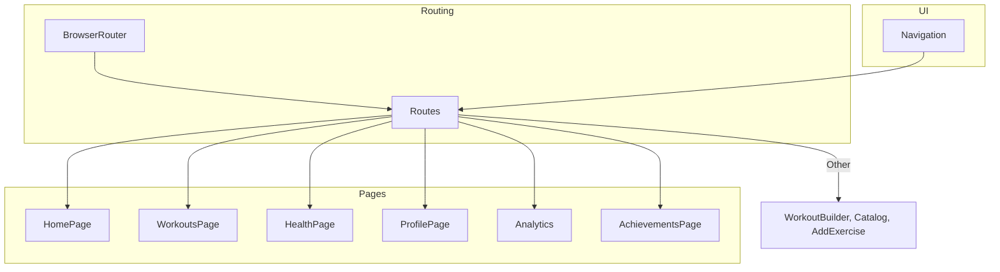
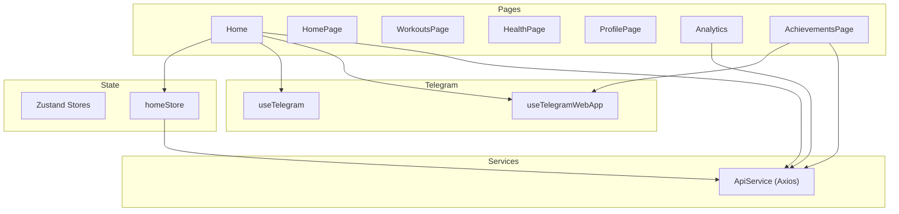
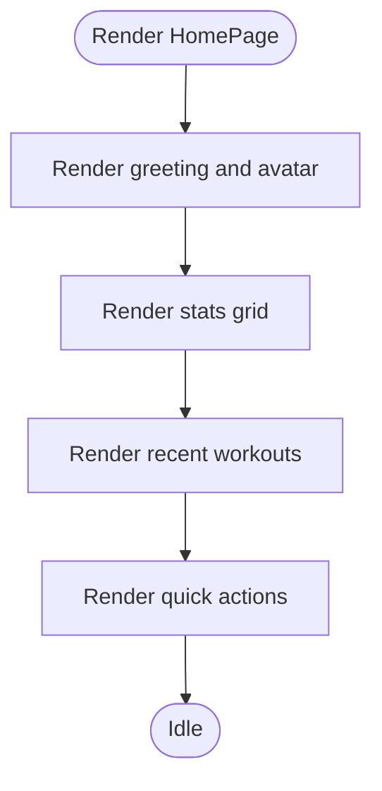
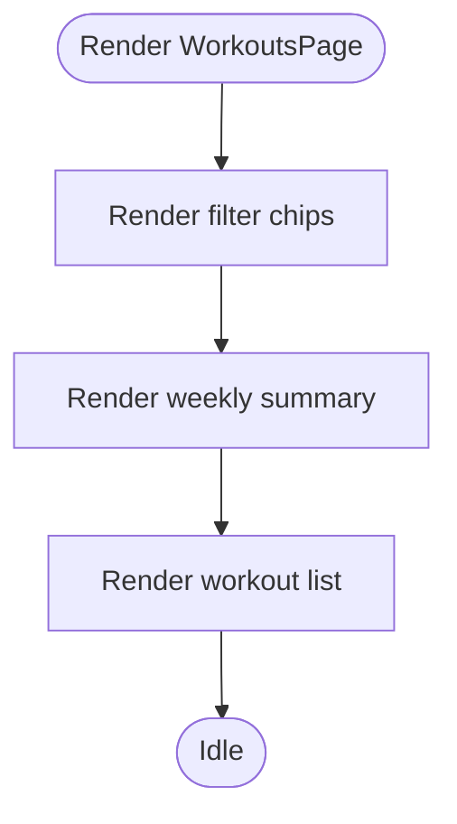
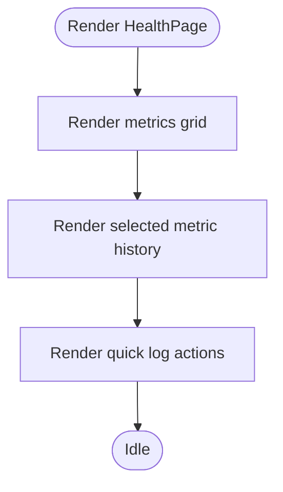
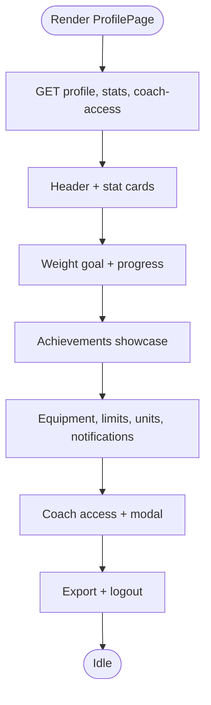
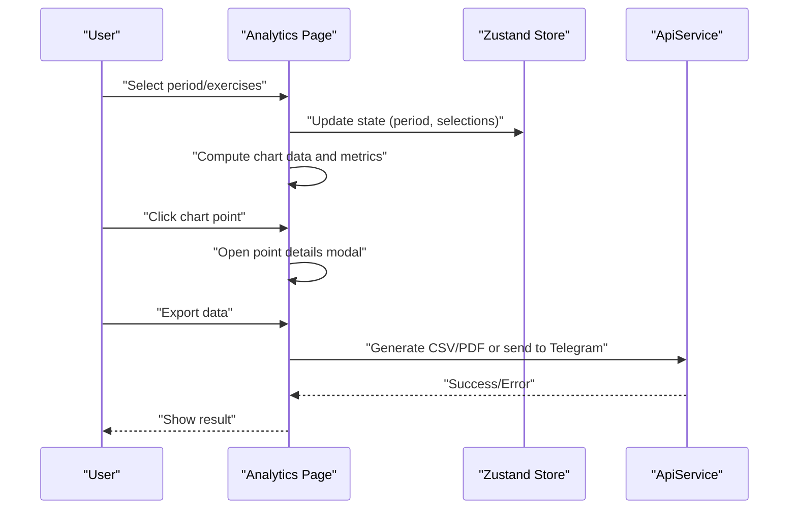
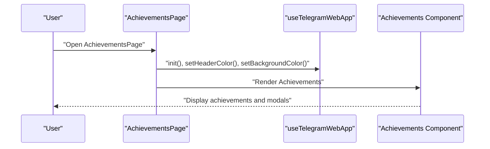
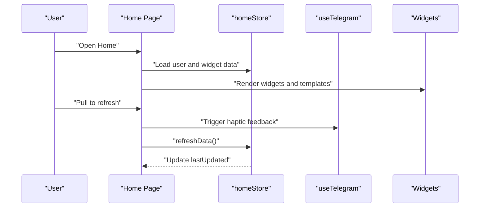
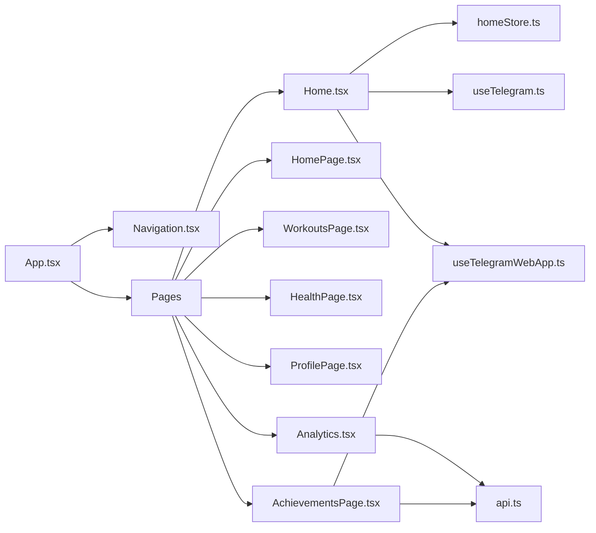

# Page Components

<cite>
**Referenced Files in This Document**
- [App.tsx](file://frontend/src/App.tsx)
- [router.tsx](file://frontend/src/app/router.tsx)
- [Navigation.tsx](file://frontend/src/components/common/Navigation.tsx)
- [Home.tsx](file://frontend/src/pages/Home.tsx)
- [HomePage.tsx](file://frontend/src/pages/HomePage.tsx)
- [WorkoutsPage.tsx](file://frontend/src/pages/WorkoutsPage.tsx)
- [HealthPage.tsx](file://frontend/src/pages/HealthPage.tsx)
- [ProfilePage.tsx](file://frontend/src/pages/ProfilePage.tsx)
- [Analytics.tsx](file://frontend/src/pages/Analytics.tsx)
- [AchievementsPage.tsx](file://frontend/src/pages/AchievementsPage.tsx)
- [homeStore.ts](file://frontend/src/stores/homeStore.ts)
- [api.ts](file://frontend/src/services/api.ts)
- [useTelegram.ts](file://frontend/src/hooks/useTelegram.ts)
- [useTelegramWebApp.ts](file://frontend/src/hooks/useTelegramWebApp.ts)
- [Achievements.tsx](file://frontend/src/components/gamification/Achievements.tsx)
</cite>

## Table of Contents
1. [Introduction](#introduction)
2. [Project Structure](#project-structure)
3. [Core Components](#core-components)
4. [Architecture Overview](#architecture-overview)
5. [Detailed Component Analysis](#detailed-component-analysis)
6. [Dependency Analysis](#dependency-analysis)
7. [Performance Considerations](#performance-considerations)
8. [Troubleshooting Guide](#troubleshooting-guide)
9. [Conclusion](#conclusion)

## Introduction
This document explains the page-level components and their implementation patterns across the FitTracker Pro application. It covers major pages including HomePage, WorkoutsPage, HealthPage, ProfilePage, Analytics, and AchievementsPage. For each page, we describe structure, composition, data fetching patterns, user interactions, state management, API integration, navigation flows, lifecycle, loading states, error handling, styling, responsiveness, and mobile optimization. We also highlight integration with global state management and Telegram WebApp APIs.

## Project Structure
The frontend uses React with TypeScript, React Router for navigation, Tailwind CSS for styling, and Zustand for global state. Pages are organized under a dedicated pages directory, while shared components and hooks live under components and hooks respectively. The App component defines routes and mounts a persistent bottom navigation bar.

**Diagram sources**
- [App.tsx:12-32](file://frontend/src/App.tsx#L12-L32)
- [Navigation.tsx:13-37](file://frontend/src/components/common/Navigation.tsx#L13-L37)

**Section sources**
- [App.tsx:12-32](file://frontend/src/App.tsx#L12-L32)
- [Navigation.tsx:13-37](file://frontend/src/components/common/Navigation.tsx#L13-L37)

## Core Components
- Routing and Navigation: App configures routes and renders a bottom Navigation bar with five tabs.
- Page Components: Each page composes reusable UI components and local state to render content.
- Global State: Zustand stores manage page-specific state (e.g., homeStore).
- API Layer: A centralized ApiService wraps Axios for HTTP requests and interceptors.
- Telegram Integration: Hooks provide Telegram WebApp integration and fallbacks for standalone usage.

Key implementation patterns:
- Composition over inheritance: Pages compose smaller components and hooks.
- Local state with controlled components for UI interactions.
- Memoization and callbacks to optimize rendering in Analytics.
- Telegram-aware hooks for native-like UX.

**Section sources**
- [App.tsx:12-32](file://frontend/src/App.tsx#L12-L32)
- [Navigation.tsx:13-37](file://frontend/src/components/common/Navigation.tsx#L13-L37)
- [homeStore.ts:147-205](file://frontend/src/stores/homeStore.ts#L147-L205)
- [api.ts:6-68](file://frontend/src/services/api.ts#L6-L68)
- [useTelegram.ts:36-116](file://frontend/src/hooks/useTelegram.ts#L36-L116)
- [useTelegramWebApp.ts:119-505](file://frontend/src/hooks/useTelegramWebApp.ts#L119-L505)

## Architecture Overview
The pages integrate with global state and Telegram APIs, while Analytics leverages memoized computations and external charting libraries. AchievementsPage delegates most logic to the Achievements component, which handles API calls and UI.

**Diagram sources**
- [Home.tsx:22-37](file://frontend/src/pages/Home.tsx#L22-L37)
- [homeStore.ts:147-205](file://frontend/src/stores/homeStore.ts#L147-L205)
- [useTelegram.ts:36-116](file://frontend/src/hooks/useTelegram.ts#L36-L116)
- [useTelegramWebApp.ts:119-505](file://frontend/src/hooks/useTelegramWebApp.ts#L119-L505)
- [Analytics.tsx:641-730](file://frontend/src/pages/Analytics.tsx#L641-L730)
- [AchievementsPage.tsx:11-28](file://frontend/src/pages/AchievementsPage.tsx#L11-L28)
- [api.ts:6-68](file://frontend/src/services/api.ts#L6-L68)

## Detailed Component Analysis

### HomePage
- Purpose: Entry dashboard for logged-in users with greeting, quick actions, and recent activity.
- Structure:
  - Header with user greeting and avatar placeholder.
  - Stats grid with icons and labels.
  - Recent workouts list.
  - Quick actions (Log Workout, Log Metric).
- State Management: Uses local state for stats and recent workouts; no global store.
- Interactions: Buttons trigger navigation placeholders; icons indicate actions.
- Styling: Tailwind utility classes; responsive grid layout.
- Mobile: Touch-friendly buttons; single-column layout optimized for phones.

**Diagram sources**
- [HomePage.tsx:16-86](file://frontend/src/pages/HomePage.tsx#L16-L86)

**Section sources**
- [HomePage.tsx:16-86](file://frontend/src/pages/HomePage.tsx#L16-L86)

### WorkoutsPage
- Purpose: Browse and filter workout sessions; view weekly summary and recent activities.
- Structure:
  - Header with title and add button.
  - Horizontal filter chips for workout types.
  - Weekly summary cards.
  - List of recent workouts with icons and metadata.
- State Management: Local state for selected filter; computed filtered list.
- Interactions: Tap filters to switch type; tap workout rows navigates to details.
- Styling: Grid and flex layouts; color-coded type badges.
- Mobile: Horizontal scrolling filters; card-based list for touch.

**Diagram sources**
- [WorkoutsPage.tsx:21-112](file://frontend/src/pages/WorkoutsPage.tsx#L21-L112)

**Section sources**
- [WorkoutsPage.tsx:21-112](file://frontend/src/pages/WorkoutsPage.tsx#L21-L112)

### HealthPage
- Purpose: Track health metrics with trend indicators and quick logging actions.
- Structure:
  - Header with subtitle.
  - Grid of metric cards with current value, unit, and trend.
  - Selected metric history chart placeholder.
  - Quick log buttons for common metrics.
- State Management: Local state for selected metric; computed trend direction and percentage.
- Interactions: Tap metric cards to switch focus; buttons trigger logging actions.
- Styling: Card-based design with trend indicators; subtle animations.
- Mobile: Responsive grid; compact chart placeholder.

**Diagram sources**
- [HealthPage.tsx:24-123](file://frontend/src/pages/HealthPage.tsx#L24-L123)

**Section sources**
- [HealthPage.tsx:24-123](file://frontend/src/pages/HealthPage.tsx#L24-L123)

### ProfilePage
- Purpose: Canonical `/profile` screen — user profile, goals, achievements preview, settings, coach access, export, logout.
- Structure:
  - Telegram-aware header (avatar, name, badges) and activity stat cards.
  - Weight goal block with `EditableField`, `ProgressBar`, and derived progress.
  - `ProfileShowcase` when achievement stats are available.
  - Profile settings: equipment and limitation chips, units, notifications.
  - Coach access card + modal (generate code, list/revoke accesses).
  - Export and logout actions; app version footer.
- Routing: Declared in `router.tsx` as `<Route path="/profile" element={<ProfilePage />} />` inside `AppShell` (see `frontend/src/app/router.tsx`).
- State management: Local React state plus `useCallback` data loaders calling `api.ts` directly (does not import `useProfile`).
- Interactions: Inline edits, chip toggles, modals, haptic feedback via `useTelegramWebApp`.
- Styling: Telegram theme utility classes; card sections; bottom padding for nav.

**Diagram sources**
- [ProfilePage.tsx:274-780](file://frontend/src/pages/ProfilePage.tsx#L274-L780)
- [router.tsx:14-28](file://frontend/src/app/router.tsx#L14-L28)

**Section sources**
- [ProfilePage.tsx:274-780](file://frontend/src/pages/ProfilePage.tsx#L274-L780)

### Analytics
- Purpose: Visualize training progress, calculate metrics, and export data.
- Structure:
  - Period selector (7d/30d/90d/all/custom).
  - Exercise selector with search and multi-select.
  - Key metrics cards (workouts, average rest, strength growth, PRs).
  - Line chart with tooltips and click-to-detail.
  - Export menu (CSV, PDF, Telegram).
  - One Rep Max calculator tab.
- State Management: Zustand store for period, selected exercises, modal state, and active tab.
- Data Flow:
  - Generates mock workout data and computes chart data and metrics.
  - Handles chart clicks to open a detailed modal.
  - Exports data via CSV/PDF or Telegram WebApp.
- Interactions: Select period, choose exercises, switch tabs, click chart points, export data.
- Styling: Responsive container, sticky header, gradient accents.
- Performance: Extensive useMemo and useCallback to avoid re-renders; chart tooltips and modals lazy-render content.

**Diagram sources**
- [Analytics.tsx:641-730](file://frontend/src/pages/Analytics.tsx#L641-L730)
- [Analytics.tsx:732-767](file://frontend/src/pages/Analytics.tsx#L732-L767)
- [Analytics.tsx:527-611](file://frontend/src/pages/Analytics.tsx#L527-L611)
- [api.ts:6-68](file://frontend/src/services/api.ts#L6-L68)

**Section sources**
- [Analytics.tsx:641-730](file://frontend/src/pages/Analytics.tsx#L641-L730)
- [Analytics.tsx:732-767](file://frontend/src/pages/Analytics.tsx#L732-L767)
- [Analytics.tsx:527-611](file://frontend/src/pages/Analytics.tsx#L527-L611)

### AchievementsPage
- Purpose: Dedicated page for user achievements with Telegram WebApp integration.
- Structure:
  - Initializes Telegram WebApp and sets header/background colors.
  - Renders Achievements component for listing and filtering.
- State Management: Uses Telegram WebApp hooks for initialization and theming.
- Interactions: Opens achievement unlock modal, shares to Telegram, navigates to details.
- Styling: Animated transitions, gradient accents, and Telegram-native theming.
- Integration: Delegates API calls and UI to Achievements component.

**Diagram sources**
- [AchievementsPage.tsx:11-28](file://frontend/src/pages/AchievementsPage.tsx#L11-L28)
- [useTelegramWebApp.ts:165-174](file://frontend/src/hooks/useTelegramWebApp.ts#L165-L174)
- [Achievements.tsx:654-685](file://frontend/src/components/gamification/Achievements.tsx#L654-L685)

**Section sources**
- [AchievementsPage.tsx:11-28](file://frontend/src/pages/AchievementsPage.tsx#L11-L28)
- [useTelegramWebApp.ts:165-174](file://frontend/src/hooks/useTelegramWebApp.ts#L165-L174)
- [Achievements.tsx:654-685](file://frontend/src/components/gamification/Achievements.tsx#L654-L685)

### Home (Full-Featured Page)
- Purpose: Comprehensive home screen with widgets, workout templates, quick actions, and pull-to-refresh.
- Structure:
  - Telegram user greeting and avatar.
  - Status widgets (glucose, wellness, water).
  - Workout templates grid.
  - Quick action tiles.
  - Sticky emergency button.
- State Management:
  - Uses homeStore for user data, health widgets, water intake, templates, and refresh state.
  - Implements pull-to-refresh gesture with haptic feedback.
- Interactions: Start/workout clicks, add water, quick actions, notifications.
- Styling: Telegram-themed palette, gradients, and smooth animations.
- Mobile: Full-screen scrollable content, bottom-safe area, and sticky elements.

**Diagram sources**
- [Home.tsx:22-121](file://frontend/src/pages/Home.tsx#L22-L121)
- [homeStore.ts:180-193](file://frontend/src/stores/homeStore.ts#L180-L193)
- [useTelegram.ts:36-116](file://frontend/src/hooks/useTelegram.ts#L36-L116)

**Section sources**
- [Home.tsx:22-121](file://frontend/src/pages/Home.tsx#L22-L121)
- [homeStore.ts:180-193](file://frontend/src/stores/homeStore.ts#L180-L193)
- [useTelegram.ts:36-116](file://frontend/src/hooks/useTelegram.ts#L36-L116)

## Dependency Analysis
- Routing: App.tsx defines routes and mounts Navigation.
- State: homeStore encapsulates Home page state and data refresh logic.
- API: ApiService centralizes HTTP calls and auth headers.
- Telegram: useTelegram provides haptic feedback and fallbacks; useTelegramWebApp integrates WebApp features.
- Analytics: Depends on external charting libraries and memoized computations.
- Achievements: Integrates with Telegram sharing and API for user stats.

**Diagram sources**
- [App.tsx:12-32](file://frontend/src/App.tsx#L12-L32)
- [Navigation.tsx:13-37](file://frontend/src/components/common/Navigation.tsx#L13-L37)
- [Home.tsx:22-37](file://frontend/src/pages/Home.tsx#L22-L37)
- [homeStore.ts:147-205](file://frontend/src/stores/homeStore.ts#L147-L205)
- [useTelegram.ts:36-116](file://frontend/src/hooks/useTelegram.ts#L36-L116)
- [useTelegramWebApp.ts:119-505](file://frontend/src/hooks/useTelegramWebApp.ts#L119-L505)
- [Analytics.tsx:641-730](file://frontend/src/pages/Analytics.tsx#L641-L730)
- [AchievementsPage.tsx:11-28](file://frontend/src/pages/AchievementsPage.tsx#L11-L28)
- [api.ts:6-68](file://frontend/src/services/api.ts#L6-L68)

**Section sources**
- [App.tsx:12-32](file://frontend/src/App.tsx#L12-L32)
- [Navigation.tsx:13-37](file://frontend/src/components/common/Navigation.tsx#L13-L37)
- [Home.tsx:22-37](file://frontend/src/pages/Home.tsx#L22-L37)
- [homeStore.ts:147-205](file://frontend/src/stores/homeStore.ts#L147-L205)
- [useTelegram.ts:36-116](file://frontend/src/hooks/useTelegram.ts#L36-L116)
- [useTelegramWebApp.ts:119-505](file://frontend/src/hooks/useTelegramWebApp.ts#L119-L505)
- [Analytics.tsx:641-730](file://frontend/src/pages/Analytics.tsx#L641-L730)
- [AchievementsPage.tsx:11-28](file://frontend/src/pages/AchievementsPage.tsx#L11-L28)
- [api.ts:6-68](file://frontend/src/services/api.ts#L6-L68)

## Performance Considerations
- Memoization: Analytics extensively uses useMemo and useCallback to prevent unnecessary recalculations and re-renders.
- Lazy Rendering: Modals and dropdowns render only when needed.
- Minimal Re-renders: Local state updates in pages avoid prop drilling and reduce re-renders.
- Charting: Responsive containers and lightweight tooltip components improve UX on small screens.
- Storage Persistence: homeStore persists selected keys to minimize initial loads.

[No sources needed since this section provides general guidance]

## Troubleshooting Guide
- API Errors:
  - ApiService logs response data on errors and rejects promises for upstream handling.
  - Analytics and Achievements catch and display user-friendly messages.
- Telegram Integration:
  - useTelegram provides no-op haptic feedback outside Telegram; useTelegramWebApp safely checks availability before invoking methods.
- State Resets:
  - homeStore exposes refreshData and lastUpdated to reflect loading states; ensure UI reflects isRefreshing and lastUpdated.
- Navigation:
  - Ensure route paths match Navigation items to avoid broken links.

**Section sources**
- [api.ts:35-44](file://frontend/src/services/api.ts#L35-L44)
- [Analytics.tsx:654-685](file://frontend/src/pages/Analytics.tsx#L654-L685)
- [useTelegram.ts:36-116](file://frontend/src/hooks/useTelegram.ts#L36-L116)
- [useTelegramWebApp.ts:119-505](file://frontend/src/hooks/useTelegramWebApp.ts#L119-L505)
- [homeStore.ts:180-193](file://frontend/src/stores/homeStore.ts#L180-L193)

## Conclusion
The page components follow consistent patterns: composition of reusable UI, local and global state management, robust Telegram integration, and thoughtful performance optimizations. Analytics demonstrates advanced memoization and charting integration, while AchievementsPage showcases Telegram-native theming and sharing. Together, these patterns deliver a cohesive, responsive, and scalable frontend architecture.