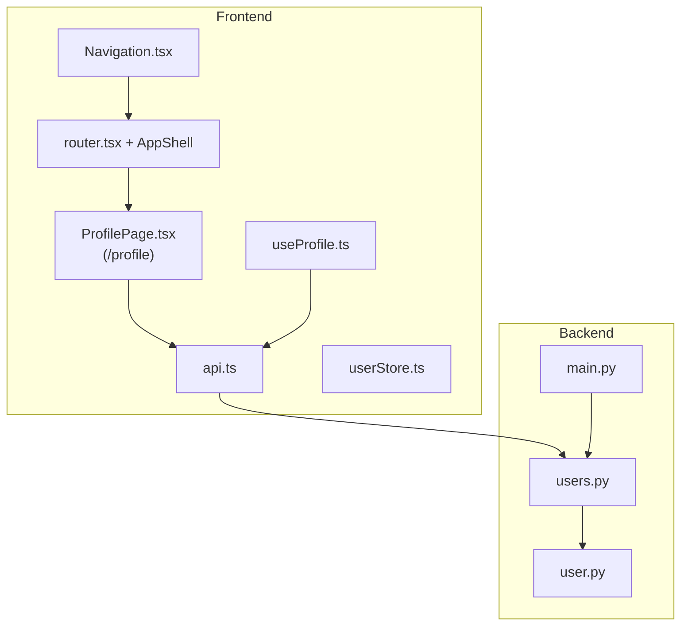
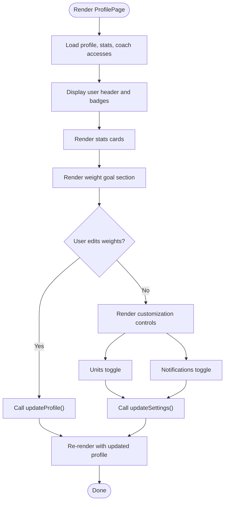
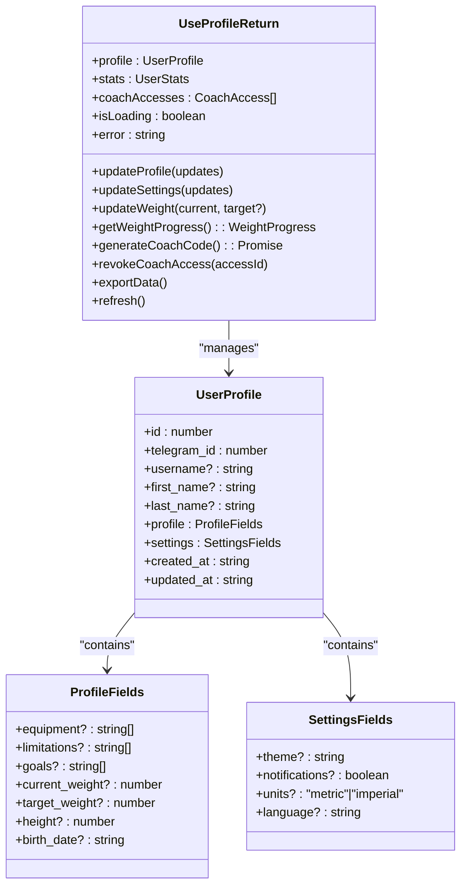
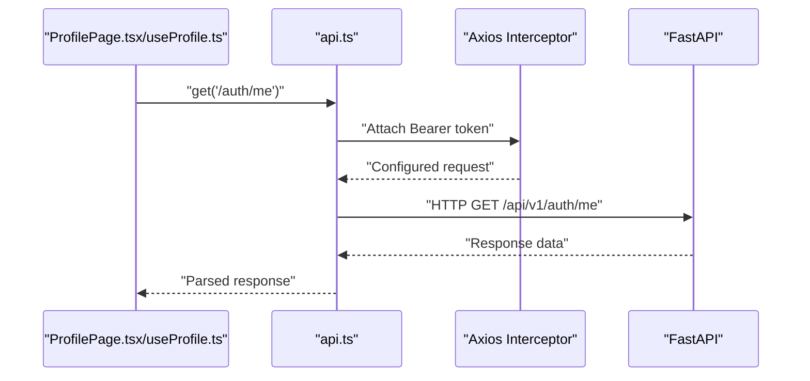
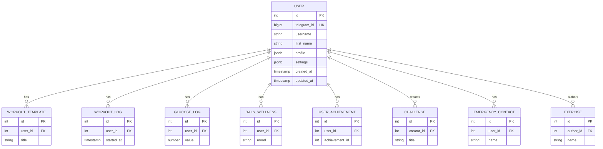
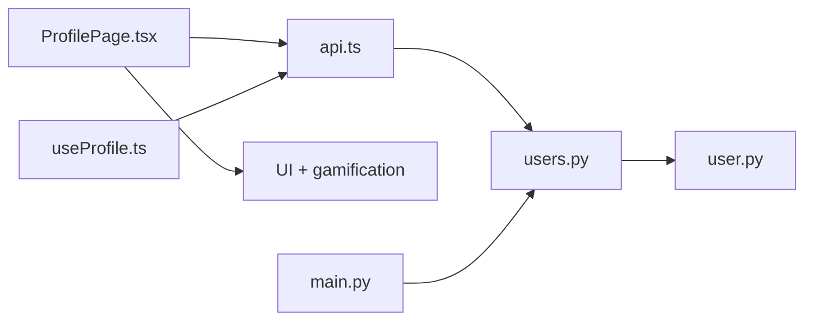

# Profile Page

<cite>
**Referenced Files in This Document**
- [ProfilePage.tsx](file://frontend/src/pages/ProfilePage.tsx)
- [router.tsx](file://frontend/src/app/router.tsx)
- [AppShell.tsx](file://frontend/src/app/layouts/AppShell.tsx)
- [useProfile.ts](file://frontend/src/hooks/useProfile.ts)
- [api.ts](file://frontend/src/services/api.ts)
- [userStore.ts](file://frontend/src/stores/userStore.ts)
- [user.py](file://backend/app/models/user.py)
- [users.py](file://backend/app/api/users.py)
- [main.py](file://backend/app/main.py)
- [Navigation.tsx](file://frontend/src/components/common/Navigation.tsx)
- [Achievements.tsx](file://frontend/src/components/gamification/Achievements.tsx)
</cite>

## Table of Contents
1. [Introduction](#introduction)
2. [Project Structure](#project-structure)
3. [Core Components](#core-components)
4. [Architecture Overview](#architecture-overview)
5. [Detailed Component Analysis](#detailed-component-analysis)
6. [Dependency Analysis](#dependency-analysis)
7. [Performance Considerations](#performance-considerations)
8. [Troubleshooting Guide](#troubleshooting-guide)
9. [Conclusion](#conclusion)

## Introduction
This document describes the Profile area of FitTracker Pro. The **canonical profile screen** is a single page module: `ProfilePage.tsx`, registered in `router.tsx` at route `/profile` inside `AppShell` (bottom navigation). The page owns its UI and loads data through `api.ts` with local React state (it does **not** import `useProfile`; that hook is a separate reusable layer for other surfaces). The document still covers `useProfile.ts`, backend models, and navigation because they define the same domain and session patterns used across the app.

## Project Structure
The Profile system spans both frontend and backend components:
- Frontend:
  - **ProfilePage.tsx** — sole profile route screen (former `Profile.tsx` and re-export stub merged here)
  - **router.tsx** — `path="/profile"` → `<ProfilePage />` under `AppShell`
  - **useProfile.ts** — shared hook with similar API operations (not imported by ProfilePage today)
  - **api.ts** — HTTP client used by the profile screen
  - **userStore.ts** — global session store used elsewhere in the app
  - **Navigation.tsx** — bottom nav link to `/profile`
- Backend:
  - User model with JSONB fields for profile and settings
  - Users API router with placeholder endpoints
  - Application entrypoint wiring routers



**Diagram sources**
- [ProfilePage.tsx:274-780](file://frontend/src/pages/ProfilePage.tsx#L274-L780)
- [router.tsx:14-28](file://frontend/src/app/router.tsx#L14-L28)
- [useProfile.ts:128-324](file://frontend/src/hooks/useProfile.ts#L128-L324)
- [api.ts:6-69](file://frontend/src/services/api.ts#L6-L69)
- [userStore.ts:15-31](file://frontend/src/stores/userStore.ts#L15-L31)
- [user.py:23-132](file://backend/app/models/user.py#L23-L132)
- [users.py:9-65](file://backend/app/api/users.py#L9-L65)
- [main.py:89-107](file://backend/app/main.py#L89-L107)
- [Navigation.tsx:9](file://frontend/src/components/common/Navigation.tsx#L9)

**Section sources**
- [ProfilePage.tsx:1-11](file://frontend/src/pages/ProfilePage.tsx#L1-L11)
- [ProfilePage.tsx:48-71](file://frontend/src/pages/ProfilePage.tsx#L48-L71)
- [useProfile.ts:8-324](file://frontend/src/hooks/useProfile.ts#L8-L324)
- [api.ts:1-69](file://frontend/src/services/api.ts#L1-L69)
- [userStore.ts:1-31](file://frontend/src/stores/userStore.ts#L1-L31)
- [user.py:1-132](file://backend/app/models/user.py#L1-L132)
- [users.py:1-65](file://backend/app/api/users.py#L1-L65)
- [main.py:1-126](file://backend/app/main.py#L1-L126)
- [Navigation.tsx:9](file://frontend/src/components/common/Navigation.tsx#L9)

## Core Components
- Profile page (ProfilePage.tsx):
  - Displays user avatar, name, username, membership status, and activity statistics
  - Provides interactive editing for current and target weight
  - Offers profile customization via chips for equipment and health limitations
  - Controls measurement units and notifications toggle
  - Manages coach access generation and revocation
  - Exports user data and handles logout
- useProfile hook:
  - Centralizes profile fetching, updating, and data synchronization
  - Handles weight progress calculation and coach access management
  - Integrates Telegram WebApp haptic feedback
- API service (api.ts):
  - Axios-based client with request/response interceptors
  - Automatic bearer token injection from localStorage
- User store (userStore.ts):
  - Zustand store with persistence for user session state
- Backend user model (user.py):
  - Defines profile and settings JSONB fields with defaults
  - Establishes relationships to related entities
- Users API (users.py):
  - Router for user endpoints with placeholder implementations
- Application wiring (main.py):
  - Includes users router under /api/v1/users

**Section sources**
- [ProfilePage.tsx:274-780](file://frontend/src/pages/ProfilePage.tsx#L274-L780)
- [router.tsx:14-28](file://frontend/src/app/router.tsx#L14-L28)
- [useProfile.ts:128-324](file://frontend/src/hooks/useProfile.ts#L128-L324)
- [api.ts:6-69](file://frontend/src/services/api.ts#L6-L69)
- [userStore.ts:15-31](file://frontend/src/stores/userStore.ts#L15-L31)
- [user.py:23-132](file://backend/app/models/user.py#L23-L132)
- [users.py:9-65](file://backend/app/api/users.py#L9-L65)
- [main.py:89-107](file://backend/app/main.py#L89-L107)

## Architecture Overview
The Profile system follows a layered architecture:
- **Presentation:** `ProfilePage.tsx` renders UI, Telegram chrome (`useTelegramWebApp`), achievements preview (`useAchievements` / `ProfileShowcase`), and calls `api.ts` from local state and `useCallback` handlers.
- **Reusable domain hook:** `useProfile.ts` mirrors many of the same endpoints and can be adopted by other screens or a future refactor; it is not imported by `ProfilePage.tsx` today.
- **Data access:** `api.ts` performs authorized HTTP calls (`/auth/me`, `/users/stats`, `/users/coach-access`, etc.).
- **Session:** `userStore.ts` holds broader app session state; profile screen reads/writes user payload primarily via API responses.
- **Backend:** FastAPI routers and SQLAlchemy `User` model persist `profile` / `settings` JSONB fields.

```mermaid
sequenceDiagram
participant UI as "ProfilePage.tsx"
participant API as "api.ts"
participant Backend as "FastAPI"
Note over UI: Local useState and useCallback; no useProfile import.
UI->>API : "Parallel GET /auth/me, /users/stats, coach-access"
API->>Backend : "Bearer-authorized HTTP"
Backend-->>API : "JSON"
API-->>UI : "setProfile / setStats / setCoachAccesses"
UI->>API : "PUT /auth/me (merge profile/settings)"
API->>Backend : "Persist user"
Backend-->>API : "Updated user"
API-->>UI : "setProfile(response)"
```

**Diagram sources**
- [ProfilePage.tsx:327-357](file://frontend/src/pages/ProfilePage.tsx#L327-L357)
- [ProfilePage.tsx:297-324](file://frontend/src/pages/ProfilePage.tsx#L297-L324)
- [api.ts:47-65](file://frontend/src/services/api.ts#L47-L65)

## Detailed Component Analysis

### Profile Page Component (ProfilePage.tsx)
- Responsibilities:
  - Render user header with avatar, name, username, and badges
  - Display activity statistics cards
  - Manage weight goal editing with real-time progress calculation
  - Provide profile customization controls (equipment, limitations)
  - Control units and notifications
  - Coach access modal with code generation and revocation
  - Export data and logout actions
- Data binding:
  - Uses local state for profile, stats, and coach accesses
  - Synchronizes with backend via API calls
- Form interactions:
  - EditableField component supports inline editing for weights
  - ChipGroup toggles equipment and limitation selections
  - Toggle switches update settings atomically
- Validation and error handling:
  - Try/catch blocks around API calls log errors and prevent crashes
  - Loading skeleton during initial fetch
- Accessibility:
  - Proper focus order and keyboard navigation via buttons and inputs
  - Semantic icons and labels for screen readers



**Diagram sources**
- [ProfilePage.tsx:274-780](file://frontend/src/pages/ProfilePage.tsx#L274-L780)
- [ProfilePage.tsx:334-357](file://frontend/src/pages/ProfilePage.tsx#L334-L357)

**Section sources**
- [ProfilePage.tsx:274-780](file://frontend/src/pages/ProfilePage.tsx#L274-L780)

### useProfile Hook
Not imported by `ProfilePage.tsx` today; documented for parity with other consumers and potential refactors.

- Responsibilities:
  - Fetch profile, stats, and coach accesses
  - Update profile fields and settings
  - Calculate weight progress and goal date
  - Generate and revoke coach access codes
  - Export user data as JSON
  - Refresh all data concurrently
- Data structures:
  - UserProfile: includes nested profile and settings objects
  - UserStats: activity metrics
  - CoachAccess: access records with expiration
- Error handling:
  - Catches API errors and logs them
  - Provides user-friendly error messages
- Persistence:
  - Updates local state after successful backend writes
  - Triggers haptic feedback on success



**Diagram sources**
- [useProfile.ts:62-89](file://frontend/src/hooks/useProfile.ts#L62-L89)
- [useProfile.ts:12-35](file://frontend/src/hooks/useProfile.ts#L12-L35)

**Section sources**
- [useProfile.ts:128-324](file://frontend/src/hooks/useProfile.ts#L128-L324)

### API Service (api.ts)
- Responsibilities:
  - Configure Axios client with base URL and headers
  - Inject Authorization: Bearer token from localStorage
  - Centralize GET, POST, PUT, DELETE helpers
  - Log and propagate API errors
- Integration:
  - Consumed by both ProfilePage.tsx and useProfile.ts
  - Routes map to backend endpoints under /api/v1



**Diagram sources**
- [api.ts:21-45](file://frontend/src/services/api.ts#L21-L45)
- [api.ts:47-65](file://frontend/src/services/api.ts#L47-L65)

**Section sources**
- [api.ts:6-69](file://frontend/src/services/api.ts#L6-L69)

### Backend User Model and API
- User model (user.py):
  - JSONB fields for profile and settings with sensible defaults
  - Relationships to workout logs, health metrics, achievements, and more
- Users API (users.py):
  - Router mounted under /api/v1/users
  - Endpoints for creating/updating users, fetching current user, and fetching by ID
  - Placeholder implementations currently raise HTTP 501 Not Implemented
- Application wiring (main.py):
  - Includes users router with appropriate prefix and tags



**Diagram sources**
- [user.py:23-132](file://backend/app/models/user.py#L23-L132)

**Section sources**
- [user.py:23-132](file://backend/app/models/user.py#L23-L132)
- [users.py:9-65](file://backend/app/api/users.py#L9-L65)
- [main.py:89-107](file://backend/app/main.py#L89-L107)

### Navigation Integration
- The navigation component includes a route to the Profile page, ensuring seamless access from the app shell.

**Section sources**
- [Navigation.tsx:9](file://frontend/src/components/common/Navigation.tsx#L9)

### Profile Customization and Preferences
- Equipment and limitations:
  - Chip-based selection toggles values in profile.equipment and profile.limitations
  - Persisted via updateProfile calls
- Units and notifications:
  - Units toggle switches between metric and imperial
  - Notifications toggle switches boolean setting
  - Persisted via updateSettings calls
- Theme selection:
  - Settings include theme field; default is "telegram"
  - Can be extended to support light/dark themes
- Accessibility:
  - Buttons and inputs use semantic roles
  - Icons accompanied by descriptive labels
- Avatar upload:
  - Current implementation uses Telegram photo_url or initials fallback
  - No explicit upload UI is present in the current ProfilePage screen

**Section sources**
- [ProfilePage.tsx:571-667](file://frontend/src/pages/ProfilePage.tsx#L571-L667)
- [useProfile.ts:179-208](file://frontend/src/hooks/useProfile.ts#L179-L208)
- [user.py:60-69](file://backend/app/models/user.py#L60-L69)

### Data Synchronization Patterns
- Concurrent loading:
  - Initial load fetches profile, stats, and coach accesses in parallel
- Optimistic updates:
  - Local state updates immediately upon successful API responses
- Error boundaries:
  - Try/catch blocks prevent UI crashes and surface errors
- Token-based authentication:
  - Bearer token injected automatically for protected routes

**Section sources**
- [ProfilePage.tsx:329-333](file://frontend/src/pages/ProfilePage.tsx#L329-L333)
- [useProfile.ts:294-302](file://frontend/src/hooks/useProfile.ts#L294-L302)
- [api.ts:21-45](file://frontend/src/services/api.ts#L21-L45)

### Relationship Between Profile Data and Other Features
- Achievements:
  - Profile showcases achievements via a dedicated component
  - Stats inform the achievement visualization
- Health metrics:
  - Units preference affects how metrics are displayed
- Workouts:
  - Profile equipment influences workout recommendations
- Emergency contacts:
  - Profile settings may influence emergency mode behavior

**Section sources**
- [ProfilePage.tsx:553-568](file://frontend/src/pages/ProfilePage.tsx#L553-L568)
- [Achievements.tsx:626](file://frontend/src/components/gamification/Achievements.tsx#L626)

## Dependency Analysis
- Frontend dependencies:
  - **ProfilePage.tsx** depends on `api.ts`, UI primitives (`Button`, `Input`, `Chip`, `Modal`, `ProgressBar`), `useTelegramWebApp`, `useAchievements`, and `ProfileShowcase`; it does **not** import `useProfile.ts`.
  - **useProfile.ts** depends on `api.ts` and Telegram WebApp hooks for optional reuse elsewhere.
  - **userStore.ts** provides broader session state for the app shell and other features.
- Backend dependencies:
  - users.py router depends on SQLAlchemy User model
  - main.py wires routers into the application



**Diagram sources**
- [ProfilePage.tsx:274-780](file://frontend/src/pages/ProfilePage.tsx#L274-L780)
- [useProfile.ts:128-324](file://frontend/src/hooks/useProfile.ts#L128-L324)
- [api.ts:6-69](file://frontend/src/services/api.ts#L6-L69)
- [users.py:9-65](file://backend/app/api/users.py#L9-L65)
- [user.py:23-132](file://backend/app/models/user.py#L23-L132)
- [main.py:89-107](file://backend/app/main.py#L89-L107)

**Section sources**
- [ProfilePage.tsx:274-780](file://frontend/src/pages/ProfilePage.tsx#L274-L780)
- [useProfile.ts:128-324](file://frontend/src/hooks/useProfile.ts#L128-L324)
- [api.ts:6-69](file://frontend/src/services/api.ts#L6-L69)
- [users.py:9-65](file://backend/app/api/users.py#L9-L65)
- [user.py:23-132](file://backend/app/models/user.py#L23-L132)
- [main.py:89-107](file://backend/app/main.py#L89-L107)

## Performance Considerations
- Minimize re-renders:
  - Use memoization for derived values like weight progress
  - Keep UI components pure; ProfilePage holds screen state locally (or adopt `useProfile` if deduplicating data logic)
- Network efficiency:
  - Batch related updates (e.g., update profile and settings together)
  - Debounce frequent updates where appropriate
- Storage:
  - Persist only essential session data in userStore.ts
  - Avoid storing large payloads in localStorage

## Troubleshooting Guide
- Authentication failures:
  - Verify Bearer token presence in localStorage
  - Check interceptor configuration for Authorization header
- API errors:
  - Inspect response interceptors for logged error details
  - Confirm backend endpoints are reachable and not returning 501
- Data not updating:
  - Ensure updateProfile/updateSettings calls resolve successfully
  - Confirm haptic feedback triggers on success
- Session state:
  - Clear userStore state and localStorage token on logout

**Section sources**
- [api.ts:21-45](file://frontend/src/services/api.ts#L21-L45)
- [users.py:47-54](file://backend/app/api/users.py#L47-L54)
- [ProfilePage.tsx:402-407](file://frontend/src/pages/ProfilePage.tsx#L402-L407)

## Conclusion
The profile experience is delivered by a **single route screen**, `ProfilePage.tsx`, wired at `/profile` in `router.tsx`. The screen combines Telegram context, inline `api.ts` calls, and rich local UI state. The **useProfile** hook documents a parallel, reusable data layer for the same backend contracts. Together with the FastAPI user model and navigation shell, this supports customization, coach access, export, and logout flows without duplicate page modules.