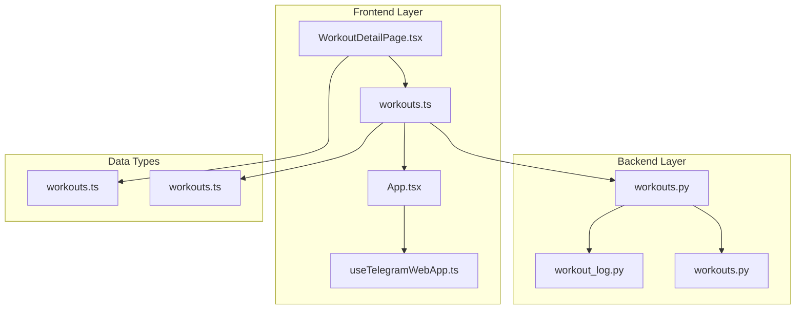
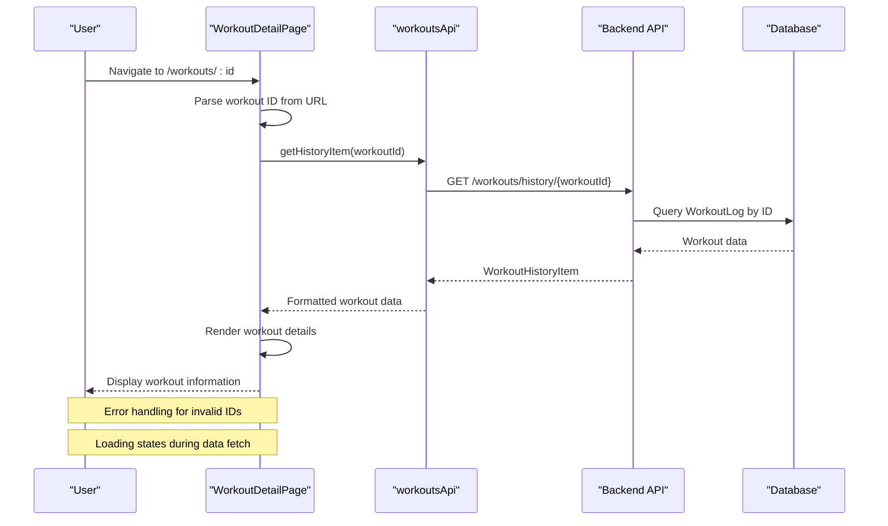
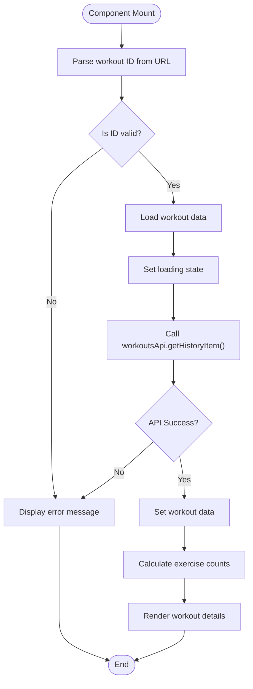
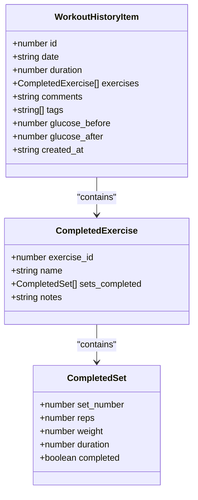
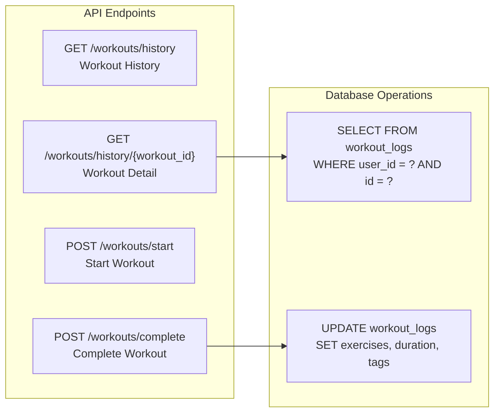
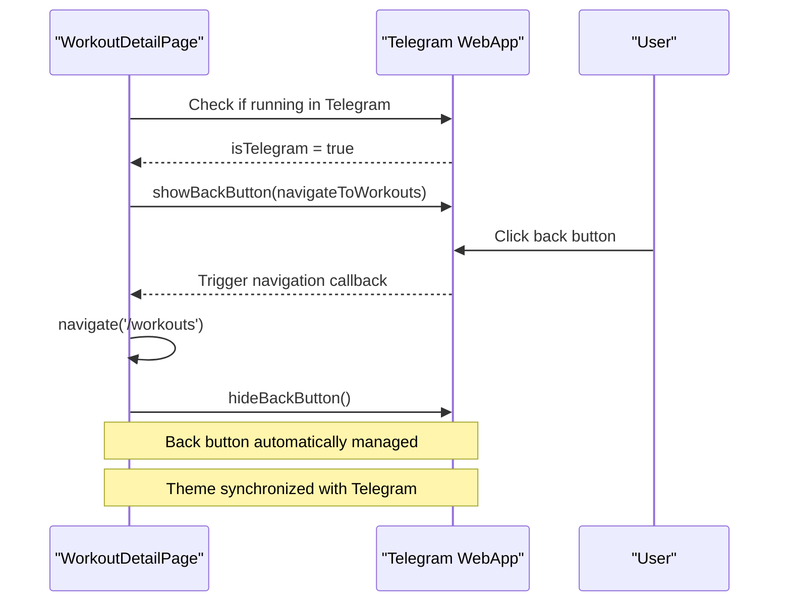
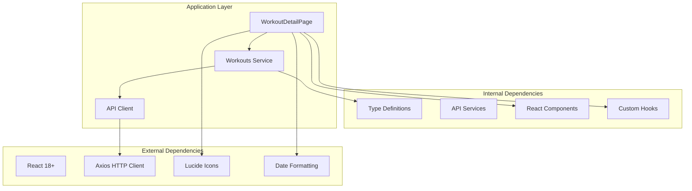

# Workout Detail Page

<cite>
**Referenced Files in This Document**
- [WorkoutDetailPage.tsx](file://frontend/src/pages/WorkoutDetailPage.tsx)
- [workouts.ts](file://frontend/src/services/workouts.ts)
- [api.ts](file://frontend/src/services/api.ts)
- [App.tsx](file://frontend/src/App.tsx)
- [WorkoutsPage.tsx](file://frontend/src/pages/WorkoutsPage.tsx)
- [useTelegramWebApp.ts](file://frontend/src/hooks/useTelegramWebApp.ts)
- [workouts.py](file://backend/app/api/workouts.py)
- [workout_log.py](file://backend/app/models/workout_log.py)
- [workouts.py](file://backend/app/schemas/workouts.py)
- [workouts.ts](file://frontend/src/types/workouts.ts)
</cite>

## Table of Contents
1. [Introduction](#introduction)
2. [Project Structure](#project-structure)
3. [Core Components](#core-components)
4. [Architecture Overview](#architecture-overview)
5. [Detailed Component Analysis](#detailed-component-analysis)
6. [Dependency Analysis](#dependency-analysis)
7. [Performance Considerations](#performance-considerations)
8. [Troubleshooting Guide](#troubleshooting-guide)
9. [Conclusion](#conclusion)

## Introduction

The Workout Detail Page is a crucial component of the Fit Tracker Pro application that displays comprehensive information about individual workout sessions. This page serves as the central hub for reviewing workout history, examining exercise performance metrics, and analyzing training progress over time.

The page provides users with detailed insights into their completed workouts, including exercise breakdowns, set completion statistics, duration analysis, and performance metrics. It integrates seamlessly with the Telegram WebApp ecosystem, offering native mobile experience with back button navigation and haptic feedback.

## Project Structure

The Workout Detail Page follows a modular architecture that separates concerns between frontend presentation, API communication, and backend data management:

**Diagram sources**
- [WorkoutDetailPage.tsx:1-218](file://frontend/src/pages/WorkoutDetailPage.tsx#L1-L218)
- [workouts.ts:1-37](file://frontend/src/services/workouts.ts#L1-L37)
- [workouts.py:1-525](file://backend/app/api/workouts.py#L1-L525)

**Section sources**
- [WorkoutDetailPage.tsx:1-218](file://frontend/src/pages/WorkoutDetailPage.tsx#L1-L218)
- [App.tsx:1-78](file://frontend/src/App.tsx#L1-L78)

## Core Components

The Workout Detail Page consists of several interconnected components that work together to provide a comprehensive workout review experience:

### Frontend Components

**WorkoutDetailPage Component**
- Handles workout loading and display logic
- Manages state for workout data, loading states, and error handling
- Implements Telegram WebApp integration for native mobile experience
- Provides formatted display of workout metrics and exercise details

**Workouts Service**
- Manages API communication for workout-related operations
- Handles HTTP requests to backend endpoints
- Provides typed interfaces for workout data exchange

**Telegram WebApp Integration**
- Enables native Telegram mobile app features
- Provides back button navigation and haptic feedback
- Manages theme synchronization with Telegram environment

### Backend Components

**Workout History Endpoint**
- Retrieves specific workout details by ID
- Implements user authorization and data filtering
- Returns structured workout data with exercise completions

**Workout Log Model**
- Stores completed workout information in database
- Maintains exercise completion data in JSON format
- Supports glucose tracking for diabetic users

**Data Validation and Serialization**
- Validates workout data input and output
- Ensures type safety across API boundaries
- Provides consistent data formats for frontend consumption

**Section sources**
- [WorkoutDetailPage.tsx:32-218](file://frontend/src/pages/WorkoutDetailPage.tsx#L32-L218)
- [workouts.ts:11-36](file://frontend/src/services/workouts.ts#L11-L36)
- [workouts.py:499-525](file://backend/app/api/workouts.py#L499-L525)

## Architecture Overview

The Workout Detail Page implements a clean separation of concerns between frontend presentation and backend data management:

**Diagram sources**
- [WorkoutDetailPage.tsx:42-83](file://frontend/src/pages/WorkoutDetailPage.tsx#L42-L83)
- [workouts.ts:21-23](file://frontend/src/services/workouts.ts#L21-L23)
- [workouts.py:499-525](file://backend/app/api/workouts.py#L499-L525)

The architecture ensures robust error handling, efficient data loading, and seamless integration with the Telegram WebApp environment.

**Section sources**
- [App.tsx:59](file://frontend/src/App.tsx#L59)
- [WorkoutsPage.tsx:155](file://frontend/src/pages/WorkoutsPage.tsx#L155)

## Detailed Component Analysis

### WorkoutDetailPage Component

The WorkoutDetailPage component serves as the primary interface for displaying workout details. It implements sophisticated state management and error handling mechanisms:

**Diagram sources**
- [WorkoutDetailPage.tsx:51-83](file://frontend/src/pages/WorkoutDetailPage.tsx#L51-L83)

Key features include:
- **Telegram WebApp Integration**: Automatic back button configuration and navigation
- **Error Handling**: Comprehensive validation and user-friendly error messages
- **Loading States**: Graceful loading indicators during data fetch
- **Data Formatting**: Localized date formatting and numeric value presentation

**Section sources**
- [WorkoutDetailPage.tsx:32-218](file://frontend/src/pages/WorkoutDetailPage.tsx#L32-L218)

### Data Structure and Types

The workout detail page utilizes a hierarchical data structure that efficiently represents complex exercise performance data:

**Diagram sources**
- [workouts.ts:62-72](file://frontend/src/types/workouts.ts#L62-L72)
- [workouts.ts:30-35](file://frontend/src/types/workouts.ts#L30-L35)
- [workouts.ts:22-28](file://frontend/src/types/workouts.ts#L22-L28)

**Section sources**
- [workouts.ts:1-82](file://frontend/src/types/workouts.ts#L1-L82)
- [workouts.py:123-136](file://backend/app/schemas/workouts.py#L123-L136)

### Backend API Integration

The backend provides a RESTful API that exposes workout history and detail endpoints:

**Diagram sources**
- [workouts.py:261-335](file://backend/app/api/workouts.py#L261-L335)
- [workouts.py:499-525](file://backend/app/api/workouts.py#L499-L525)

**Section sources**
- [workouts.py:1-525](file://backend/app/api/workouts.py#L1-L525)

### Telegram WebApp Integration

The component seamlessly integrates with Telegram's WebApp environment:

**Diagram sources**
- [WorkoutDetailPage.tsx:42-49](file://frontend/src/pages/WorkoutDetailPage.tsx#L42-L49)
- [useTelegramWebApp.ts:284-296](file://frontend/src/hooks/useTelegramWebApp.ts#L284-L296)

**Section sources**
- [useTelegramWebApp.ts:1-508](file://frontend/src/hooks/useTelegramWebApp.ts#L1-L508)

## Dependency Analysis

The Workout Detail Page exhibits well-managed dependencies that promote maintainability and testability:

**Diagram sources**
- [WorkoutDetailPage.tsx:1-6](file://frontend/src/pages/WorkoutDetailPage.tsx#L1-L6)
- [workouts.ts:1-9](file://frontend/src/services/workouts.ts#L1-L9)

Key dependency characteristics:
- **Minimal External Dependencies**: Only essential libraries for UI and HTTP communication
- **Type Safety**: Comprehensive TypeScript definitions prevent runtime errors
- **Modular Architecture**: Clear separation between concerns enables independent testing
- **Telegram Integration**: Native mobile features enhance user experience

**Section sources**
- [App.tsx:1-78](file://frontend/src/App.tsx#L1-L78)
- [workouts.ts:1-37](file://frontend/src/services/workouts.ts#L1-L37)

## Performance Considerations

The Workout Detail Page implements several performance optimization strategies:

### Memory Management
- **Cleanup Functions**: Proper cleanup of event listeners and navigation handlers
- **Cancellation Pattern**: Prevents race conditions during rapid navigation
- **State Optimization**: Efficient state updates using React's memoization

### Network Optimization
- **Request Cancellation**: Prevents unnecessary API calls during navigation
- **Error Recovery**: Graceful handling of network failures
- **Loading States**: Optimistic UI updates during data fetching

### Rendering Performance
- **Component Memoization**: Uses useMemo for expensive calculations
- **Conditional Rendering**: Efficient DOM manipulation based on state
- **Icon Optimization**: Lightweight Lucide icons with minimal bundle impact

**Section sources**
- [WorkoutDetailPage.tsx:79-83](file://frontend/src/pages/WorkoutDetailPage.tsx#L79-L83)
- [WorkoutDetailPage.tsx:85-95](file://frontend/src/pages/WorkoutDetailPage.tsx#L85-L95)

## Troubleshooting Guide

Common issues and their solutions:

### Navigation Issues
**Problem**: Back button not working in Telegram WebApp
**Solution**: Verify Telegram WebApp initialization and proper cleanup
- Check `tg.isTelegram` detection
- Ensure `tg.showBackButton()` is called during mount
- Verify cleanup in `useEffect` return function

### Data Loading Problems
**Problem**: Workout details not loading or showing loading indefinitely
**Solution**: Implement proper error handling and loading state management
- Validate workout ID parsing: `Number.parseInt(id ?? '')`
- Check API response structure and error handling
- Implement timeout and retry mechanisms

### Type Safety Issues
**Problem**: TypeScript compilation errors with workout data
**Solution**: Ensure proper type definitions and interface compliance
- Verify `WorkoutHistoryItem` interface matches backend schema
- Check for optional field handling in TypeScript types
- Validate enum and union type usage

### Performance Issues
**Problem**: Slow rendering or memory leaks
**Solution**: Optimize component rendering and state management
- Use `useMemo` for expensive calculations
- Implement proper cleanup in `useEffect` hooks
- Avoid unnecessary re-renders with proper dependency arrays

**Section sources**
- [WorkoutDetailPage.tsx:52-76](file://frontend/src/pages/WorkoutDetailPage.tsx#L52-L76)
- [useTelegramWebApp.ts:129-142](file://frontend/src/hooks/useTelegramWebApp.ts#L129-L142)

## Conclusion

The Workout Detail Page represents a well-architected solution that effectively combines modern React patterns with native Telegram WebApp integration. The component demonstrates excellent separation of concerns, comprehensive error handling, and thoughtful performance optimizations.

Key strengths include:
- **Seamless Telegram Integration**: Native mobile experience with automatic back button management
- **Robust Data Handling**: Comprehensive validation, error handling, and loading states
- **Type Safety**: Strong TypeScript integration prevents runtime errors
- **Performance Optimization**: Efficient rendering and memory management
- **Extensible Architecture**: Clean separation enables easy maintenance and future enhancements

The implementation serves as a solid foundation for workout analytics and progress tracking, providing users with valuable insights into their fitness journey while maintaining excellent user experience standards.