# Workouts Page

<cite>
**Referenced Files in This Document**
- [WorkoutsPage.tsx](file://frontend/src/pages/WorkoutsPage.tsx)
- [WorkoutBuilder.tsx](file://frontend/src/pages/WorkoutBuilder.tsx)
- [RestTimer.tsx](file://frontend/src/components/workout/RestTimer.tsx)
- [useTimer.ts](file://frontend/src/hooks/useTimer.ts)
- [Catalog.tsx](file://frontend/src/pages/Catalog.tsx)
- [Analytics.tsx](file://frontend/src/pages/Analytics.tsx)
- [OneRMCalculator.tsx](file://frontend/src/components/analytics/OneRMCalculator.tsx)
- [api.ts](file://frontend/src/services/api.ts)
- [workouts.py](file://backend/app/api/workouts.py)
- [workout_template.py](file://backend/app/models/workout_template.py)
- [workout_log.py](file://backend/app/models/workout_log.py)
- [workouts.py (schemas)](file://backend/app/schemas/workouts.py)
- [exercises.py](file://backend/app/api/exercises.py)
- [exercise.py](file://backend/app/models/exercise.py)
- [analytics.py](file://backend/app/api/analytics.py)
- [analytics.py (schemas)](file://backend/app/schemas/analytics.py)
</cite>

## Table of Contents
1. [Introduction](#introduction)
2. [Project Structure](#project-structure)
3. [Core Components](#core-components)
4. [Architecture Overview](#architecture-overview)
5. [Detailed Component Analysis](#detailed-component-analysis)
6. [Dependency Analysis](#dependency-analysis)
7. [Performance Considerations](#performance-considerations)
8. [Troubleshooting Guide](#troubleshooting-guide)
9. [Conclusion](#conclusion)
10. [Appendices](#appendices)

## Introduction
This document provides comprehensive documentation for the Workouts Page and the workout management system. It covers the workout listing interface, the workout builder functionality, exercise addition workflow, and the rest timer implementation. It also documents template selection, custom workout creation, exercise catalog integration, and workout session management. The builder pattern for creating personalized workout plans, exercise selection logic, and workout progression tracking are explained alongside timer functionality, rest period management, session completion workflows, sharing capabilities, progress tracking, and analytics integration.

## Project Structure
The workout management system spans both frontend and backend layers:
- Frontend pages and components:
  - Workouts listing page
  - Workout builder with drag-and-drop exercise blocks
  - Rest timer component with precision timing and haptic/sound feedback
  - Exercise catalog page integrated with the builder
  - Analytics dashboard with progress charts and calculators
- Backend APIs:
  - Workouts endpoints for templates, history, and session lifecycle
  - Exercises catalog with filtering and metadata
  - Analytics endpoints for progress, calendar, and exports

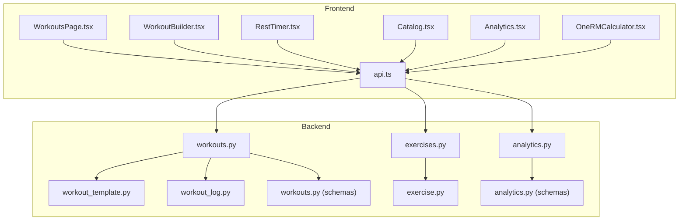

**Diagram sources**
- [WorkoutsPage.tsx:1-113](file://frontend/src/pages/WorkoutsPage.tsx#L1-L113)
- [WorkoutBuilder.tsx:1-1048](file://frontend/src/pages/WorkoutBuilder.tsx#L1-L1048)
- [RestTimer.tsx:1-550](file://frontend/src/components/workout/RestTimer.tsx#L1-L550)
- [Catalog.tsx:1-1283](file://frontend/src/pages/Catalog.tsx#L1-L1283)
- [Analytics.tsx:1-996](file://frontend/src/pages/Analytics.tsx#L1-L996)
- [OneRMCalculator.tsx:1-730](file://frontend/src/components/analytics/OneRMCalculator.tsx#L1-L730)
- [api.ts:1-69](file://frontend/src/services/api.ts#L1-L69)
- [workouts.py:1-522](file://backend/app/api/workouts.py#L1-L522)
- [exercises.py:1-463](file://backend/app/api/exercises.py#L1-L463)
- [analytics.py:1-518](file://backend/app/api/analytics.py#L1-L518)
- [workout_template.py:1-83](file://backend/app/models/workout_template.py#L1-L83)
- [workout_log.py:1-112](file://backend/app/models/workout_log.py#L1-L112)
- [exercise.py:1-116](file://backend/app/models/exercise.py#L1-L116)
- [workouts.py (schemas):1-146](file://backend/app/schemas/workouts.py#L1-L146)
- [analytics.py (schemas):1-111](file://backend/app/schemas/analytics.py#L1-L111)

**Section sources**
- [WorkoutsPage.tsx:1-113](file://frontend/src/pages/WorkoutsPage.tsx#L1-L113)
- [WorkoutBuilder.tsx:1-1048](file://frontend/src/pages/WorkoutBuilder.tsx#L1-L1048)
- [RestTimer.tsx:1-550](file://frontend/src/components/workout/RestTimer.tsx#L1-L550)
- [Catalog.tsx:1-1283](file://frontend/src/pages/Catalog.tsx#L1-L1283)
- [Analytics.tsx:1-996](file://frontend/src/pages/Analytics.tsx#L1-L996)
- [OneRMCalculator.tsx:1-730](file://frontend/src/components/analytics/OneRMCalculator.tsx#L1-L730)
- [api.ts:1-69](file://frontend/src/services/api.ts#L1-L69)
- [workouts.py:1-522](file://backend/app/api/workouts.py#L1-L522)
- [exercises.py:1-463](file://backend/app/api/exercises.py#L1-L463)
- [analytics.py:1-518](file://backend/app/api/analytics.py#L1-L518)
- [workout_template.py:1-83](file://backend/app/models/workout_template.py#L1-L83)
- [workout_log.py:1-112](file://backend/app/models/workout_log.py#L1-L112)
- [exercise.py:1-116](file://backend/app/models/exercise.py#L1-L116)
- [workouts.py (schemas):1-146](file://backend/app/schemas/workouts.py#L1-L146)
- [analytics.py (schemas):1-111](file://backend/app/schemas/analytics.py#L1-L111)

## Core Components
- Workouts Listing Page: Displays recent workouts, filtering by type, and weekly summaries.
- Workout Builder: Drag-and-drop builder for creating personalized workout plans with strength, cardio, timer, and note blocks.
- Rest Timer: Precision timer for rest periods with sound, haptic feedback, and background operation.
- Exercise Catalog: Browse and filter exercises for adding to workouts.
- Analytics Dashboard: Charts and calculators for workout progress and 1RM calculations.
- Backend Workouts API: Templates, history, and session lifecycle management.
- Backend Exercises API: Catalog and filtering for exercises.
- Backend Analytics API: Progress analytics, calendar, and data exports.

**Section sources**
- [WorkoutsPage.tsx:1-113](file://frontend/src/pages/WorkoutsPage.tsx#L1-L113)
- [WorkoutBuilder.tsx:1-1048](file://frontend/src/pages/WorkoutBuilder.tsx#L1-L1048)
- [RestTimer.tsx:1-550](file://frontend/src/components/workout/RestTimer.tsx#L1-L550)
- [Catalog.tsx:1-1283](file://frontend/src/pages/Catalog.tsx#L1-L1283)
- [Analytics.tsx:1-996](file://frontend/src/pages/Analytics.tsx#L1-L996)
- [workouts.py:1-522](file://backend/app/api/workouts.py#L1-L522)
- [exercises.py:1-463](file://backend/app/api/exercises.py#L1-L463)
- [analytics.py:1-518](file://backend/app/api/analytics.py#L1-L518)

## Architecture Overview
The system follows a clear separation of concerns:
- Frontend pages/components communicate with backend via the shared API service.
- Backend exposes REST endpoints for workouts, exercises, and analytics.
- Data models define storage structures for templates, logs, and exercises.
- Schemas validate request/response payloads.

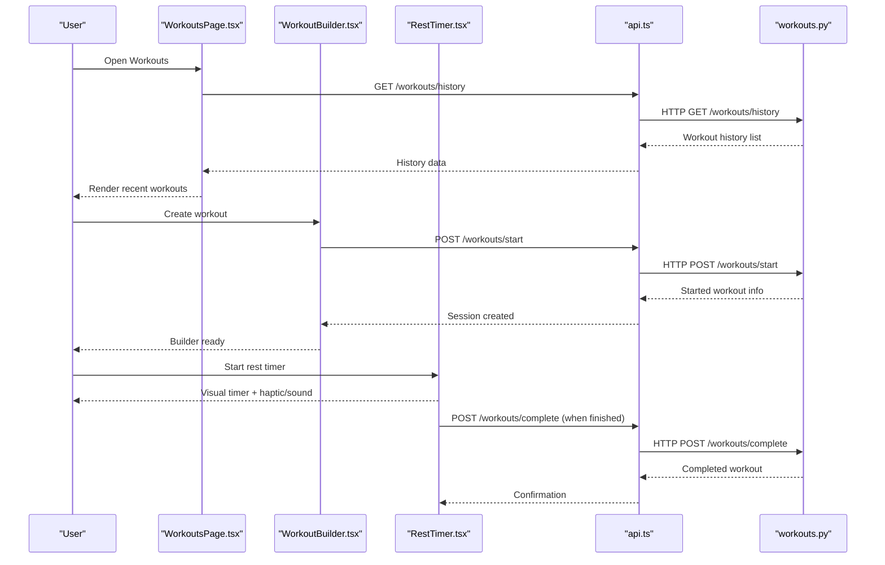

**Diagram sources**
- [WorkoutsPage.tsx:1-113](file://frontend/src/pages/WorkoutsPage.tsx#L1-L113)
- [WorkoutBuilder.tsx:1-1048](file://frontend/src/pages/WorkoutBuilder.tsx#L1-L1048)
- [RestTimer.tsx:1-550](file://frontend/src/components/workout/RestTimer.tsx#L1-L550)
- [api.ts:1-69](file://frontend/src/services/api.ts#L1-L69)
- [workouts.py:337-493](file://backend/app/api/workouts.py#L337-L493)

## Detailed Component Analysis

### Workouts Listing Interface
- Displays recent workouts with type, duration, and calories.
- Provides type-based filtering and a weekly summary card.
- Uses local mock data for demonstration.

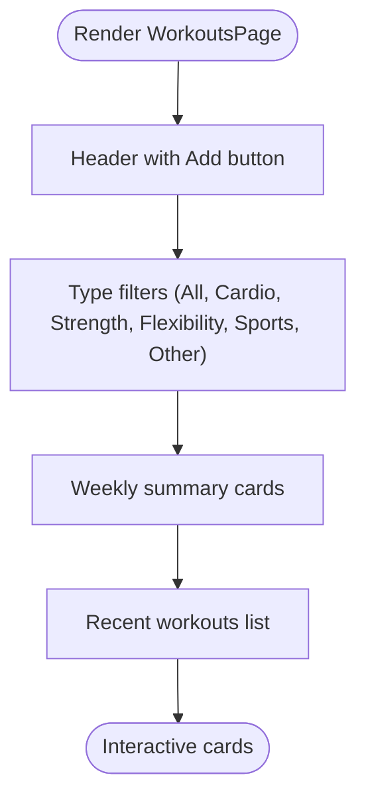

**Diagram sources**
- [WorkoutsPage.tsx:21-112](file://frontend/src/pages/WorkoutsPage.tsx#L21-L112)

**Section sources**
- [WorkoutsPage.tsx:1-113](file://frontend/src/pages/WorkoutsPage.tsx#L1-L113)

### Workout Builder Functionality
- Builder supports four block types: strength, cardio, timer, and note.
- Drag-and-drop reordering using @dnd-kit.
- Exercise selector modal with search and category filters.
- Config modal for sets/reps/weight/duration/rest.
- Local auto-save to localStorage with periodic intervals.
- Template saving with name, type tags, and public flag.

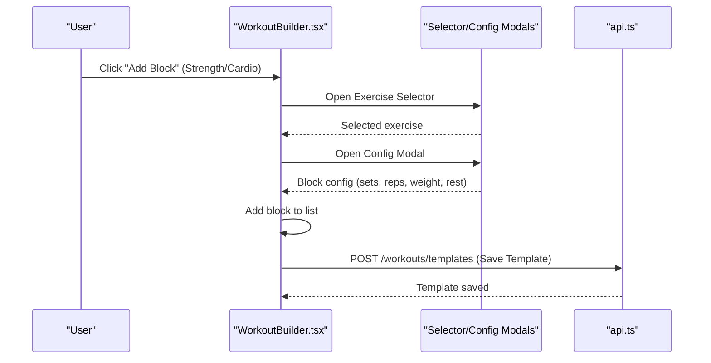

**Diagram sources**
- [WorkoutBuilder.tsx:382-512](file://frontend/src/pages/WorkoutBuilder.tsx#L382-L512)
- [api.ts:52-54](file://frontend/src/services/api.ts#L52-L54)

**Section sources**
- [WorkoutBuilder.tsx:1-1048](file://frontend/src/pages/WorkoutBuilder.tsx#L1-L1048)
- [api.ts:1-69](file://frontend/src/services/api.ts#L1-L69)

### Exercise Addition Workflow
- Exercise catalog integrates with the builder:
  - Search by name/category/equipment.
  - Add custom exercises inline.
  - Select exercise and configure block parameters.
- Backend exercises API supports filtering and metadata.

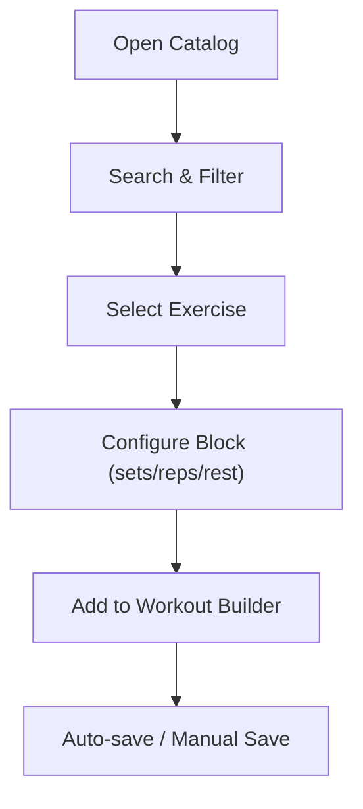

**Diagram sources**
- [Catalog.tsx:1-1283](file://frontend/src/pages/Catalog.tsx#L1-L1283)
- [WorkoutBuilder.tsx:397-432](file://frontend/src/pages/WorkoutBuilder.tsx#L397-L432)
- [exercises.py:24-140](file://backend/app/api/exercises.py#L24-L140)

**Section sources**
- [Catalog.tsx:1-1283](file://frontend/src/pages/Catalog.tsx#L1-L1283)
- [WorkoutBuilder.tsx:382-432](file://frontend/src/pages/WorkoutBuilder.tsx#L382-L432)
- [exercises.py:1-463](file://backend/app/api/exercises.py#L1-L463)

### Rest Timer Implementation
- High-precision timer using requestAnimationFrame.
- Supports warning at 10 seconds, completion callbacks, and background operation.
- Wake Lock API to keep screen awake during rest.
- Sound generation via Web Audio API and Telegram haptic feedback.
- Quick presets, manual add/subtract time, and skip/reset controls.

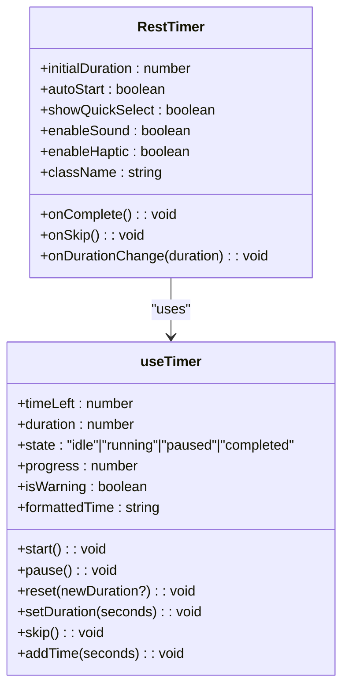

**Diagram sources**
- [RestTimer.tsx:11-30](file://frontend/src/components/workout/RestTimer.tsx#L11-L30)
- [useTimer.ts:26-51](file://frontend/src/hooks/useTimer.ts#L26-L51)

**Section sources**
- [RestTimer.tsx:1-550](file://frontend/src/components/workout/RestTimer.tsx#L1-L550)
- [useTimer.ts:1-293](file://frontend/src/hooks/useTimer.ts#L1-L293)

### Workout Template Selection and Custom Creation
- Templates are stored in the backend with exercises serialized as JSON.
- Users can select templates or create custom ones.
- Template saving validates presence of exercises and type tags.

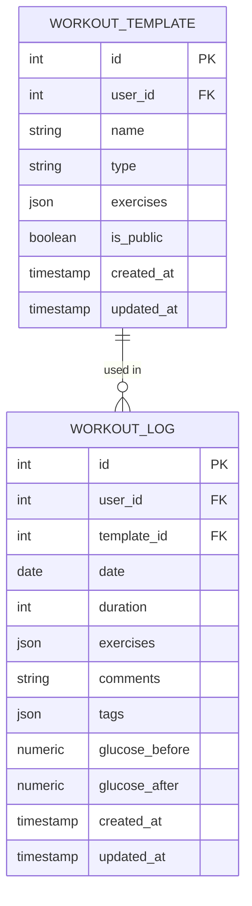

**Diagram sources**
- [workout_template.py:18-82](file://backend/app/models/workout_template.py#L18-L82)
- [workout_log.py:19-111](file://backend/app/models/workout_log.py#L19-L111)

**Section sources**
- [workout_template.py:1-83](file://backend/app/models/workout_template.py#L1-L83)
- [workout_log.py:1-112](file://backend/app/models/workout_log.py#L1-L112)
- [workouts.py:108-162](file://backend/app/api/workouts.py#L108-L162)

### Exercise Catalog Integration
- Backend exercises API supports category, equipment, muscle group, and search filters.
- Responses include metadata like equipment lists, muscle groups, and risk flags.
- Frontend catalog page renders filtered exercise lists and details.

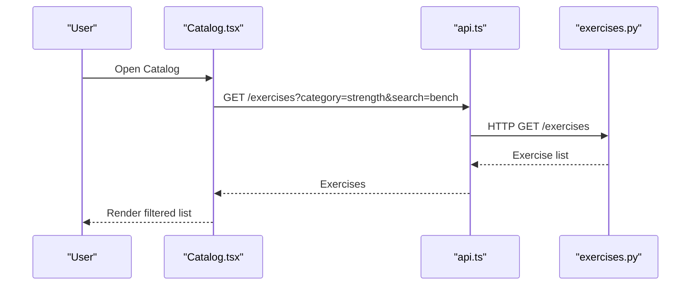

**Diagram sources**
- [Catalog.tsx:1-1283](file://frontend/src/pages/Catalog.tsx#L1-L1283)
- [exercises.py:24-140](file://backend/app/api/exercises.py#L24-L140)
- [api.ts:47-49](file://frontend/src/services/api.ts#L47-L49)

**Section sources**
- [Catalog.tsx:1-1283](file://frontend/src/pages/Catalog.tsx#L1-L1283)
- [exercises.py:1-463](file://backend/app/api/exercises.py#L1-L463)

### Workout Session Management
- Start session with optional template selection.
- Complete session with duration, exercises, comments, tags, and glucose metrics.
- History retrieval with pagination and date range filters.

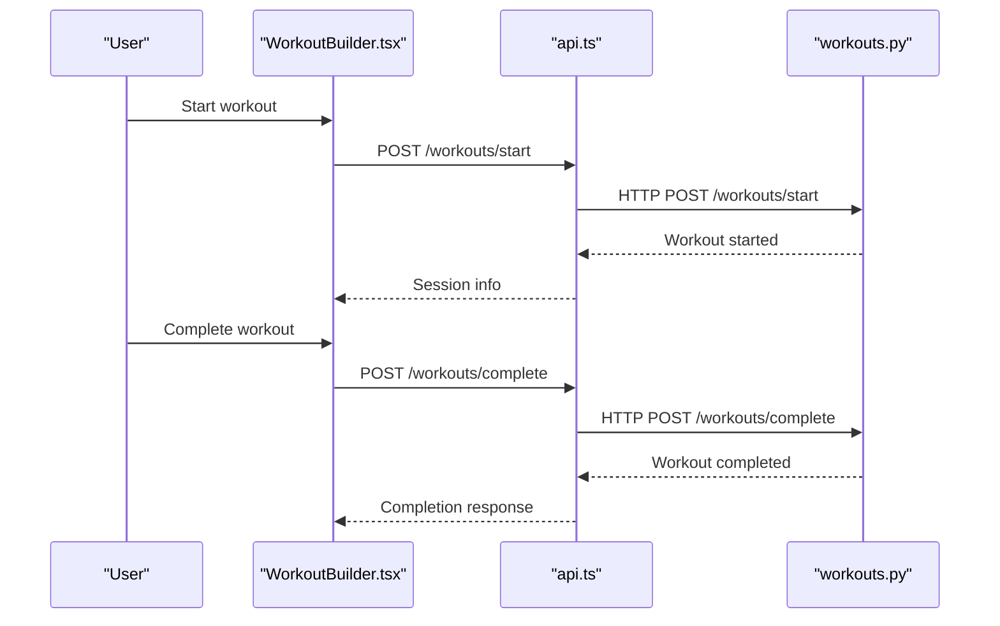

**Diagram sources**
- [WorkoutBuilder.tsx:464-474](file://frontend/src/pages/WorkoutBuilder.tsx#L464-L474)
- [workouts.py:337-493](file://backend/app/api/workouts.py#L337-L493)
- [api.ts:52-54](file://frontend/src/services/api.ts#L52-L54)

**Section sources**
- [workouts.py:260-334](file://backend/app/api/workouts.py#L260-L334)
- [workouts.py:337-493](file://backend/app/api/workouts.py#L337-L493)
- [workouts.py (schemas):72-121](file://backend/app/schemas/workouts.py#L72-L121)

### Builder Pattern for Personalized Plans
- Blocks represent workout segments with typed configuration.
- Drag-and-drop maintains order; each block carries its own config.
- Local drafts persist between browser sessions.

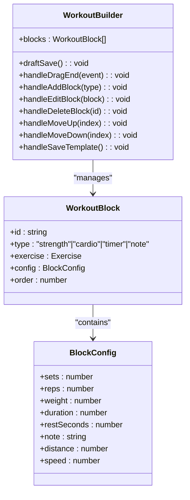

**Diagram sources**
- [WorkoutBuilder.tsx:50-83](file://frontend/src/pages/WorkoutBuilder.tsx#L50-L83)
- [WorkoutBuilder.tsx:267-520](file://frontend/src/pages/WorkoutBuilder.tsx#L267-L520)

**Section sources**
- [WorkoutBuilder.tsx:1-1048](file://frontend/src/pages/WorkoutBuilder.tsx#L1-L1048)

### Exercise Selection Logic
- Frontend filters exercises by search query and category.
- Backend filters support category, equipment, muscle groups, and search terms.
- Risk flags and equipment metadata inform safe exercise choices.

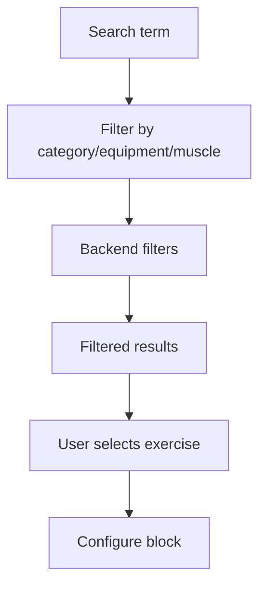

**Diagram sources**
- [WorkoutBuilder.tsx:522-527](file://frontend/src/pages/WorkoutBuilder.tsx#L522-L527)
- [exercises.py:24-140](file://backend/app/api/exercises.py#L24-L140)

**Section sources**
- [WorkoutBuilder.tsx:522-527](file://frontend/src/pages/WorkoutBuilder.tsx#L522-L527)
- [exercises.py:24-140](file://backend/app/api/exercises.py#L24-L140)

### Workout Progression Tracking
- Analytics endpoints compute exercise progress, calendar views, and summary stats.
- Charts visualize max weight over time; calculators estimate 1RM and suggest weight zones.

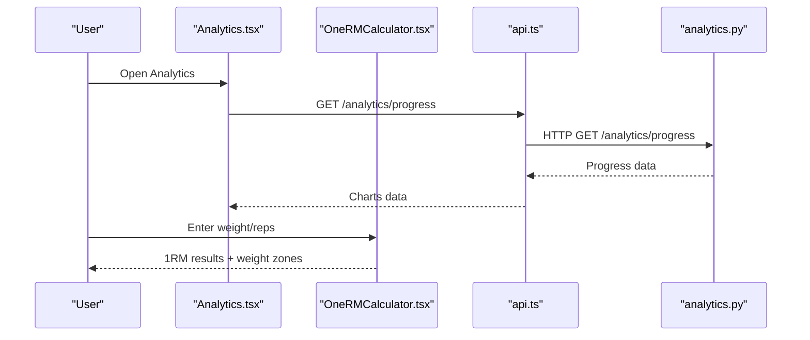

**Diagram sources**
- [Analytics.tsx:641-996](file://frontend/src/pages/Analytics.tsx#L641-L996)
- [OneRMCalculator.tsx:1-730](file://frontend/src/components/analytics/OneRMCalculator.tsx#L1-L730)
- [analytics.py:27-197](file://backend/app/api/analytics.py#L27-L197)
- [api.ts:47-49](file://frontend/src/services/api.ts#L47-L49)

**Section sources**
- [Analytics.tsx:1-996](file://frontend/src/pages/Analytics.tsx#L1-L996)
- [OneRMCalculator.tsx:1-730](file://frontend/src/components/analytics/OneRMCalculator.tsx#L1-L730)
- [analytics.py:1-518](file://backend/app/api/analytics.py#L1-L518)

### Workout Timer and Rest Management
- RestTimer component encapsulates timer logic, haptic/sound feedback, and wake lock.
- useTimer hook provides precise timing with requestAnimationFrame and background operation.

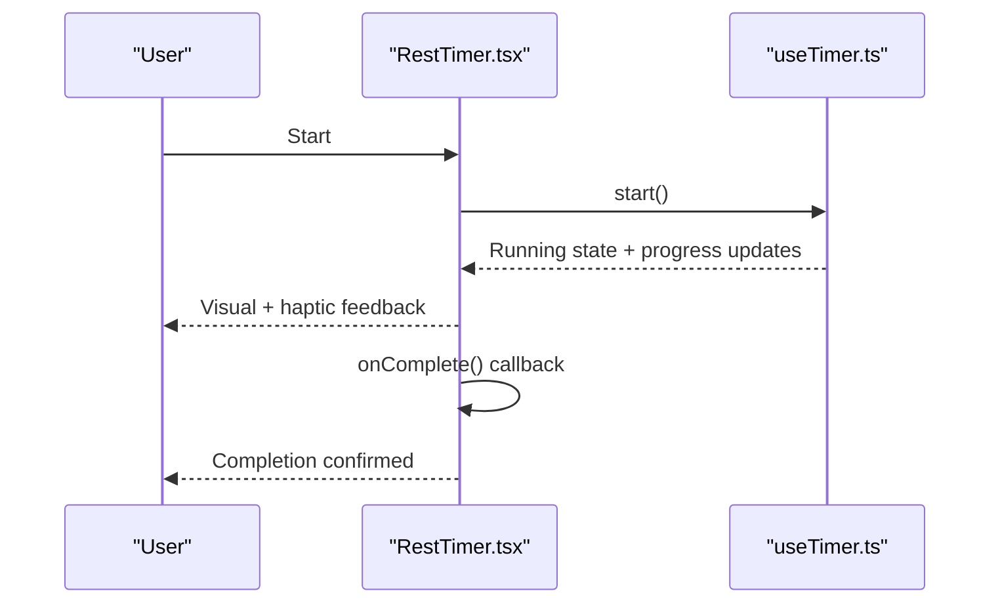

**Diagram sources**
- [RestTimer.tsx:115-189](file://frontend/src/components/workout/RestTimer.tsx#L115-L189)
- [useTimer.ts:57-290](file://frontend/src/hooks/useTimer.ts#L57-L290)

**Section sources**
- [RestTimer.tsx:1-550](file://frontend/src/components/workout/RestTimer.tsx#L1-L550)
- [useTimer.ts:1-293](file://frontend/src/hooks/useTimer.ts#L1-L293)

### Session Completion Workflows
- Start endpoint validates template ownership and creates a log entry.
- Complete endpoint persists duration, exercises, comments, tags, and glucose metrics.

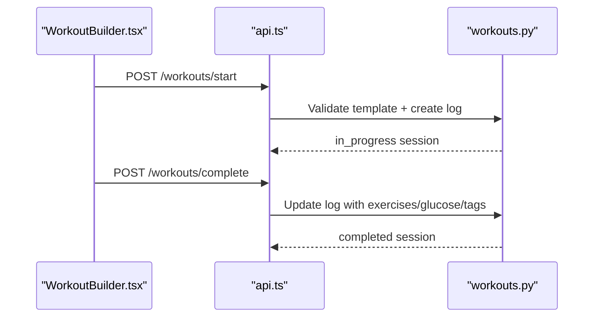

**Diagram sources**
- [workouts.py:337-493](file://backend/app/api/workouts.py#L337-L493)
- [api.ts:52-54](file://frontend/src/services/api.ts#L52-L54)

**Section sources**
- [workouts.py:337-493](file://backend/app/api/workouts.py#L337-L493)
- [workouts.py (schemas):72-121](file://backend/app/schemas/workouts.py#L72-L121)

### Sharing Capabilities and Integration
- Analytics export supports CSV/PDF/print and Telegram sharing via WebApp sendData.
- OneRM calculator allows saving results to local history and sharing via Telegram.

**Section sources**
- [Analytics.tsx:527-611](file://frontend/src/pages/Analytics.tsx#L527-L611)
- [OneRMCalculator.tsx:546-560](file://frontend/src/components/analytics/OneRMCalculator.tsx#L546-L560)

## Dependency Analysis
- Frontend depends on shared API service for all backend communication.
- Backend APIs depend on SQLAlchemy models and Pydantic schemas.
- No circular dependencies observed between frontend pages/components and backend modules.

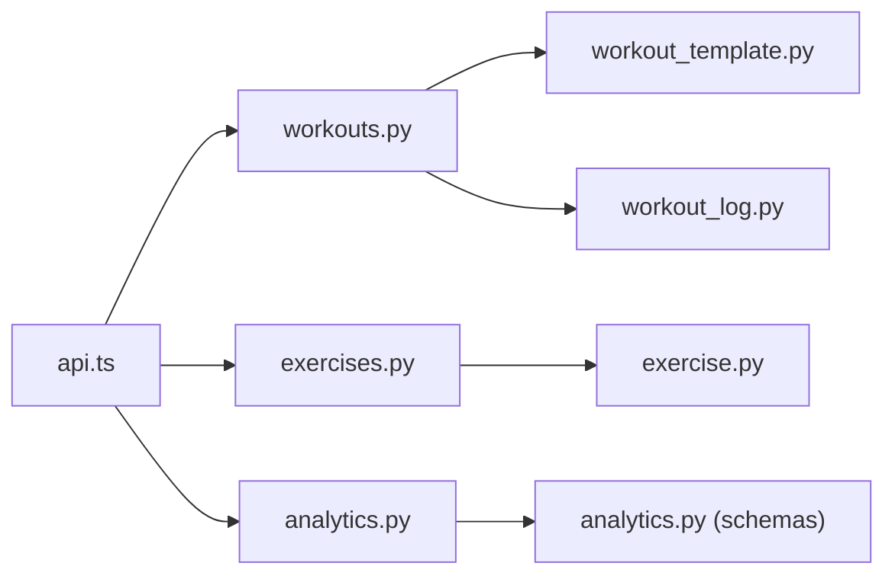

**Diagram sources**
- [api.ts:1-69](file://frontend/src/services/api.ts#L1-L69)
- [workouts.py:1-522](file://backend/app/api/workouts.py#L1-L522)
- [exercises.py:1-463](file://backend/app/api/exercises.py#L1-L463)
- [analytics.py:1-518](file://backend/app/api/analytics.py#L1-L518)
- [workout_template.py:1-83](file://backend/app/models/workout_template.py#L1-L83)
- [workout_log.py:1-112](file://backend/app/models/workout_log.py#L1-L112)
- [exercise.py:1-116](file://backend/app/models/exercise.py#L1-L116)
- [analytics.py (schemas):1-111](file://backend/app/schemas/analytics.py#L1-L111)

**Section sources**
- [api.ts:1-69](file://frontend/src/services/api.ts#L1-L69)
- [workouts.py:1-522](file://backend/app/api/workouts.py#L1-L522)
- [exercises.py:1-463](file://backend/app/api/exercises.py#L1-L463)
- [analytics.py:1-518](file://backend/app/api/analytics.py#L1-L518)

## Performance Considerations
- Frontend uses requestAnimationFrame for smooth timer rendering and reduces unnecessary re-renders through memoization and controlled components.
- Backend queries use pagination and indexed columns to limit result sizes and improve response times.
- Local auto-save minimizes network requests and prevents data loss.

## Troubleshooting Guide
- Timer does not start or pauses unexpectedly:
  - Verify browser audio context is resumed and Wake Lock permissions are granted.
  - Check visibility change handling for background operation.
- Template save fails:
  - Ensure template name is provided and at least one exercise is added.
  - Confirm network connectivity and API response status.
- Exercise catalog shows no results:
  - Adjust search/filter criteria; backend filters require valid parameters.
- Analytics export not available:
  - Export status is pending; check backend task queue and expiration.

**Section sources**
- [RestTimer.tsx:191-238](file://frontend/src/components/workout/RestTimer.tsx#L191-L238)
- [useTimer.ts:243-274](file://frontend/src/hooks/useTimer.ts#L243-L274)
- [WorkoutBuilder.tsx:476-512](file://frontend/src/pages/WorkoutBuilder.tsx#L476-L512)
- [exercises.py:24-140](file://backend/app/api/exercises.py#L24-L140)
- [analytics.py:310-382](file://backend/app/api/analytics.py#L310-L382)

## Conclusion
The workout management system combines a robust frontend builder with precise timing and analytics, backed by a flexible backend API. Users can create personalized workout plans, manage rest periods effectively, track progress, and share insights. The modular design ensures maintainability and extensibility for future enhancements.

## Appendices
- API Endpoints Overview:
  - Workouts: GET/POST/PUT/DELETE templates, GET history, POST start/complete sessions
  - Exercises: GET list with filters, GET by ID, POST/PUT/DELETE exercises
  - Analytics: GET progress, calendar, summary, POST export
- Data Models:
  - WorkoutTemplate, WorkoutLog, Exercise, and supporting schemas define the domain.

**Section sources**
- [workouts.py:29-105](file://backend/app/api/workouts.py#L29-L105)
- [workouts.py:165-258](file://backend/app/api/workouts.py#L165-L258)
- [workouts.py:260-334](file://backend/app/api/workouts.py#L260-L334)
- [workouts.py:337-493](file://backend/app/api/workouts.py#L337-L493)
- [exercises.py:24-140](file://backend/app/api/exercises.py#L24-L140)
- [exercises.py:143-165](file://backend/app/api/exercises.py#L143-L165)
- [exercises.py:168-220](file://backend/app/api/exercises.py#L168-L220)
- [exercises.py:222-271](file://backend/app/api/exercises.py#L222-L271)
- [exercises.py:274-296](file://backend/app/api/exercises.py#L274-L296)
- [exercises.py:298-329](file://backend/app/api/exercises.py#L298-L329)
- [exercises.py:332-361](file://backend/app/api/exercises.py#L332-L361)
- [exercises.py:364-409](file://backend/app/api/exercises.py#L364-L409)
- [exercises.py:412-462](file://backend/app/api/exercises.py#L412-L462)
- [analytics.py:27-197](file://backend/app/api/analytics.py#L27-L197)
- [analytics.py:200-307](file://backend/app/api/analytics.py#L200-L307)
- [analytics.py:310-365](file://backend/app/api/analytics.py#L310-L365)
- [analytics.py:368-382](file://backend/app/api/analytics.py#L368-L382)
- [analytics.py:385-517](file://backend/app/api/analytics.py#L385-L517)