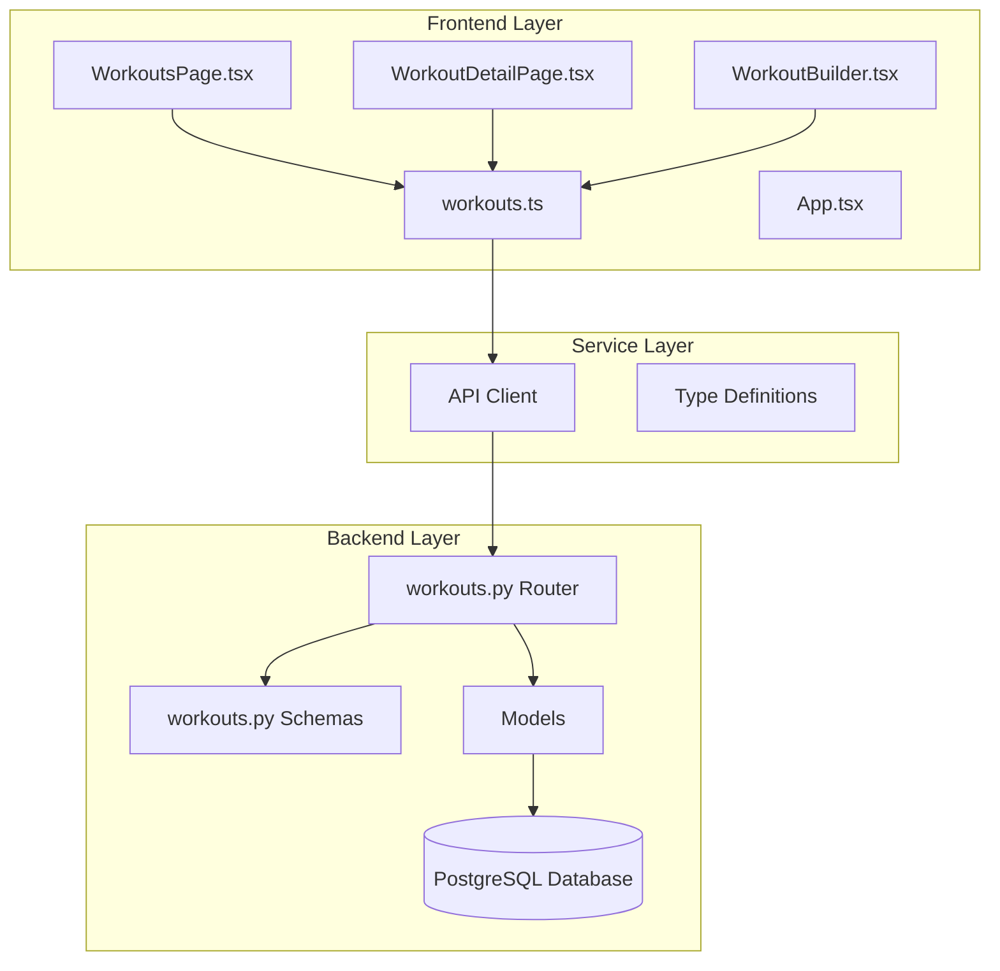
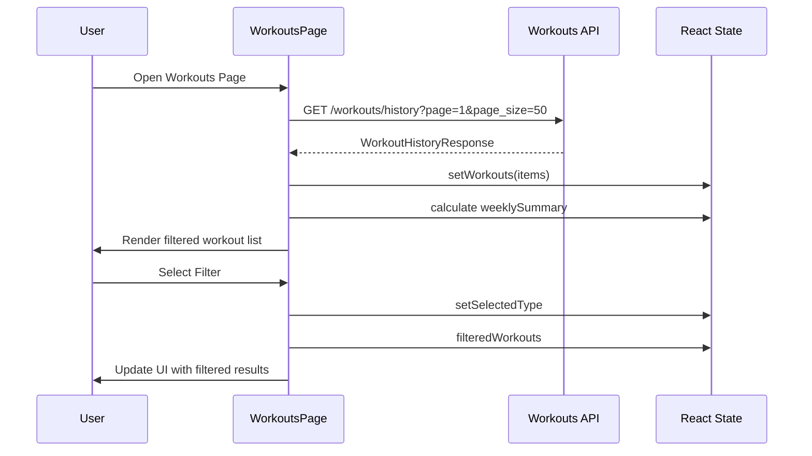
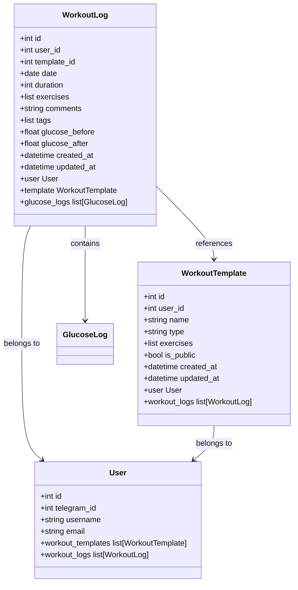
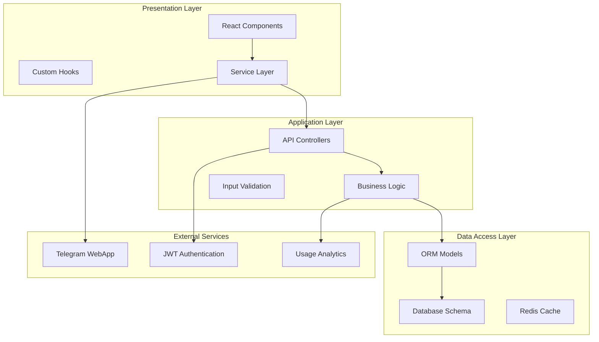
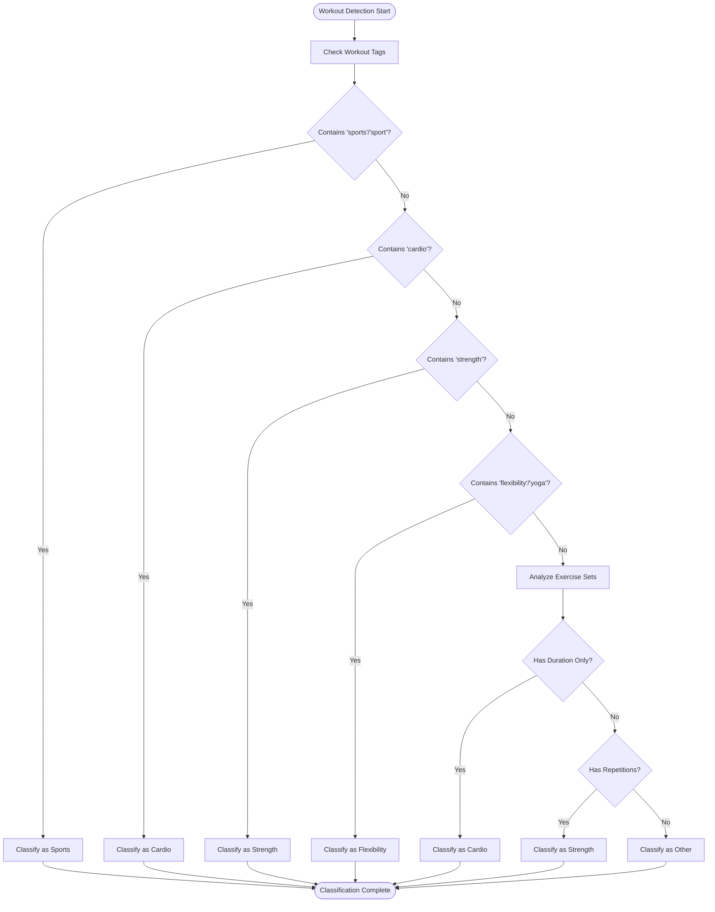
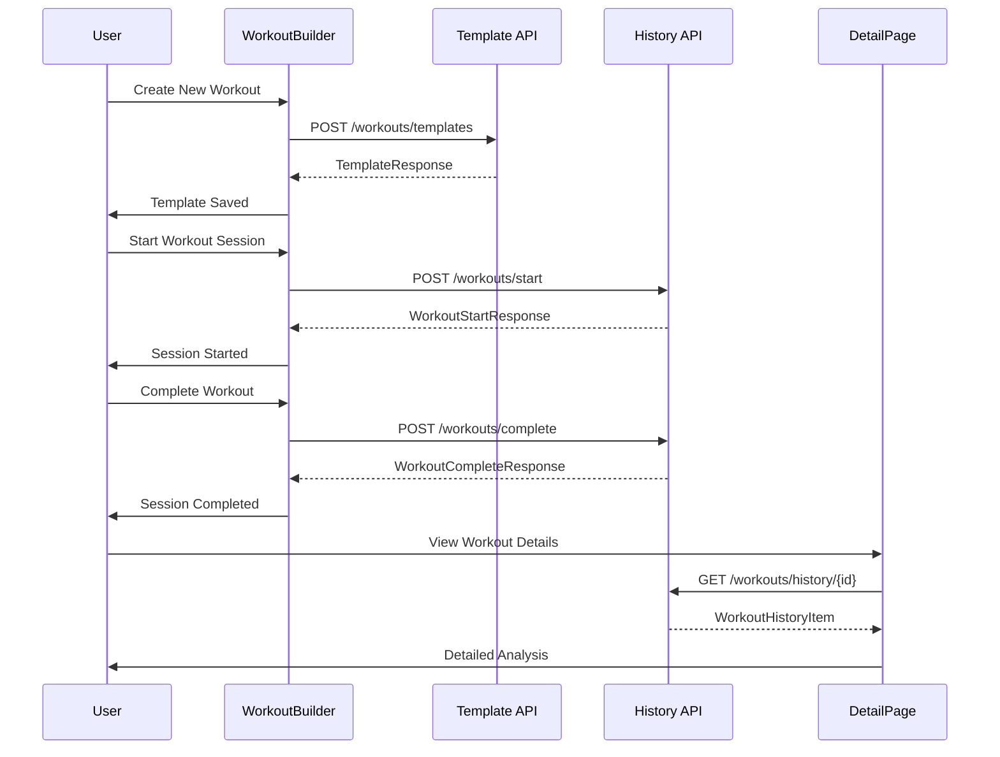

# Enhanced Workouts Page

<cite>
**Referenced Files in This Document**
- [WorkoutsPage.tsx](file://frontend/src/pages/WorkoutsPage.tsx)
- [WorkoutDetailPage.tsx](file://frontend/src/pages/WorkoutDetailPage.tsx)
- [WorkoutBuilder.tsx](file://frontend/src/pages/WorkoutBuilder.tsx)
- [workouts.ts](file://frontend/src/services/workouts.ts)
- [workouts.py](file://backend/app/api/workouts.py)
- [workout_log.py](file://backend/app/models/workout_log.py)
- [workout_template.py](file://backend/app/models/workout_template.py)
- [workouts.py](file://backend/app/schemas/workouts.py)
- [App.tsx](file://frontend/src/App.tsx)
- [workouts.ts](file://frontend/src/types/workouts.ts)
</cite>

## Table of Contents
1. [Introduction](#introduction)
2. [Project Structure](#project-structure)
3. [Core Components](#core-components)
4. [Architecture Overview](#architecture-overview)
5. [Detailed Component Analysis](#detailed-component-analysis)
6. [Dependency Analysis](#dependency-analysis)
7. [Performance Considerations](#performance-considerations)
8. [Troubleshooting Guide](#troubleshooting-guide)
9. [Conclusion](#conclusion)

## Introduction
The Enhanced Workouts Page is a comprehensive fitness tracking feature that enables users to manage, view, and analyze their workout history. This system provides a complete workflow from workout creation and execution to detailed analysis and progress tracking. The implementation combines a modern React frontend with a robust FastAPI backend, featuring real-time data synchronization, offline capabilities, and Telegram WebApp integration.

The system supports multiple workout types (cardio, strength, flexibility, sports, other) with intelligent categorization, detailed exercise logging with sets and repetitions, and comprehensive analytics including weekly summaries and calorie estimation. Users can create reusable workout templates, track their progress over time, and maintain detailed records of their fitness journey.

## Project Structure
The Enhanced Workouts functionality is organized across three main layers: frontend presentation, service layer, and backend API with database persistence.



**Diagram sources**
- [WorkoutsPage.tsx:1-265](file://frontend/src/pages/WorkoutsPage.tsx#L1-L265)
- [workouts.py:1-525](file://backend/app/api/workouts.py#L1-L525)

**Section sources**
- [WorkoutsPage.tsx:1-265](file://frontend/src/pages/WorkoutsPage.tsx#L1-L265)
- [workouts.py:1-525](file://backend/app/api/workouts.py#L1-L525)

## Core Components

### Frontend Components

#### WorkoutsPage Component
The main workouts interface provides a comprehensive dashboard for workout management with filtering capabilities and summary statistics.

**Key Features:**
- Real-time workout history loading with pagination support
- Intelligent workout type detection based on exercise patterns
- Weekly summary statistics (count, duration, calories)
- Interactive filtering by workout categories
- Telegram WebApp integration with haptic feedback

**Data Flow:**


**Diagram sources**
- [WorkoutsPage.tsx:108-138](file://frontend/src/pages/WorkoutsPage.tsx#L108-L138)
- [workouts.ts:11-19](file://frontend/src/services/workouts.ts#L11-L19)

#### WorkoutDetailPage Component
Provides detailed analysis of individual workout sessions with comprehensive exercise breakdown and metrics.

**Key Features:**
- Detailed workout information display
- Exercise-specific set completion tracking
- Metrics calculation (duration, exercise count, completed sets)
- Formatted display of numerical data with proper units

**Section sources**
- [WorkoutDetailPage.tsx:1-218](file://frontend/src/pages/WorkoutDetailPage.tsx#L1-L218)

#### WorkoutBuilder Component
Advanced workout creation tool with drag-and-drop functionality and template management.

**Key Features:**
- Interactive workout block creation (strength, cardio, timer, note)
- Drag-and-drop exercise arrangement
- Real-time template building with auto-save
- Comprehensive exercise configuration interface

**Section sources**
- [WorkoutBuilder.tsx:1-800](file://frontend/src/pages/WorkoutBuilder.tsx#L1-L800)

### Backend API Components

#### Workouts API Router
Handles all workout-related endpoints with comprehensive CRUD operations and business logic.

**Core Endpoints:**
- `/workouts/history` - Retrieve workout history with pagination and date filtering
- `/workouts/templates` - Manage workout templates (CRUD operations)
- `/workouts/start` - Begin new workout session
- `/workouts/complete` - Complete and finalize workout session

**Section sources**
- [workouts.py:261-335](file://backend/app/api/workouts.py#L261-L335)
- [workouts.py:338-496](file://backend/app/api/workouts.py#L338-L496)

#### Data Models


**Diagram sources**
- [workout_log.py:19-112](file://backend/app/models/workout_log.py#L19-L112)
- [workout_template.py:18-83](file://backend/app/models/workout_template.py#L18-L83)

**Section sources**
- [workout_log.py:19-112](file://backend/app/models/workout_log.py#L19-L112)
- [workout_template.py:18-83](file://backend/app/models/workout_template.py#L18-L83)

## Architecture Overview

The Enhanced Workouts system follows a clean architecture pattern with clear separation between frontend, backend, and data layers.



**Diagram sources**
- [App.tsx:52-69](file://frontend/src/App.tsx#L52-L69)
- [workouts.py:27-27](file://backend/app/api/workouts.py#L27-L27)

The architecture ensures scalability, maintainability, and provides clear boundaries between concerns. The frontend components communicate through a well-defined service layer that abstracts API interactions, while the backend maintains strict separation between business logic and data access.

## Detailed Component Analysis

### Workout Type Classification System

The system implements an intelligent workout classification mechanism that automatically categorizes workouts based on exercise patterns and tags.



**Diagram sources**
- [WorkoutsPage.tsx:29-48](file://frontend/src/pages/WorkoutsPage.tsx#L29-L48)

The classification algorithm prioritizes explicit tags, then examines exercise characteristics, and finally analyzes the training modalities to determine the most appropriate category.

### Data Flow Architecture

The system implements a comprehensive data flow that handles workout creation, execution, and analysis through well-defined sequences.



**Diagram sources**
- [WorkoutBuilder.tsx:533-581](file://frontend/src/pages/WorkoutBuilder.tsx#L533-L581)
- [workouts.ts:29-35](file://frontend/src/services/workouts.ts#L29-L35)

**Section sources**
- [WorkoutBuilder.tsx:533-581](file://frontend/src/pages/WorkoutBuilder.tsx#L533-L581)
- [workouts.ts:29-35](file://frontend/src/services/workouts.ts#L29-L35)

### Error Handling and Validation

The system implements comprehensive error handling across all layers with user-friendly error messages and graceful degradation.

**Frontend Error Handling Patterns:**
- Loading states with skeleton screens
- Network error recovery with retry mechanisms
- Input validation with real-time feedback
- Graceful degradation for unsupported features

**Backend Validation Strategies:**
- Pydantic model validation for request/response data
- Database constraint enforcement
- Business logic validation before operations
- Comprehensive error responses with status codes

**Section sources**
- [WorkoutsPage.tsx:115-130](file://frontend/src/pages/WorkoutsPage.tsx#L115-L130)
- [WorkoutDetailPage.tsx:58-83](file://frontend/src/pages/WorkoutDetailPage.tsx#L58-L83)

## Dependency Analysis

The Enhanced Workouts system exhibits excellent modularity with clear dependency relationships and low coupling between components.

```mermaid
graph LR
subgraph "Frontend Dependencies"
WP[WorkoutsPage] --> WS[workouts.ts]
WDP[WorkoutDetailPage] --> WS
WB[WorkoutBuilder] --> WS
WS --> TYPES[workouts.ts (types)]
WS --> TG[Telegram WebApp]
end
subgraph "Backend Dependencies"
API[workouts.py] --> SCHEMA[workouts.py (schemas)]
API --> MODEL[Models]
MODEL --> DB[(PostgreSQL)]
API --> AUTH[auth.py]
end
subgraph "Shared Dependencies"
TYPES --> SCHEMA
SCHEMA --> MODEL
end
WP -.->|routes| APP[App.tsx]
WDP -.->|routes| APP
WB -.->|routes| APP
```

**Diagram sources**
- [App.tsx:55-65](file://frontend/src/App.tsx#L55-L65)
- [workouts.py:15-25](file://backend/app/api/workouts.py#L15-L25)

The dependency graph shows minimal cross-dependencies, enabling independent development and testing of components. The frontend services layer provides abstraction over API interactions, while the backend maintains clear separation between concerns through well-defined interfaces.

**Section sources**
- [App.tsx:55-65](file://frontend/src/App.tsx#L55-L65)
- [workouts.py:15-25](file://backend/app/api/workouts.py#L15-L25)

## Performance Considerations

### Frontend Performance Optimizations

The Enhanced Workouts page implements several performance optimization strategies:

**Memory Management:**
- React.memo usage for expensive components
- Proper cleanup of event listeners and intervals
- Efficient state updates with useMemo and useCallback
- Lazy loading for heavy components

**Network Optimization:**
- Pagination with configurable page sizes
- Request cancellation to prevent race conditions
- Caching strategies for frequently accessed data
- Debounced search and filter operations

**Rendering Performance:**
- Virtualized lists for large datasets
- Conditional rendering of heavy components
- Optimized re-render cycles
- Efficient DOM manipulation

### Backend Performance Strategies

**Database Optimization:**
- Proper indexing on frequently queried columns
- Query optimization with selective field retrieval
- Connection pooling and session management
- Asynchronous operations for I/O bound tasks

**API Performance:**
- Response caching for static data
- Batch operations where possible
- Efficient pagination implementation
- Resource limiting and rate control

## Troubleshooting Guide

### Common Frontend Issues

**Workout History Not Loading:**
1. Verify network connectivity and API availability
2. Check browser console for JavaScript errors
3. Ensure proper authentication token presence
4. Validate pagination parameters

**Filter Functionality Problems:**
1. Confirm workout type detection logic
2. Check tag parsing and normalization
3. Verify filter state management
4. Test with different workout configurations

**Telegram WebApp Integration Issues:**
1. Verify Telegram environment detection
2. Check WebApp initialization sequence
3. Validate haptic feedback permissions
4. Test back button functionality

### Backend Troubleshooting

**API Endpoint Failures:**
1. Check JWT token validity and expiration
2. Verify database connection and migrations
3. Review request/response schema validation
4. Monitor database query performance

**Data Consistency Issues:**
1. Validate transaction boundaries
2. Check foreign key constraint enforcement
3. Review cascade delete operations
4. Verify data serialization/deserialization

**Section sources**
- [WorkoutsPage.tsx:115-130](file://frontend/src/pages/WorkoutsPage.tsx#L115-L130)
- [workouts.py:148-171](file://backend/app/api/workouts.py#L148-L171)

## Conclusion

The Enhanced Workouts Page represents a comprehensive solution for fitness tracking that successfully balances functionality, performance, and user experience. The implementation demonstrates excellent architectural principles with clear separation of concerns, robust error handling, and scalable design patterns.

Key strengths of the implementation include:

**Technical Excellence:**
- Clean separation between frontend and backend concerns
- Comprehensive type safety and validation
- Efficient data flow and caching strategies
- Modular component architecture

**User Experience:**
- Intuitive workout creation and management
- Real-time feedback and haptic responses
- Comprehensive analytics and progress tracking
- Responsive design optimized for mobile devices

**Scalability:**
- Well-defined APIs with clear contracts
- Database schema designed for growth
- Performance optimizations for large datasets
- Extensible architecture for future enhancements

The system provides a solid foundation for continued development and can accommodate additional features such as social sharing, advanced analytics, integration with wearable devices, and expanded workout types. The comprehensive documentation and modular design ensure maintainability and ease of extension for future requirements.