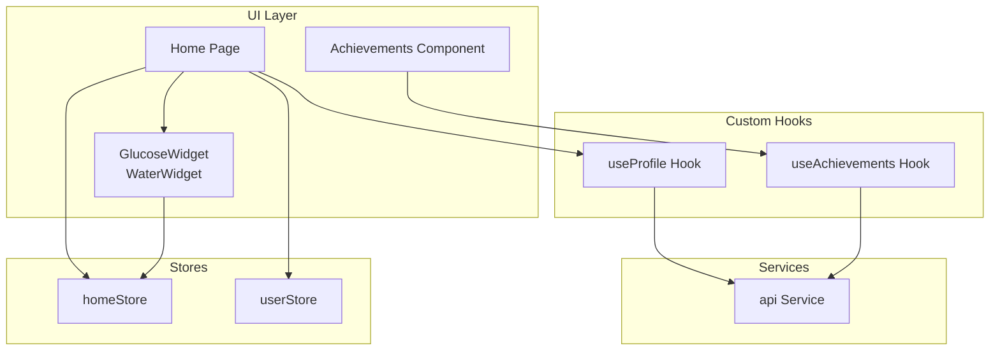
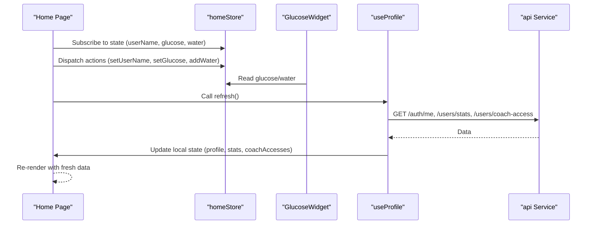
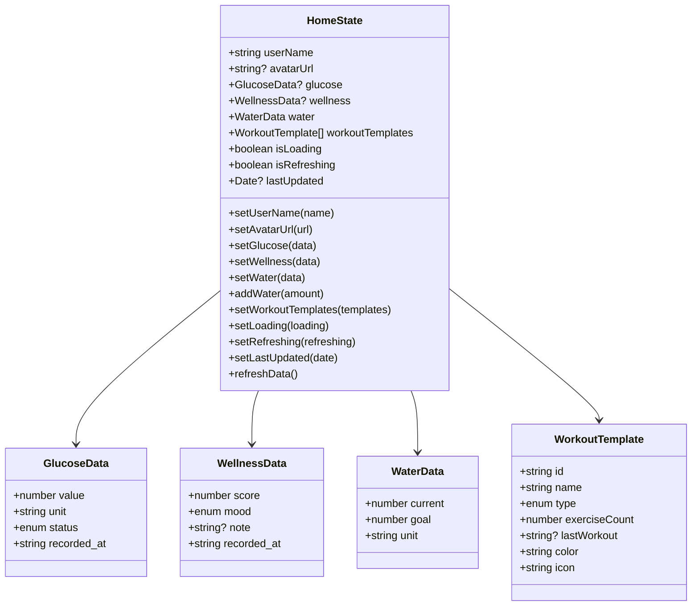
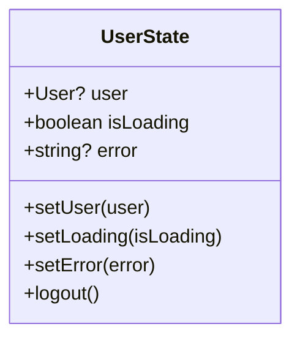
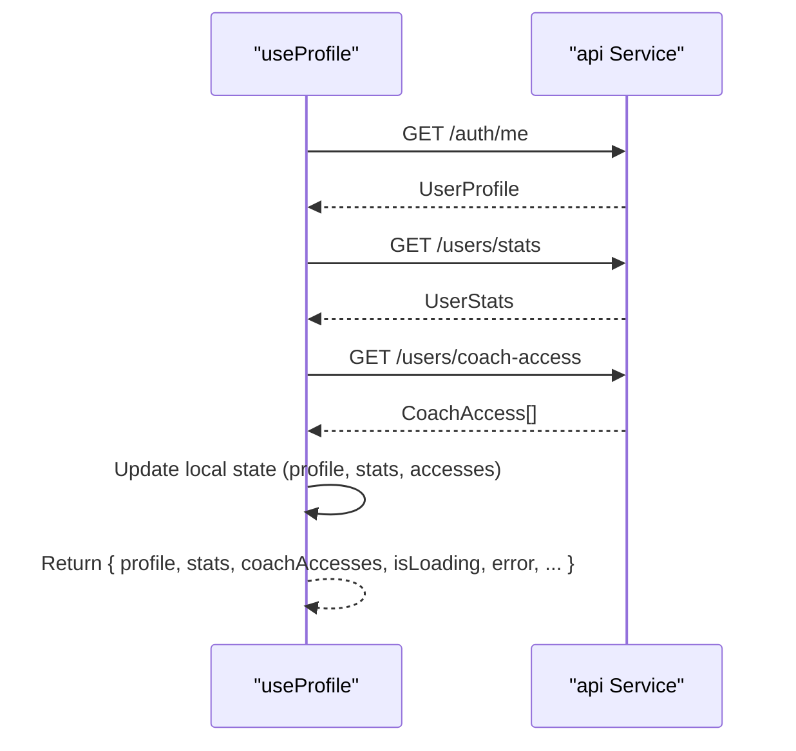
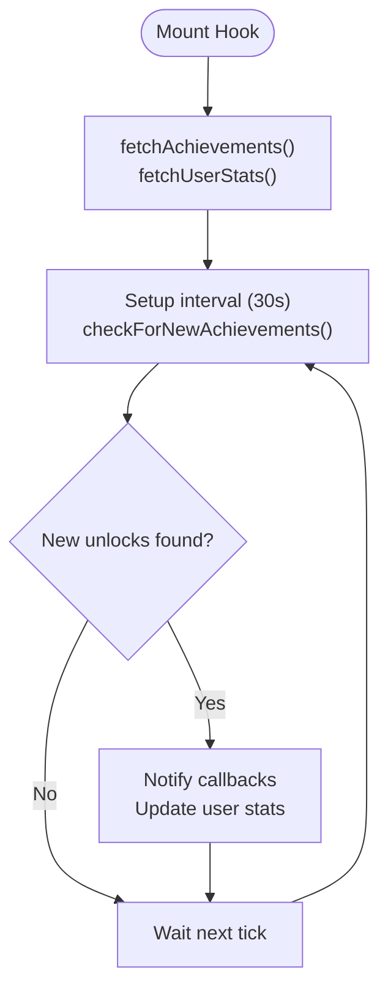
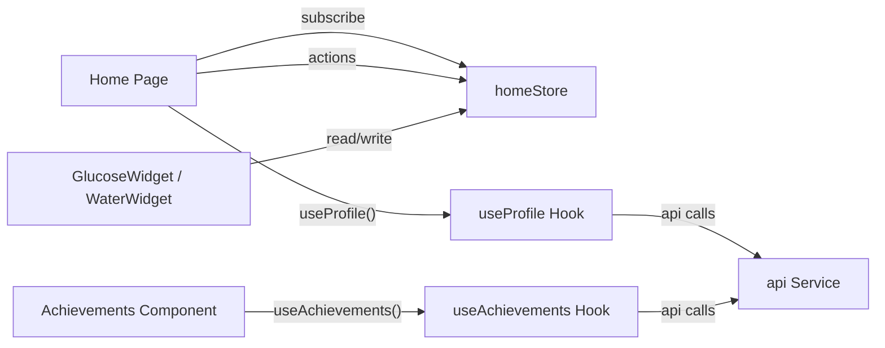
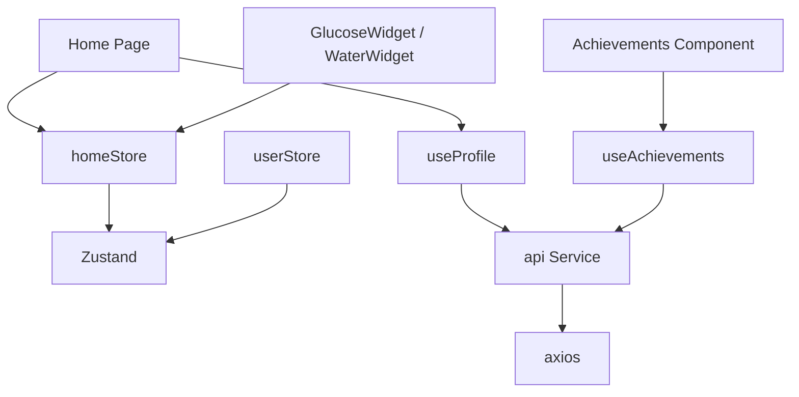

# State Management

<cite>
**Referenced Files in This Document**
- [homeStore.ts](file://frontend/src/stores/homeStore.ts)
- [userStore.ts](file://frontend/src/stores/userStore.ts)
- [useProfile.ts](file://frontend/src/hooks/useProfile.ts)
- [useAchievements.ts](file://frontend/src/hooks/useAchievements.ts)
- [api.ts](file://frontend/src/services/api.ts)
- [Home.tsx](file://frontend/src/pages/Home.tsx)
- [GlucoseWidget.tsx](file://frontend/src/components/home/GlucoseWidget.tsx)
- [WaterWidget.tsx](file://frontend/src/components/home/WaterWidget.tsx)
- [Achievements.tsx](file://frontend/src/components/gamification/Achievements.tsx)
- [main.tsx](file://frontend/src/main.tsx)
- [App.tsx](file://frontend/src/App.tsx)
</cite>

## Table of Contents
1. [Introduction](#introduction)
2. [Project Structure](#project-structure)
3. [Core Components](#core-components)
4. [Architecture Overview](#architecture-overview)
5. [Detailed Component Analysis](#detailed-component-analysis)
6. [Dependency Analysis](#dependency-analysis)
7. [Performance Considerations](#performance-considerations)
8. [Troubleshooting Guide](#troubleshooting-guide)
9. [Conclusion](#conclusion)

## Introduction
This document explains the state management architecture built with Zustand stores and custom React hooks. It covers the store pattern, state structure, data flow, persistence, async loading, error handling, and performance considerations. It also documents the homeStore and userStore implementations, custom hooks useProfile and useAchievements, and how they integrate with components and pages.

## Project Structure
The state management spans three layers:
- Stores: Lightweight, typed Zustand stores with persistence for global state.
- Hooks: Custom hooks encapsulating async data fetching, local UI state, and side effects.
- Services: Shared API client with interceptors for auth and error handling.
- Pages and Components: Consumers of stores and hooks to render UI and trigger actions.

**Diagram sources**
- [Home.tsx:22-37](file://frontend/src/pages/Home.tsx#L22-L37)
- [GlucoseWidget.tsx:41-84](file://frontend/src/components/home/GlucoseWidget.tsx#L41-L84)
- [WaterWidget.tsx:11-71](file://frontend/src/components/home/WaterWidget.tsx#L11-L71)
- [useProfile.ts:128-324](file://frontend/src/hooks/useProfile.ts#L128-L324)
- [useAchievements.ts:67-275](file://frontend/src/hooks/useAchievements.ts#L67-L275)
- [api.ts:6-68](file://frontend/src/services/api.ts#L6-L68)
- [homeStore.ts:147-205](file://frontend/src/stores/homeStore.ts#L147-L205)
- [userStore.ts:15-30](file://frontend/src/stores/userStore.ts#L15-L30)

**Section sources**
- [Home.tsx:1-277](file://frontend/src/pages/Home.tsx#L1-L277)
- [homeStore.ts:1-206](file://frontend/src/stores/homeStore.ts#L1-L206)
- [userStore.ts:1-31](file://frontend/src/stores/userStore.ts#L1-L31)
- [useProfile.ts:1-327](file://frontend/src/hooks/useProfile.ts#L1-L327)
- [useAchievements.ts:1-278](file://frontend/src/hooks/useAchievements.ts#L1-L278)
- [api.ts:1-69](file://frontend/src/services/api.ts#L1-L69)

## Core Components
- homeStore: Manages user identity, health widgets, hydration, workout templates, and refresh lifecycle with persistence.
- userStore: Holds user session state and exposes logout.
- useProfile: Async profile, stats, and coach access management with optimistic updates and haptic feedback.
- useAchievements: Achievement catalog, user progress, claim/unlock notifications, and periodic polling.
- api service: Centralized HTTP client with auth token injection and error logging.

Key responsibilities:
- Stores: Define state shape, actions, and persistence policies.
- Hooks: Encapsulate side effects, manage loading/error states, and expose typed APIs.
- Service: Provide a single source of truth for network requests.

**Section sources**
- [homeStore.ts:34-64](file://frontend/src/stores/homeStore.ts#L34-L64)
- [userStore.ts:5-13](file://frontend/src/stores/userStore.ts#L5-L13)
- [useProfile.ts:62-89](file://frontend/src/hooks/useProfile.ts#L62-L89)
- [useAchievements.ts:19-44](file://frontend/src/hooks/useAchievements.ts#L19-L44)
- [api.ts:6-68](file://frontend/src/services/api.ts#L6-L68)

## Architecture Overview
The system follows a unidirectional data flow:
- Components subscribe to stores and hooks.
- Actions mutate state synchronously or trigger async flows.
- Side effects (HTTP) are isolated in hooks and service layer.
- Persistence persists selected slices of store state.

**Diagram sources**
- [Home.tsx:22-37](file://frontend/src/pages/Home.tsx#L22-L37)
- [GlucoseWidget.tsx:41-84](file://frontend/src/components/home/GlucoseWidget.tsx#L41-L84)
- [useProfile.ts:128-324](file://frontend/src/hooks/useProfile.ts#L128-L324)
- [api.ts:47-65](file://frontend/src/services/api.ts#L47-L65)
- [homeStore.ts:147-205](file://frontend/src/stores/homeStore.ts#L147-L205)

## Detailed Component Analysis

### homeStore
- Purpose: Centralize home screen state and hydration-related metrics with persistence.
- State structure:
  - Identity: userName, avatarUrl
  - Health widgets: glucose, wellness, water
  - Workouts: workoutTemplates
  - Lifecycle: isLoading, isRefreshing, lastUpdated
- Actions:
  - Setters for identity and metrics
  - addWater with goal-aware clamping
  - refreshData orchestrates async load with loading flags
- Persistence: partialize selects which fields to persist.

**Diagram sources**
- [homeStore.ts:4-32](file://frontend/src/stores/homeStore.ts#L4-L32)
- [homeStore.ts:34-64](file://frontend/src/stores/homeStore.ts#L34-L64)

**Section sources**
- [homeStore.ts:147-205](file://frontend/src/stores/homeStore.ts#L147-L205)

### userStore
- Purpose: Manage logged-in user session and logout.
- State: user, isLoading, error.
- Actions: setUser, setLoading, setError, logout.

**Diagram sources**
- [userStore.ts:5-13](file://frontend/src/stores/userStore.ts#L5-L13)

**Section sources**
- [userStore.ts:15-30](file://frontend/src/stores/userStore.ts#L15-L30)

### useProfile Hook
- Responsibilities:
  - Load profile, stats, and coach access lists.
  - Update profile/settings/weight with optimistic UI.
  - Calculate weight progress and goal date.
  - Export user data as JSON.
  - Refresh all data concurrently.
- Async patterns:
  - Uses api.get, api.put, api.post, api.delete.
  - Concurrent loading via Promise.all.
  - Haptic feedback on success.
- Error handling:
  - Sets local error messages and logs to console.
  - Throws on update failures to surface to callers.

**Diagram sources**
- [useProfile.ts:128-324](file://frontend/src/hooks/useProfile.ts#L128-L324)
- [api.ts:47-65](file://frontend/src/services/api.ts#L47-L65)

**Section sources**
- [useProfile.ts:128-324](file://frontend/src/hooks/useProfile.ts#L128-L324)

### useAchievements Hook
- Responsibilities:
  - Fetch achievements and user stats.
  - Claim achievements and notify subscribers.
  - Periodic polling for new unlocks.
  - Provide getters for achievement/user achievement.
- Async patterns:
  - Initial load via useEffect.
  - Polling every 30 seconds with cleanup.
  - Subscriptions via callback registry.
- Error handling:
  - Local error state and console logging.
  - Returns null on claim failure.

**Diagram sources**
- [useAchievements.ts:67-275](file://frontend/src/hooks/useAchievements.ts#L67-L275)

**Section sources**
- [useAchievements.ts:67-275](file://frontend/src/hooks/useAchievements.ts#L67-L275)

### Components and Pages Integration
- Home page consumes homeStore for hydration and health widgets, and integrates useProfile for initial user data.
- Widgets read from homeStore and call actions (e.g., addWater).
- Achievements component uses useAchievements hook for listing and unlocking.

**Diagram sources**
- [Home.tsx:22-37](file://frontend/src/pages/Home.tsx#L22-L37)
- [GlucoseWidget.tsx:41-84](file://frontend/src/components/home/GlucoseWidget.tsx#L41-L84)
- [WaterWidget.tsx:11-71](file://frontend/src/components/home/WaterWidget.tsx#L11-L71)
- [useProfile.ts:128-324](file://frontend/src/hooks/useProfile.ts#L128-L324)
- [useAchievements.ts:67-275](file://frontend/src/hooks/useAchievements.ts#L67-L275)
- [api.ts:47-65](file://frontend/src/services/api.ts#L47-L65)

**Section sources**
- [Home.tsx:22-37](file://frontend/src/pages/Home.tsx#L22-L37)
- [GlucoseWidget.tsx:41-84](file://frontend/src/components/home/GlucoseWidget.tsx#L41-L84)
- [WaterWidget.tsx:11-71](file://frontend/src/components/home/WaterWidget.tsx#L11-L71)
- [useProfile.ts:128-324](file://frontend/src/hooks/useProfile.ts#L128-L324)
- [useAchievements.ts:67-275](file://frontend/src/hooks/useAchievements.ts#L67-L275)

## Dependency Analysis
- Stores depend on Zustand create and persist middleware.
- Hooks depend on the api service and React lifecycle.
- Components depend on stores and hooks for rendering and interactivity.
- The api service depends on axios and environment configuration.

**Diagram sources**
- [homeStore.ts:1-2](file://frontend/src/stores/homeStore.ts#L1-L2)
- [userStore.ts:1-2](file://frontend/src/stores/userStore.ts#L1-L2)
- [useProfile.ts:8-10](file://frontend/src/hooks/useProfile.ts#L8-L10)
- [useAchievements.ts:8-10](file://frontend/src/hooks/useAchievements.ts#L8-L10)
- [api.ts:1-2](file://frontend/src/services/api.ts#L1-L2)
- [Home.tsx:1-4](file://frontend/src/pages/Home.tsx#L1-L4)
- [GlucoseWidget.tsx:1-3](file://frontend/src/components/home/GlucoseWidget.tsx#L1-L3)
- [WaterWidget.tsx:1-3](file://frontend/src/components/home/WaterWidget.tsx#L1-L3)
- [Achievements.tsx:17-18](file://frontend/src/components/gamification/Achievements.tsx#L17-L18)

**Section sources**
- [homeStore.ts:1-2](file://frontend/src/stores/homeStore.ts#L1-L2)
- [userStore.ts:1-2](file://frontend/src/stores/userStore.ts#L1-L2)
- [api.ts:1-2](file://frontend/src/services/api.ts#L1-L2)
- [Home.tsx:1-4](file://frontend/src/pages/Home.tsx#L1-L4)

## Performance Considerations
- Store granularity: Keep stores focused and small to minimize re-renders. The current stores are cohesive per domain (home, user).
- Selective subscriptions: Prefer reading only required fields from stores to avoid unnecessary re-renders.
- Persist only essential slices: homeStore persists a subset of state to reduce storage overhead.
- Asynchronous work:
  - Batch concurrent loads (useProfile’s Promise.all).
  - Debounce or throttle frequent UI interactions (e.g., pull-to-refresh).
- Memory management:
  - Clear intervals and event listeners in useEffect cleanups (useAchievements).
  - Avoid retaining large objects in local state; derive where possible.
- Caching and staleness:
  - Consider integrating a caching library (e.g., React Query) for server data. The project initializes a QueryClient provider, which can be leveraged for server-side caching and invalidation.

[No sources needed since this section provides general guidance]

## Troubleshooting Guide
Common issues and remedies:
- Authentication errors:
  - Verify Authorization header injection in api service and token presence in localStorage.
  - Inspect response interceptor logs for error payloads.
- Store state not updating:
  - Ensure actions mutate state immutably and use functional updates when deriving from previous state (e.g., addWater).
  - Confirm persistence keys match expected state slices.
- Async loading states:
  - Check isLoading flags around API calls in hooks.
  - Validate error messages and console logs for failed requests.
- Polling not stopping:
  - Confirm interval cleanup in useEffect return function (useAchievements).
- UI not reflecting changes:
  - Verify components subscribe to correct store selectors and re-render on state changes.

**Section sources**
- [api.ts:21-44](file://frontend/src/services/api.ts#L21-L44)
- [homeStore.ts:169-174](file://frontend/src/stores/homeStore.ts#L169-L174)
- [useAchievements.ts:249-259](file://frontend/src/hooks/useAchievements.ts#L249-L259)

## Conclusion
The state management architecture cleanly separates concerns:
- Stores define minimal, persistent state with clear actions.
- Hooks encapsulate async flows and local UI state.
- The api service centralizes HTTP concerns with interceptors.
This design supports scalability, maintainability, and predictable data flow across the application.