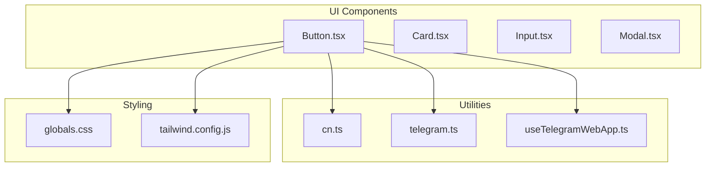
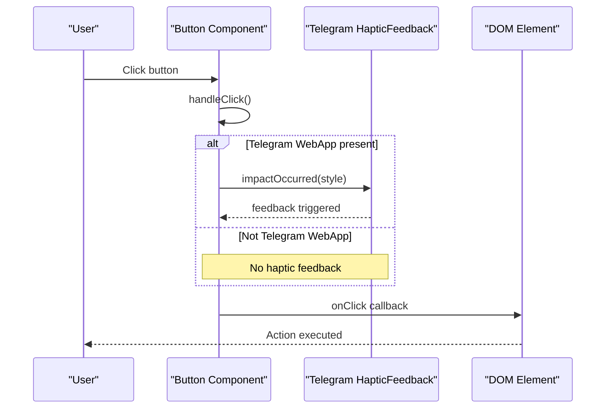
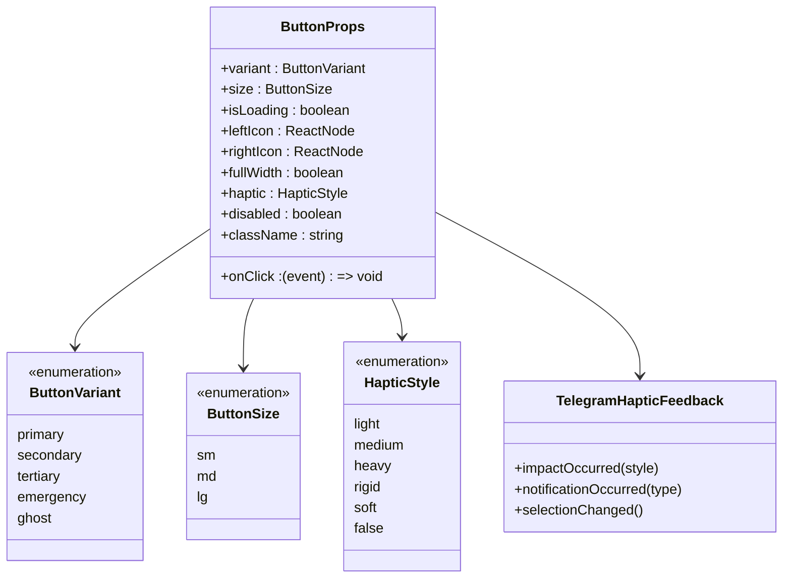
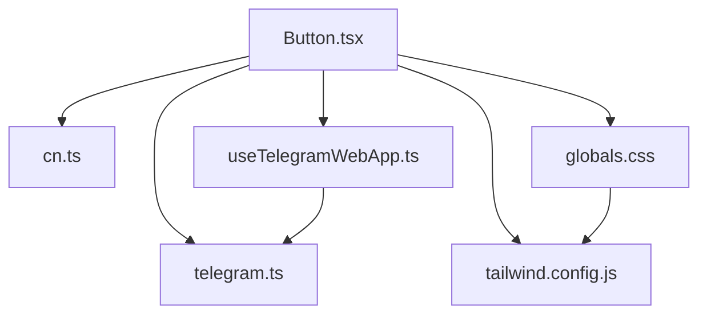

# Button Component

<cite>
**Referenced Files in This Document**
- [Button.tsx](file://frontend/src/components/ui/Button.tsx)
- [cn.ts](file://frontend/src/utils/cn.ts)
- [index.ts](file://frontend/src/components/ui/index.ts)
- [Button.test.tsx](file://frontend/src/__tests__/components/Button.test.tsx)
- [useTelegramWebApp.ts](file://frontend/src/hooks/useTelegramWebApp.ts)
- [telegram.ts](file://frontend/src/types/telegram.ts)
- [globals.css](file://frontend/src/styles/globals.css)
- [tailwind.config.js](file://frontend/tailwind.config.js)
- [WorkoutBuilder.tsx](file://frontend/src/pages/WorkoutBuilder.tsx)
</cite>

## Table of Contents
1. [Introduction](#introduction)
2. [Project Structure](#project-structure)
3. [Core Components](#core-components)
4. [Architecture Overview](#architecture-overview)
5. [Detailed Component Analysis](#detailed-component-analysis)
6. [Dependency Analysis](#dependency-analysis)
7. [Performance Considerations](#performance-considerations)
8. [Troubleshooting Guide](#troubleshooting-guide)
9. [Conclusion](#conclusion)
10. [Appendices](#appendices)

## Introduction
The Button component is a reusable, accessible, and highly configurable UI element designed for the Fit Tracker Pro application. It supports multiple visual variants, sizes, loading states, icons, full-width layout, and Telegram Mini App haptic feedback integration. Built with React and TypeScript, it leverages Tailwind CSS for styling and a utility function for merging conditional classes.

## Project Structure
The Button component resides in the UI components library alongside other shared components. It exports its TypeScript types and integrates with the broader design system and Telegram WebApp APIs.

**Diagram sources**
- [Button.tsx:1-184](file://frontend/src/components/ui/Button.tsx#L1-L184)
- [cn.ts:1-7](file://frontend/src/utils/cn.ts#L1-L7)
- [useTelegramWebApp.ts:1-508](file://frontend/src/hooks/useTelegramWebApp.ts#L1-L508)
- [telegram.ts:1-390](file://frontend/src/types/telegram.ts#L1-L390)
- [globals.css:1-581](file://frontend/src/styles/globals.css#L1-L581)
- [tailwind.config.js:1-349](file://frontend/tailwind.config.js#L1-L349)

**Section sources**
- [Button.tsx:1-184](file://frontend/src/components/ui/Button.tsx#L1-L184)
- [index.ts:1-25](file://frontend/src/components/ui/index.ts#L1-L25)

## Core Components
The Button component provides a flexible foundation for interactive actions across the application. It supports:
- Variants: primary, secondary, tertiary, emergency, ghost
- Sizes: sm, md, lg
- Loading states with spinner animation
- Left and right icons
- Full-width layout option
- Telegram Mini App haptic feedback integration
- Accessibility attributes (aria-busy, aria-disabled)

Key TypeScript definitions:
- ButtonVariant: union of supported variants
- ButtonSize: union of supported sizes
- ButtonProps: interface extending HTMLButtonElement attributes with Button-specific props

The component uses a utility function to merge Tailwind classes conditionally, ensuring clean and maintainable styling logic.

**Section sources**
- [Button.tsx:4-22](file://frontend/src/components/ui/Button.tsx#L4-L22)
- [Button.tsx:24-64](file://frontend/src/components/ui/Button.tsx#L24-L64)
- [cn.ts:1-7](file://frontend/src/utils/cn.ts#L1-L7)

## Architecture Overview
The Button component orchestrates styling, behavior, and Telegram integration through a structured flow:

**Diagram sources**
- [Button.tsx:104-113](file://frontend/src/components/ui/Button.tsx#L104-L113)
- [useTelegramWebApp.ts:199-215](file://frontend/src/hooks/useTelegramWebApp.ts#L199-L215)

## Detailed Component Analysis

### Props Interface and TypeScript Definitions
The Button component defines a comprehensive props interface that extends standard button attributes and adds UI-specific options:

- variant: selects visual appearance (primary, secondary, tertiary, emergency, ghost)
- size: controls dimensions and typography (sm, md, lg)
- isLoading: enables loading state with spinner and disables interaction
- leftIcon/rightIcon: renders SVG icons before/after text content
- fullWidth: expands button to full container width
- haptic: triggers Telegram haptic feedback ('light' | 'medium' | 'heavy' | 'rigid' | 'soft' | false)

Accessibility attributes:
- aria-busy: indicates loading state
- aria-disabled: reflects disabled or loading state

**Section sources**
- [Button.tsx:7-22](file://frontend/src/components/ui/Button.tsx#L7-L22)
- [Button.tsx:115-142](file://frontend/src/components/ui/Button.tsx#L115-L142)

### Variant Styles and Size Classes
The component applies variant and size styles using a mapping approach:

Variant styles include:
- primary: brand primary color with hover and focus states
- secondary: Telegram-compatible secondary background and text
- tertiary: transparent background with bordered outline
- emergency: danger/error palette for critical actions
- ghost: transparent background with subtle hover effect

Size styles define height, padding, text size, and icon spacing for small, medium, and large buttons.

Icon sizing adjusts proportionally with button size to maintain visual balance.

**Section sources**
- [Button.tsx:24-58](file://frontend/src/components/ui/Button.tsx#L24-L58)
- [Button.tsx:60-64](file://frontend/src/components/ui/Button.tsx#L60-L64)

### Loading State Implementation
When isLoading is true, the component:
- Disables the button (both disabled and aria-disabled)
- Replaces child content with a spinner animation and text
- Maintains the same layout structure for consistent spacing

The spinner uses a standard SVG with animated path elements to indicate asynchronous operations.

**Section sources**
- [Button.tsx:118](file://frontend/src/components/ui/Button.tsx#L118)
- [Button.tsx:144-169](file://frontend/src/components/ui/Button.tsx#L144-L169)

### Icons and Layout
The component supports optional left and right icons:
- Icons are wrapped in flex containers to prevent shrinking
- Icon sizing scales with button size using CSS selectors
- Text content uses truncation to prevent overflow in compact layouts

**Section sources**
- [Button.tsx:171-174](file://frontend/src/components/ui/Button.tsx#L171-L174)
- [Button.tsx:60-64](file://frontend/src/components/ui/Button.tsx#L60-L64)

### Full Width Behavior
When fullWidth is true, the button expands to occupy the full width of its container, enabling consistent alignment in forms and modals.

**Section sources**
- [Button.tsx:136](file://frontend/src/components/ui/Button.tsx#L136)

### Telegram Mini App Haptic Feedback
The component integrates with Telegram WebApp's HapticFeedback API:
- Checks for Telegram WebApp availability before triggering feedback
- Supports impactOccurred with predefined styles
- Uses a default 'light' haptic style when enabled

The hook-based approach in useTelegramWebApp demonstrates a more comprehensive integration pattern for advanced haptic scenarios.

**Section sources**
- [Button.tsx:106-111](file://frontend/src/components/ui/Button.tsx#L106-L111)
- [useTelegramWebApp.ts:199-215](file://frontend/src/hooks/useTelegramWebApp.ts#L199-L215)
- [telegram.ts:123-130](file://frontend/src/types/telegram.ts#L123-L130)

### Styling System and Tailwind Integration
The component relies on:
- cn utility function for merging conditional Tailwind classes
- Tailwind design tokens for colors, shadows, and transitions
- CSS variables for Telegram theme integration
- Global component classes for consistent button behavior

The design system extends Tailwind with custom colors, shadows, and animations tailored to the application's needs.

**Section sources**
- [cn.ts:1-7](file://frontend/src/utils/cn.ts#L1-L7)
- [tailwind.config.js:13-150](file://frontend/tailwind.config.js#L13-L150)
- [globals.css:88-118](file://frontend/src/styles/globals.css#L88-L118)

### Usage Patterns and Examples
Practical usage patterns demonstrated in the codebase include:
- Basic primary button with text content
- Secondary button with left icon for add actions
- Loading state for async operations
- Emergency variant for destructive actions
- Full-width buttons in modal layouts
- Small secondary buttons for navigation actions

These examples illustrate common patterns for different contexts within the application.

**Section sources**
- [Button.tsx:69-84](file://frontend/src/components/ui/Button.tsx#L69-L84)
- [WorkoutBuilder.tsx:936-939](file://frontend/src/pages/WorkoutBuilder.tsx#L936-L939)
- [WorkoutBuilder.tsx:1037-1039](file://frontend/src/pages/WorkoutBuilder.tsx#L1037-L1039)

### Accessibility Features
The component implements several accessibility best practices:
- Proper disabled state handling with aria-disabled
- Busy state indication with aria-busy
- Focus-visible outlines for keyboard navigation
- Semantic button semantics with role="button"
- Truncated text to prevent overflow issues

**Section sources**
- [Button.tsx:140-141](file://frontend/src/components/ui/Button.tsx#L140-L141)

## Architecture Overview

**Diagram sources**
- [Button.tsx:4-22](file://frontend/src/components/ui/Button.tsx#L4-L22)
- [telegram.ts:123-130](file://frontend/src/types/telegram.ts#L123-L130)

## Detailed Component Analysis

### Component Composition and Rendering
The Button component composes multiple rendering strategies:
- Conditional rendering for loading vs. normal state
- Dynamic class composition using cn utility
- Icon placement with consistent spacing
- Responsive sizing across breakpoints

The component maintains a clean separation between styling logic and behavioral logic.

**Section sources**
- [Button.tsx:115-178](file://frontend/src/components/ui/Button.tsx#L115-L178)

### Testing Strategy
The component includes comprehensive tests covering:
- Basic rendering with text content
- Click event handling
- Loading state behavior
- Variant-specific styling
- Disabled state behavior

These tests ensure reliable behavior across different configurations.

**Section sources**
- [Button.test.tsx:1-44](file://frontend/src/__tests__/components/Button.test.tsx#L1-L44)

### Export and Integration
The Button component is exported from the UI module index, making it available throughout the application. This pattern promotes consistent usage and reduces import complexity.

**Section sources**
- [index.ts:5-6](file://frontend/src/components/ui/index.ts#L5-L6)

## Dependency Analysis

**Diagram sources**
- [Button.tsx:1-2](file://frontend/src/components/ui/Button.tsx#L1-L2)
- [cn.ts:1-7](file://frontend/src/utils/cn.ts#L1-L7)
- [useTelegramWebApp.ts:6-12](file://frontend/src/hooks/useTelegramWebApp.ts#L6-L12)
- [telegram.ts:6-12](file://frontend/src/types/telegram.ts#L6-L12)
- [globals.css:1-3](file://frontend/src/styles/globals.css#L1-L3)
- [tailwind.config.js:1-2](file://frontend/tailwind.config.js#L1-L2)

**Section sources**
- [Button.tsx:1-2](file://frontend/src/components/ui/Button.tsx#L1-L2)
- [useTelegramWebApp.ts:6-12](file://frontend/src/hooks/useTelegramWebApp.ts#L6-L12)
- [telegram.ts:6-12](file://frontend/src/types/telegram.ts#L6-L12)

## Performance Considerations
- Class merging: The cn utility efficiently merges conditional classes without redundant computations
- Icon scaling: CSS selectors ensure consistent icon sizing without runtime calculations
- Loading state: Spinner animation uses pure CSS transforms for smooth performance
- Telegram integration: Conditional checks prevent unnecessary API calls when not in Telegram WebApp

## Troubleshooting Guide
Common issues and resolutions:
- Haptic feedback not triggering: Verify Telegram WebApp availability and HapticFeedback support
- Loading state not disabling: Ensure isLoading prop is properly managed and not overridden by external logic
- Icon sizing inconsistencies: Confirm size prop matches intended icon scale
- Telegram theme conflicts: Check CSS variable precedence and theme mode (light/dark)

**Section sources**
- [Button.tsx:106-111](file://frontend/src/components/ui/Button.tsx#L106-L111)
- [globals.css:88-118](file://frontend/src/styles/globals.css#L88-L118)

## Conclusion
The Button component provides a robust, accessible, and extensible foundation for interactive elements in the Fit Tracker Pro application. Its comprehensive variant system, size options, loading states, and Telegram integration make it suitable for diverse use cases while maintaining consistency with the overall design system.

## Appendices

### Practical Usage Examples
Examples of Button configurations commonly used in the application:
- Primary action buttons for main workflows
- Secondary buttons for auxiliary actions with icons
- Emergency buttons for destructive operations
- Loading buttons during async operations
- Full-width buttons in modal dialogs
- Small navigation buttons for quick actions

**Section sources**
- [Button.tsx:69-84](file://frontend/src/components/ui/Button.tsx#L69-L84)
- [WorkoutBuilder.tsx:936-939](file://frontend/src/pages/WorkoutBuilder.tsx#L936-L939)
- [WorkoutBuilder.tsx:1037-1039](file://frontend/src/pages/WorkoutBuilder.tsx#L1037-L1039)