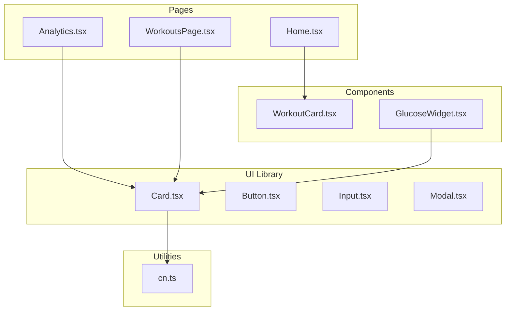
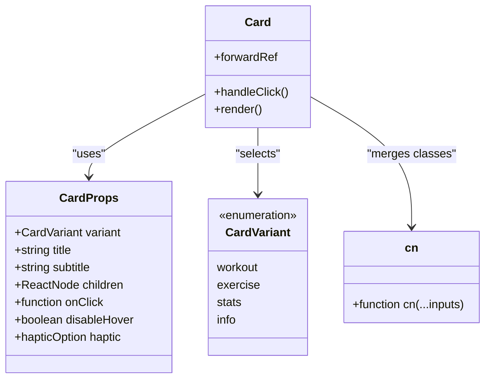
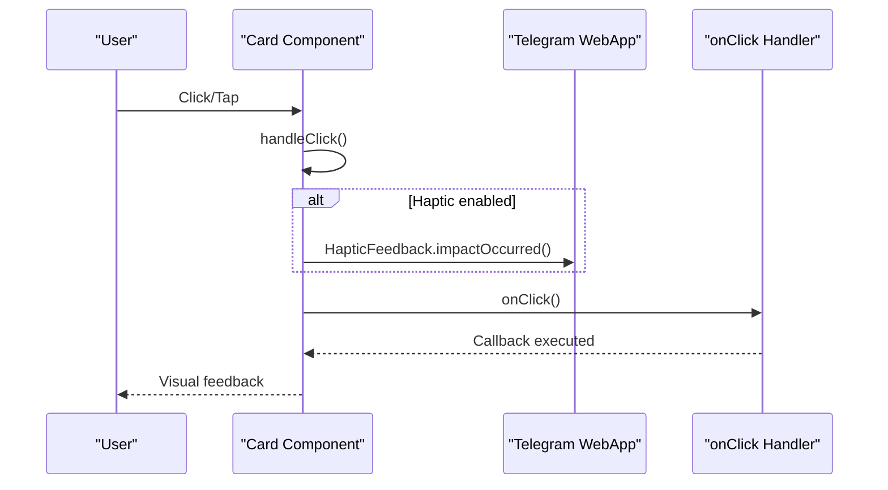
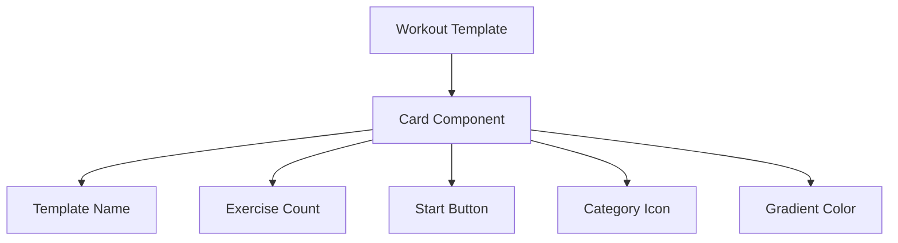
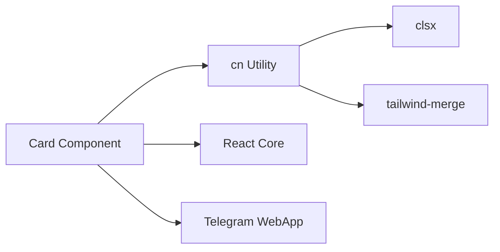

# Card Component

<cite>
**Referenced Files in This Document**
- [Card.tsx](file://frontend/src/components/ui/Card.tsx)
- [index.ts](file://frontend/src/components/ui/index.ts)
- [cn.ts](file://frontend/src/utils/cn.ts)
- [DESIGN_SYSTEM.md](file://frontend/DESIGN_SYSTEM.md)
- [Home.tsx](file://frontend/src/pages/Home.tsx)
- [WorkoutCard.tsx](file://frontend/src/components/home/WorkoutCard.tsx)
- [Analytics.tsx](file://frontend/src/pages/Analytics.tsx)
- [OneRMCalculator.tsx](file://frontend/src/components/analytics/OneRMCalculator.tsx)
</cite>

## Table of Contents
1. [Introduction](#introduction)
2. [Project Structure](#project-structure)
3. [Core Components](#core-components)
4. [Architecture Overview](#architecture-overview)
5. [Detailed Component Analysis](#detailed-component-analysis)
6. [Dependency Analysis](#dependency-analysis)
7. [Performance Considerations](#performance-considerations)
8. [Troubleshooting Guide](#troubleshooting-guide)
9. [Conclusion](#conclusion)

## Introduction
The Card component is a foundational UI element in FitTracker Pro designed to present structured content with consistent styling and interactive behavior. It supports multiple variants optimized for different use cases: workout templates, exercise entries, statistics displays, and general informational content. The component integrates seamlessly with the application's design system, leveraging Telegram Mini App theming, Tailwind CSS utilities, and haptic feedback for mobile interactions.

## Project Structure
The Card component resides in the UI library alongside other atomic components. It is exported through the UI index for centralized access and is consumed across various pages and widgets throughout the application.

**Diagram sources**
- [Card.tsx:1-175](file://frontend/src/components/ui/Card.tsx#L1-L175)
- [index.ts:1-25](file://frontend/src/components/ui/index.ts#L1-L25)
- [cn.ts:1-7](file://frontend/src/utils/cn.ts#L1-L7)
- [Home.tsx:1-277](file://frontend/src/pages/Home.tsx#L1-L277)
- [WorkoutCard.tsx:1-100](file://frontend/src/components/home/WorkoutCard.tsx#L1-L100)
- [Analytics.tsx:1-200](file://frontend/src/pages/Analytics.tsx#L1-L200)
- [OneRMCalculator.tsx:1-200](file://frontend/src/components/analytics/OneRMCalculator.tsx#L1-L200)

**Section sources**
- [Card.tsx:1-175](file://frontend/src/components/ui/Card.tsx#L1-L175)
- [index.ts:1-25](file://frontend/src/components/ui/index.ts#L1-L25)

## Core Components
The Card component provides a flexible foundation for displaying content with consistent spacing, typography, and interactive states. It supports four distinct variants, each tailored to specific contexts within the application.

### Props Interface
The component accepts a comprehensive set of props enabling customization and interaction:

- **variant**: Selects the visual style (workout, exercise, stats, info)
- **title**: Primary heading text
- **subtitle**: Secondary descriptive text
- **children**: Content to render inside the card
- **onClick**: Handler for click/tap events
- **disableHover**: Disables interactive hover effects
- **haptic**: Configures haptic feedback intensity

### Variant Styles and Behavior
Each variant defines specific styling, padding, and interaction characteristics:

- **Workout cards**: Lightweight secondary background with subtle shadows, optimized for template previews
- **Exercise cards**: Standard background with bordered frame, suitable for exercise entries
- **Stats cards**: Gradient primary background with white text, designed for key metrics display
- **Info cards**: Standard background with borders and light shadows, ideal for general content

**Section sources**
- [Card.tsx:4-50](file://frontend/src/components/ui/Card.tsx#L4-L50)
- [Card.tsx:71-170](file://frontend/src/components/ui/Card.tsx#L71-L170)

## Architecture Overview
The Card component integrates with the broader design system through shared utilities and theming. It leverages the cn utility for class merging and follows Telegram Mini App design guidelines for consistent appearance across platforms.

**Diagram sources**
- [Card.tsx:6-21](file://frontend/src/components/ui/Card.tsx#L6-L21)
- [Card.tsx:71-170](file://frontend/src/components/ui/Card.tsx#L71-L170)
- [cn.ts:4-6](file://frontend/src/utils/cn.ts#L4-L6)

## Detailed Component Analysis

### Interactive Behavior and Accessibility
The component implements comprehensive interactive features including keyboard navigation support, role assignment for clickable elements, and haptic feedback integration for Telegram Mini App environments.

**Diagram sources**
- [Card.tsx:86-95](file://frontend/src/components/ui/Card.tsx#L86-L95)

### Usage Patterns Across FitTracker Pro

#### Workout Template Cards
Workout templates utilize the Card component to present training options with contextual metadata and action buttons. The component integrates with the home page's workout template system to display available routines.

**Diagram sources**
- [Home.tsx:224-234](file://frontend/src/pages/Home.tsx#L224-L234)
- [WorkoutCard.tsx:27-99](file://frontend/src/components/home/WorkoutCard.tsx#L27-L99)

#### Health Metrics Display
Health metrics leverage the Card component for presenting quantitative data with appropriate visual hierarchy and styling. The component adapts its appearance based on the metric type and current values.

#### Achievement Cards
Achievement displays use the Card component pattern to present badges and progress indicators with gradient backgrounds and interactive states.

**Section sources**
- [Home.tsx:224-234](file://frontend/src/pages/Home.tsx#L224-L234)
- [WorkoutCard.tsx:27-99](file://frontend/src/components/home/WorkoutCard.tsx#L27-L99)
- [Analytics.tsx:415-445](file://frontend/src/pages/Analytics.tsx#L415-L445)
- [OneRMCalculator.tsx:130-153](file://frontend/src/components/analytics/OneRMCalculator.tsx#L130-L153)

### Design System Integration
The Card component aligns with FitTracker Pro's design system through consistent use of:
- Telegram Mini App themed colors and backgrounds
- Tailwind CSS utility classes for responsive layouts
- Haptic feedback integration for mobile interactions
- Consistent spacing and typography scales

**Section sources**
- [DESIGN_SYSTEM.md:215-270](file://frontend/DESIGN_SYSTEM.md#L215-L270)
- [Card.tsx:23-50](file://frontend/src/components/ui/Card.tsx#L23-L50)

## Dependency Analysis
The Card component maintains loose coupling with external dependencies while providing strong internal cohesion. Its primary dependencies include the cn utility for class merging and React's forwardRef for proper DOM access.

**Diagram sources**
- [Card.tsx:1-2](file://frontend/src/components/ui/Card.tsx#L1-L2)
- [cn.ts:1-7](file://frontend/src/utils/cn.ts#L1-L7)

**Section sources**
- [Card.tsx:1-2](file://frontend/src/components/ui/Card.tsx#L1-L2)
- [cn.ts:1-7](file://frontend/src/utils/cn.ts#L1-L7)

## Performance Considerations
The Card component is optimized for performance through:
- Minimal re-renders via forwardRef implementation
- Efficient class merging using the cn utility
- Conditional rendering of optional elements (title, subtitle)
- CSS-based animations and transitions
- Mobile-first haptic feedback implementation

## Troubleshooting Guide
Common issues and solutions when working with the Card component:

### Haptic Feedback Not Working
- Verify Telegram WebApp environment availability
- Check haptic prop configuration ('light' | 'medium' | 'heavy' | false)
- Ensure component is mounted in Telegram Mini App context

### Styling Issues
- Confirm variant prop matches available options
- Verify Tailwind CSS configuration includes required utilities
- Check for conflicting class names in className prop

### Interactive State Problems
- Ensure onClick handler is properly passed
- Verify role and tabIndex attributes for accessibility
- Check disableHover prop if interactive states are unexpectedly disabled

**Section sources**
- [Card.tsx:86-136](file://frontend/src/components/ui/Card.tsx#L86-L136)

## Conclusion
The Card component serves as a cornerstone of FitTracker Pro's UI system, providing consistent, accessible, and visually appealing content presentation across diverse application contexts. Its modular design, comprehensive variant system, and seamless integration with the design system make it an essential building block for maintaining visual consistency and user experience quality throughout the application.