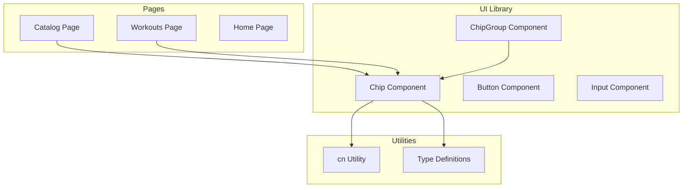
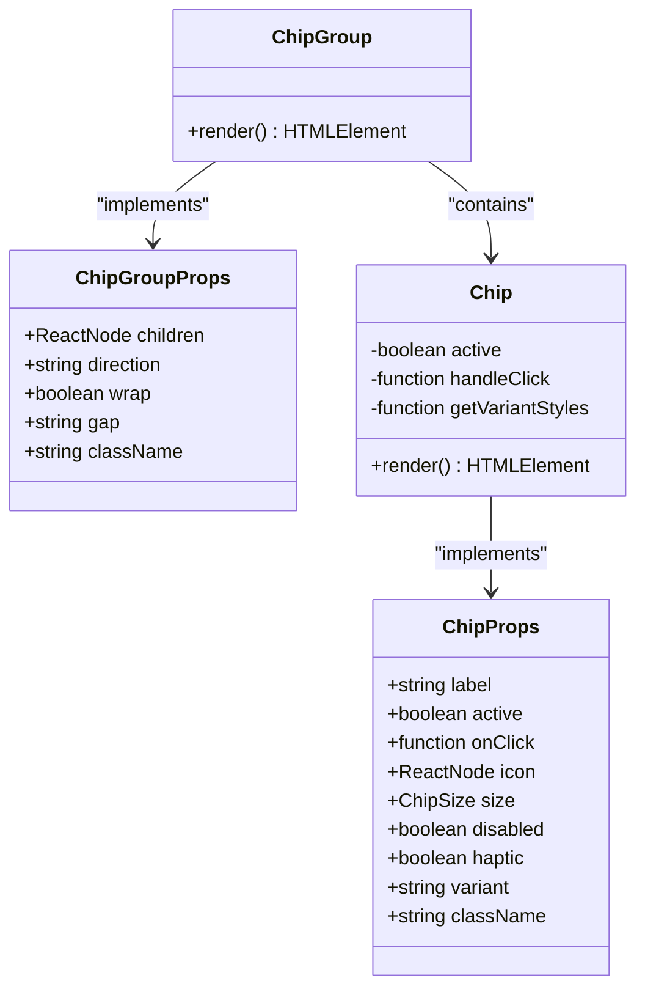
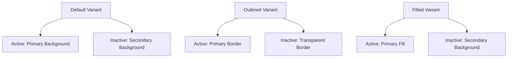
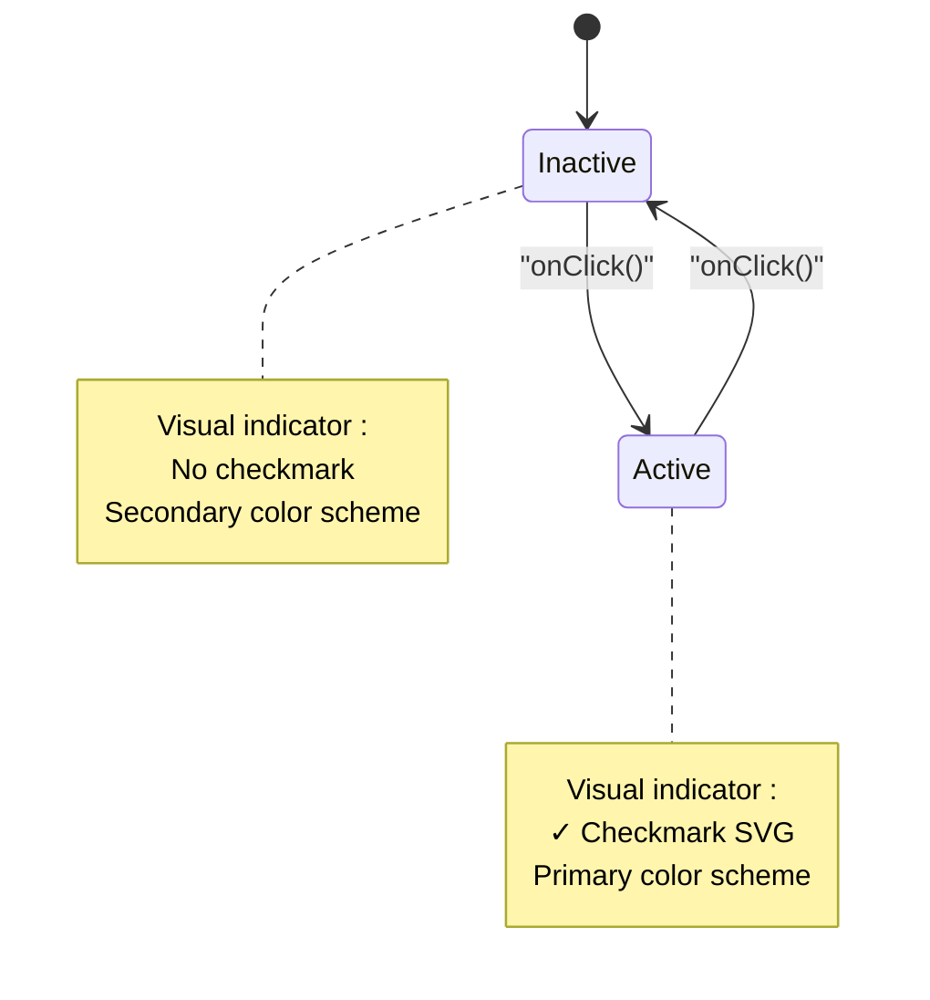
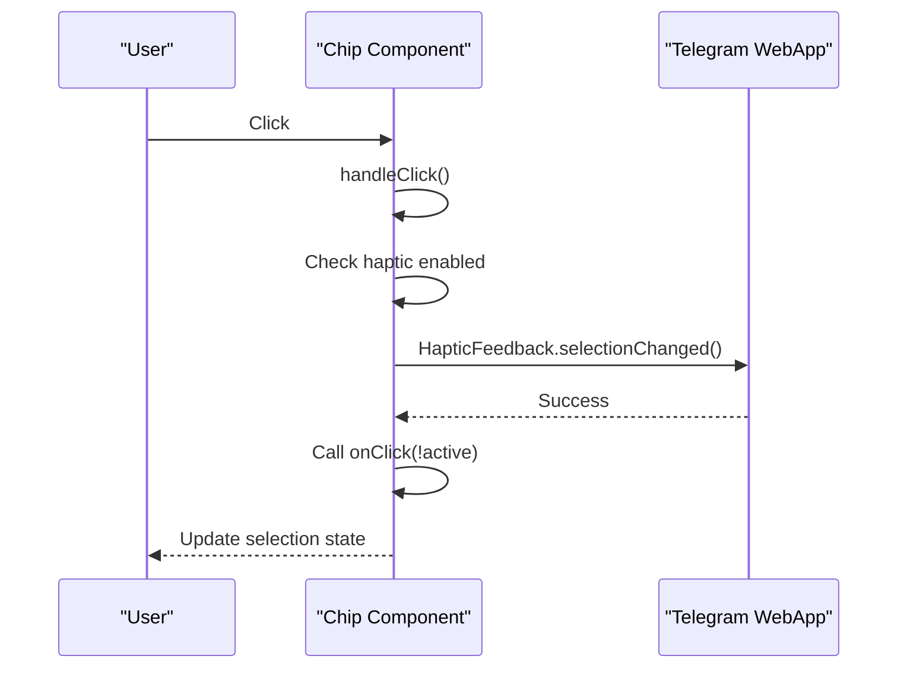
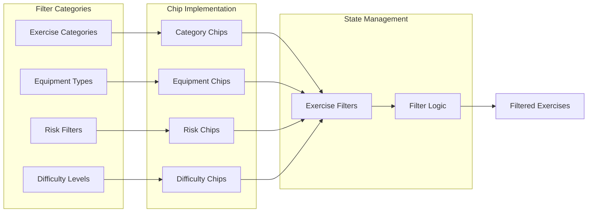
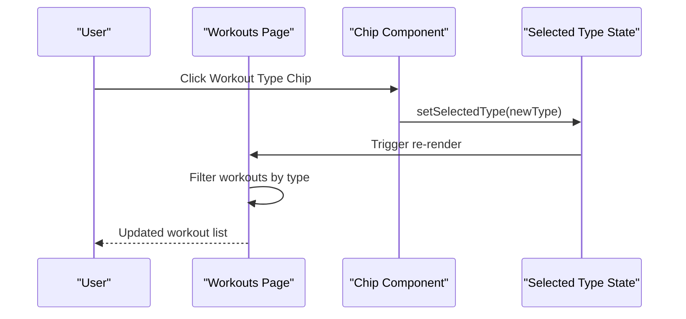
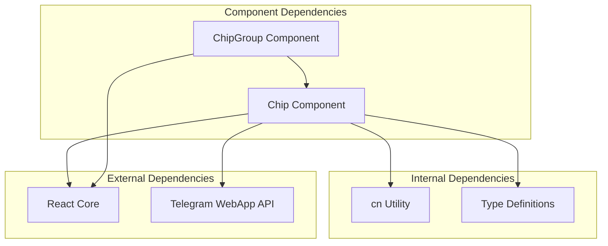

# Chip Component

<cite>
**Referenced Files in This Document**
- [Chip.tsx](file://frontend/src/components/ui/Chip.tsx)
- [index.ts](file://frontend/src/components/ui/index.ts)
- [Catalog.tsx](file://frontend/src/pages/Catalog.tsx)
- [WorkoutsPage.tsx](file://frontend/src/pages/WorkoutsPage.tsx)
- [index.ts](file://frontend/src/types/index.ts)
- [cn.ts](file://frontend/src/utils/cn.ts)
</cite>

## Table of Contents
1. [Introduction](#introduction)
2. [Project Structure](#project-structure)
3. [Core Components](#core-components)
4. [Architecture Overview](#architecture-overview)
5. [Detailed Component Analysis](#detailed-component-analysis)
6. [Dependency Analysis](#dependency-analysis)
7. [Performance Considerations](#performance-considerations)
8. [Troubleshooting Guide](#troubleshooting-guide)
9. [Conclusion](#conclusion)

## Introduction
The Chip component is a versatile UI element designed for filtering, tagging, and selection within the Fit Tracker Pro application. It serves as a lightweight, interactive button that communicates selection state through visual indicators and supports multiple interaction patterns including single selection, multi-selection, and haptic feedback integration for Telegram WebApp environments.

The component integrates seamlessly with the application's filtering systems, enabling users to refine exercise catalogs, manage workout preferences, and organize content through intuitive chip-based interactions.

## Project Structure
The Chip component is part of the shared UI library located in the frontend components directory. It follows a modular architecture that promotes reusability across different pages and contexts within the application.



**Diagram sources**
- [Chip.tsx:1-229](file://frontend/src/components/ui/Chip.tsx#L1-L229)
- [index.ts:1-25](file://frontend/src/components/ui/index.ts#L1-L25)

**Section sources**
- [Chip.tsx:1-229](file://frontend/src/components/ui/Chip.tsx#L1-L229)
- [index.ts:1-25](file://frontend/src/components/ui/index.ts#L1-L25)

## Core Components
The Chip component consists of two primary exports: the main Chip component and the ChipGroup wrapper for multi-select scenarios.

### Chip Component
The Chip component is a forwardRef-enabled button that provides visual feedback for selection states and supports various interaction patterns.

### ChipGroup Component
The ChipGroup component serves as a container for multiple Chip instances, providing layout control and accessibility support for grouped selections.

**Section sources**
- [Chip.tsx:65-167](file://frontend/src/components/ui/Chip.tsx#L65-L167)
- [Chip.tsx:175-226](file://frontend/src/components/ui/Chip.tsx#L175-L226)

## Architecture Overview
The Chip component architecture demonstrates a clean separation of concerns with distinct responsibilities for styling, interaction, and accessibility.



**Diagram sources**
- [Chip.tsx:6-23](file://frontend/src/components/ui/Chip.tsx#L6-L23)
- [Chip.tsx:175-186](file://frontend/src/components/ui/Chip.tsx#L175-L186)

The component architecture supports three distinct interaction patterns:
- Single selection mode for mutually exclusive choices
- Multi-selection mode for independent toggles
- Hybrid mode combining both approaches

**Section sources**
- [Chip.tsx:65-167](file://frontend/src/components/ui/Chip.tsx#L65-L167)
- [Chip.tsx:175-226](file://frontend/src/components/ui/Chip.tsx#L175-L226)

## Detailed Component Analysis

### Props Interface and Variants
The Chip component exposes a comprehensive props interface supporting multiple interaction modes and visual variants.

#### Core Props
- **label**: Required text content displayed within the chip
- **active**: Boolean state indicating selection status
- **onClick**: Handler receiving the new active state on click
- **size**: Dimension control ('sm' | 'md')
- **variant**: Visual style ('default' | 'outlined' | 'filled')
- **disabled**: Interactive state control
- **haptic**: Telegram WebApp haptic feedback integration
- **icon**: Optional leading icon node

#### Variant Styles
The component supports three visual variants with distinct active/inactive state styling:



**Diagram sources**
- [Chip.tsx:92-109](file://frontend/src/components/ui/Chip.tsx#L92-L109)

#### Size Variations
Two size options provide flexibility for different contexts:
- **sm**: Compact form for dense layouts and mobile interfaces
- **md**: Standard size for primary interactions and desktop interfaces

**Section sources**
- [Chip.tsx:4-23](file://frontend/src/components/ui/Chip.tsx#L4-L23)
- [Chip.tsx:25-33](file://frontend/src/components/ui/Chip.tsx#L25-L33)

### Interactive Behavior Patterns
The Chip component implements sophisticated interaction patterns supporting both single and multi-selection scenarios.

#### Selection State Management


**Diagram sources**
- [Chip.tsx:81-90](file://frontend/src/components/ui/Chip.tsx#L81-L90)

#### Haptic Feedback Integration
The component includes Telegram WebApp haptic feedback support for enhanced user experience:



**Diagram sources**
- [Chip.tsx:81-90](file://frontend/src/components/ui/Chip.tsx#L81-L90)

**Section sources**
- [Chip.tsx:81-90](file://frontend/src/components/ui/Chip.tsx#L81-L90)

### Event Handling and Accessibility
The component provides robust event handling with proper accessibility attributes:

- **aria-pressed**: Communicates selection state to assistive technologies
- **disabled state**: Properly handles disabled interactions
- **Keyboard navigation**: Inherits standard button keyboard behavior
- **Focus management**: Maintains focus ring for accessibility

**Section sources**
- [Chip.tsx:136-137](file://frontend/src/components/ui/Chip.tsx#L136-L137)

### Usage in Application Filtering Systems

#### Exercise Catalog Filtering
The Chip component serves as the primary filtering mechanism in the exercise catalog:



**Diagram sources**
- [Catalog.tsx:1068-1082](file://frontend/src/pages/Catalog.tsx#L1068-L1082)
- [Catalog.tsx:1200-1249](file://frontend/src/pages/Catalog.tsx#L1200-L1249)

#### Workout Type Navigation
The component also supports workout type filtering in the workouts page:



**Diagram sources**
- [WorkoutsPage.tsx:38-80](file://frontend/src/pages/WorkoutsPage.tsx#L38-L80)

**Section sources**
- [Catalog.tsx:1068-1082](file://frontend/src/pages/Catalog.tsx#L1068-L1082)
- [Catalog.tsx:1200-1249](file://frontend/src/pages/Catalog.tsx#L1200-L1249)
- [WorkoutsPage.tsx:38-80](file://frontend/src/pages/WorkoutsPage.tsx#L38-L80)

### Examples of Chip Usage Patterns

#### Filter Implementation Example
The component demonstrates effective filter implementation patterns:

```typescript
// Category filter chips
{CATEGORIES.map(category => (
    <Chip
        key={category.id}
        label={`${category.icon} ${category.label}`}
        active={filters.categories.includes(category.id)}
        onClick={() => handleCategoryToggle(category.id)}
        size="sm"
        variant="filled"
    />
))}
```

#### Multi-Select Pattern
The component supports multi-select scenarios through individual chip state management:

```typescript
// Equipment filter chips
{EQUIPMENT_OPTIONS.map(option => (
    <Chip
        key={option.id}
        label={option.label}
        active={filters.equipment.includes(option.id)}
        onClick={() => handleEquipmentToggle(option.id)}
        size="sm"
    />
))}
```

**Section sources**
- [Catalog.tsx:1071-1080](file://frontend/src/pages/Catalog.tsx#L1071-L1080)
- [Catalog.tsx:1202-1210](file://frontend/src/pages/Catalog.tsx#L1202-L1210)

## Dependency Analysis
The Chip component maintains loose coupling with external dependencies while providing comprehensive functionality.



**Diagram sources**
- [Chip.tsx:1-2](file://frontend/src/components/ui/Chip.tsx#L1-L2)
- [cn.ts:1-7](file://frontend/src/utils/cn.ts#L1-L7)

### Internal Dependencies
- **cn utility**: Provides Tailwind CSS class merging functionality
- **Type definitions**: Defines TypeScript interfaces for props and variants

### External Dependencies
- **React**: ForwardRef implementation and state management
- **Telegram WebApp API**: Haptic feedback integration for Telegram environments

**Section sources**
- [Chip.tsx:1-2](file://frontend/src/components/ui/Chip.tsx#L1-L2)
- [cn.ts:1-7](file://frontend/src/utils/cn.ts#L1-L7)

## Performance Considerations
The Chip component is optimized for performance through several design decisions:

### Rendering Optimization
- **ForwardRef**: Eliminates unnecessary wrapper components
- **Memoization-friendly**: Stateless component design enables efficient re-rendering
- **Minimal DOM**: Single button element with conditional child rendering

### Memory Efficiency
- **Style composition**: Dynamic style calculation reduces CSS bundle size
- **Conditional rendering**: Icon and checkmark rendering only when needed
- **Event delegation**: Efficient event handling through single click handler

### Accessibility Performance
- **ARIA attributes**: Built-in accessibility support without additional overhead
- **Keyboard navigation**: Native button semantics for screen reader compatibility

## Troubleshooting Guide

### Common Issues and Solutions

#### Haptic Feedback Not Working
**Problem**: Haptic feedback fails in non-Telegram environments
**Solution**: The component automatically detects Telegram WebApp availability and gracefully falls back to standard click behavior

#### Selection State Synchronization
**Problem**: Chip state appears inconsistent with parent component state
**Solution**: Ensure the onClick handler properly updates the parent state and passes the correct active state to the Chip component

#### Visual State Conflicts
**Problem**: Chip displays incorrect visual state despite correct logical state
**Solution**: Verify that the active prop accurately reflects the intended selection state and that variant styling matches the expected visual pattern

#### Responsive Layout Issues
**Problem**: Chips overlap or overflow in constrained spaces
**Solution**: Use the ChipGroup component with appropriate wrap and gap settings for responsive layouts

**Section sources**
- [Chip.tsx:81-90](file://frontend/src/components/ui/Chip.tsx#L81-L90)
- [Chip.tsx:204-226](file://frontend/src/components/ui/Chip.tsx#L204-L226)

## Conclusion
The Chip component represents a well-designed, flexible UI element that effectively serves multiple roles within the Fit Tracker Pro application. Its comprehensive props interface, robust interaction patterns, and seamless integration with the application's filtering systems demonstrate thoughtful architecture and implementation.

The component successfully balances simplicity with functionality, providing developers with a reliable foundation for building interactive filtering interfaces while maintaining consistency with the overall design language. Its support for multiple variants, sizes, and interaction patterns ensures adaptability across diverse use cases within the fitness tracking application ecosystem.

Through careful attention to accessibility, performance, and user experience, the Chip component contributes significantly to the application's usability and maintainability, serving as an excellent example of modern React component design principles.