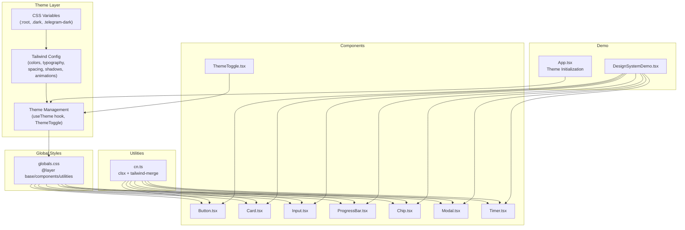
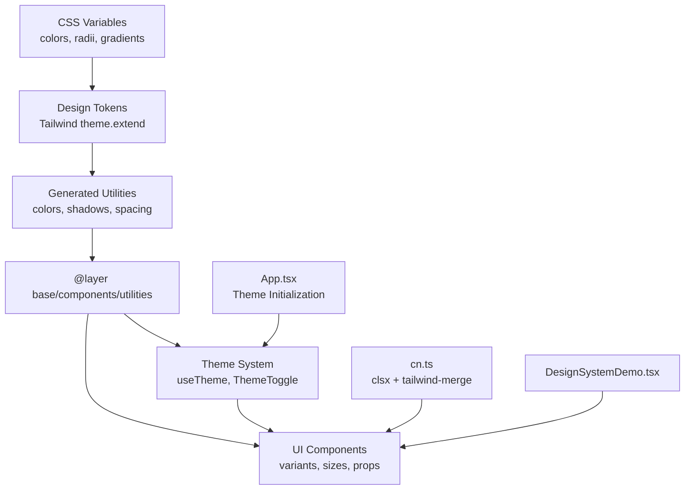
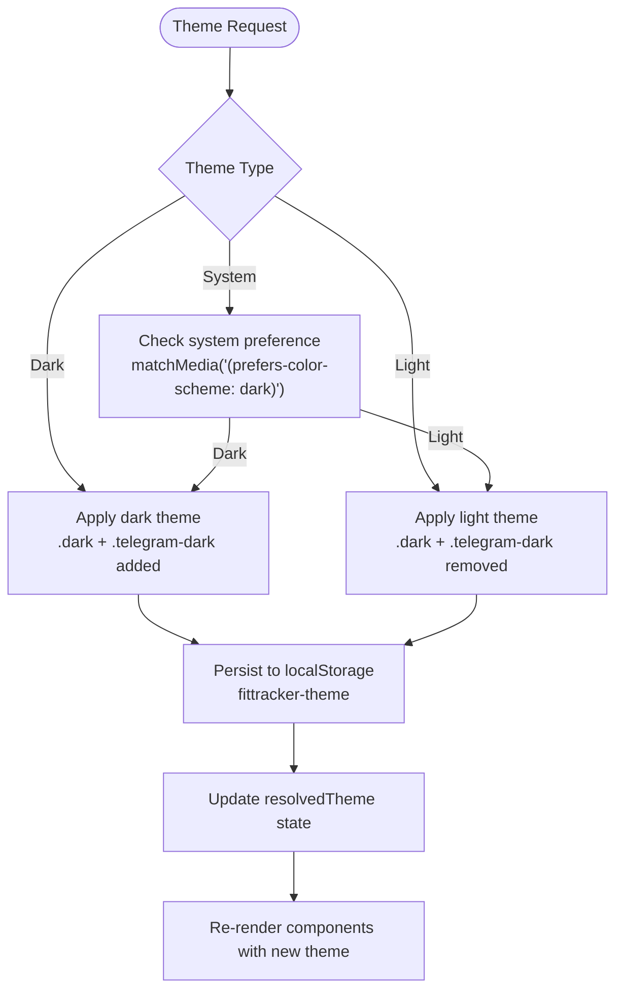
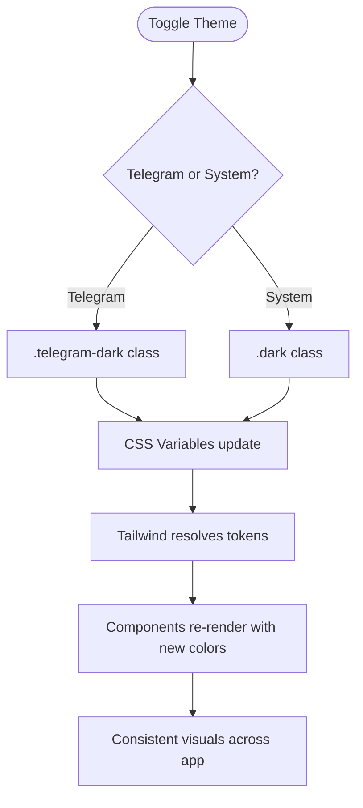
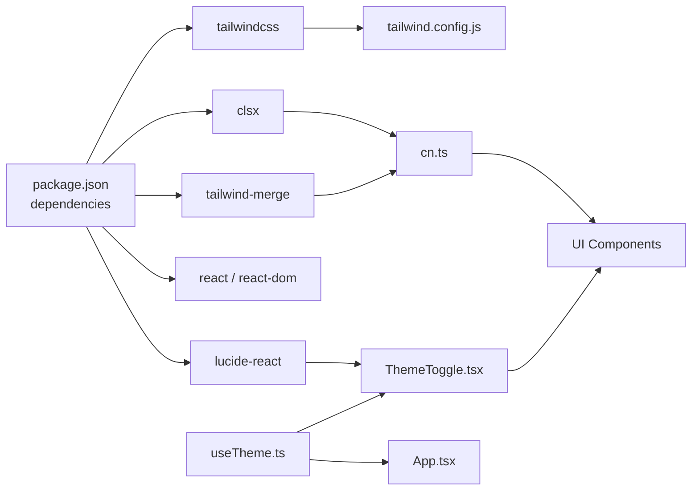

# Design System Guidelines

<cite>
**Referenced Files in This Document**
- [DESIGN_SYSTEM.md](file://frontend/DESIGN_SYSTEM.md)
- [tailwind.config.js](file://frontend/tailwind.config.js)
- [globals.css](file://frontend/src/styles/globals.css)
- [package.json](file://frontend/package.json)
- [DesignSystemDemo.tsx](file://frontend/src/components/ui/DesignSystemDemo.tsx)
- [Button.tsx](file://frontend/src/components/ui/Button.tsx)
- [Card.tsx](file://frontend/src/components/ui/Card.tsx)
- [Input.tsx](file://frontend/src/components/ui/Input.tsx)
- [ProgressBar.tsx](file://frontend/src/components/ui/ProgressBar.tsx)
- [Chip.tsx](file://frontend/src/components/ui/Chip.tsx)
- [Modal.tsx](file://frontend/src/components/ui/Modal.tsx)
- [Timer.tsx](file://frontend/src/components/ui/Timer.tsx)
- [cn.ts](file://frontend/src/utils/cn.ts)
- [ThemeToggle.tsx](file://frontend/src/components/ui/ThemeToggle.tsx)
- [useTheme.ts](file://frontend/src/hooks/useTheme.ts)
- [ProfilePage.tsx](file://frontend/src/pages/ProfilePage.tsx)
- [App.tsx](file://frontend/src/App.tsx)
</cite>

## Update Summary
**Changes Made**
- Added comprehensive theme system documentation including ThemeToggle component and useTheme hook
- Documented three-theme support (light, dark, system-based)
- Updated architecture overview to include theme management patterns
- Added new sections for theme configuration and implementation
- Enhanced troubleshooting guide with theme-related issues

## Table of Contents
1. [Introduction](#introduction)
2. [Project Structure](#project-structure)
3. [Core Components](#core-components)
4. [Architecture Overview](#architecture-overview)
5. [Theme System Implementation](#theme-system-implementation)
6. [Detailed Component Analysis](#detailed-component-analysis)
7. [Dependency Analysis](#dependency-analysis)
8. [Performance Considerations](#performance-considerations)
9. [Troubleshooting Guide](#troubleshooting-guide)
10. [Conclusion](#conclusion)
11. [Appendices](#appendices)

## Introduction
This document defines the FitTracker Pro design system guidelines. It explains the color schemes, typography hierarchy, spacing systems, and component design principles. It also documents the design tokens, theme configuration, and consistency patterns used across the application, along with guidance for extending the design system and maintaining visual consistency across devices.

**Updated** Added comprehensive theme system documentation including ThemeToggle component, useTheme hook, and three-theme support (light, dark, system-based)

## Project Structure
FitTracker Pro's design system is implemented using Tailwind CSS with a custom theme configuration and global CSS variables. Component libraries are built as reusable React UI primitives with consistent variants, sizes, and accessibility attributes. The system integrates Telegram Mini App theming and provides utilities for animations, safe areas, and responsive layouts.

**Diagram sources**
- [globals.css:9-118](file://frontend/src/styles/globals.css#L9-L118)
- [tailwind.config.js:8-346](file://frontend/tailwind.config.js#L8-L346)
- [useTheme.ts:18-80](file://frontend/src/hooks/useTheme.ts#L18-L80)
- [ThemeToggle.tsx:13-111](file://frontend/src/components/ui/ThemeToggle.tsx#L13-L111)
- [Button.tsx:24-58](file://frontend/src/components/ui/Button.tsx#L24-L58)
- [Card.tsx:23-50](file://frontend/src/components/ui/Card.tsx#L23-L50)
- [Input.tsx:28-48](file://frontend/src/components/ui/Input.tsx#L28-L48)
- [ProgressBar.tsx:27-39](file://frontend/src/components/ui/ProgressBar.tsx#L27-L39)
- [Chip.tsx:25-33](file://frontend/src/components/ui/Chip.tsx#L25-L33)
- [Modal.tsx:28-33](file://frontend/src/components/ui/Modal.tsx#L28-L33)
- [Timer.tsx:28-32](file://frontend/src/components/ui/Timer.tsx#L28-L32)
- [cn.ts:4-6](file://frontend/src/utils/cn.ts#L4-L6)
- [DesignSystemDemo.tsx:10-280](file://frontend/src/components/ui/DesignSystemDemo.tsx#L10-L280)
- [App.tsx:16-26](file://frontend/src/App.tsx#L16-L26)

**Section sources**
- [DESIGN_SYSTEM.md:1-410](file://frontend/DESIGN_SYSTEM.md#L1-L410)
- [tailwind.config.js:1-349](file://frontend/tailwind.config.js#L1-L349)
- [globals.css:1-581](file://frontend/src/styles/globals.css#L1-L581)
- [package.json:16-35](file://frontend/package.json#L16-L35)

## Core Components
FitTracker Pro provides a cohesive set of UI primitives with consistent variants, sizes, and behaviors. Each component encapsulates design tokens and accessibility semantics while supporting Telegram Mini App integration.

- Button: Variants include primary, secondary, tertiary, emergency, and ghost. Sizes support small, medium, and large. Supports icons, loading states, full width, and haptic feedback.
- Card: Variants include workout, exercise, stats, and info. Supports titles, subtitles, clickability, and haptic feedback.
- Input: Types include text, number, password, and search. Validation states include default, error, and success. Supports icons, labels, helper/error text, and haptic feedback.
- ProgressBar: Colors include primary, success, warning, danger, and gradient. Supports animated fills, labels, sizes, and haptic feedback on completion.
- Chip: Variants include default, outlined, and filled. Supports active state, icons, sizes, and haptic feedback.
- Modal: Supports overlay click-to-close, escape-to-close, drag-to-dismiss gestures, sizes, and haptic feedback.
- Timer: Variants include circular and digital. Supports auto-start, controls, sizes, and haptic feedback.
- ThemeToggle: Interactive theme switcher with three variants (default, minimal, segmented) supporting light, dark, and system themes.

**Updated** Added ThemeToggle component with three theme variants and comprehensive theme management capabilities

**Section sources**
- [Button.tsx:4-22](file://frontend/src/components/ui/Button.tsx#L4-L22)
- [Card.tsx:4-21](file://frontend/src/components/ui/Card.tsx#L4-L21)
- [Input.tsx:4-26](file://frontend/src/components/ui/Input.tsx#L4-L26)
- [ProgressBar.tsx:4-25](file://frontend/src/components/ui/ProgressBar.tsx#L4-L25)
- [Chip.tsx:4-23](file://frontend/src/components/ui/Chip.tsx#L4-L23)
- [Modal.tsx:5-26](file://frontend/src/components/ui/Modal.tsx#L5-L26)
- [Timer.tsx:4-26](file://frontend/src/components/ui/Timer.tsx#L4-L26)
- [ThemeToggle.tsx:8-11](file://frontend/src/components/ui/ThemeToggle.tsx#L8-L11)

## Architecture Overview
The design system architecture centers on a layered approach:
- CSS variables define semantic tokens and theme-specific overrides.
- Tailwind configuration extends design tokens into utilities and component classes.
- Global CSS applies base styles, component classes, and utilities.
- React components consume design tokens via variants and sizes, ensuring consistency.
- Utilities like cn merge classes safely and avoid conflicts.
- Theme management system provides centralized theme state and persistence.

**Updated** Enhanced architecture to include theme management layer with useTheme hook and ThemeToggle component

**Diagram sources**
- [globals.css:9-118](file://frontend/src/styles/globals.css#L9-L118)
- [tailwind.config.js:8-346](file://frontend/tailwind.config.js#L8-L346)
- [useTheme.ts:18-80](file://frontend/src/hooks/useTheme.ts#L18-L80)
- [ThemeToggle.tsx:13-111](file://frontend/src/components/ui/ThemeToggle.tsx#L13-L111)
- [cn.ts:4-6](file://frontend/src/utils/cn.ts#L4-L6)
- [DesignSystemDemo.tsx:10-280](file://frontend/src/components/ui/DesignSystemDemo.tsx#L10-L280)
- [App.tsx:16-26](file://frontend/src/App.tsx#L16-L26)

## Theme System Implementation

### Three-Theme Support
FitTracker Pro implements a comprehensive theme system supporting three distinct themes:
- Light theme: Default bright appearance with light backgrounds
- Dark theme: Deep dark appearance with dark backgrounds
- System theme: Automatically follows device/system theme preferences

### Theme Management Architecture
The theme system is built around two core components:

#### useTheme Hook
The `useTheme` hook provides centralized theme state management with:
- Theme state persistence using localStorage
- Automatic system theme detection and updates
- Reactive theme resolution and application
- Type-safe theme operations

#### ThemeToggle Component
The `ThemeToggle` component offers three interaction variants:
- Default: Full-featured button with theme indication
- Minimal: Compact icon-only toggle for constrained spaces
- Segmented: Three-option selector for explicit theme selection

**Diagram sources**
- [useTheme.ts:27-41](file://frontend/src/hooks/useTheme.ts#L27-L41)
- [useTheme.ts:44-48](file://frontend/src/hooks/useTheme.ts#L44-L48)
- [ThemeToggle.tsx:13-111](file://frontend/src/components/ui/ThemeToggle.tsx#L13-L111)

**Section sources**
- [useTheme.ts:7-14](file://frontend/src/hooks/useTheme.ts#L7-L14)
- [useTheme.ts:18-80](file://frontend/src/hooks/useTheme.ts#L18-L80)
- [ThemeToggle.tsx:8-11](file://frontend/src/components/ui/ThemeToggle.tsx#L8-L11)
- [ThemeToggle.tsx:13-111](file://frontend/src/components/ui/ThemeToggle.tsx#L13-L111)

### Theme Persistence and Initialization
The theme system includes robust persistence and initialization mechanisms:
- Local storage for theme preferences
- App-level initialization during mount
- System theme listener for automatic updates
- Graceful fallback to system theme when unavailable

**Section sources**
- [useTheme.ts:16-22](file://frontend/src/hooks/useTheme.ts#L16-L22)
- [App.tsx:16-26](file://frontend/src/App.tsx#L16-L26)
- [ProfilePage.tsx:53-62](file://frontend/src/pages/ProfilePage.tsx#L53-L62)

## Detailed Component Analysis

### Color Schemes and Design Tokens
- Semantic colors: border, input, ring, background, foreground.
- Brand palette: primary with 50–900 shades and foreground contrast.
- State colors: success, warning, danger with 50–900 shades and foreground contrast.
- Neutral gray scale: 50–950 shades with foreground contrast.
- Specialized: glucose color scale for health contexts.
- Legacy compatibility: secondary, destructive, muted, accent, popover, card.
- Telegram integration: telegram.* tokens mapped to Telegram Mini App theme variables.

**Section sources**
- [tailwind.config.js:13-149](file://frontend/tailwind.config.js#L13-L149)
- [globals.css:9-61](file://frontend/src/styles/globals.css#L9-L61)
- [globals.css:92-118](file://frontend/src/styles/globals.css#L92-L118)

### Typography Hierarchy
- Font sizes: extra-small to 4xl, with specialized timer sizes.
- Font weights: thin to black.
- Line heights: tailored per size for readability.
- Timer-specific monospace sizing for consistent digit widths.

**Section sources**
- [tailwind.config.js:155-179](file://frontend/tailwind.config.js#L155-L179)
- [globals.css:285-291](file://frontend/src/styles/globals.css#L285-L291)

### Spacing System
- Extended spacing: 18, 22, 26, 30 units.
- Z-index scale: 60–100 for layered UI.
- Safe area utilities for mobile insets.
- Responsive container utilities for mobile-first layout.

**Section sources**
- [tailwind.config.js:328-344](file://frontend/tailwind.config.js#L328-L344)
- [globals.css:330-396](file://frontend/src/styles/globals.css#L330-L396)

### Component Design Principles
- Consistent variants and sizes across components.
- Accessible ARIA attributes and keyboard interactions.
- Haptic feedback integration for Telegram Mini App.
- Responsive behavior and safe area handling.
- Clear visual states for interactive elements.

**Section sources**
- [Button.tsx:86-179](file://frontend/src/components/ui/Button.tsx#L86-L179)
- [Card.tsx:71-170](file://frontend/src/components/ui/Card.tsx#L71-L170)
- [Input.tsx:83-295](file://frontend/src/components/ui/Input.tsx#L83-L295)
- [ProgressBar.tsx:79-225](file://frontend/src/components/ui/ProgressBar.tsx#L79-L225)
- [Chip.tsx:65-169](file://frontend/src/components/ui/Chip.tsx#L65-L169)
- [Modal.tsx:58-282](file://frontend/src/components/ui/Modal.tsx#L58-L282)
- [Timer.tsx:61-345](file://frontend/src/components/ui/Timer.tsx#L61-L345)

### Theme Configuration and Consistency Patterns
- Root theme variables define brand and neutral palettes.
- Dark mode toggles via .dark class; Telegram dark mode via .telegram-dark.
- Tailwind colors map to CSS variables for dynamic theming.
- Component classes encapsulate consistent styles; React components expose variants for programmatic control.
- Utility functions merge classes safely to prevent conflicts.
- Theme system provides reactive theme switching with persistent state.

**Updated** Enhanced theme configuration to include comprehensive theme management system

**Diagram sources**
- [globals.css:66-118](file://frontend/src/styles/globals.css#L66-L118)
- [tailwind.config.js:13-149](file://frontend/tailwind.config.js#L13-L149)
- [DesignSystemDemo.tsx:13-16](file://frontend/src/components/ui/DesignSystemDemo.tsx#L13-L16)

**Section sources**
- [globals.css:66-118](file://frontend/src/styles/globals.css#L66-L118)
- [tailwind.config.js:13-149](file://frontend/tailwind.config.js#L13-L149)
- [DESIGN_SYSTEM.md:18-29](file://frontend/DESIGN_SYSTEM.md#L18-L29)

### Creating New Components That Follow Established Patterns
- Define a clear variant and size taxonomy aligned with existing components.
- Use design tokens from Tailwind theme and CSS variables.
- Apply consistent spacing, typography, and shadow scales.
- Support Telegram Mini App integration where applicable.
- Include accessibility attributes and keyboard interactions.
- Use cn for class merging to avoid conflicts.
- Implement theme-aware styling using CSS variables and Tailwind utilities.

**Updated** Added theme-aware styling considerations for new component development

**Section sources**
- [Button.tsx:24-58](file://frontend/src/components/ui/Button.tsx#L24-L58)
- [Card.tsx:23-50](file://frontend/src/components/ui/Card.tsx#L23-L50)
- [Input.tsx:28-48](file://frontend/src/components/ui/Input.tsx#L28-L48)
- [ProgressBar.tsx:27-39](file://frontend/src/components/ui/ProgressBar.tsx#L27-L39)
- [Chip.tsx:25-33](file://frontend/src/components/ui/Chip.tsx#L25-L33)
- [Modal.tsx:28-33](file://frontend/src/components/ui/Modal.tsx#L28-L33)
- [Timer.tsx:28-32](file://frontend/src/components/ui/Timer.tsx#L28-L32)
- [cn.ts:4-6](file://frontend/src/utils/cn.ts#L4-L6)

### Maintaining Visual Consistency Across Devices
- Use responsive utilities and container patterns for mobile-first layouts.
- Leverage safe area utilities for immersive mobile experiences.
- Apply consistent typography and spacing scales across breakpoints.
- Ensure animations and transitions align with motion design guidelines.
- Implement theme-aware components that adapt to user preferences.

**Updated** Added theme-aware considerations for visual consistency

**Section sources**
- [globals.css:330-396](file://frontend/src/styles/globals.css#L330-L396)
- [globals.css:570-581](file://frontend/src/styles/globals.css#L570-L581)
- [tailwind.config.js:307-323](file://frontend/tailwind.config.js#L307-L323)

## Dependency Analysis
The design system relies on Tailwind CSS and a small set of utility libraries. The component library depends on cn for class merging and Tailwind utilities for styling. The theme system adds useTheme hook and ThemeToggle component as core dependencies.

**Updated** Added theme system dependencies to the analysis

**Diagram sources**
- [package.json:16-35](file://frontend/package.json#L16-L35)
- [tailwind.config.js:1-349](file://frontend/tailwind.config.js#L1-L349)
- [cn.ts:1-7](file://frontend/src/utils/cn.ts#L1-L7)
- [ThemeToggle.tsx:4-6](file://frontend/src/components/ui/ThemeToggle.tsx#L4-L6)
- [useTheme.ts:5](file://frontend/src/hooks/useTheme.ts#L5)

**Section sources**
- [package.json:16-35](file://frontend/package.json#L16-L35)
- [cn.ts:1-7](file://frontend/src/utils/cn.ts#L1-L7)

## Performance Considerations
- Prefer component variants and sizes over ad hoc styling to reduce CSS bloat.
- Use Tailwind utilities judiciously; consolidate repeated patterns into component classes.
- Minimize heavy animations on lower-end devices; leverage hardware-accelerated properties.
- Keep component props focused to simplify rendering and improve maintainability.
- Optimize theme switching performance with efficient DOM manipulation.
- Cache theme state and avoid unnecessary re-renders during theme transitions.

**Updated** Added theme system performance considerations

## Troubleshooting Guide
- Theme not switching: Verify adding/removing .dark or .telegram-dark classes and ensure CSS variable overrides are applied.
- Colors appear incorrect: Confirm Tailwind theme colors resolve to CSS variables and that .dark/.telegram-dark is present on documentElement.
- Haptic feedback not triggering: Ensure Telegram WebApp is available and HapticFeedback APIs are supported in the environment.
- Class conflicts: Use cn to merge classes and avoid duplicating Tailwind utilities manually.
- Theme persistence issues: Check localStorage availability and theme state synchronization.
- Theme toggle not responding: Verify ThemeToggle component imports and useTheme hook connection.
- System theme not updating: Ensure matchMedia listeners are properly attached and cleaned up.

**Updated** Added theme system troubleshooting scenarios

**Section sources**
- [globals.css:66-118](file://frontend/src/styles/globals.css#L66-L118)
- [Button.tsx:104-113](file://frontend/src/components/ui/Button.tsx#L104-L113)
- [Input.tsx:116-123](file://frontend/src/components/ui/Input.tsx#L116-L123)
- [ProgressBar.tsx:134-152](file://frontend/src/components/ui/ProgressBar.tsx#L134-L152)
- [cn.ts:4-6](file://frontend/src/utils/cn.ts#L4-L6)
- [useTheme.ts:62-72](file://frontend/src/hooks/useTheme.ts#L62-L72)
- [ThemeToggle.tsx:13-111](file://frontend/src/components/ui/ThemeToggle.tsx#L13-L111)

## Conclusion
FitTracker Pro's design system combines Tailwind CSS, CSS variables, and thoughtful component design to deliver a consistent, accessible, and Telegram-integrated user experience. The comprehensive theme system provides seamless light/dark theme switching with system preference detection, ensuring optimal user experience across all devices and preferences. By adhering to established design tokens, variants, and patterns, teams can extend the system reliably while maintaining visual coherence across devices and themes.

**Updated** Enhanced conclusion to highlight the comprehensive theme system capabilities

## Appendices
- Design System Demo: Explore all components and utilities in a single showcase.
- Telegram Integration: Use Telegram Mini App theme variables and SDK hooks for native feel.
- Theme System Reference: Complete documentation for theme management and customization.

**Updated** Added theme system reference to appendices

**Section sources**
- [DesignSystemDemo.tsx:10-280](file://frontend/src/components/ui/DesignSystemDemo.tsx#L10-L280)
- [DESIGN_SYSTEM.md:215-270](file://frontend/DESIGN_SYSTEM.md#L215-L270)