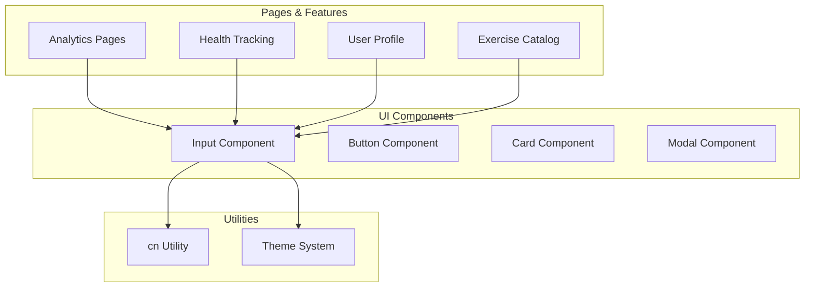
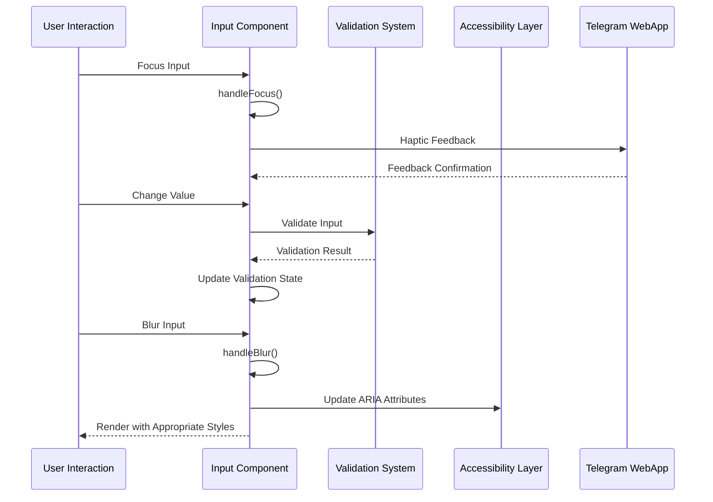
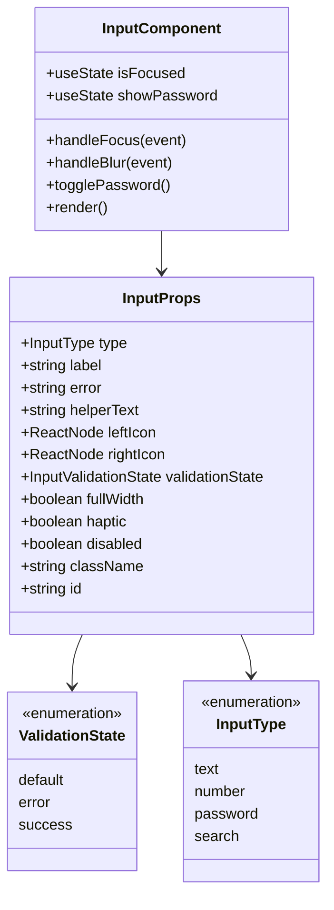
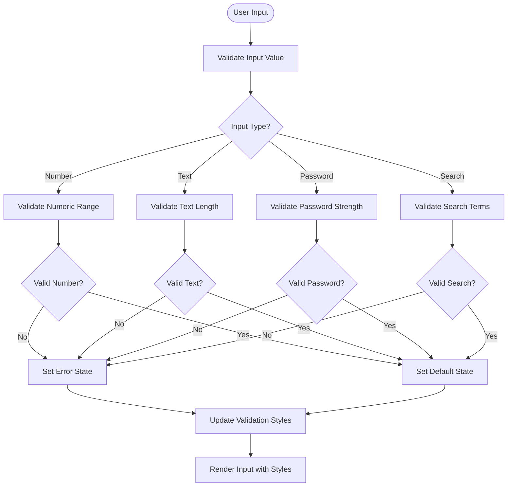
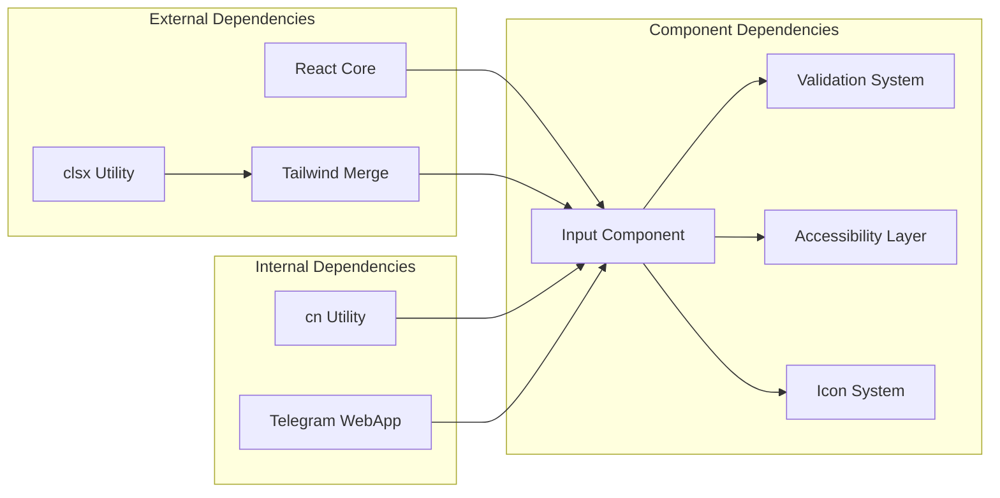

# Input Component

<cite>
**Referenced Files in This Document**
- [Input.tsx](file://frontend/src/components/ui/Input.tsx)
- [index.ts](file://frontend/src/components/ui/index.ts)
- [cn.ts](file://frontend/src/utils/cn.ts)
- [OneRMCalculator.tsx](file://frontend/src/components/analytics/OneRMCalculator.tsx)
- [AddExercise.tsx](file://frontend/src/pages/AddExercise.tsx)
- [Catalog.tsx](file://frontend/src/pages/Catalog.tsx)
- [Profile.tsx](file://frontend/src/pages/Profile.tsx)
</cite>

## Table of Contents
1. [Introduction](#introduction)
2. [Project Structure](#project-structure)
3. [Core Components](#core-components)
4. [Architecture Overview](#architecture-overview)
5. [Detailed Component Analysis](#detailed-component-analysis)
6. [Dependency Analysis](#dependency-analysis)
7. [Performance Considerations](#performance-considerations)
8. [Troubleshooting Guide](#troubleshooting-guide)
9. [Conclusion](#conclusion)

## Introduction
The Input component is a comprehensive form input element designed for the FitTracker Pro application. It provides enhanced functionality beyond the standard HTML input, including validation states, accessibility features, icon support, and Telegram WebApp integration. The component serves as a foundational UI element for collecting user data across various fitness tracking features.

## Project Structure
The Input component is part of the UI component library located in the frontend/src/components/ui directory. It follows a modular architecture pattern with clear separation of concerns and TypeScript definitions.



**Diagram sources**
- [Input.tsx:1-301](file://frontend/src/components/ui/Input.tsx#L1-L301)
- [index.ts:1-25](file://frontend/src/components/ui/index.ts#L1-L25)

**Section sources**
- [Input.tsx:1-301](file://frontend/src/components/ui/Input.tsx#L1-L301)
- [index.ts:1-25](file://frontend/src/components/ui/index.ts#L1-L25)

## Core Components
The Input component provides a robust foundation for form input handling with the following key capabilities:

### Props Interface and TypeScript Definitions
The component accepts a comprehensive set of props extending HTMLInputElement attributes while adding specialized functionality:

- **Basic Input Types**: text, number, password, search
- **Validation States**: default, error, success
- **Accessibility Features**: proper labeling, ARIA attributes
- **Styling Options**: fullWidth, custom className
- **Telegram Integration**: Haptic feedback support

### Core Functionality
- Dynamic type switching for password visibility
- Real-time validation state management
- Icon support for left/right positioning
- Focus/blur event handling with haptic feedback
- Accessible error messaging and labeling

**Section sources**
- [Input.tsx:7-26](file://frontend/src/components/ui/Input.tsx#L7-L26)
- [Input.tsx:28-48](file://frontend/src/components/ui/Input.tsx#L28-L48)

## Architecture Overview
The Input component integrates seamlessly with the broader application architecture through several key patterns:



**Diagram sources**
- [Input.tsx:116-131](file://frontend/src/components/ui/Input.tsx#L116-L131)
- [Input.tsx:198-205](file://frontend/src/components/ui/Input.tsx#L198-L205)

The component follows a unidirectional data flow pattern where user interactions trigger state updates that cascade through validation, accessibility, and rendering layers.

**Section sources**
- [Input.tsx:83-296](file://frontend/src/components/ui/Input.tsx#L83-L296)

## Detailed Component Analysis

### Component Implementation
The Input component is built using React.forwardRef to maintain proper ref forwarding capabilities for form libraries integration.



**Diagram sources**
- [Input.tsx:4-26](file://frontend/src/components/ui/Input.tsx#L4-L26)
- [Input.tsx:83-103](file://frontend/src/components/ui/Input.tsx#L83-L103)

### Validation Patterns and State Management
The component implements sophisticated validation state management with automatic error detection and user feedback:



**Diagram sources**
- [Input.tsx:108-109](file://frontend/src/components/ui/Input.tsx#L108-L109)
- [Input.tsx:35-48](file://frontend/src/components/ui/Input.tsx#L35-L48)

### Accessibility Features
The component implements comprehensive accessibility features following WCAG guidelines:

- **Proper Label Association**: Automatic ID generation and htmlFor linking
- **ARIA Attributes**: aria-invalid and aria-describedby for screen readers
- **Keyboard Navigation**: Full keyboard support for all interactive elements
- **Focus Management**: Proper focus indicators and focus trap behavior
- **Color Contrast**: Sufficient contrast ratios for all validation states

**Section sources**
- [Input.tsx:140-150](file://frontend/src/components/ui/Input.tsx#L140-L150)
- [Input.tsx:198-205](file://frontend/src/components/ui/Input.tsx#L198-L205)

### Integration with Form Libraries
The component supports integration with popular form libraries through proper prop forwarding and event handling:

#### React Hook Form Integration
```typescript
// Example integration pattern
const { register, formState: { errors } } = useForm();

<Input
  {...register('fieldName', { 
    required: 'Field is required',
    validate: (value) => value.length >= 3 || 'Minimum 3 characters'
  })}
  validationState={errors.fieldName ? 'error' : 'default'}
  error={errors.fieldName?.message as string}
/>
```

#### Formik Integration
```typescript
// Example integration pattern
<Input
  {...field}
  error={formik.errors.fieldName}
  validationState={formik.touched.fieldName && formik.errors.fieldName ? 'error' : 'default'}
  onBlur={(e) => {
    field.onBlur(e);
    formik.handleBlur(e);
  }}
/>
```

**Section sources**
- [OneRMCalculator.tsx:590-624](file://frontend/src/components/analytics/OneRMCalculator.tsx#L590-L624)
- [AddExercise.tsx:420-429](file://frontend/src/pages/AddExercise.tsx#L420-L429)

### Different Input Types and Usage Examples

#### Text Input with Validation
```typescript
<Input
  type="text"
  label="Username"
  placeholder="Enter your username"
  validationState="default"
  helperText="Choose a unique username"
/>
```

#### Number Input for Metrics
```typescript
<Input
  type="number"
  label="Weight (kg)"
  placeholder="75"
  validationState="success"
  helperText="Current weight measurement"
  leftIcon={<WeightIcon />}
/>
```

#### Password Input with Visibility Toggle
```typescript
<Input
  type="password"
  label="Password"
  placeholder="••••••••"
  validationState="error"
  error="Password must be at least 8 characters"
  rightIcon={<PasswordIcon />}
/>
```

#### Search Input for Exercise Catalog
```typescript
<Input
  type="search"
  label="Search Exercises"
  placeholder="Search by name or muscle group"
  leftIcon={<SearchIcon />}
  validationState="default"
/>
```

**Section sources**
- [OneRMCalculator.tsx:590-624](file://frontend/src/components/analytics/OneRMCalculator.tsx#L590-L624)
- [AddExercise.tsx:420-429](file://frontend/src/pages/AddExercise.tsx#L420-L429)
- [Catalog.tsx:3-800](file://frontend/src/pages/Catalog.tsx#L3-L800)

### Keyboard Navigation Support
The component provides comprehensive keyboard accessibility:

- **Tab Navigation**: Logical tab order through form fields
- **Enter/Space Keys**: Activation of interactive elements (password toggle)
- **Escape Key**: Modal dismissal when used within modals
- **Arrow Keys**: Navigation in dropdown/select-like components
- **Form Submission**: Enter key triggers form submission

**Section sources**
- [Input.tsx:222-231](file://frontend/src/components/ui/Input.tsx#L222-L231)

### Styling Approach and Design System Integration
The component follows the application's design system with consistent spacing, typography, and color schemes:

#### Typography Integration
- **Font Sizes**: Consistent scale from text-sm to text-lg
- **Line Heights**: Appropriate line heights for readability
- **Font Weights**: Medium weight for labels, regular for input text

#### Spacing and Layout
- **Padding**: Consistent 3-4px padding for input areas
- **Margins**: 1.5 spacing units between label and input
- **Border Radius**: 12px rounded corners for modern appearance

#### Color System
- **Primary**: Blue-based color scheme for focused states
- **Success**: Green-based validation feedback
- **Danger**: Red-based error states
- **Hint**: Subtle gray text for placeholders and helpers

**Section sources**
- [Input.tsx:176-197](file://frontend/src/components/ui/Input.tsx#L176-L197)
- [cn.ts:1-7](file://frontend/src/utils/cn.ts#L1-L7)

## Dependency Analysis



**Diagram sources**
- [Input.tsx:1-2](file://frontend/src/components/ui/Input.tsx#L1-L2)
- [cn.ts:1-7](file://frontend/src/utils/cn.ts#L1-L7)

### Component Coupling and Cohesion
The Input component maintains high internal cohesion while minimizing external dependencies. It relies primarily on:
- React core for component functionality
- clsx and tailwind-merge for class composition
- Telegram WebApp for haptic feedback integration

### Potential Circular Dependencies
The component avoids circular dependencies through:
- Forward ref pattern preventing render-time dependency loops
- Utility function separation (cn) from component logic
- Event handler separation from state management

**Section sources**
- [Input.tsx:1-3](file://frontend/src/components/ui/Input.tsx#L1-L3)
- [cn.ts:1-7](file://frontend/src/utils/cn.ts#L1-L7)

## Performance Considerations
The Input component is optimized for performance through several mechanisms:

### Rendering Optimization
- **Minimal Re-renders**: State updates are scoped to relevant component sections
- **Memoized Calculations**: Validation results are cached during render cycles
- **Conditional Rendering**: Icons and helper text only render when needed

### Memory Management
- **Event Handler Cleanup**: Proper cleanup of focus/blur handlers
- **Ref Management**: Efficient ref forwarding prevents unnecessary DOM queries
- **Icon Caching**: Static icons are rendered without re-computation

### Bundle Size Impact
- **Tree Shaking**: Component exports are properly structured for dead code elimination
- **Utility Separation**: Shared utilities minimize duplication across components
- **CSS-in-JS**: Tailwind classes are generated at build time, reducing runtime overhead

## Troubleshooting Guide

### Common Issues and Solutions

#### Validation State Not Updating
**Problem**: Input validation state doesn't reflect user input changes
**Solution**: Ensure proper prop passing and state management:
```typescript
// Correct implementation
<Input
  value={inputValue}
  onChange={(e) => setInputValue(e.target.value)}
  validationState={isValid ? 'success' : 'error'}
/>
```

#### Accessibility Issues
**Problem**: Screen reader compatibility problems
**Solution**: Verify proper ARIA attributes and labeling:
```typescript
// Ensure proper accessibility
<Input
  id="unique-input-id"
  label="Descriptive Label"
  aria-describedby="helper-text-id"
/>
```

#### Telegram Haptic Feedback Not Working
**Problem**: Haptic feedback not triggering on mobile devices
**Solution**: Check Telegram WebApp availability and permissions:
```typescript
// Verify Telegram integration
const hasTelegram = typeof window !== 'undefined' && 'Telegram' in window;
const hasHaptic = hasTelegram && window.Telegram.WebApp?.HapticFeedback;
```

#### Styling Conflicts
**Problem**: Input styles conflicting with global CSS
**Solution**: Use proper className composition and avoid global overrides:
```typescript
// Use cn utility for safe class merging
className={cn('custom-class', baseStyles, conditionalClasses)}
```

**Section sources**
- [Input.tsx:116-131](file://frontend/src/components/ui/Input.tsx#L116-L131)
- [Input.tsx:198-205](file://frontend/src/components/ui/Input.tsx#L198-L205)

## Conclusion
The Input component represents a mature, accessible, and feature-rich solution for form input handling in the FitTracker Pro application. Its comprehensive validation system, accessibility features, and integration capabilities make it a cornerstone of the application's user interface. The component's thoughtful design ensures consistent user experiences across different input scenarios while maintaining performance and accessibility standards.

The component successfully bridges the gap between basic HTML inputs and complex form requirements, providing developers with a flexible, extensible foundation for building robust user interfaces. Its integration with the Telegram WebApp ecosystem and adherence to design system principles positions it as a model component for React applications requiring advanced input handling capabilities.