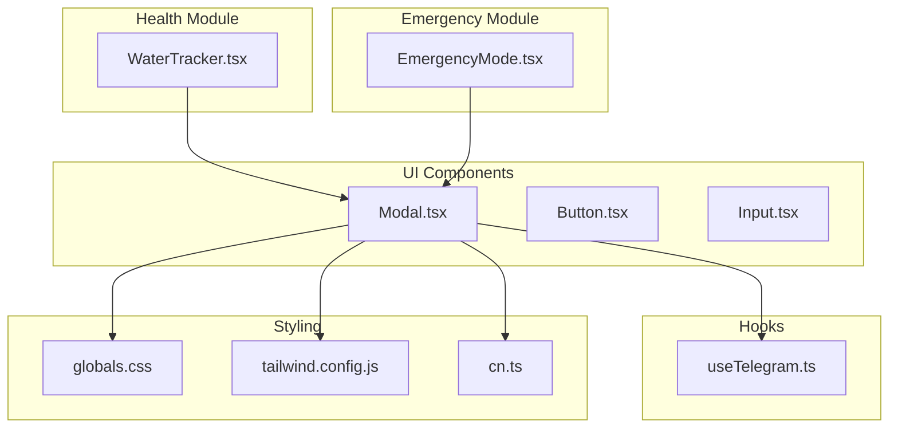
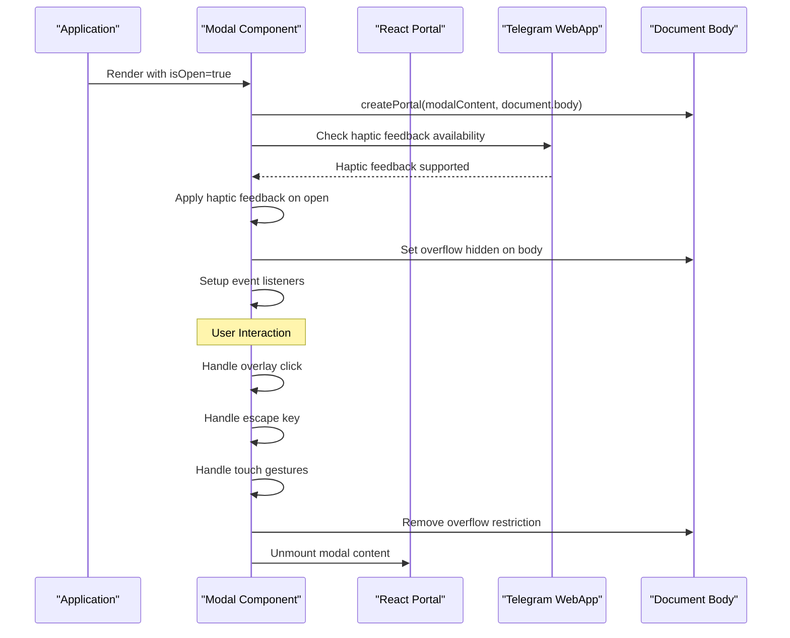
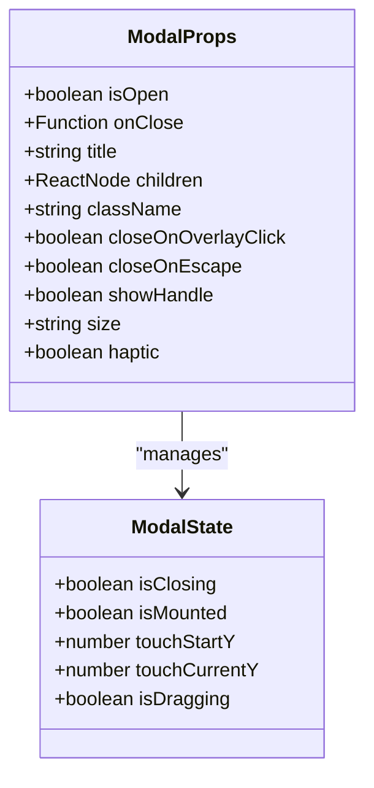
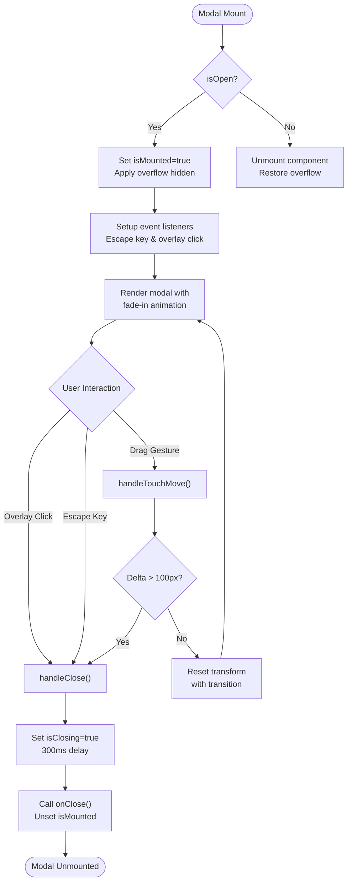
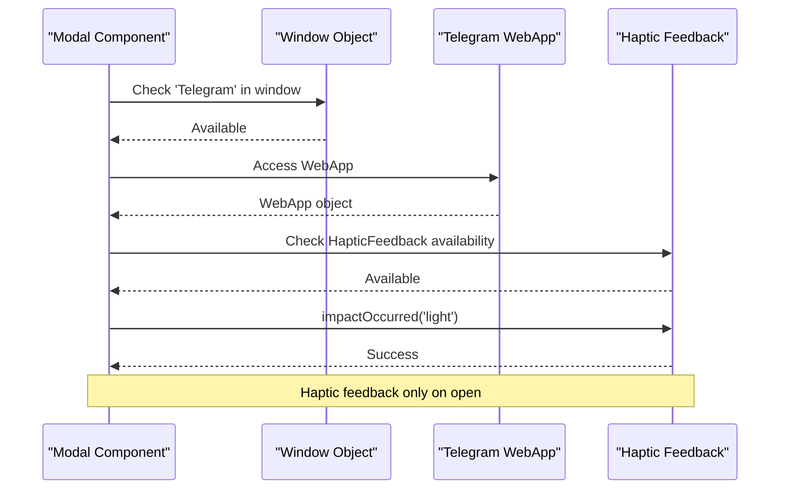
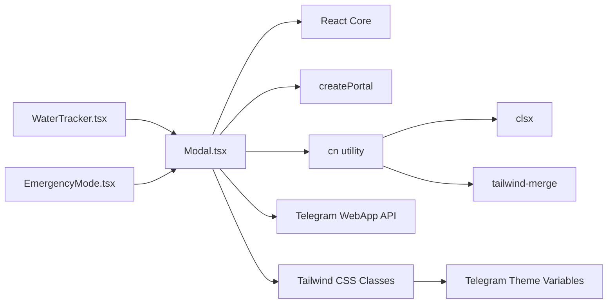

# Modal Component

<cite>
**Referenced Files in This Document**
- [Modal.tsx](file://frontend/src/components/ui/Modal.tsx)
- [index.ts](file://frontend/src/components/ui/index.ts)
- [WaterTracker.tsx](file://frontend/src/components/health/WaterTracker.tsx)
- [EmergencyMode.tsx](file://frontend/src/components/emergency/EmergencyMode.tsx)
- [useTelegram.ts](file://frontend/src/hooks/useTelegram.ts)
- [globals.css](file://frontend/src/styles/globals.css)
- [tailwind.config.js](file://frontend/tailwind.config.js)
- [cn.ts](file://frontend/src/utils/cn.ts)
</cite>

## Table of Contents
1. [Introduction](#introduction)
2. [Project Structure](#project-structure)
3. [Core Components](#core-components)
4. [Architecture Overview](#architecture-overview)
5. [Detailed Component Analysis](#detailed-component-analysis)
6. [Dependency Analysis](#dependency-analysis)
7. [Performance Considerations](#performance-considerations)
8. [Troubleshooting Guide](#troubleshooting-guide)
9. [Conclusion](#conclusion)

## Introduction
The Modal component is a flexible, accessible, and Telegram Mini App–optimized modal dialog system designed for the FitTracker Pro application. It provides a consistent user experience across desktop and mobile platforms while integrating seamlessly with Telegram WebApp APIs for enhanced haptic feedback and theme support. The component supports multiple interaction patterns including overlay clicks, escape key handling, and drag-to-dismiss gestures, making it suitable for various use cases such as workout confirmations, settings dialogs, and emergency mode activation.

## Project Structure
The Modal component resides in the UI components library and integrates with the broader design system and Telegram Mini App ecosystem.

**Diagram sources**
- [Modal.tsx:1-282](file://frontend/src/components/ui/Modal.tsx#L1-L282)
- [WaterTracker.tsx:335-416](file://frontend/src/components/health/WaterTracker.tsx#L335-L416)
- [EmergencyMode.tsx:950-1079](file://frontend/src/components/emergency/EmergencyMode.tsx#L950-L1079)
- [useTelegram.ts:1-117](file://frontend/src/hooks/useTelegram.ts#L1-L117)
- [globals.css:1-581](file://frontend/src/styles/globals.css#L1-L581)
- [tailwind.config.js:105-160](file://frontend/tailwind.config.js#L105-L160)
- [cn.ts:1-7](file://frontend/src/utils/cn.ts#L1-L7)

**Section sources**
- [Modal.tsx:1-282](file://frontend/src/components/ui/Modal.tsx#L1-L282)
- [index.ts:20-21](file://frontend/src/components/ui/index.ts#L20-L21)

## Core Components
The Modal component is exported through the UI components index and integrated into the design system. It serves as a foundational building block for various application features requiring modal interactions.

**Section sources**
- [index.ts:20-21](file://frontend/src/components/ui/index.ts#L20-L21)
- [Modal.tsx:281](file://frontend/src/components/ui/Modal.tsx#L281)

## Architecture Overview
The Modal component follows a portal-based architecture that renders modals outside the normal DOM hierarchy, enabling proper z-index stacking and overlay management. It integrates with Telegram WebApp APIs for enhanced mobile experiences and implements comprehensive accessibility features.

**Diagram sources**
- [Modal.tsx:88-126](file://frontend/src/components/ui/Modal.tsx#L88-L126)
- [Modal.tsx:128-172](file://frontend/src/components/ui/Modal.tsx#L128-L172)
- [Modal.tsx:78-86](file://frontend/src/components/ui/Modal.tsx#L78-L86)

## Detailed Component Analysis

### Props Interface and Behavior
The Modal component exposes a comprehensive props interface designed for flexibility and accessibility:

**Diagram sources**
- [Modal.tsx:5-26](file://frontend/src/components/ui/Modal.tsx#L5-L26)
- [Modal.tsx:70-76](file://frontend/src/components/ui/Modal.tsx#L70-L76)

Key behavioral characteristics include:
- **State Management**: Dual-state system with mounting/unmounting and closing animations
- **Interaction Patterns**: Overlay clicks, escape key handling, and drag-to-dismiss gestures
- **Accessibility**: Proper ARIA attributes and role assignment
- **Responsive Design**: Bottom-sheet layout optimized for mobile devices

**Section sources**
- [Modal.tsx:5-26](file://frontend/src/components/ui/Modal.tsx#L5-L26)
- [Modal.tsx:58-69](file://frontend/src/components/ui/Modal.tsx#L58-L69)

### Overlay Management and Animation System
The component implements sophisticated overlay management with smooth transitions and proper z-index handling:

**Diagram sources**
- [Modal.tsx:88-126](file://frontend/src/components/ui/Modal.tsx#L88-L126)
- [Modal.tsx:128-172](file://frontend/src/components/ui/Modal.tsx#L128-L172)

**Section sources**
- [Modal.tsx:88-126](file://frontend/src/components/ui/Modal.tsx#L88-L126)
- [Modal.tsx:128-172](file://frontend/src/components/ui/Modal.tsx#L128-L172)

### Telegram Mini App Integration
The Modal component integrates deeply with Telegram WebApp APIs for enhanced mobile experiences:

**Diagram sources**
- [Modal.tsx:78-86](file://frontend/src/components/ui/Modal.tsx#L78-L86)
- [useTelegram.ts:38-81](file://frontend/src/hooks/useTelegram.ts#L38-L81)

**Section sources**
- [Modal.tsx:78-86](file://frontend/src/components/ui/Modal.tsx#L78-L86)
- [useTelegram.ts:38-81](file://frontend/src/hooks/useTelegram.ts#L38-L81)

### Accessibility Features
The component implements comprehensive accessibility features ensuring compliance with WCAG guidelines:

- **ARIA Attributes**: Proper `aria-modal="true"` and `role="dialog"` assignment
- **Keyboard Navigation**: Escape key support for dismissal
- **Focus Management**: Automatic focus restoration and proper focus traps
- **Screen Reader Support**: Semantic HTML structure and meaningful labels

**Section sources**
- [Modal.tsx:187-189](file://frontend/src/components/ui/Modal.tsx#L187-L189)
- [Modal.tsx:104-117](file://frontend/src/components/ui/Modal.tsx#L104-L117)

### Mobile-Specific Considerations
The Modal component includes several mobile-optimized features:

- **Bottom Sheet Layout**: Default mobile-first design with rounded corners
- **Safe Area Support**: Automatic padding for device notches and home indicators
- **Touch Gestures**: Drag-to-dismiss functionality with threshold detection
- **Haptic Feedback**: Integration with Telegram's haptic API for tactile feedback
- **Responsive Sizing**: Adaptive sizing based on viewport and content requirements

**Section sources**
- [Modal.tsx:198-216](file://frontend/src/components/ui/Modal.tsx#L198-L216)
- [globals.css:330-359](file://frontend/src/styles/globals.css#L330-L359)

## Dependency Analysis
The Modal component has minimal external dependencies and integrates cleanly with the existing codebase:

**Diagram sources**
- [Modal.tsx:1-3](file://frontend/src/components/ui/Modal.tsx#L1-L3)
- [cn.ts:1-7](file://frontend/src/utils/cn.ts#L1-L7)
- [WaterTracker.tsx:335](file://frontend/src/components/health/WaterTracker.tsx#L335)
- [EmergencyMode.tsx:950](file://frontend/src/components/emergency/EmergencyMode.tsx#L950)

**Section sources**
- [Modal.tsx:1-3](file://frontend/src/components/ui/Modal.tsx#L1-L3)
- [cn.ts:1-7](file://frontend/src/utils/cn.ts#L1-L7)

## Performance Considerations
The Modal component is optimized for performance through several mechanisms:

- **Conditional Rendering**: Uses `isMounted` state to prevent unnecessary re-renders
- **Efficient Event Handling**: Memoized callbacks with proper cleanup
- **CSS Transitions**: Hardware-accelerated animations using transform properties
- **Portal Rendering**: Minimizes DOM traversal overhead by rendering outside normal hierarchy
- **Lazy Loading**: Haptic feedback only initialized when needed

## Troubleshooting Guide

### Common Issues and Solutions

**Issue**: Modal not closing on overlay click
- **Cause**: `closeOnOverlayClick` prop set to false
- **Solution**: Ensure `closeOnOverlayClick` is true or remove prop for default behavior

**Issue**: Escape key not working
- **Cause**: `closeOnEscape` prop set to false
- **Solution**: Set `closeOnEscape` to true or remove prop for default behavior

**Issue**: Haptic feedback not triggering
- **Cause**: Running outside Telegram Mini App environment
- **Solution**: Verify Telegram WebApp availability or disable haptic feedback

**Issue**: Scroll issues after modal closes
- **Cause**: Body overflow not restored
- **Solution**: Check cleanup effects in modal lifecycle

**Section sources**
- [Modal.tsx:104-117](file://frontend/src/components/ui/Modal.tsx#L104-L117)
- [Modal.tsx:99-102](file://frontend/src/components/ui/Modal.tsx#L99-L102)

## Conclusion
The Modal component provides a robust, accessible, and Telegram Mini App–optimized solution for modal interactions in the FitTracker Pro application. Its comprehensive feature set, including haptic feedback integration, drag-to-dismiss gestures, and proper accessibility support, makes it suitable for diverse use cases ranging from simple confirmations to complex multi-step workflows. The component's clean architecture and minimal dependencies ensure maintainability and extensibility for future enhancements.