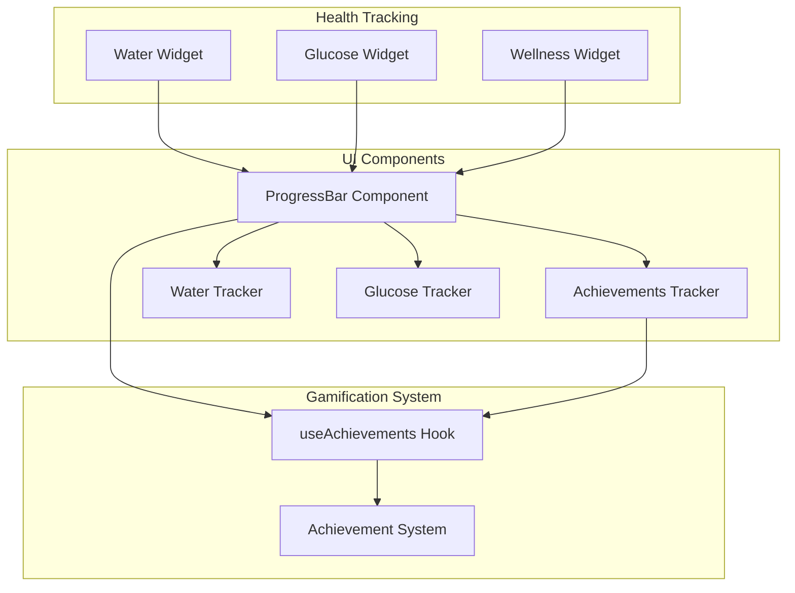
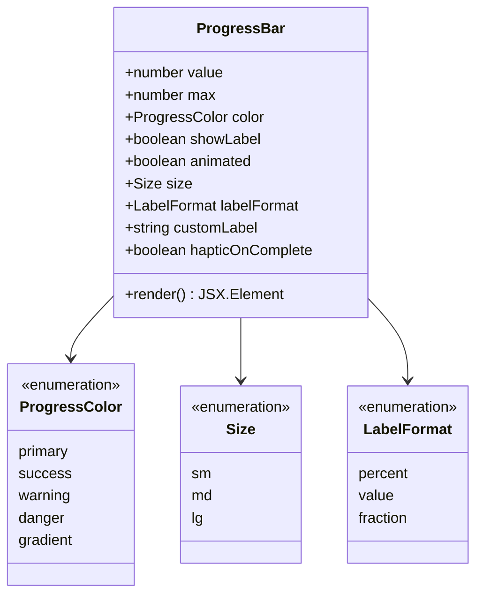
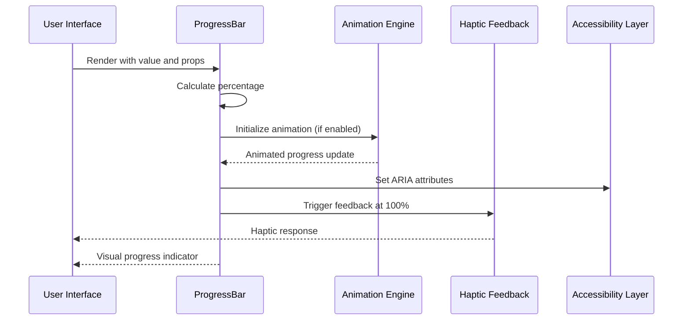
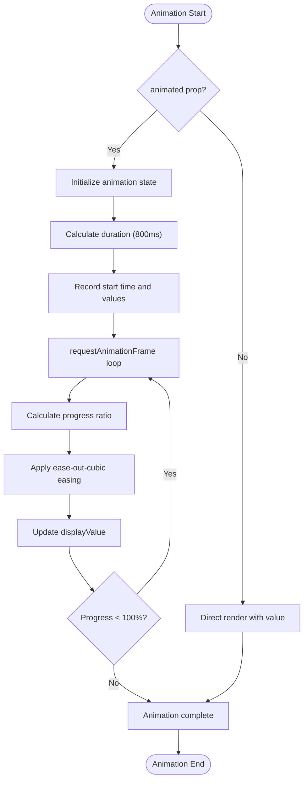
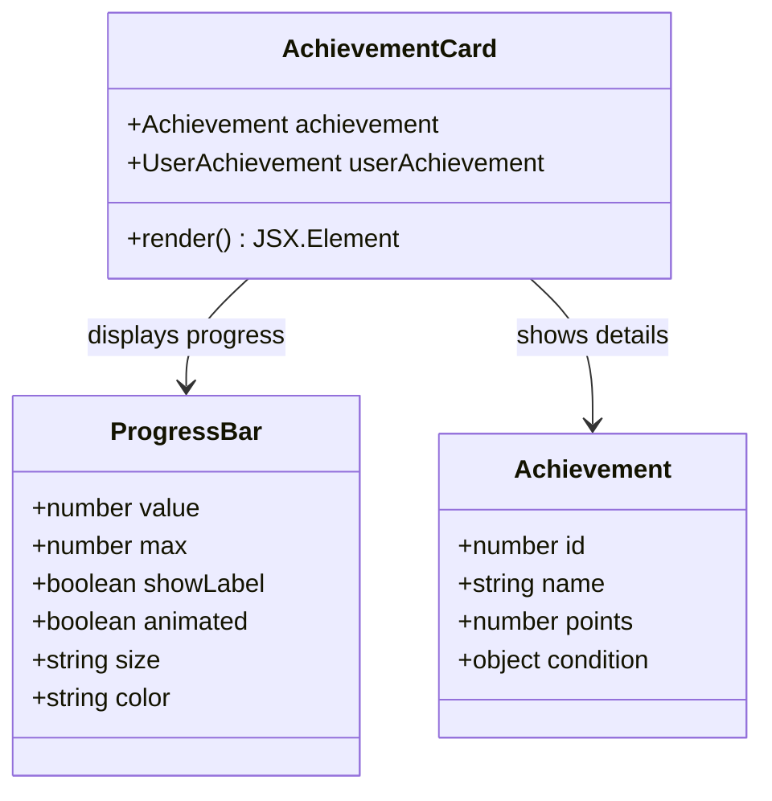
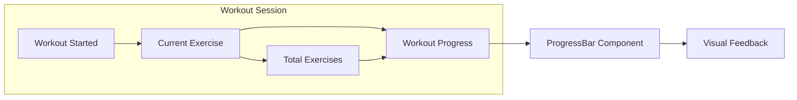
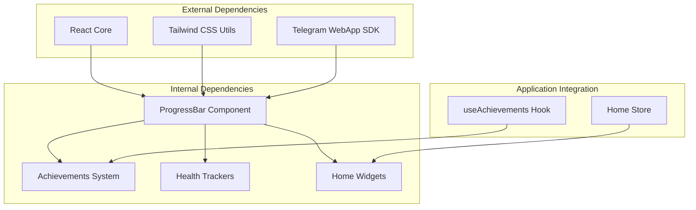

# Progress Bar Component

<cite>
**Referenced Files in This Document**
- [ProgressBar.tsx](file://frontend/src/components/ui/ProgressBar.tsx)
- [Achievements.tsx](file://frontend/src/components/gamification/Achievements.tsx)
- [useAchievements.ts](file://frontend/src/hooks/useAchievements.ts)
- [WaterTracker.tsx](file://frontend/src/components/health/WaterTracker.tsx)
- [GlucoseTracker.tsx](file://frontend/src/components/health/GlucoseTracker.tsx)
- [WaterWidget.tsx](file://frontend/src/components/home/WaterWidget.tsx)
- [GlucoseWidget.tsx](file://frontend/src/components/home/GlucoseWidget.tsx)
- [WellnessWidget.tsx](file://frontend/src/components/home/WellnessWidget.tsx)
- [Home.tsx](file://frontend/src/pages/Home.tsx)
- [homeStore.ts](file://frontend/src/stores/homeStore.ts)
- [index.ts](file://frontend/src/components/gamification/index.ts)
</cite>

## Table of Contents
1. [Introduction](#introduction)
2. [Project Structure](#project-structure)
3. [Core Components](#core-components)
4. [Architecture Overview](#architecture-overview)
5. [Detailed Component Analysis](#detailed-component-analysis)
6. [Dependency Analysis](#dependency-analysis)
7. [Performance Considerations](#performance-considerations)
8. [Troubleshooting Guide](#troubleshooting-guide)
9. [Conclusion](#conclusion)

## Introduction
The Progress Bar component is a core UI element in FitTracker Pro designed to provide visual feedback for quantitative goals and completion tracking. It serves as a cornerstone of the application's gamification system, offering users clear, motivating indicators of their progress toward fitness and health objectives. This component supports multiple visual themes, animation behaviors, and accessibility features while integrating seamlessly with the application's achievement system and health tracking modules.

## Project Structure
The Progress Bar component is part of the UI component library and is integrated throughout the application in several key areas:

**Diagram sources**
- [ProgressBar.tsx:1-225](file://frontend/src/components/ui/ProgressBar.tsx#L1-L225)
- [Achievements.tsx:1-934](file://frontend/src/components/gamification/Achievements.tsx#L1-L934)
- [useAchievements.ts:1-278](file://frontend/src/hooks/useAchievements.ts#L1-L278)

**Section sources**
- [ProgressBar.tsx:1-225](file://frontend/src/components/ui/ProgressBar.tsx#L1-L225)
- [Achievements.tsx:1-934](file://frontend/src/components/gamification/Achievements.tsx#L1-L934)

## Core Components
The Progress Bar component provides a flexible, accessible solution for displaying progress across various contexts in the application. Its design emphasizes both visual appeal and functional clarity.

### Props Interface
The component accepts a comprehensive set of props that enable extensive customization:

- **value**: Required numeric value representing current progress
- **max**: Optional maximum value (defaults to 100)
- **color**: Progress color variant ('primary', 'success', 'warning', 'danger', 'gradient')
- **showLabel**: Boolean to display progress label
- **animated**: Boolean to enable smooth animation transitions
- **size**: Component size ('sm', 'md', 'lg')
- **labelFormat**: Label display format ('percent', 'value', 'fraction')
- **customLabel**: Custom label text override
- **hapticOnComplete**: Boolean to trigger haptic feedback at 100%

### Styling System
The component uses a modular styling approach with predefined variants:

**Diagram sources**
- [ProgressBar.tsx:4-25](file://frontend/src/components/ui/ProgressBar.tsx#L4-L25)

**Section sources**
- [ProgressBar.tsx:6-25](file://frontend/src/components/ui/ProgressBar.tsx#L6-L25)

## Architecture Overview
The Progress Bar component integrates with multiple application systems to provide comprehensive progress tracking:

**Diagram sources**
- [ProgressBar.tsx:99-152](file://frontend/src/components/ui/ProgressBar.tsx#L99-L152)

The component participates in three primary use cases:
1. **Achievement Progress Tracking**: Visualizing completion percentages for in-progress achievements
2. **Health Goal Monitoring**: Displaying progress toward daily hydration and nutrition targets
3. **Workout Completion**: Showing exercise completion rates and session progress

## Detailed Component Analysis

### Animation System
The Progress Bar implements sophisticated animation behavior for enhanced user experience:

**Diagram sources**
- [ProgressBar.tsx:104-131](file://frontend/src/components/ui/ProgressBar.tsx#L104-L131)

### Accessibility Implementation
The component adheres to WCAG guidelines through comprehensive ARIA support:

- **Role Attribute**: `role="progressbar"` for screen reader compatibility
- **Value Attributes**: `aria-valuenow`, `aria-valuemin`, `aria-valuemax` for progress state
- **Label Support**: Dynamic `aria-label` generation for screen readers
- **Keyboard Navigation**: Inherits standard focus behavior from container div

### Integration Patterns

#### Achievement System Integration
The Progress Bar serves as the primary visual indicator for achievement progress:

**Diagram sources**
- [Achievements.tsx:235-375](file://frontend/src/components/gamification/Achievements.tsx#L235-L375)

#### Health Tracking Integration
The component integrates with health monitoring systems for hydration and nutrition goals:

**Section sources**
- [ProgressBar.tsx:170-218](file://frontend/src/components/ui/ProgressBar.tsx#L170-L218)
- [Achievements.tsx:342-351](file://frontend/src/components/gamification/Achievements.tsx#L342-L351)

### Progress Tracking Examples

#### Workout Progress Tracking
The component effectively visualizes exercise completion rates:

#### Hydration Goals
The Progress Bar displays fluid intake progress toward daily targets:

**Section sources**
- [WaterTracker.tsx:763-775](file://frontend/src/components/health/WaterTracker.tsx#L763-L775)
- [WaterWidget.tsx:11-13](file://frontend/src/components/home/WaterWidget.tsx#L11-L13)

#### Achievement Completion
The component tracks progress toward achievement milestones:

**Section sources**
- [Achievements.tsx:342-351](file://frontend/src/components/gamification/Achievements.tsx#L342-L351)
- [useAchievements.ts:158-165](file://frontend/src/hooks/useAchievements.ts#L158-L165)

## Dependency Analysis
The Progress Bar component maintains loose coupling with application systems while providing essential integration points:

**Diagram sources**
- [ProgressBar.tsx:1-2](file://frontend/src/components/ui/ProgressBar.tsx#L1-L2)
- [useAchievements.ts:8-17](file://frontend/src/hooks/useAchievements.ts#L8-L17)

**Section sources**
- [ProgressBar.tsx:1-2](file://frontend/src/components/ui/ProgressBar.tsx#L1-L2)
- [useAchievements.ts:67-275](file://frontend/src/hooks/useAchievements.ts#L67-L275)

## Performance Considerations
The Progress Bar component is optimized for smooth animations and efficient rendering:

### Animation Performance
- **requestAnimationFrame**: Uses browser-native animation for 60fps performance
- **Easing Function**: Implements cubic easing for natural motion perception
- **State Management**: Maintains separate display and actual values for smooth transitions
- **Memory Efficiency**: Cleans up animation frames automatically

### Rendering Optimization
- **Conditional Rendering**: Only renders labels when explicitly requested
- **CSS Classes**: Uses Tailwind utility classes for efficient styling
- **Minimal DOM**: Single container with two child elements for optimal structure
- **Accessibility**: Lightweight ARIA attributes without performance impact

## Troubleshooting Guide

### Common Issues and Solutions

#### Animation Not Working
**Problem**: Progress updates appear instantly without animation
**Solution**: Ensure `animated` prop is set to `true` and value changes trigger re-render

#### Haptic Feedback Not Triggering
**Problem**: No tactile feedback at 100% completion
**Solution**: Verify Telegram WebApp environment and `hapticOnComplete` prop setting

#### Accessibility Issues
**Problem**: Screen readers not announcing progress state
**Solution**: Confirm ARIA attributes are properly set and `aria-label` is generated

#### Styling Problems
**Problem**: Progress bar appears incorrectly sized or colored
**Solution**: Check Tailwind CSS class combinations and ensure proper theme variables

**Section sources**
- [ProgressBar.tsx:133-152](file://frontend/src/components/ui/ProgressBar.tsx#L133-L152)
- [ProgressBar.tsx:174-179](file://frontend/src/components/ui/ProgressBar.tsx#L174-L179)

## Conclusion
The Progress Bar component represents a sophisticated yet accessible solution for progress visualization in FitTracker Pro. Its comprehensive feature set, including smooth animations, haptic feedback, and full accessibility support, makes it an essential element of the application's gamification and health tracking systems. The component's modular design and loose coupling enable seamless integration across multiple application contexts while maintaining optimal performance and user experience standards.

Through its integration with the achievement system, health tracking modules, and home dashboard widgets, the Progress Bar component demonstrates how thoughtful UI design can enhance user motivation and engagement in fitness and wellness applications. The component's extensible architecture ensures it can adapt to future feature requirements while maintaining backward compatibility and performance standards.