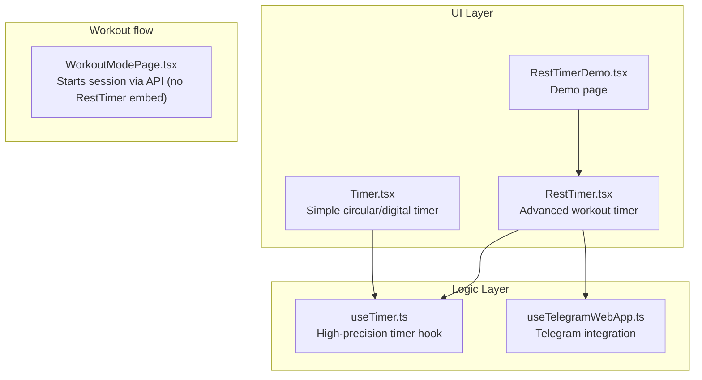
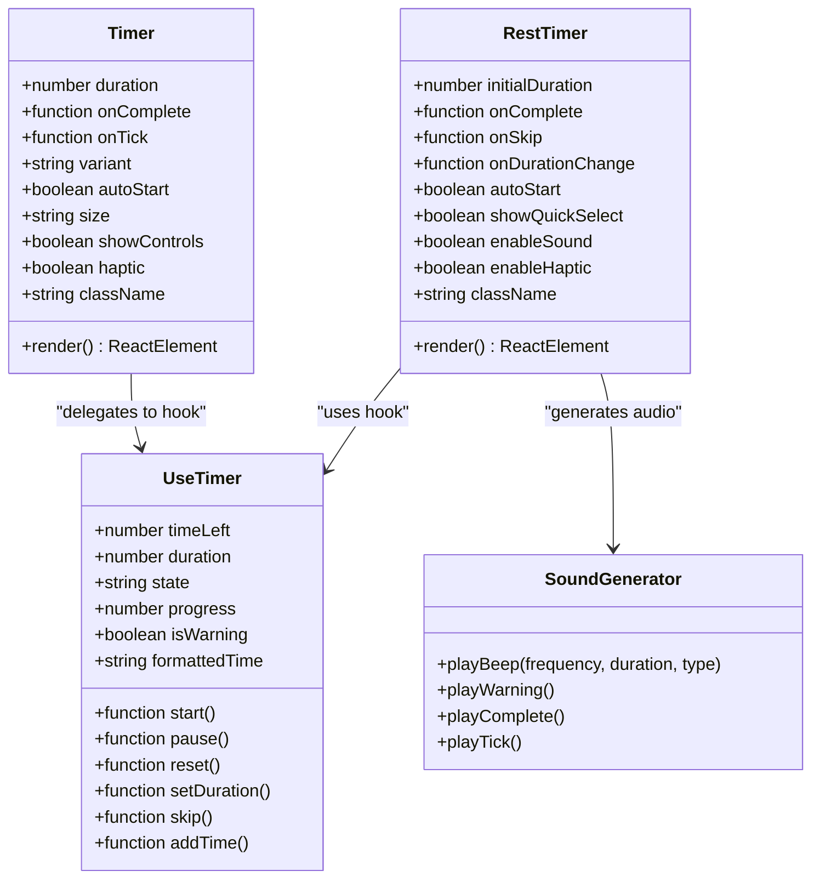
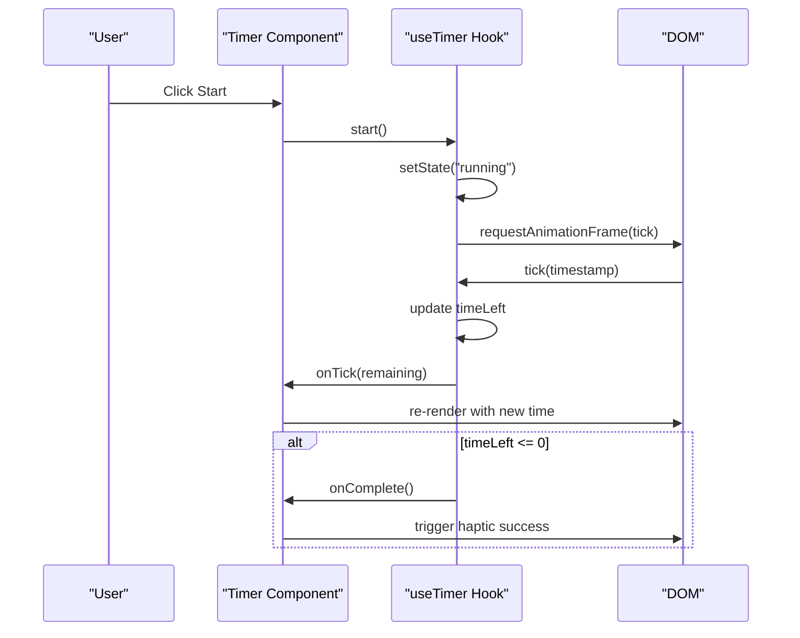
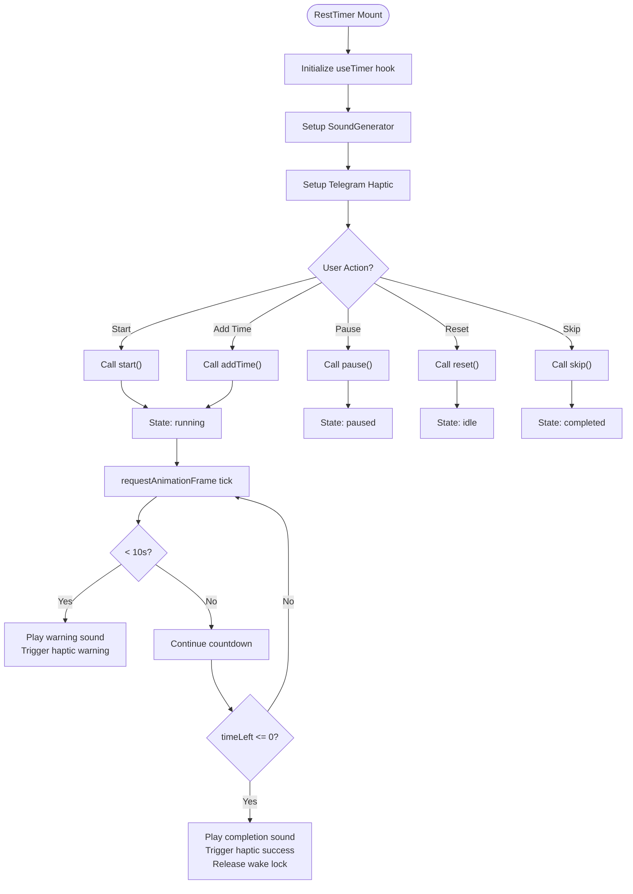
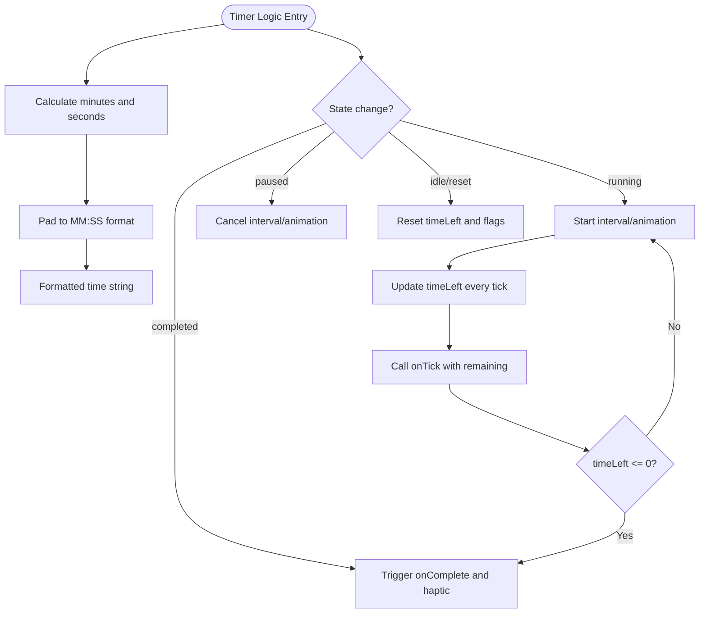
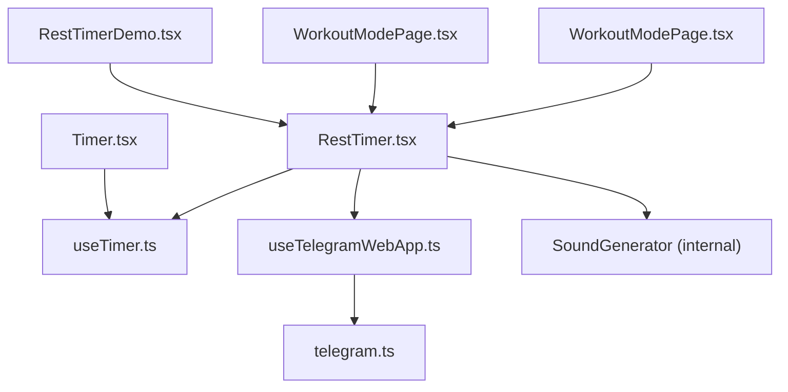

# Timer Component

<cite>
**Referenced Files in This Document**
- [Timer.tsx](file://frontend/src/components/ui/Timer.tsx)
- [useTimer.ts](file://frontend/src/hooks/useTimer.ts)
- [RestTimer.tsx](file://frontend/src/components/workout/RestTimer.tsx)
- [RestTimerDemo.tsx](file://frontend/src/pages/RestTimerDemo.tsx)
- [useTelegramWebApp.ts](file://frontend/src/hooks/useTelegramWebApp.ts)
- [WorkoutModePage.tsx](file://frontend/src/pages/WorkoutModePage.tsx)
- [workoutTypeConfigs.ts](file://frontend/src/features/workouts/config/workoutTypeConfigs.ts)
- [useTimer.test.ts](file://frontend/src/__tests__/hooks/useTimer.test.ts)
- [telegram.ts](file://frontend/src/types/telegram.ts)
</cite>

## Table of Contents
1. [Introduction](#introduction)
2. [Project Structure](#project-structure)
3. [Core Components](#core-components)
4. [Architecture Overview](#architecture-overview)
5. [Detailed Component Analysis](#detailed-component-analysis)
6. [Dependency Analysis](#dependency-analysis)
7. [Performance Considerations](#performance-considerations)
8. [Troubleshooting Guide](#troubleshooting-guide)
9. [Conclusion](#conclusion)

## Introduction
This document provides comprehensive documentation for the Timer component ecosystem in the Fit Tracker Pro application. It covers two timer implementations: a lightweight UI component (`Timer`) and a high-precision hook-based timer (`useTimer`). The documentation explains countdown functionality, time formatting, state management patterns, props interfaces, interval handling, pause/resume mechanics, and integration with the application's workout engine. It also addresses time zone considerations, mobile device performance, and practical usage scenarios for workout sessions, rest periods, and meditation tracking.

## Project Structure
The timer functionality spans three main areas:
- UI Timer component for simple, presentational countdowns
- Hook-based timer for precise timing and advanced features
- RestTimer wrapper integrating sound, haptics, and background operation
- Demo page showcasing RestTimer capabilities
- Integration with Telegram WebApp for haptic feedback and theme-aware UI
- Workout engine integration for structured workout flows

**Diagram sources**
- [Timer.tsx:1-345](file://frontend/src/components/ui/Timer.tsx#L1-L345)
- [useTimer.ts:1-293](file://frontend/src/hooks/useTimer.ts#L1-L293)
- [RestTimer.tsx:1-550](file://frontend/src/components/workout/RestTimer.tsx#L1-L550)
- [RestTimerDemo.tsx:1-163](file://frontend/src/pages/RestTimerDemo.tsx#L1-L163)
- [useTelegramWebApp.ts:1-508](file://frontend/src/hooks/useTelegramWebApp.ts#L1-L508)
- [WorkoutModePage.tsx](file://frontend/src/pages/WorkoutModePage.tsx)

**Section sources**
- [Timer.tsx:1-345](file://frontend/src/components/ui/Timer.tsx#L1-L345)
- [useTimer.ts:1-293](file://frontend/src/hooks/useTimer.ts#L1-L293)
- [RestTimer.tsx:1-550](file://frontend/src/components/workout/RestTimer.tsx#L1-L550)
- [RestTimerDemo.tsx:1-163](file://frontend/src/pages/RestTimerDemo.tsx#L1-L163)
- [useTelegramWebApp.ts:1-508](file://frontend/src/hooks/useTelegramWebApp.ts#L1-L508)
- [WorkoutModePage.tsx](file://frontend/src/pages/WorkoutModePage.tsx)
- [workoutTypeConfigs.ts](file://frontend/src/features/workouts/config/workoutTypeConfigs.ts)

## Core Components
This section documents the two primary timer implementations and their roles.

### Timer Component (UI)
A lightweight, presentational timer supporting:
- Circular and digital variants
- Auto-start behavior
- Size variants (small, medium, large)
- Optional control buttons
- Haptic feedback integration
- Time formatting (MM:SS)

Key props:
- duration: number (seconds)
- onComplete?: () => void
- onTick?: (remaining: number) => void
- variant?: 'circular' | 'digital'
- autoStart?: boolean
- size?: 'sm' | 'md' | 'lg'
- showControls?: boolean
- haptic?: boolean
- className?: string

State management:
- Tracks timeLeft and timerState
- Uses interval-based updates every second
- Resets completion flag on duration change

Formatting:
- Converts seconds to MM:SS with zero-padding

Haptic feedback:
- Integrates with Telegram WebApp HapticFeedback when available

**Section sources**
- [Timer.tsx:7-26](file://frontend/src/components/ui/Timer.tsx#L7-L26)
- [Timer.tsx:61-160](file://frontend/src/components/ui/Timer.tsx#L61-L160)
- [Timer.tsx:84-102](file://frontend/src/components/ui/Timer.tsx#L84-L102)

### useTimer Hook (High-Precision)
A sophisticated timer hook designed for accurate timing and robust behavior:
- requestAnimationFrame-based tick scheduling
- Background operation support via visibility change handling
- Warning state for last 10 seconds
- Methods: start, pause, reset, setDuration, skip, addTime
- Formatted time output (MM:SS)
- Progress calculation and warning detection

Key options:
- initialDuration?: number
- onComplete?: () => void
- onTick?: (remaining: number) => void
- onWarning?: () => void
- autoStart?: boolean
- enableSound?: boolean
- enableHaptic?: boolean

State management:
- Tracks timeLeft, duration, state, progress, isWarning
- Uses refs for precise timing and cross-frame state
- Handles completion and warning transitions

Background operation:
- Resumes timing when returning from background
- Cancels animation frames appropriately

**Section sources**
- [useTimer.ts:9-24](file://frontend/src/hooks/useTimer.ts#L9-L24)
- [useTimer.ts:57-83](file://frontend/src/hooks/useTimer.ts#L57-L83)
- [useTimer.ts:105-149](file://frontend/src/hooks/useTimer.ts#L105-L149)
- [useTimer.ts:244-274](file://frontend/src/hooks/useTimer.ts#L244-L274)

### RestTimer Component (Advanced)
A feature-rich timer tailored for workout rest periods:
- Circular progress with color transitions
- Sound generation via Web Audio API
- Haptic feedback via Telegram WebApp
- Wake Lock API to keep screen awake
- Quick select presets (30, 60, 90, 120, 180 seconds)
- Dynamic time adjustment (+/- 10 seconds)
- Skip functionality
- Warning tones at 10 seconds remaining

Integration points:
- Uses useTimer hook internally
- Leverages useTelegramWebApp for haptic feedback
- Implements SoundGenerator class for audio cues

**Section sources**
- [RestTimer.tsx:11-30](file://frontend/src/components/workout/RestTimer.tsx#L11-L30)
- [RestTimer.tsx:115-189](file://frontend/src/components/workout/RestTimer.tsx#L115-L189)
- [RestTimer.tsx:39-110](file://frontend/src/components/workout/RestTimer.tsx#L39-L110)
- [RestTimer.tsx:191-238](file://frontend/src/components/workout/RestTimer.tsx#L191-L238)

## Architecture Overview
The timer architecture combines a simple UI component with a high-precision hook, enabling flexible usage across different contexts. The RestTimer extends the hook with advanced features for workout scenarios.

**Diagram sources**
- [Timer.tsx:61-340](file://frontend/src/components/ui/Timer.tsx#L61-L340)
- [useTimer.ts:57-290](file://frontend/src/hooks/useTimer.ts#L57-L290)
- [RestTimer.tsx:115-549](file://frontend/src/components/workout/RestTimer.tsx#L115-L549)
- [RestTimer.tsx:39-110](file://frontend/src/components/workout/RestTimer.tsx#L39-L110)

## Detailed Component Analysis

### Timer Component Analysis
The Timer component provides a straightforward countdown interface with two rendering modes and optional controls.

**Diagram sources**
- [Timer.tsx:105-122](file://frontend/src/components/ui/Timer.tsx#L105-L122)
- [useTimer.ts:152-161](file://frontend/src/hooks/useTimer.ts#L152-L161)
- [useTimer.ts:105-149](file://frontend/src/hooks/useTimer.ts#L105-L149)

Key behaviors:
- Interval-based ticking every second for the basic Timer
- requestAnimationFrame-based precision for the useTimer hook
- Automatic completion handling with haptic feedback
- Controlled visibility of control buttons

**Section sources**
- [Timer.tsx:105-154](file://frontend/src/components/ui/Timer.tsx#L105-L154)
- [useTimer.ts:152-161](file://frontend/src/hooks/useTimer.ts#L152-L161)
- [useTimer.ts:105-149](file://frontend/src/hooks/useTimer.ts#L105-L149)

### RestTimer Advanced Features
The RestTimer extends the hook with workout-specific capabilities.

**Diagram sources**
- [RestTimer.tsx:145-189](file://frontend/src/components/workout/RestTimer.tsx#L145-L189)
- [RestTimer.tsx:179-188](file://frontend/src/components/workout/RestTimer.tsx#L179-L188)
- [RestTimer.tsx:191-238](file://frontend/src/components/workout/RestTimer.tsx#L191-L238)

**Section sources**
- [RestTimer.tsx:145-189](file://frontend/src/components/workout/RestTimer.tsx#L145-L189)
- [RestTimer.tsx:179-188](file://frontend/src/components/workout/RestTimer.tsx#L179-L188)
- [RestTimer.tsx:191-238](file://frontend/src/components/workout/RestTimer.tsx#L191-L238)

### Time Formatting and State Management Patterns
Both Timer and useTimer implement consistent time formatting and state management patterns.

**Diagram sources**
- [Timer.tsx:84-88](file://frontend/src/components/ui/Timer.tsx#L84-L88)
- [useTimer.ts:88-92](file://frontend/src/hooks/useTimer.ts#L88-L92)
- [useTimer.ts:124-142](file://frontend/src/hooks/useTimer.ts#L124-L142)

**Section sources**
- [Timer.tsx:84-88](file://frontend/src/components/ui/Timer.tsx#L84-L88)
- [useTimer.ts:88-92](file://frontend/src/hooks/useTimer.ts#L88-L92)
- [useTimer.ts:124-142](file://frontend/src/hooks/useTimer.ts#L124-L142)

## Dependency Analysis
The timer components depend on shared utilities and integrate with the broader application ecosystem.

**Diagram sources**
- [Timer.tsx:1-3](file://frontend/src/components/ui/Timer.tsx#L1-L3)
- [useTimer.ts:1-5](file://frontend/src/hooks/useTimer.ts#L1-L5)
- [RestTimer.tsx:6-9](file://frontend/src/components/workout/RestTimer.tsx#L6-L9)
- [useTelegramWebApp.ts:1-12](file://frontend/src/hooks/useTelegramWebApp.ts#L1-L12)
- [RestTimerDemo.tsx:5-8](file://frontend/src/pages/RestTimerDemo.tsx#L5-L8)
- [WorkoutModePage.tsx](file://frontend/src/pages/WorkoutModePage.tsx)
- [telegram.ts:1-390](file://frontend/src/types/telegram.ts#L1-L390)

**Section sources**
- [Timer.tsx:1-3](file://frontend/src/components/ui/Timer.tsx#L1-L3)
- [useTimer.ts:1-5](file://frontend/src/hooks/useTimer.ts#L1-L5)
- [RestTimer.tsx:6-9](file://frontend/src/components/workout/RestTimer.tsx#L6-L9)
- [useTelegramWebApp.ts:1-12](file://frontend/src/hooks/useTelegramWebApp.ts#L1-L12)
- [RestTimerDemo.tsx:5-8](file://frontend/src/pages/RestTimerDemo.tsx#L5-L8)
- [WorkoutModePage.tsx](file://frontend/src/pages/WorkoutModePage.tsx)
- [telegram.ts:1-390](file://frontend/src/types/telegram.ts#L1-L390)

## Performance Considerations
Mobile device performance and accuracy considerations:
- useTimer leverages requestAnimationFrame for smooth UI updates while maintaining precise second-level timing
- Background operation via visibility change events ensures continuity when users minimize the app
- Wake Lock API prevents screen dimming during workout sessions
- Web Audio API generates sounds without external assets, reducing load times
- Telegram WebApp haptic feedback provides tactile cues with minimal overhead
- Timer components use efficient SVG rendering for circular progress indicators

Time zone considerations:
- Timer durations are specified in seconds, independent of time zones
- No date/time arithmetic is performed; only absolute durations are tracked
- This design avoids timezone complications and simplifies cross-platform behavior

Testing and validation:
- Unit tests verify start/pause/reset behavior and completion callbacks
- Fake timers are used to simulate time passage deterministically

**Section sources**
- [useTimer.ts:105-149](file://frontend/src/hooks/useTimer.ts#L105-L149)
- [useTimer.ts:244-274](file://frontend/src/hooks/useTimer.ts#L244-L274)
- [RestTimer.tsx:191-238](file://frontend/src/components/workout/RestTimer.tsx#L191-L238)
- [useTimer.test.ts:1-114](file://frontend/src/__tests__/hooks/useTimer.test.ts#L1-L114)

## Troubleshooting Guide
Common issues and resolutions:
- Timer not starting: Verify autoStart prop or explicit start() call; check state transitions
- No haptic feedback: Ensure Telegram WebApp is available and HapticFeedback is supported
- Sounds not playing: Confirm Web Audio API availability and user gesture requirements
- Background timing inconsistencies: Check visibility change handlers and wake lock state
- Timer stuck in paused state: Ensure proper cleanup of animation frames and intervals
- Time formatting issues: Validate seconds input and padding logic

Debugging tips:
- Monitor state transitions and timeLeft updates
- Verify completion callbacks are triggered exactly once per completion
- Test edge cases: immediate completion, rapid state changes, and background transitions

**Section sources**
- [Timer.tsx:91-102](file://frontend/src/components/ui/Timer.tsx#L91-L102)
- [useTimer.ts:152-170](file://frontend/src/hooks/useTimer.ts#L152-L170)
- [RestTimer.tsx:191-238](file://frontend/src/components/workout/RestTimer.tsx#L191-L238)
- [useTimer.test.ts:16-112](file://frontend/src/__tests__/hooks/useTimer.test.ts#L16-L112)

## Conclusion
The Timer component ecosystem provides flexible, high-performance countdown functionality suitable for diverse use cases. The basic Timer offers simple, reliable timing for general UI needs, while the useTimer hook delivers precise, background-aware timing essential for workout and meditation applications. The RestTimer extends these capabilities with sound, haptics, and wake lock support, making it ideal for structured workout sessions. Together, these components demonstrate robust state management, efficient rendering, and thoughtful integration with mobile platforms and accessibility features.