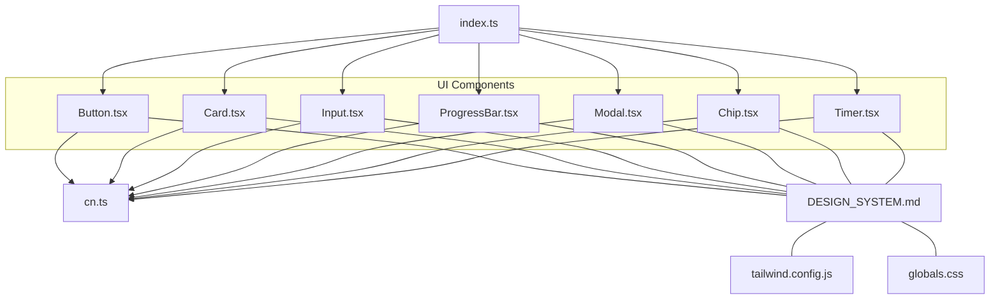
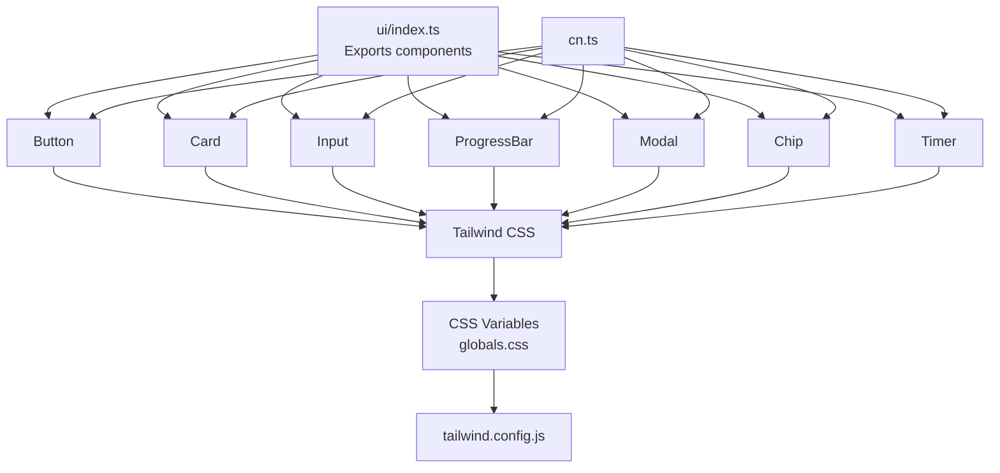
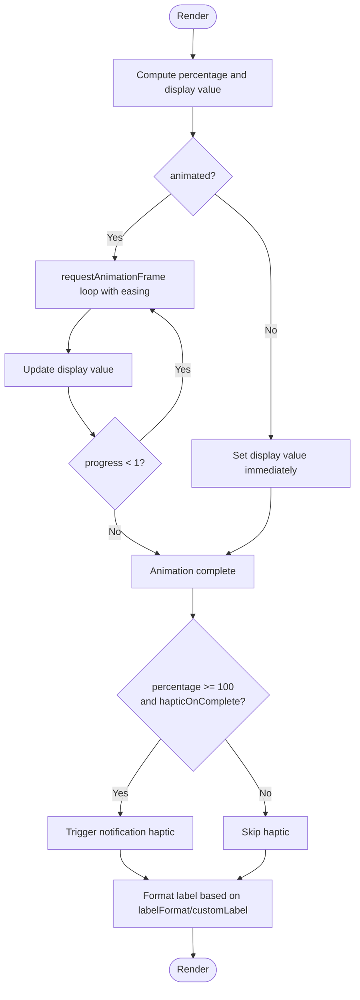
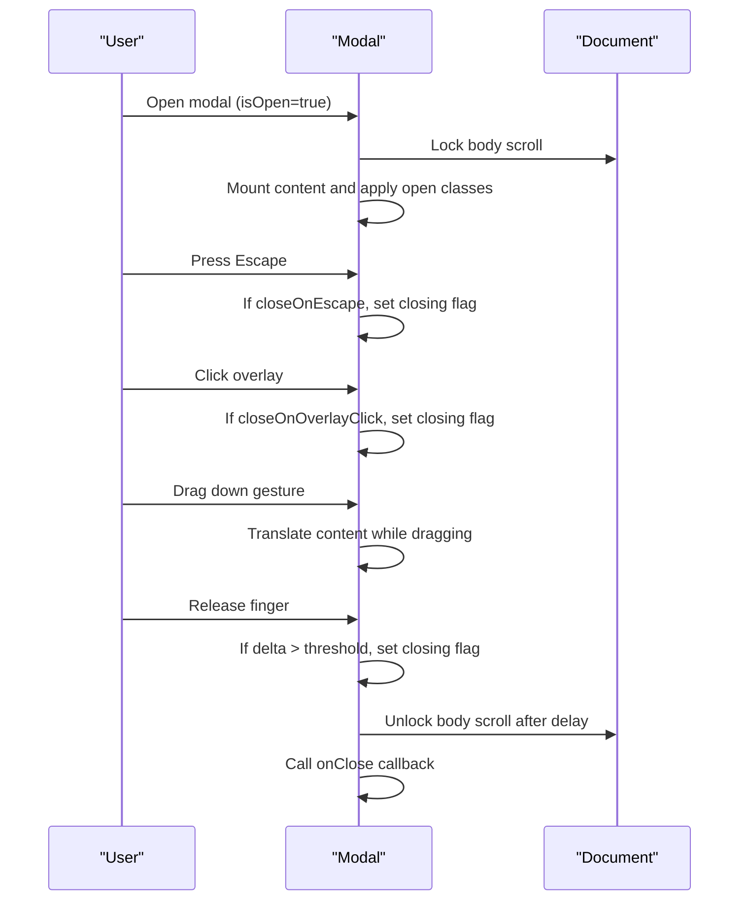
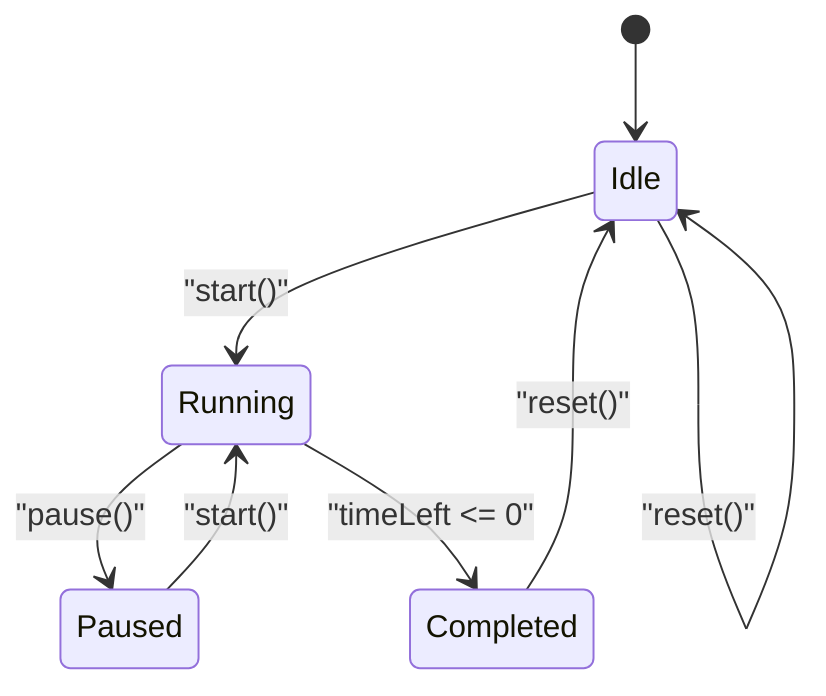
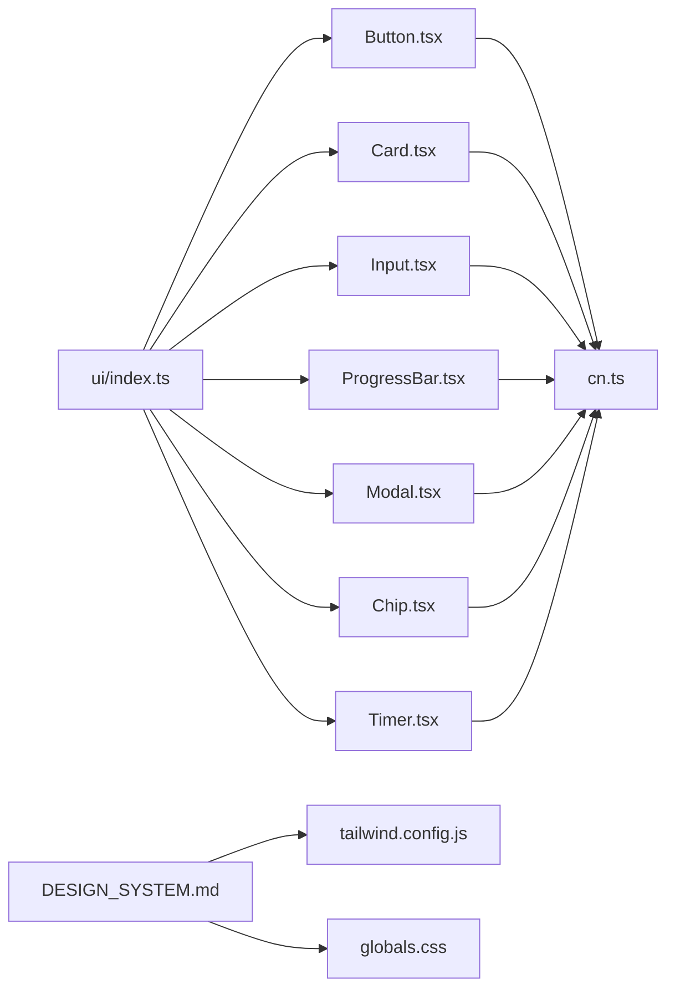

# UI Component Library

<cite>
**Referenced Files in This Document**
- [index.ts](file://frontend/src/components/ui/index.ts)
- [Button.tsx](file://frontend/src/components/ui/Button.tsx)
- [Card.tsx](file://frontend/src/components/ui/Card.tsx)
- [Input.tsx](file://frontend/src/components/ui/Input.tsx)
- [ProgressBar.tsx](file://frontend/src/components/ui/ProgressBar.tsx)
- [Modal.tsx](file://frontend/src/components/ui/Modal.tsx)
- [Chip.tsx](file://frontend/src/components/ui/Chip.tsx)
- [Timer.tsx](file://frontend/src/components/ui/Timer.tsx)
- [DESIGN_SYSTEM.md](file://frontend/DESIGN_SYSTEM.md)
- [tailwind.config.js](file://frontend/tailwind.config.js)
- [globals.css](file://frontend/src/styles/globals.css)
- [cn.ts](file://frontend/src/utils/cn.ts)
- [DesignSystemDemo.tsx](file://frontend/src/components/ui/DesignSystemDemo.tsx)
- [Button.test.tsx](file://frontend/src/__tests__/components/Button.test.tsx)
- [package.json](file://frontend/package.json)
</cite>

## Table of Contents
1. [Introduction](#introduction)
2. [Project Structure](#project-structure)
3. [Core Components](#core-components)
4. [Architecture Overview](#architecture-overview)
5. [Detailed Component Analysis](#detailed-component-analysis)
6. [Dependency Analysis](#dependency-analysis)
7. [Performance Considerations](#performance-considerations)
8. [Accessibility and UX](#accessibility-and-ux)
9. [Responsive Behavior and Cross-Browser Compatibility](#responsive-behavior-and-cross-browser-compatibility)
10. [Extensibility and Design Consistency Guidelines](#extensibility-and-design-consistency-guidelines)
11. [Troubleshooting Guide](#troubleshooting-guide)
12. [Conclusion](#conclusion)

## Introduction
This document describes the FitTracker Pro UI component library, focusing on reusable components such as Button, Card, Input, ProgressBar, Modal, Chip, and Timer. It explains component props, TypeScript interfaces, styling patterns, customization options, and integration patterns. It also documents the design system principles, color schemes, typography, spacing, and Telegram Mini App integration. Guidance is included for component composition, state management, event handling, accessibility, responsiveness, and extending the library while maintaining design consistency.

## Project Structure
The UI components live under the frontend/src/components/ui directory and are re-exported via a central index file. They rely on Tailwind CSS for styling, with design tokens defined in CSS variables and extended via tailwind.config.js. Utilities like cn combine clsx and tailwind-merge for robust class merging.



**Diagram sources**
- [index.ts:1-25](file://frontend/src/components/ui/index.ts#L1-L25)
- [Button.tsx:1-184](file://frontend/src/components/ui/Button.tsx#L1-L184)
- [Card.tsx:1-175](file://frontend/src/components/ui/Card.tsx#L1-L175)
- [Input.tsx:1-301](file://frontend/src/components/ui/Input.tsx#L1-L301)
- [ProgressBar.tsx:1-225](file://frontend/src/components/ui/ProgressBar.tsx#L1-L225)
- [Modal.tsx:1-282](file://frontend/src/components/ui/Modal.tsx#L1-L282)
- [Chip.tsx:1-229](file://frontend/src/components/ui/Chip.tsx#L1-L229)
- [Timer.tsx:1-345](file://frontend/src/components/ui/Timer.tsx#L1-L345)
- [DESIGN_SYSTEM.md:1-410](file://frontend/DESIGN_SYSTEM.md#L1-L410)
- [tailwind.config.js:1-349](file://frontend/tailwind.config.js#L1-L349)
- [globals.css:1-581](file://frontend/src/styles/globals.css#L1-L581)
- [cn.ts:1-7](file://frontend/src/utils/cn.ts#L1-L7)

**Section sources**
- [index.ts:1-25](file://frontend/src/components/ui/index.ts#L1-L25)
- [DESIGN_SYSTEM.md:1-410](file://frontend/DESIGN_SYSTEM.md#L1-L410)
- [tailwind.config.js:1-349](file://frontend/tailwind.config.js#L1-L349)
- [globals.css:1-581](file://frontend/src/styles/globals.css#L1-L581)
- [cn.ts:1-7](file://frontend/src/utils/cn.ts#L1-L7)

## Core Components
This section summarizes each component’s purpose, props, variants, and key behaviors.

- Button
  - Purpose: Primary, secondary, tertiary, emergency, and ghost variants with optional icons, loading state, full width, and haptic feedback.
  - Key props: variant, size, isLoading, leftIcon, rightIcon, fullWidth, haptic.
  - Accessibility: Disabled states, aria attributes, keyboard operability via forwardRef.
  - Telegram integration: Haptic feedback via WebApp SDK.

- Card
  - Purpose: Variant cards for workouts, exercises, stats, and info with optional title/subtitle, clickability, and haptic feedback.
  - Key props: variant, title, subtitle, onClick, disableHover, haptic.
  - Accessibility: Role and keyboard support for clickable cards.

- Input
  - Purpose: Text, number, password, and search inputs with validation states, helper/error text, icons, and haptic feedback.
  - Key props: type, label, error, helperText, leftIcon, rightIcon, validationState, fullWidth, haptic.
  - Password visibility toggling and focus/blur haptics.

- ProgressBar
  - Purpose: Animated progress indicator with color variants, label formatting, and haptic feedback on completion.
  - Key props: value, max, color, showLabel, animated, size, labelFormat, customLabel, hapticOnComplete.

- Modal
  - Purpose: Bottom sheet-like modal with overlay, escape-to-close, click-outside-to-close, drag-to-dismiss, and Telegram haptic feedback.
  - Key props: isOpen, onClose, title, children, className, closeOnOverlayClick, closeOnEscape, showHandle, size, haptic.

- Chip and ChipGroup
  - Purpose: Selectable tag chips with default/outlined/filled variants, active state, and group layout controls.
  - Key props: label, active, onClick, icon, size, disabled, haptic, variant; ChipGroup: direction, wrap, gap, className.

- Timer
  - Purpose: Circular and digital timers with controls, haptic feedback, and completion callbacks.
  - Key props: duration, onComplete, onTick, variant, autoStart, size, showControls, haptic.

**Section sources**
- [Button.tsx:4-184](file://frontend/src/components/ui/Button.tsx#L4-L184)
- [Card.tsx:4-175](file://frontend/src/components/ui/Card.tsx#L4-L175)
- [Input.tsx:4-301](file://frontend/src/components/ui/Input.tsx#L4-L301)
- [ProgressBar.tsx:4-225](file://frontend/src/components/ui/ProgressBar.tsx#L4-L225)
- [Modal.tsx:5-282](file://frontend/src/components/ui/Modal.tsx#L5-L282)
- [Chip.tsx:4-229](file://frontend/src/components/ui/Chip.tsx#L4-L229)
- [Timer.tsx:4-345](file://frontend/src/components/ui/Timer.tsx#L4-L345)

## Architecture Overview
The UI library follows a modular export pattern. Each component is self-contained with TypeScript interfaces and styled using Tailwind utilities and design tokens. Utilities like cn merge classes safely. The design system is centralized in DESIGN_SYSTEM.md and configured via tailwind.config.js and globals.css.



**Diagram sources**
- [index.ts:5-24](file://frontend/src/components/ui/index.ts#L5-L24)
- [globals.css:9-118](file://frontend/src/styles/globals.css#L9-L118)
- [tailwind.config.js:13-150](file://frontend/tailwind.config.js#L13-L150)
- [cn.ts:4-6](file://frontend/src/utils/cn.ts#L4-L6)

## Detailed Component Analysis

### Button
- Props and Variants
  - variant: primary, secondary, tertiary, emergency, ghost
  - size: sm, md, lg
  - isLoading: disables and shows spinner
  - leftIcon/rightIcon: optional icons
  - fullWidth: stretch to container width
  - haptic: haptic impact level or false
- Styling and Composition
  - Uses variant and size style maps; merges with className via cn.
  - Full-width controlled via conditional class.
  - Loading state renders spinner and text together.
- Accessibility
  - Disabled state and aria-disabled/aria-busy.
  - Focus ring and outline management.
- Telegram Integration
  - Haptic feedback via Telegram.WebApp.HapticFeedback on click.

```mermaid
classDiagram
class ButtonProps {
+variant : ButtonVariant
+size : ButtonSize
+isLoading : boolean
+leftIcon : ReactNode
+rightIcon : ReactNode
+fullWidth : boolean
+haptic : "light"|"medium"|"heavy"|"rigid"|"soft"|false
}
class ButtonVariant {
<<enum>>
"primary"
"secondary"
"tertiary"
"emergency"
"ghost"
}
class ButtonSize {
<<enum>>
"sm"
"md"
"lg"
}
ButtonProps --> ButtonVariant
ButtonProps --> ButtonSize
```

**Diagram sources**
- [Button.tsx:4-22](file://frontend/src/components/ui/Button.tsx#L4-L22)

**Section sources**
- [Button.tsx:4-184](file://frontend/src/components/ui/Button.tsx#L4-L184)

### Card
- Props and Variants
  - variant: workout, exercise, stats, info
  - title/subtitle: optional header
  - onClick: makes card clickable with role and keyboard support
  - disableHover: suppress hover effects
  - haptic: haptic feedback on click
- Styling and Composition
  - Variant-specific background, borders, shadows, and padding.
  - Clickable cards receive focus ring and active scaling.
- Accessibility
  - Role="button", tabIndex, Enter/Space activation.

```mermaid
classDiagram
class CardProps {
+variant : CardVariant
+title : string
+subtitle : string
+onClick() : void
+disableHover : boolean
+haptic : "light"|"medium"|"heavy"|false
}
class CardVariant {
<<enum>>
"workout"
"exercise"
"stats"
"info"
}
CardProps --> CardVariant
```

**Diagram sources**
- [Card.tsx:4-21](file://frontend/src/components/ui/Card.tsx#L4-L21)

**Section sources**
- [Card.tsx:4-175](file://frontend/src/components/ui/Card.tsx#L4-L175)

### Input
- Props and Validation
  - type: text, number, password, search
  - validationState: default, error, success
  - label, error, helperText, leftIcon, rightIcon
  - fullWidth, haptic
- Special Behaviors
  - Password visibility toggle.
  - Focus/blur handlers trigger haptic feedback.
  - Conditional icon visibility per type.
- Accessibility
  - Proper aria-invalid and aria-describedby.
  - Label association via htmlFor.

```mermaid
classDiagram
class InputProps {
+type : InputType
+validationState : InputValidationState
+label : string
+error : string
+helperText : string
+leftIcon : ReactNode
+rightIcon : ReactNode
+fullWidth : boolean
+haptic : boolean
}
class InputType {
<<enum>>
"text"
"number"
"password"
"search"
}
class InputValidationState {
<<enum>>
"default"
"error"
"success"
}
InputProps --> InputType
InputProps --> InputValidationState
```

**Diagram sources**
- [Input.tsx:4-26](file://frontend/src/components/ui/Input.tsx#L4-L26)

**Section sources**
- [Input.tsx:4-301](file://frontend/src/components/ui/Input.tsx#L4-L301)

### ProgressBar
- Props and Features
  - value, max, color, showLabel, animated, size, labelFormat, customLabel, hapticOnComplete.
  - Animated fill with easing; completion haptic feedback.
  - Label formatting: percent, value, fraction.
- Accessibility
  - ARIA role and valuenow/min/max attributes.



**Diagram sources**
- [ProgressBar.tsx:79-225](file://frontend/src/components/ui/ProgressBar.tsx#L79-L225)

**Section sources**
- [ProgressBar.tsx:4-225](file://frontend/src/components/ui/ProgressBar.tsx#L4-L225)

### Modal
- Props and Interactions
  - isOpen, onClose, title, children, className, closeOnOverlayClick, closeOnEscape, showHandle, size, haptic.
  - Overlay click, Escape key, and drag-to-dismiss gestures.
  - Body scroll locking during open state.
- Accessibility
  - aria-modal and role="dialog".
  - Focus management and keyboard interactions.



**Diagram sources**
- [Modal.tsx:58-282](file://frontend/src/components/ui/Modal.tsx#L58-L282)

**Section sources**
- [Modal.tsx:5-282](file://frontend/src/components/ui/Modal.tsx#L5-L282)

### Chip and ChipGroup
- Chip
  - Props: label, active, onClick, icon, size, disabled, haptic, variant.
  - Variants: default, outlined, filled; active state shows checkmark.
- ChipGroup
  - Props: children, direction, wrap, gap, className.
  - Provides layout and grouping semantics.

```mermaid
classDiagram
class ChipProps {
+label : string
+active : boolean
+onClick(active) : void
+icon : ReactNode
+size : ChipSize
+disabled : boolean
+haptic : boolean
+variant : "default"|"outlined"|"filled"
}
class ChipSize {
<<enum>>
"sm"
"md"
}
ChipProps --> ChipSize
```

**Diagram sources**
- [Chip.tsx:4-23](file://frontend/src/components/ui/Chip.tsx#L4-L23)

**Section sources**
- [Chip.tsx:4-229](file://frontend/src/components/ui/Chip.tsx#L4-L229)

### Timer
- Props and States
  - duration, onComplete, onTick, variant, autoStart, size, showControls, haptic.
  - Internal state: timeLeft, timerState (idle, running, paused, completed).
- Rendering
  - Circular: SVG progress ring with centered digital time.
  - Digital: large digital time and progress bar.
- Interactions
  - Start/Pause/Reset controls; haptic feedback on actions.



**Diagram sources**
- [Timer.tsx:61-345](file://frontend/src/components/ui/Timer.tsx#L61-L345)

**Section sources**
- [Timer.tsx:4-345](file://frontend/src/components/ui/Timer.tsx#L4-L345)

## Dependency Analysis
- Component exports: ui/index.ts aggregates all components and their TypeScript types.
- Styling foundation: globals.css defines CSS variables and component classes; tailwind.config.js extends Tailwind with design tokens, animations, shadows, and Telegram theme variables.
- Utility: cn.ts merges classes using clsx and tailwind-merge to avoid conflicts.
- Testing: Button.test.tsx demonstrates unit testing patterns for click, loading, and variant rendering.



**Diagram sources**
- [index.ts:1-25](file://frontend/src/components/ui/index.ts#L1-L25)
- [cn.ts:1-7](file://frontend/src/utils/cn.ts#L1-L7)
- [DESIGN_SYSTEM.md:1-410](file://frontend/DESIGN_SYSTEM.md#L1-L410)
- [tailwind.config.js:1-349](file://frontend/tailwind.config.js#L1-L349)
- [globals.css:1-581](file://frontend/src/styles/globals.css#L1-L581)

**Section sources**
- [index.ts:1-25](file://frontend/src/components/ui/index.ts#L1-L25)
- [cn.ts:1-7](file://frontend/src/utils/cn.ts#L1-L7)
- [DESIGN_SYSTEM.md:1-410](file://frontend/DESIGN_SYSTEM.md#L1-L410)
- [tailwind.config.js:1-349](file://frontend/tailwind.config.js#L1-L349)
- [globals.css:1-581](file://frontend/src/styles/globals.css#L1-L581)

## Performance Considerations
- Prefer variant and size style maps to minimize runtime style computation.
- Use cn for class merging to reduce redundant or conflicting classes.
- For ProgressBar, animated transitions are optimized with requestAnimationFrame and easing; avoid excessive re-renders by controlling value updates efficiently.
- Modal leverages portal rendering and minimal DOM updates; ensure isOpen changes are debounced if needed.
- Timers use intervals; clean up properly on unmount and when duration changes.

## Accessibility and UX
- Focus management: Components expose focus rings and outline resets; ensure keyboard navigation works (Enter/Space for interactive elements).
- ARIA attributes: ProgressBar exposes role and value attributes; Modal sets aria-modal and role="dialog"; Button and Input manage aria-disabled and aria-invalid.
- Touch interactions: Components use touch-manipulation utilities and haptic feedback for tactile feedback on supported platforms.
- Semantic roles: Clickable cards use role="button" and proper keyboard activation.

**Section sources**
- [Button.tsx:104-142](file://frontend/src/components/ui/Button.tsx#L104-L142)
- [Card.tsx:86-115](file://frontend/src/components/ui/Card.tsx#L86-L115)
- [ProgressBar.tsx:174-179](file://frontend/src/components/ui/ProgressBar.tsx#L174-L179)
- [Modal.tsx:187-189](file://frontend/src/components/ui/Modal.tsx#L187-L189)

## Responsive Behavior and Cross-Browser Compatibility
- Responsive utilities: globals.css includes container-mobile and media queries for mobile-first padding.
- Safe areas: Utilities for safe-area insets ensure content avoids device notches and home indicators.
- Scrollbar hiding: no-scrollbar utility preserves functionality while hiding native scrollbars.
- Typography and spacing: Tailwind theme defines font sizes, weights, radii, shadows, and spacing scales.
- Cross-browser: Tailwind base styles normalize borders and apply antialiasing; CSS variables adapt to Telegram themes.

**Section sources**
- [globals.css:570-581](file://frontend/src/styles/globals.css#L570-L581)
- [globals.css:330-369](file://frontend/src/styles/globals.css#L330-L369)
- [tailwind.config.js:155-180](file://frontend/tailwind.config.js#L155-L180)
- [tailwind.config.js:328-344](file://frontend/tailwind.config.js#L328-L344)

## Extensibility and Design Consistency Guidelines
- Extend via:
  - Adding new variants or sizes in existing components’ style maps.
  - Introducing new semantic colors in CSS variables and tailwind.config.js.
  - Creating new component groups (e.g., Tabs, Pagination) following the same export pattern in ui/index.ts.
- Maintain consistency:
  - Use cn for class merging.
  - Define new component classes in globals.css under @layer components.
  - Keep TypeScript interfaces cohesive and export them from ui/index.ts.
  - Mirror Telegram theme variables and dark mode variables in CSS.
- Demo and documentation:
  - Use DesignSystemDemo to showcase new components and variants.
  - Reference DESIGN_SYSTEM.md for usage patterns and examples.

**Section sources**
- [index.ts:1-25](file://frontend/src/components/ui/index.ts#L1-L25)
- [DESIGN_SYSTEM.md:1-410](file://frontend/DESIGN_SYSTEM.md#L1-L410)
- [globals.css:9-118](file://frontend/src/styles/globals.css#L9-L118)
- [tailwind.config.js:13-150](file://frontend/tailwind.config.js#L13-L150)

## Troubleshooting Guide
- Button does not respond when isLoading is true
  - isLoading disables the button; ensure loading state is cleared when appropriate.
- Input icons overlap or disappear
  - Check leftIcon/rightIcon conditions and type-specific spacing classes.
- Modal remains scrollable or does not close
  - Verify isOpen lifecycle and close handlers; confirm body scroll lock cleanup.
- ProgressBar label not updating
  - Ensure value and max change triggers re-render; verify labelFormat/customLabel logic.
- Chip active state not reflected
  - Confirm onClick handler receives and toggles active state; check variant-specific styles.
- Timer not starting
  - Ensure autoStart or explicit start() is called; verify haptic availability in Telegram environment.

**Section sources**
- [Button.tsx:118-120](file://frontend/src/components/ui/Button.tsx#L118-L120)
- [Input.tsx:193-197](file://frontend/src/components/ui/Input.tsx#L193-L197)
- [Modal.tsx:93-101](file://frontend/src/components/ui/Modal.tsx#L93-L101)
- [ProgressBar.tsx:96-131](file://frontend/src/components/ui/ProgressBar.tsx#L96-L131)
- [Chip.tsx:89-90](file://frontend/src/components/ui/Chip.tsx#L89-L90)
- [Timer.tsx:105-122](file://frontend/src/components/ui/Timer.tsx#L105-L122)

## Conclusion
The FitTracker Pro UI component library provides a cohesive, accessible, and extensible design system built on React, TypeScript, and Tailwind CSS. Components are designed with Telegram Mini App integration, responsive behavior, and consistent styling through design tokens. By following the documented patterns and guidelines, teams can extend the library while preserving design consistency and user experience.