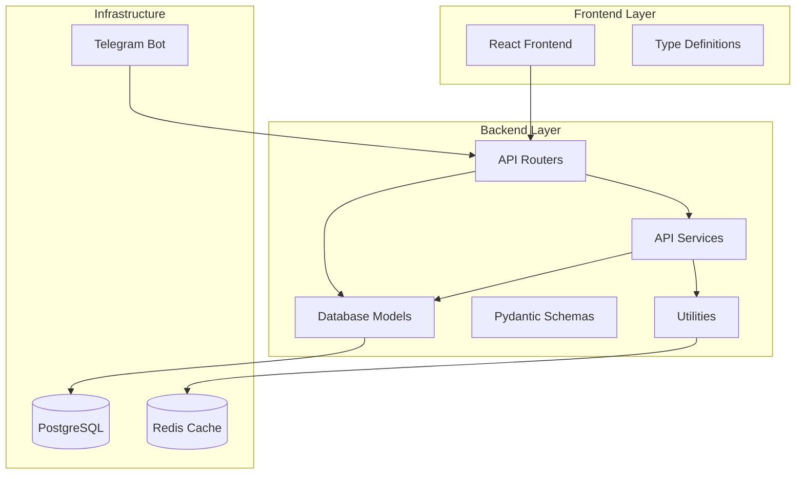
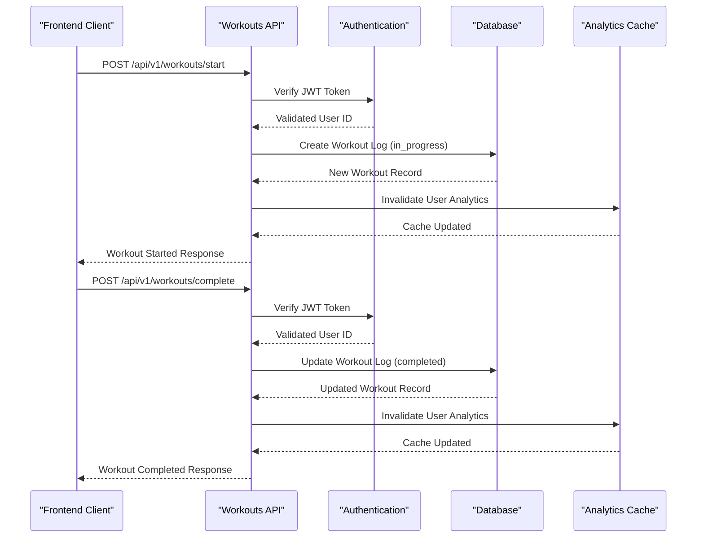
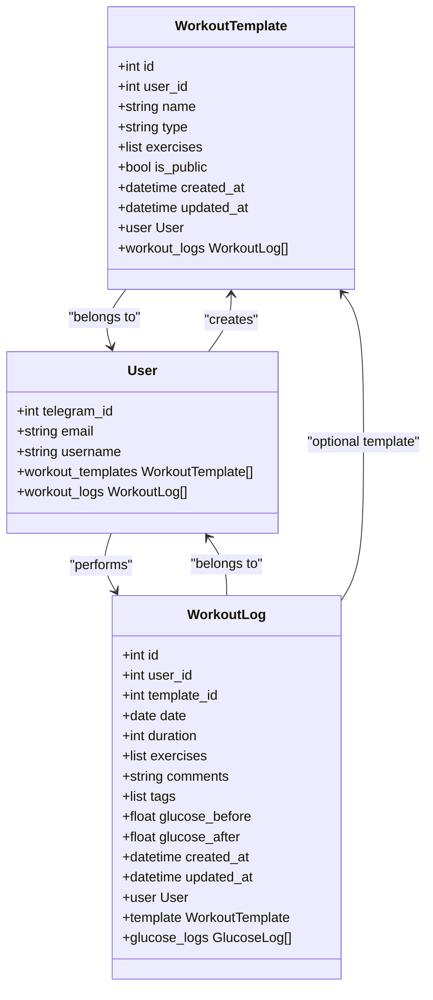
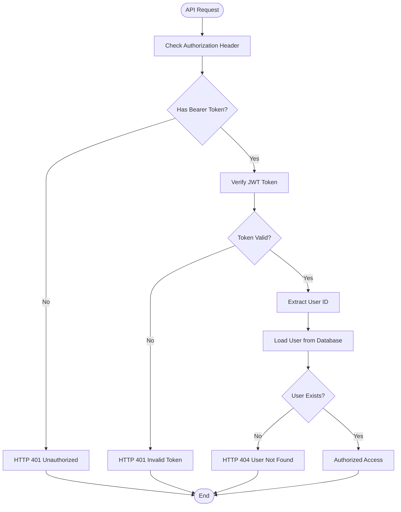
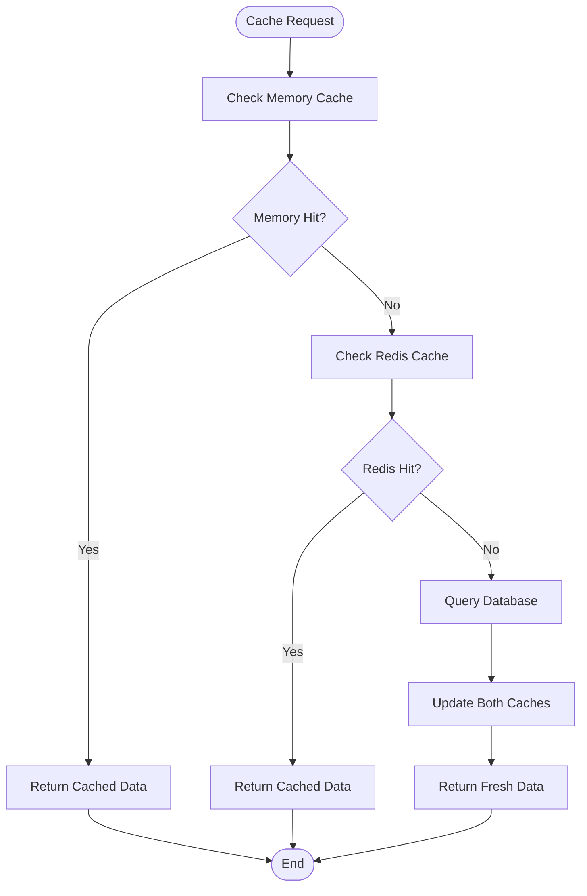
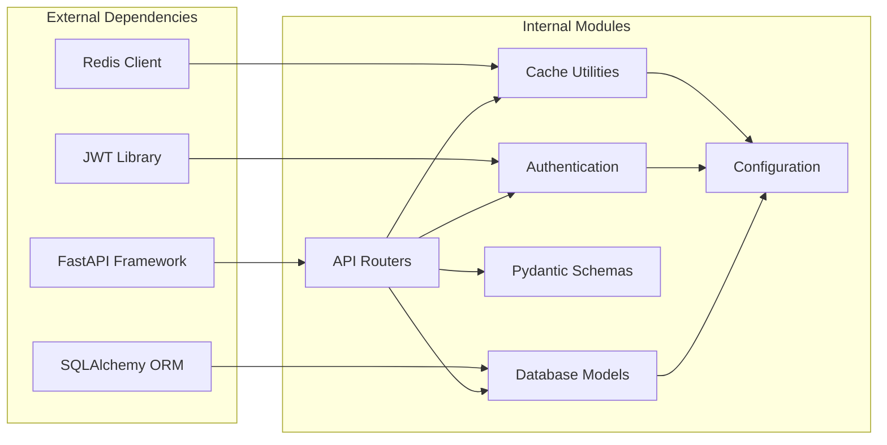

# Workout Service

<cite>
**Referenced Files in This Document**
- [workouts.py](file://backend/app/api/workouts.py)
- [workout_log.py](file://backend/app/models/workout_log.py)
- [workout_template.py](file://backend/app/models/workout_template.py)
- [workouts.py](file://backend/app/schemas/workouts.py)
- [main.py](file://backend/app/main.py)
- [auth.py](file://backend/app/middleware/auth.py)
- [cache.py](file://backend/app/utils/cache.py)
- [config.py](file://backend/app/utils/config.py)
- [workouts.ts](file://frontend/src/services/workouts.ts)
- [workouts.ts](file://frontend/src/types/workouts.ts)
</cite>

## Table of Contents
1. [Introduction](#introduction)
2. [Project Structure](#project-structure)
3. [Core Components](#core-components)
4. [Architecture Overview](#architecture-overview)
5. [Detailed Component Analysis](#detailed-component-analysis)
6. [Dependency Analysis](#dependency-analysis)
7. [Performance Considerations](#performance-considerations)
8. [Troubleshooting Guide](#troubleshooting-guide)
9. [Conclusion](#conclusion)

## Introduction

The Workout Service is a comprehensive fitness tracking system built as part of the FitTracker Pro Telegram Mini App ecosystem. This service manages workout templates, workout sessions, and historical workout data while providing robust authentication, caching, and analytics capabilities.

The service enables users to create personalized workout templates, track their exercise sessions in real-time, and maintain detailed workout histories with metrics like duration, exercises performed, comments, tags, and blood glucose monitoring for diabetic users.

## Project Structure

The Workout Service follows a modular FastAPI architecture with clear separation of concerns:

**Diagram sources**
- [main.py:123-139](file://backend/app/main.py#L123-L139)
- [workouts.py:27](file://backend/app/api/workouts.py#L27)

**Section sources**
- [main.py:122-139](file://backend/app/main.py#L122-L139)
- [workouts.py:27](file://backend/app/api/workouts.py#L27)

## Core Components

### Workout Template Management
The system provides comprehensive workout template functionality allowing users to create, manage, and reuse workout routines:

- **Template Creation**: Users can define custom workout templates with exercises, sets, reps, and rest periods
- **Template Types**: Supports cardio, strength, flexibility, and mixed workout types
- **Public Templates**: Option to share templates publicly within the system
- **Template Retrieval**: Paginated listing with filtering capabilities

### Workout Session Tracking
Real-time workout session management with comprehensive exercise tracking:

- **Session Start**: Creates workout logs with initial status tracking
- **Exercise Completion**: Detailed tracking of sets, reps, weights, and durations
- **Session Completion**: Finalizes workout with duration, comments, and metrics
- **Glucose Monitoring**: Blood glucose tracking before and after workouts for diabetic users

### Workout History Management
Persistent storage and retrieval of completed workout sessions:

- **Historical Tracking**: Comprehensive workout history with filtering by date ranges
- **Pagination Support**: Efficient pagination for large workout histories
- **Metrics Storage**: Duration, exercises performed, comments, and tags
- **Analytics Integration**: Automatic cache invalidation for real-time analytics updates

**Section sources**
- [workouts.py:30-106](file://backend/app/api/workouts.py#L30-L106)
- [workouts.py:261-335](file://backend/app/api/workouts.py#L261-L335)
- [workouts.py:338-496](file://backend/app/api/workouts.py#L338-L496)

## Architecture Overview

The Workout Service implements a layered architecture with clear separation between presentation, business logic, and data persistence:

**Diagram sources**
- [workouts.py:338-414](file://backend/app/api/workouts.py#L338-L414)
- [workouts.py:417-496](file://backend/app/api/workouts.py#L417-L496)
- [auth.py:174-202](file://backend/app/middleware/auth.py#L174-L202)

The architecture ensures thread-safe asynchronous operations, proper error handling, and efficient resource utilization through connection pooling and caching mechanisms.

**Section sources**
- [main.py:89-108](file://backend/app/main.py#L89-L108)
- [workouts.py:8](file://backend/app/api/workouts.py#L8)

## Detailed Component Analysis

### Database Models

The Workout Service utilizes SQLAlchemy ORM for robust data persistence with comprehensive indexing and relationships:

**Diagram sources**
- [workout_template.py:18-79](file://backend/app/models/workout_template.py#L18-L79)
- [workout_log.py:19-108](file://backend/app/models/workout_log.py#L19-L108)

The models implement comprehensive indexing strategies for optimal query performance:

- **WorkoutTemplate**: Indexed by user_id, type, is_public, and created_at for efficient filtering and sorting
- **WorkoutLog**: Indexed by user_id, template_id, date, and composite user_date for pagination and filtering
- **Foreign Key Constraints**: Proper cascading deletes and null handling for referential integrity

**Section sources**
- [workout_template.py:74-79](file://backend/app/models/workout_template.py#L74-L79)
- [workout_log.py:103-108](file://backend/app/models/workout_log.py#L103-L108)

### API Endpoints

The Workout Service exposes a comprehensive set of RESTful endpoints:

#### Template Management Endpoints
- **GET /api/v1/workouts/templates**: Retrieve paginated workout templates with optional type filtering
- **POST /api/v1/workouts/templates**: Create new workout templates with exercise configurations
- **GET /api/v1/workouts/templates/{template_id}**: Retrieve specific template by ID
- **PUT /api/v1/workouts/templates/{template_id}**: Update existing templates
- **DELETE /api/v1/workouts/templates/{template_id}**: Remove templates

#### Workout Session Endpoints
- **GET /api/v1/workouts/history**: Retrieve workout history with date range filtering
- **GET /api/v1/workouts/history/{workout_id}**: Retrieve specific workout details
- **POST /api/v1/workouts/start**: Start a new workout session
- **POST /api/v1/workouts/complete**: Complete an ongoing workout session

Each endpoint implements comprehensive validation, authentication, and error handling mechanisms.

**Section sources**
- [workouts.py:30-106](file://backend/app/api/workouts.py#L30-L106)
- [workouts.py:261-335](file://backend/app/api/workouts.py#L261-L335)
- [workouts.py:338-496](file://backend/app/api/workouts.py#L338-L496)

### Authentication and Security

The system implements robust JWT-based authentication with comprehensive security measures:

**Diagram sources**
- [auth.py:133-202](file://backend/app/middleware/auth.py#L133-L202)

The authentication system provides:
- **Token Generation**: Access tokens with configurable expiration, refresh tokens for extended sessions
- **Token Verification**: Secure JWT verification with algorithm validation
- **User Loading**: Efficient user loading from database with proper error handling
- **Role-Based Access**: Extensible framework for administrative privileges

**Section sources**
- [auth.py:21-76](file://backend/app/middleware/auth.py#L21-L76)
- [auth.py:174-202](file://backend/app/middleware/auth.py#L174-L202)

### Caching and Analytics

The system implements a sophisticated caching layer for improved performance and real-time analytics:

**Diagram sources**
- [cache.py:59-103](file://backend/app/utils/cache.py#L59-L103)

Key caching features include:
- **Dual-Level Caching**: In-memory cache for local speed + Redis for distributed caching
- **Automatic Invalidation**: Smart cache invalidation on workout data changes
- **Configurable TTL**: Flexible time-to-live settings for different cache types
- **Analytics Integration**: Specialized cache invalidation for user analytics data

**Section sources**
- [cache.py:106-131](file://backend/app/utils/cache.py#L106-L131)
- [config.py:25-35](file://backend/app/utils/config.py#L25-L35)

## Dependency Analysis

The Workout Service maintains clean dependency relationships with minimal coupling between components:

**Diagram sources**
- [requirements.txt:1-42](file://backend/requirements.txt#L1-L42)
- [main.py:14-25](file://backend/app/main.py#L14-L25)

The dependency structure ensures:
- **Loose Coupling**: Modules depend on abstractions rather than concrete implementations
- **Clear Interfaces**: Well-defined boundaries between different layers
- **Testability**: Easy mocking and testing of individual components
- **Maintainability**: Independent evolution of different service components

**Section sources**
- [requirements.txt:1-42](file://backend/requirements.txt#L1-L42)
- [main.py:14-25](file://backend/app/main.py#L14-L25)

## Performance Considerations

The Workout Service implements several performance optimization strategies:

### Database Optimization
- **Indexing Strategy**: Strategic indexing on frequently queried columns (user_id, date, type)
- **Connection Pooling**: Asynchronous connection pooling for efficient database resource utilization
- **Query Optimization**: Subquery-based pagination for efficient large dataset handling
- **JSON Storage**: Flexible JSONB storage for exercise configurations without schema rigidity

### Caching Strategy
- **Multi-Level Caching**: In-memory cache for local speed + Redis for distributed caching
- **Smart Invalidation**: Targeted cache invalidation on data changes
- **Configurable TTL**: Tunable cache expiration for different data types
- **Memory Management**: Automatic cleanup of expired cache entries

### API Performance
- **Asynchronous Operations**: Non-blocking I/O for improved concurrency
- **Pagination**: Efficient pagination for large datasets
- **Validation**: Early validation to prevent unnecessary database operations
- **Resource Cleanup**: Proper resource management and connection closing

## Troubleshooting Guide

### Common Issues and Solutions

#### Authentication Problems
- **Symptom**: HTTP 401 Unauthorized errors
- **Cause**: Invalid or missing JWT tokens
- **Solution**: Ensure proper Bearer token format in Authorization header

#### Database Connection Issues
- **Symptom**: Operational errors during database operations
- **Cause**: Connection pool exhaustion or database downtime
- **Solution**: Check database connectivity and connection pool configuration

#### Cache Invalidation Problems
- **Symptom**: Stale analytics data after workout completion
- **Cause**: Cache not being invalidated properly
- **Solution**: Verify cache invalidation calls in workout completion endpoints

#### Performance Issues
- **Symptom**: Slow response times for workout history queries
- **Cause**: Missing database indexes or inefficient queries
- **Solution**: Review query execution plans and add appropriate indexes

**Section sources**
- [auth.py:148-171](file://backend/app/middleware/auth.py#L148-L171)
- [cache.py:106-131](file://backend/app/utils/cache.py#L106-L131)

## Conclusion

The Workout Service represents a robust, scalable solution for fitness tracking with comprehensive features for workout template management, real-time session tracking, and historical data analysis. The service demonstrates excellent architectural principles with clear separation of concerns, comprehensive error handling, and performance optimizations.

Key strengths include:
- **Modular Design**: Clean separation between API, business logic, and data persistence
- **Security Focus**: Robust JWT authentication with proper user validation
- **Performance Optimization**: Multi-level caching and efficient database operations
- **Extensibility**: Well-designed interfaces for future feature additions
- **Monitoring Ready**: Built-in Sentry integration for production monitoring

The service provides a solid foundation for the FitTracker Pro ecosystem and can be easily extended to support additional fitness tracking features, integration with wearable devices, and advanced analytics capabilities.