# Workout Types System

<cite>
**Referenced Files in This Document**
- [workout_template.py](file://backend/app/models/workout_template.py)
- [workout_log.py](file://backend/app/models/workout_log.py)
- [workouts.py](file://backend/app/schemas/workouts.py)
- [workouts.py](file://backend/app/api/workouts.py)
- [workouts.ts](file://frontend/src/services/workouts.ts)
- [workouts.ts](file://frontend/src/types/workouts.ts)
- [WorkoutBuilder.tsx](file://frontend/src/pages/WorkoutBuilder.tsx)
- [WorkoutsPage.tsx](file://frontend/src/pages/WorkoutsPage.tsx)
- [WorkoutDetailPage.tsx](file://frontend/src/pages/WorkoutDetailPage.tsx)
- [App.tsx](file://frontend/src/App.tsx)
- [exercises.py](file://backend/app/api/exercises.py)
- [exercise.py](file://backend/app/models/exercise.py)
- [schema_v2.sql (legacy archive)](file://docs/db/legacy/schema_v2.sql)
</cite>

## Table of Contents
1. [Introduction](#introduction)
2. [System Architecture](#system-architecture)
3. [Core Components](#core-components)
4. [Workout Template System](#workout-template-system)
5. [Workout Logging System](#workout-logging-system)
6. [Exercise Catalog Integration](#exercise-catalog-integration)
7. [Frontend Implementation](#frontend-implementation)
8. [Data Flow Analysis](#data-flow-analysis)
9. [Performance Considerations](#performance-considerations)
10. [Troubleshooting Guide](#troubleshooting-guide)
11. [Conclusion](#conclusion)

## Introduction

The Workout Types System in Fit Tracker Pro is a comprehensive fitness tracking solution that enables users to create, manage, and track various types of workouts. The system supports four primary workout categories: cardio, strength, flexibility, and mixed workouts, with additional support for custom workout types. This system integrates seamlessly with the broader Fit Tracker Pro ecosystem, providing users with personalized workout experiences while maintaining data integrity and performance optimization.

The system is built on a modern tech stack featuring FastAPI for the backend, PostgreSQL with JSONB support for data storage, and React with TypeScript for the frontend. It leverages Telegram WebApp integration for enhanced mobile experience and includes sophisticated caching mechanisms for optimal performance.

## System Architecture

The Workout Types System follows a layered architecture pattern with clear separation of concerns between presentation, business logic, and data persistence layers.

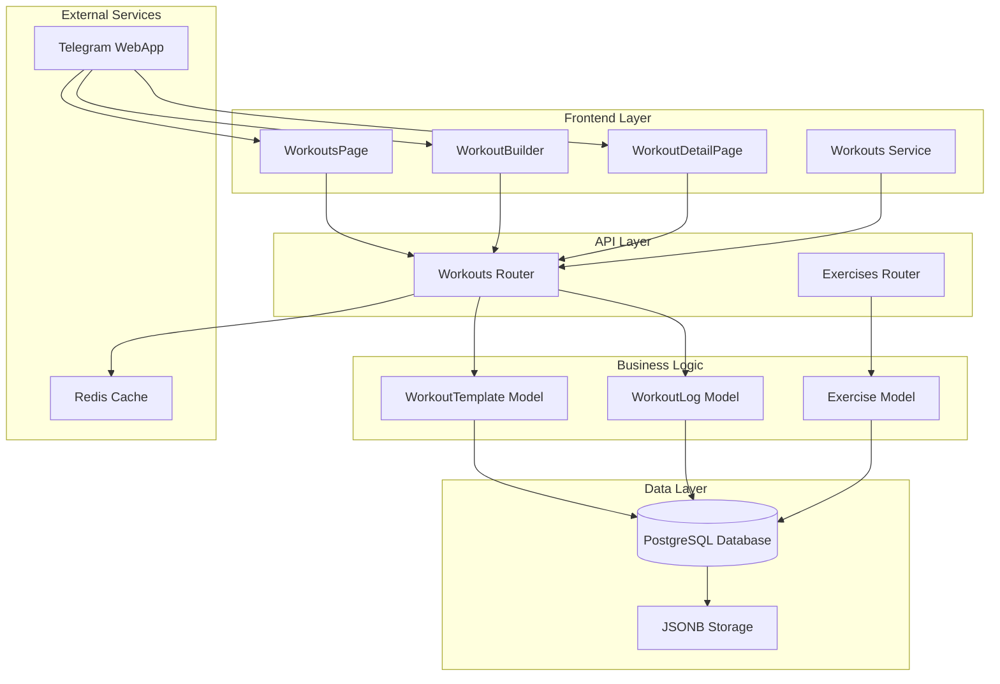

**Diagram sources**
- [workouts.py:1-525](file://backend/app/api/workouts.py#L1-L525)
- [workout_template.py:1-83](file://backend/app/models/workout_template.py#L1-L83)
- [workout_log.py:1-112](file://backend/app/models/workout_log.py#L1-L112)
- [exercises.py:1-463](file://backend/app/api/exercises.py#L1-L463)

The architecture ensures scalability through asynchronous database operations, efficient caching strategies, and modular component design. The system handles workout templates, logging, and exercise catalog integration while maintaining real-time synchronization capabilities.

**Section sources**
- [workouts.py:1-525](file://backend/app/api/workouts.py#L1-L525)
- [schema_v2.sql:1-598](file://docs/db/legacy/schema_v2.sql#L1-L598)

## Core Components

### Workout Template Management

The Workout Template system provides users with the ability to create reusable workout structures that can be applied across multiple sessions. Templates support four distinct workout types with flexible exercise configurations.

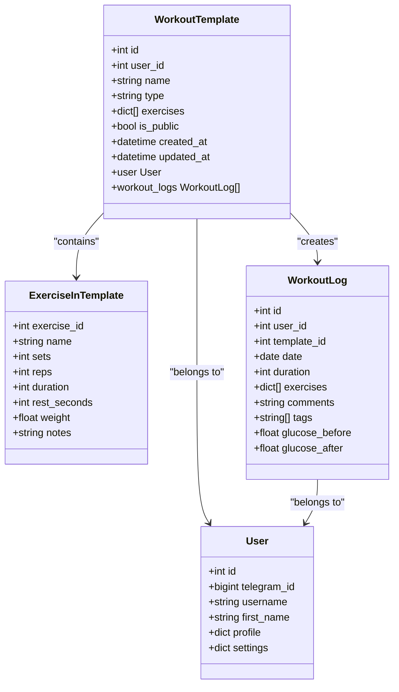

**Diagram sources**
- [workout_template.py:18-83](file://backend/app/models/workout_template.py#L18-L83)
- [workout_log.py:19-112](file://backend/app/models/workout_log.py#L19-L112)
- [workouts.py:10-70](file://backend/app/schemas/workouts.py#L10-L70)

The template system supports JSONB storage for exercises, enabling dynamic workout configurations without rigid schema constraints. This flexibility allows users to create complex workout routines with varying exercise combinations and parameters.

**Section sources**
- [workout_template.py:1-83](file://backend/app/models/workout_template.py#L1-L83)
- [workouts.py:1-146](file://backend/app/schemas/workouts.py#L1-L146)

### Workout Logging Infrastructure

The Workout Logging system tracks completed workout sessions with comprehensive exercise data capture, including sets, reps, weights, and duration metrics. The system maintains detailed historical records while supporting real-time workout tracking.

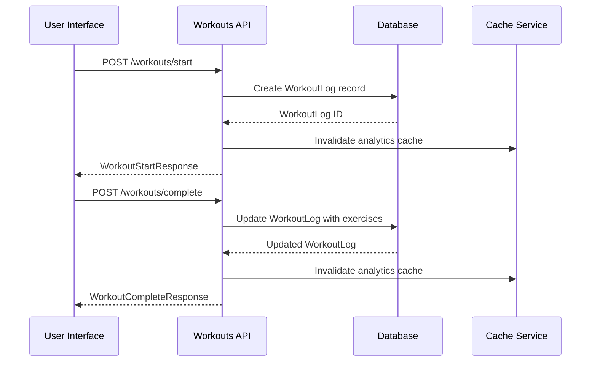

**Diagram sources**
- [workouts.py:338-496](file://backend/app/api/workouts.py#L338-L496)
- [workout_log.py:19-112](file://backend/app/models/workout_log.py#L19-L112)

The logging system captures detailed exercise completion data, including set completion status, rep counts, weight usage, and timing information. This granular tracking enables advanced analytics and progress monitoring capabilities.

**Section sources**
- [workout_log.py:1-112](file://backend/app/models/workout_log.py#L1-L112)
- [workouts.py:261-525](file://backend/app/api/workouts.py#L261-L525)

## Workout Template System

### Template Creation and Management

The template system enables users to create personalized workout routines that can be reused across multiple sessions. Templates support four workout types with flexible exercise configurations.

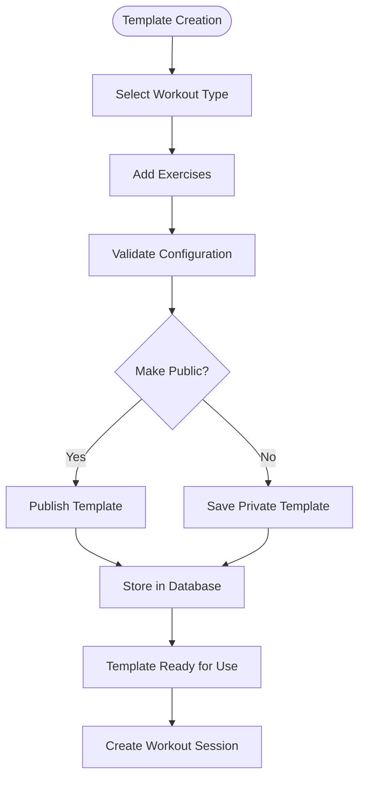

**Diagram sources**
- [workouts.py:109-260](file://backend/app/api/workouts.py#L109-L260)
- [workouts.py:42-70](file://backend/app/schemas/workouts.py#L42-L70)

Templates are stored using JSONB format, allowing for dynamic exercise configurations without schema rigidity. Each template contains exercise definitions with sets, reps, duration, rest periods, and optional weight parameters.

**Section sources**
- [workouts.py:109-260](file://backend/app/api/workouts.py#L109-L260)
- [workouts.py:1-146](file://backend/app/schemas/workouts.py#L1-L146)

### Template Validation and Security

The system implements comprehensive validation and security measures to ensure template integrity and user privacy.

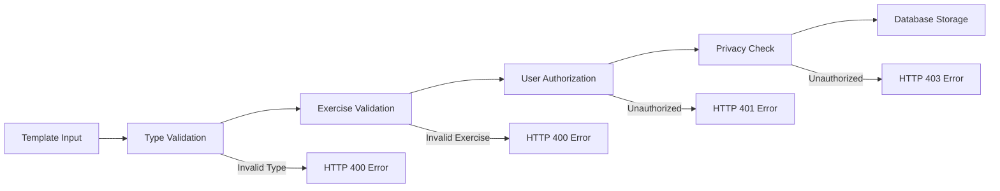

**Diagram sources**
- [workouts.py:109-260](file://backend/app/api/workouts.py#L109-L260)

The validation process ensures that template types conform to supported values (cardio, strength, flexibility, mixed) and that exercises meet minimum requirements. User authorization prevents unauthorized template access and modification.

**Section sources**
- [workouts.py:109-260](file://backend/app/api/workouts.py#L109-L260)

## Workout Logging System

### Session Lifecycle Management

The workout logging system manages the complete lifecycle of workout sessions from initiation to completion, capturing comprehensive exercise data and user metrics.

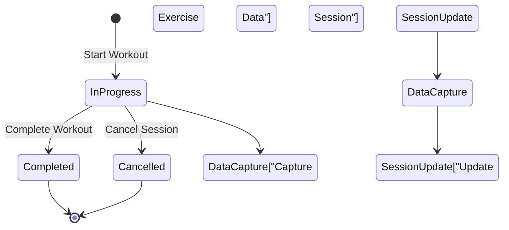

**Diagram sources**
- [workouts.py:338-496](file://backend/app/api/workouts.py#L338-L496)
- [workout_log.py:19-112](file://backend/app/models/workout_log.py#L19-L112)

The system captures detailed exercise completion data including sets, reps, weights, durations, and user comments. Glucose monitoring capabilities support diabetic users with pre- and post-workout glucose tracking.

**Section sources**
- [workouts.py:338-496](file://backend/app/api/workouts.py#L338-L496)
- [workout_log.py:1-112](file://backend/app/models/workout_log.py#L1-L112)

### Exercise Data Structure

The exercise data structure supports comprehensive tracking of workout performance metrics with flexible configuration options.

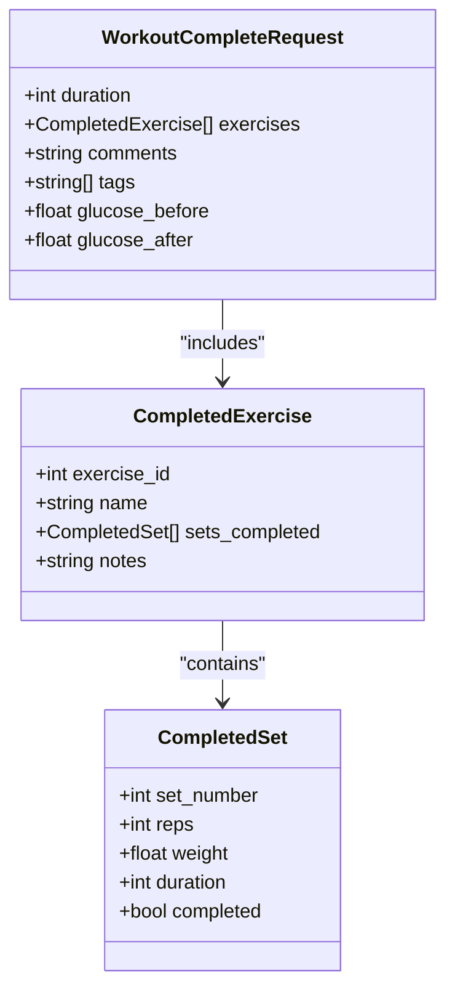

**Diagram sources**
- [workouts.py:24-103](file://backend/app/schemas/workouts.py#L24-L103)

The data structure accommodates various exercise types with appropriate metric capture. Strength exercises track reps and weight, while cardio exercises capture duration and intensity metrics.

**Section sources**
- [workouts.py:1-146](file://backend/app/schemas/workouts.py#L1-L146)

## Exercise Catalog Integration

### Exercise Library Management

The system integrates with a comprehensive exercise catalog that provides standardized exercise definitions with safety considerations and equipment requirements.

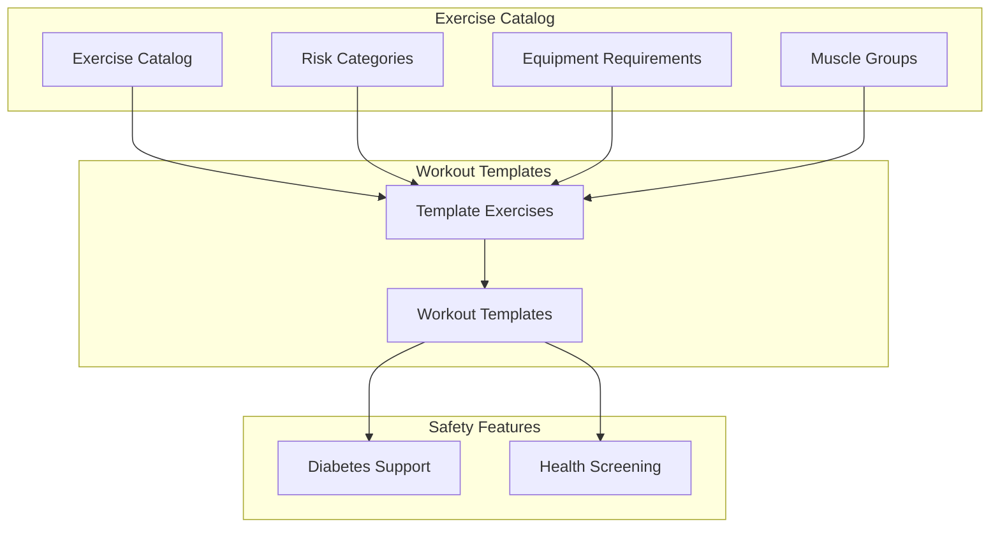

**Diagram sources**
- [exercise.py:17-116](file://backend/app/models/exercise.py#L17-L116)
- [exercises.py:24-140](file://backend/app/api/exercises.py#L24-L140)

The exercise catalog includes comprehensive metadata such as equipment needs, target muscle groups, and risk flags for users with health conditions. This integration ensures workout safety and appropriateness for individual user profiles.

**Section sources**
- [exercise.py:1-116](file://backend/app/models/exercise.py#L1-L116)
- [exercises.py:1-463](file://backend/app/api/exercises.py#L1-L463)

### Exercise Safety and Risk Management

The exercise system incorporates comprehensive safety features to accommodate users with various health conditions and limitations.

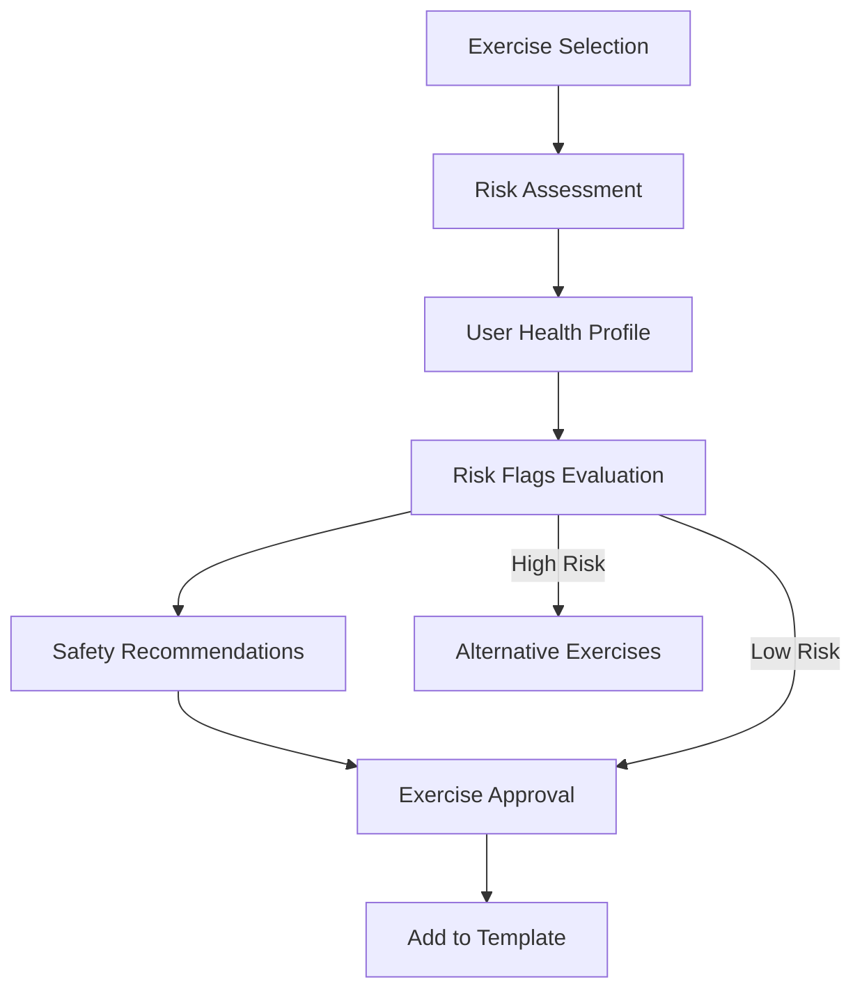

**Diagram sources**
- [exercise.py:57-68](file://backend/app/models/exercise.py#L57-L68)
- [workout_template.py:42-47](file://backend/app/models/workout_template.py#L42-L47)

The system evaluates exercise safety against user health profiles, considering conditions like diabetes, joint problems, heart conditions, and high blood pressure. This proactive approach helps prevent injuries and ensures safe workout participation.

**Section sources**
- [exercise.py:1-116](file://backend/app/models/exercise.py#L1-L116)

## Frontend Implementation

### Workout Builder Interface

The Workout Builder provides an intuitive drag-and-drop interface for creating customized workout templates with real-time preview and validation capabilities.

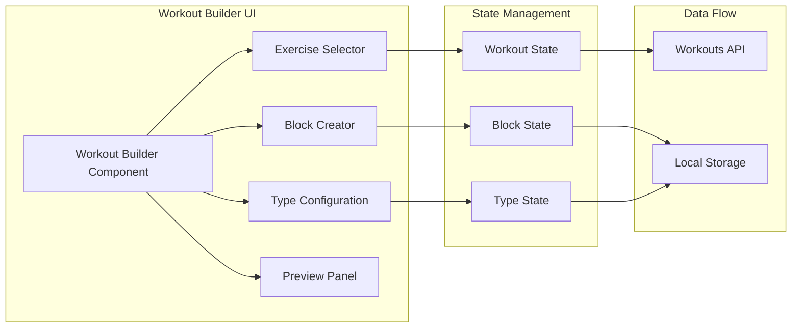

**Diagram sources**
- [WorkoutBuilder.tsx:295-581](file://frontend/src/pages/WorkoutBuilder.tsx#L295-L581)
- [workouts.ts:11-36](file://frontend/src/services/workouts.ts#L11-L36)

The interface supports five workout types (cardio, strength, flexibility, sports, other) with specialized configuration options for each exercise type. Real-time validation ensures template completeness and proper exercise selection.

**Section sources**
- [WorkoutBuilder.tsx:1-800](file://frontend/src/pages/WorkoutBuilder.tsx#L1-L800)
- [workouts.ts:1-37](file://frontend/src/services/workouts.ts#L1-L37)

### Workout History and Analytics

The Workout History system provides comprehensive tracking and analysis of completed workout sessions with filtering, sorting, and summary capabilities.

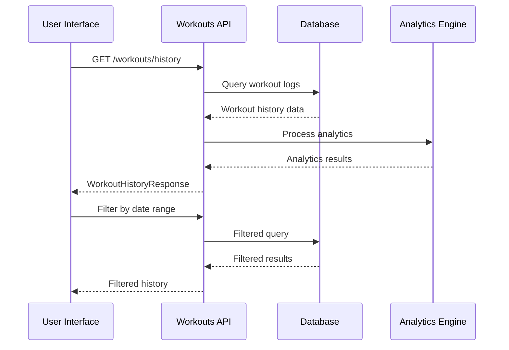

**Diagram sources**
- [workouts.py:261-335](file://backend/app/api/workouts.py#L261-L335)
- [WorkoutsPage.tsx:65-138](file://frontend/src/pages/WorkoutsPage.tsx#L65-L138)

The system automatically detects workout types based on exercise patterns and tags, providing accurate categorization without manual intervention. Weekly summaries offer quick insights into training patterns and progress.

**Section sources**
- [workouts.py:261-335](file://backend/app/api/workouts.py#L261-L335)
- [WorkoutsPage.tsx:1-265](file://frontend/src/pages/WorkoutsPage.tsx#L1-L265)

## Data Flow Analysis

### End-to-End Workflow

The Workout Types System implements a comprehensive data flow that ensures seamless operation from template creation to workout completion and analytics reporting.

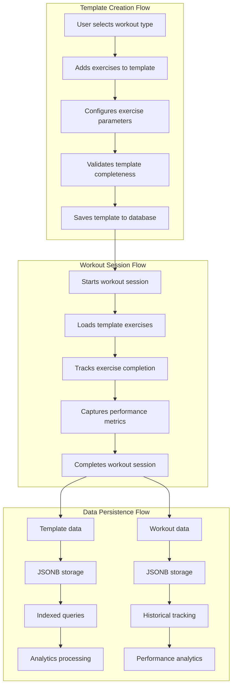

**Diagram sources**
- [workout_template.py:42-47](file://backend/app/models/workout_template.py#L42-L47)
- [workout_log.py:49-54](file://backend/app/models/workout_log.py#L49-L54)
- [workouts.py:338-496](file://backend/app/api/workouts.py#L338-L496)

The data flow ensures efficient storage and retrieval of workout information through optimized database indexing and JSONB column utilization. Caching mechanisms minimize database load while maintaining data consistency.

**Section sources**
- [workout_template.py:1-83](file://backend/app/models/workout_template.py#L1-L83)
- [workout_log.py:1-112](file://backend/app/models/workout_log.py#L1-L112)
- [workouts.py:1-525](file://backend/app/api/workouts.py#L1-L525)

### Database Schema Integration

The system leverages PostgreSQL's JSONB capabilities for flexible data storage while maintaining referential integrity and query performance.

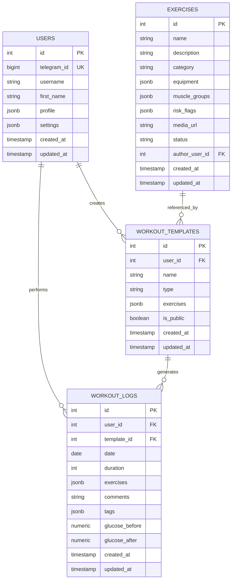

**Diagram sources**
- [schema_v2.sql:10-180](file://docs/db/legacy/schema_v2.sql#L10-L180)

The schema design optimizes for both flexibility and performance, utilizing JSONB columns for dynamic exercise configurations while maintaining foreign key relationships for data integrity.

**Section sources**
- [schema_v2.sql:1-598](file://docs/db/legacy/schema_v2.sql#L1-L598)

## Performance Considerations

### Database Optimization Strategies

The Workout Types System implements several optimization strategies to ensure high-performance operation under various load conditions.

**Query Optimization**
- JSONB indexing for exercise arrays and tags
- Composite indexes for frequently queried columns
- Efficient pagination with offset/limit patterns
- Selective column retrieval to minimize bandwidth

**Caching Strategy**
- Redis-based caching for frequently accessed templates
- Analytics data caching with automatic invalidation
- Session-based caching for user-specific data
- CDN optimization for static assets

**Connection Pooling**
- Asynchronous database connections for concurrent requests
- Connection pooling to reduce connection overhead
- Transaction batching for bulk operations
- Read replica utilization for analytical queries

### Frontend Performance Enhancements

The frontend implementation includes several performance optimizations for smooth user experience across different devices and network conditions.

**Bundle Optimization**
- Code splitting for route-based lazy loading
- Dynamic imports for heavy components
- Asset compression and optimization
- Service worker implementation for offline functionality

**State Management**
- Efficient React state updates with memoization
- Local storage for offline template persistence
- Debounced search and filter operations
- Virtualized lists for large dataset rendering

**Network Optimization**
- Request deduplication to prevent redundant API calls
- Background synchronization for offline data
- Progressive loading for large workout histories
- Smart caching with cache invalidation strategies

## Troubleshooting Guide

### Common Issues and Solutions

**Template Creation Failures**
- Verify workout type conforms to allowed values (cardio, strength, flexibility, mixed)
- Ensure exercises array contains at least one valid exercise definition
- Check user authorization for template ownership
- Validate exercise parameter ranges (sets, reps, duration, rest seconds)

**Workout Session Issues**
- Confirm template exists and belongs to current user
- Verify exercise data structure matches expected format
- Check glucose value ranges for diabetic users (2.0-30.0 mmol/L)
- Ensure duration values are positive integers

**Data Synchronization Problems**
- Implement proper error handling for network failures
- Use optimistic updates with rollback capabilities
- Maintain local cache consistency during offline operations
- Handle concurrent template modifications appropriately

**Performance Degradation**
- Monitor database query performance and optimize slow queries
- Implement proper pagination for large datasets
- Use database connection pooling effectively
- Cache frequently accessed data appropriately

### Debugging Tools and Techniques

**Backend Debugging**
- Enable detailed logging for API request/response cycles
- Monitor database query execution times
- Track cache hit rates and invalidation patterns
- Implement structured error reporting with context

**Frontend Debugging**
- Use browser developer tools for network request inspection
- Monitor React component render performance
- Track Redux/Pinia state changes and updates
- Implement error boundaries for graceful failure handling

**Database Monitoring**
- Monitor query execution plans and performance metrics
- Track JSONB query performance and index utilization
- Monitor connection pool usage and timeouts
- Implement database query logging for debugging

**Section sources**
- [workouts.py:109-260](file://backend/app/api/workouts.py#L109-L260)
- [workout_log.py:19-112](file://backend/app/models/workout_log.py#L19-L112)

## Conclusion

The Workout Types System in Fit Tracker Pro represents a comprehensive solution for fitness tracking that balances flexibility, performance, and user experience. The system's architecture supports scalable growth while maintaining responsive user interactions through thoughtful design decisions.

Key strengths of the system include:

**Technical Excellence**
- Modern architecture with clear separation of concerns
- Robust data modeling with JSONB flexibility
- Comprehensive validation and security measures
- Optimized database schema leveraging PostgreSQL capabilities

**User Experience**
- Intuitive drag-and-drop template builder interface
- Real-time workout tracking with comprehensive metrics
- Personalized exercise recommendations based on health profiles
- Seamless integration with Telegram WebApp for mobile optimization

**Scalability and Performance**
- Efficient caching strategies with automatic invalidation
- Optimized database queries with proper indexing
- Asynchronous operations for improved responsiveness
- Modular design supporting future feature expansion

The system successfully addresses the diverse needs of fitness enthusiasts while providing healthcare professionals with valuable tools for patient monitoring and engagement. Its foundation in modern web technologies and database design principles positions it well for continued evolution and enhancement.

Future enhancements could include advanced analytics capabilities, integration with wearable device APIs, expanded exercise library with community contributions, and enhanced social features for workout sharing and competition. The current architecture provides a solid foundation for implementing these features while maintaining system stability and performance.