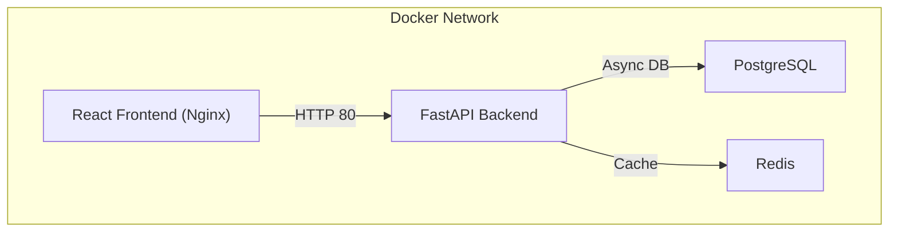
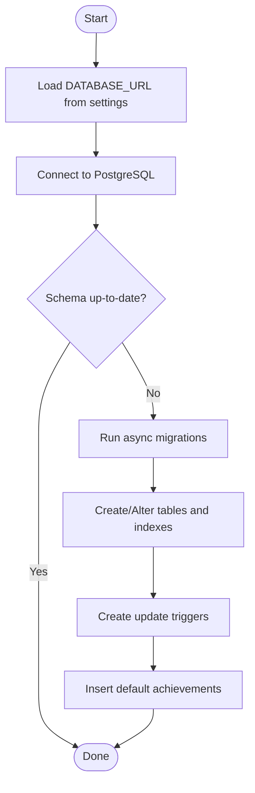
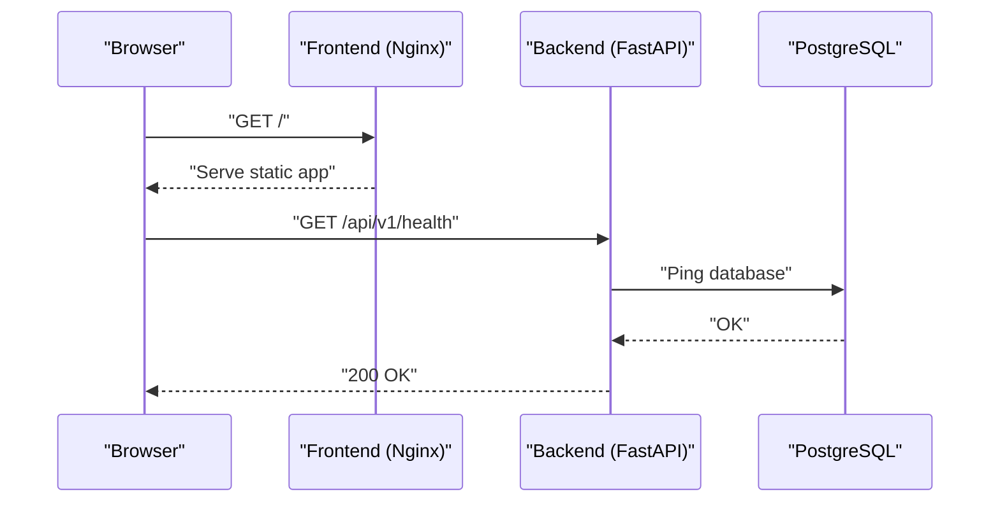

# Getting Started

<cite>
**Referenced Files in This Document**
- [README.md](file://README.md)
- [docker-compose.yml](file://docker-compose.yml)
- [backend/Dockerfile](file://backend/Dockerfile)
- [frontend/Dockerfile](file://frontend/Dockerfile)
- [backend/requirements.txt](file://backend/requirements.txt)
- [frontend/package.json](file://frontend/package.json)
- [backend/app/main.py](file://backend/app/main.py)
- [backend/app/utils/config.py](file://backend/app/utils/config.py)
- [frontend/src/services/api.ts](file://frontend/src/services/api.ts)
- [database/migrations/env.py](file://database/migrations/env.py)
- [database/migrations/versions/cd723942379e_initial_schema.py](file://database/migrations/versions/cd723942379e_initial_schema.py)
- [docs/ENVIRONMENT_SETUP.md](file://docs/ENVIRONMENT_SETUP.md)
- [docs/DEPLOYMENT.md](file://docs/DEPLOYMENT.md)
- [TELEGRAM_SETUP.md](file://TELEGRAM_SETUP.md)
</cite>

## Table of Contents
1. [Introduction](#introduction)
2. [Prerequisites and System Requirements](#prerequisites-and-system-requirements)
3. [Environment Setup](#environment-setup)
4. [Installation Methods](#installation-methods)
5. [Environment Variables](#environment-variables)
6. [Database Migrations](#database-migrations)
7. [Starting Services](#starting-services)
8. [Verification](#verification)
9. [Troubleshooting Guide](#troubleshooting-guide)
10. [Conclusion](#conclusion)

## Introduction
FitTracker Pro is a Telegram Mini App for fitness and health tracking with features like workouts, health metrics, analytics, achievements, challenges, and emergency mode. It consists of:
- Frontend: React + TypeScript + Vite
- Backend: Python FastAPI with PostgreSQL, Redis, Alembic migrations
- Optional monitoring stack (Prometheus + Grafana)
- Reverse proxy via Nginx

This guide helps you set up FitTracker Pro locally using Docker (recommended) or local development, configure environment variables, apply database migrations, and verify the installation.

## Prerequisites and System Requirements
- Operating systems: macOS, Linux, or Windows (WSL2 recommended on Windows)
- Docker Desktop and Docker Compose installed (for Docker-based setup)
- Git for cloning the repository
- At least 4 GB RAM recommended for smooth local development
- Ports 80, 8000, 5432, and 6379 should be available on your host

**Section sources**
- [README.md:45-90](file://README.md#L45-L90)
- [docs/DEPLOYMENT.md:34-41](file://docs/DEPLOYMENT.md#L34-L41)

## Environment Setup
Follow these steps to prepare your environment for either Docker-based or local development.

- Clone the repository and navigate to the project root
- Copy example environment files:
  - Backend: copy backend/.env.example to backend/.env
  - Frontend: copy frontend/.env.example to frontend/.env
- Generate a secure SECRET_KEY for JWT signing
- Fill in required variables for both backend and frontend

Notes:
- For local development without Docker, install Python 3.11+ and Node.js 20+, then install backend and frontend dependencies separately.
- For Docker-based setup, environment variables are loaded via docker-compose.yml and service-specific Dockerfiles.

**Section sources**
- [README.md:47-64](file://README.md#L47-L64)
- [docs/ENVIRONMENT_SETUP.md:7-23](file://docs/ENVIRONMENT_SETUP.md#L7-L23)
- [docs/ENVIRONMENT_SETUP.md:112-141](file://docs/ENVIRONMENT_SETUP.md#L112-L141)

## Installation Methods
FitTracker Pro supports two primary installation approaches.

### Option A: Docker-Based Setup (Recommended)
This method runs all services in containers and is ideal for local development and testing.

Steps:
1. Copy environment files:
   - Backend: cp backend/.env.example backend/.env
   - Frontend: cp frontend/.env.example frontend/.env
2. Launch services:
   - docker-compose up -d
3. Apply database migrations:
   - docker-compose exec backend alembic upgrade head
4. Access:
   - Frontend: http://localhost
   - Backend API: http://localhost:8000/api/v1
   - API Docs: http://localhost:8000/docs

**Diagram sources**
- [docker-compose.yml:3-99](file://docker-compose.yml#L3-L99)

**Section sources**
- [README.md:47-64](file://README.md#L47-L64)
- [docker-compose.yml:3-99](file://docker-compose.yml#L3-L99)

### Option B: Local Development (Python + Node.js)
This method runs the backend and frontend natively on your machine.

Backend (Python):
- cd backend
- python -m venv venv
- source venv/bin/activate  # Windows: venv\Scripts\activate
- pip install -r requirements.txt
- cp .env.example .env
- uvicorn app.main:app --reload

Frontend (Node.js):
- cd frontend
- npm install
- npm run dev

Access:
- Frontend: http://localhost:5173
- Backend API: http://localhost:8000/api/v1

**Section sources**
- [README.md:71-88](file://README.md#L71-L88)
- [backend/requirements.txt:1-42](file://backend/requirements.txt#L1-L42)
- [frontend/package.json:6-15](file://frontend/package.json#L6-L15)

## Environment Variables
Configure environment variables for both backend and frontend.

### Backend (.env)
Required variables:
- DATABASE_URL: async PostgreSQL connection string
- DATABASE_URL_SYNC: synchronous PostgreSQL connection string
- REDIS_URL: Redis cache URL
- TELEGRAM_BOT_TOKEN: Telegram Bot token from BotFather
- TELEGRAM_WEBAPP_URL: Your Mini App URL (HTTPS required)
- SECRET_KEY: Secure 32+ character key for JWT signing
- ENVIRONMENT: development or production
- DEBUG: true/false
- ALLOWED_ORIGINS: comma-separated list of allowed origins
- SENTRY_DSN: optional Sentry DSN for error tracking

Notes:
- The backend loads .env from the backend directory using Pydantic Settings.
- The backend Dockerfile sets health checks and exposes port 8000.

**Section sources**
- [README.md:106-120](file://README.md#L106-L120)
- [backend/app/utils/config.py:15-55](file://backend/app/utils/config.py#L15-L55)
- [backend/Dockerfile:43-47](file://backend/Dockerfile#L43-L47)

### Frontend (.env)
Required variables:
- VITE_API_URL: Backend API URL (e.g., http://localhost:8000/api/v1)
- VITE_TELEGRAM_BOT_USERNAME: Bot username (without @)
- VITE_ENVIRONMENT: development or production
- VITE_SENTRY_DSN: optional Sentry DSN for frontend

Notes:
- The frontend reads VITE_* variables at build time.
- The frontend Dockerfile builds static assets and serves them via Nginx.

**Section sources**
- [README.md:122-128](file://README.md#L122-L128)
- [frontend/src/services/api.ts:4](file://frontend/src/services/api.ts#L4)
- [frontend/Dockerfile:20-56](file://frontend/Dockerfile#L20-L56)

## Database Migrations
FitTracker Pro uses Alembic for PostgreSQL schema migrations.

- Migration environment configuration loads settings from backend/.env and applies async migrations.
- Initial schema creates tables for users, exercises, workout templates/logs, health metrics, achievements, challenges, and emergency contacts.
- Triggers update updated_at timestamps automatically.

Apply migrations after services are running:
- docker-compose exec backend alembic upgrade head

**Diagram sources**
- [database/migrations/env.py:15-81](file://database/migrations/env.py#L15-L81)
- [database/migrations/versions/cd723942379e_initial_schema.py:19-460](file://database/migrations/versions/cd723942379e_initial_schema.py#L19-L460)

**Section sources**
- [README.md:62-64](file://README.md#L62-L64)
- [database/migrations/env.py:15-81](file://database/migrations/env.py#L15-L81)
- [database/migrations/versions/cd723942379e_initial_schema.py:19-460](file://database/migrations/versions/cd723942379e_initial_schema.py#L19-L460)

## Starting Services
Choose one of the following depending on your installation method.

### Docker-Based
- docker-compose up -d
- Verify services:
  - docker-compose ps
  - docker-compose logs -f backend
  - docker-compose logs -f frontend
  - docker-compose logs -f postgres
  - docker-compose logs -f redis

### Local Development
- Backend: uvicorn app.main:app --reload
- Frontend: npm run dev
- Verify:
  - Backend health: curl http://localhost:8000/api/v1/health
  - Frontend dev server: http://localhost:5173

**Section sources**
- [README.md:47-64](file://README.md#L47-L64)
- [backend/app/main.py:109-126](file://backend/app/main.py#L109-L126)

## Verification
After starting services and applying migrations, verify the installation.

- Health checks:
  - Backend: http://localhost:8000/api/v1/health
  - Frontend: http://localhost/health (Nginx health check)
- API docs: http://localhost:8000/docs
- Database connectivity verified by backend health check and Alembic migrations
- Telegram WebApp integration:
  - Ensure TELEGRAM_WEBAPP_URL is set and HTTPS is used
  - Confirm ALLOWED_ORIGINS includes your domain
  - Test Telegram auth endpoint: POST /api/v1/auth/telegram

**Diagram sources**
- [backend/app/main.py:109-126](file://backend/app/main.py#L109-L126)
- [frontend/Dockerfile:50-52](file://frontend/Dockerfile#L50-L52)

**Section sources**
- [README.md:66-69](file://README.md#L66-L69)
- [backend/app/main.py:109-126](file://backend/app/main.py#L109-L126)
- [TELEGRAM_SETUP.md:56-109](file://TELEGRAM_SETUP.md#L56-L109)

## Troubleshooting Guide
Common setup issues and resolutions:

- Database connection failed
  - Ensure PostgreSQL is running and reachable
  - Verify DATABASE_URL credentials and database existence
  - Check docker-compose health checks for postgres

- CORS errors
  - Add your domain(s) to ALLOWED_ORIGINS
  - Include protocol (http:// or https://)
  - Separate multiple origins with commas

- Telegram WebApp not loading
  - Use HTTPS (required by Telegram)
  - Match TELEGRAM_WEBAPP_URL with your domain
  - Verify CORS settings and that the domain is allowed in BotFather

- Backend fails to start
  - Check backend logs: docker-compose logs backend
  - Ensure SECRET_KEY is set and long enough
  - Confirm Redis and PostgreSQL are healthy

- Frontend build or runtime issues
  - Reinstall dependencies: npm ci && npm run build
  - Verify VITE_API_URL points to the correct backend URL
  - Check Nginx health check: curl http://localhost/health

- Migrations fail
  - Ensure backend service is healthy
  - Run: docker-compose exec backend alembic upgrade head
  - Review migration logs for errors

**Section sources**
- [docs/ENVIRONMENT_SETUP.md:122-141](file://docs/ENVIRONMENT_SETUP.md#L122-L141)
- [docs/DEPLOYMENT.md:350-397](file://docs/DEPLOYMENT.md#L350-L397)
- [TELEGRAM_SETUP.md:257-281](file://TELEGRAM_SETUP.md#L257-L281)

## Conclusion
You now have two reliable ways to run FitTracker Pro locally:
- Docker-based setup for quick iteration and isolation
- Local development for direct debugging and faster rebuilds

Ensure environment variables are configured correctly, apply migrations, and verify health endpoints. For production deployments, follow the deployment guide and security checklist.