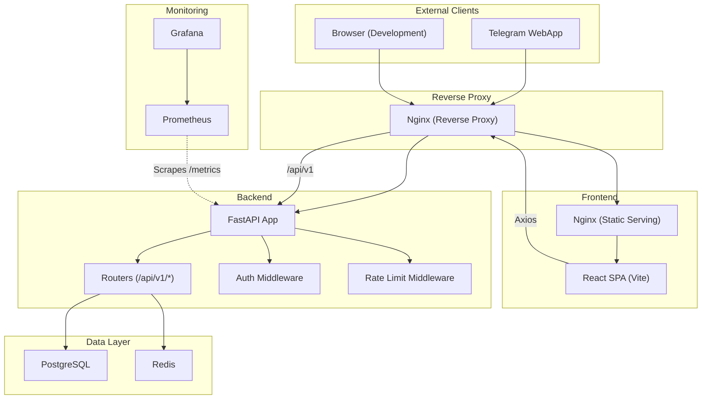
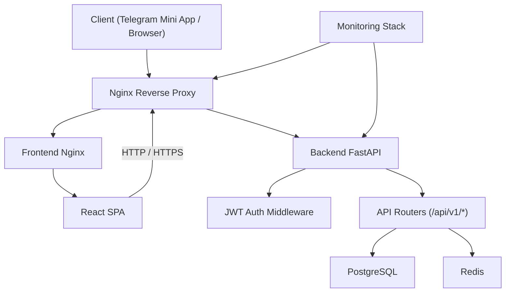
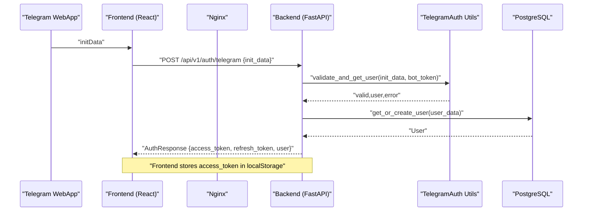
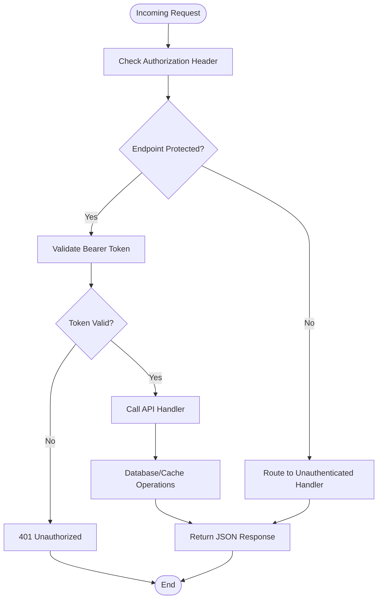
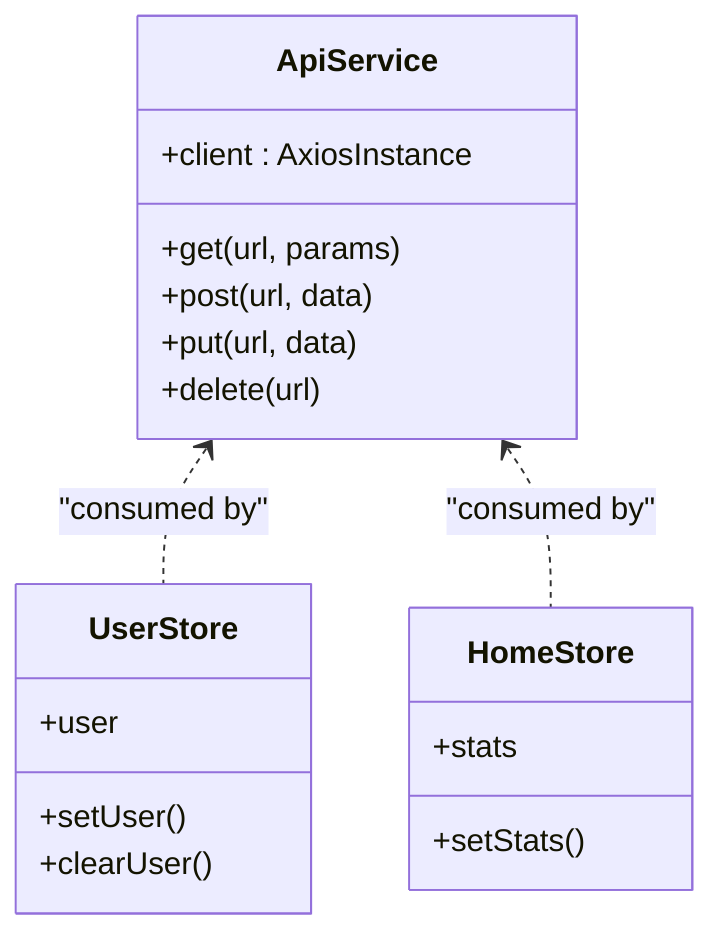
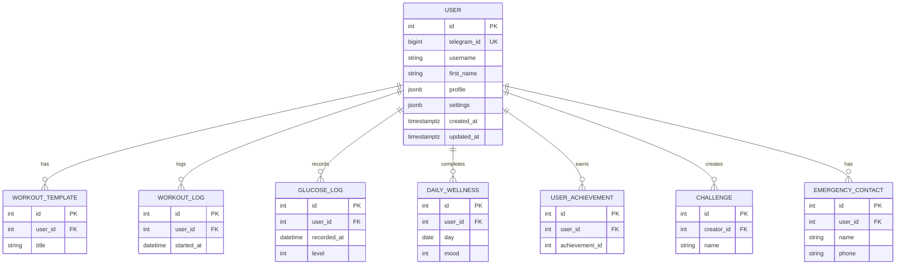
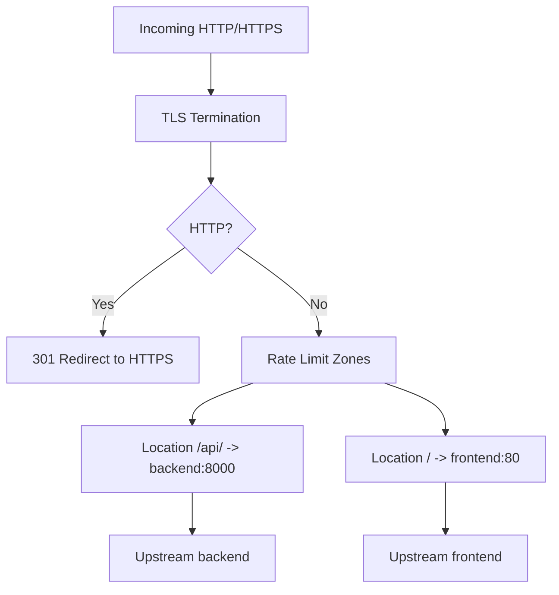
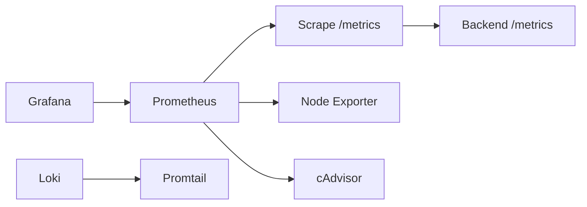
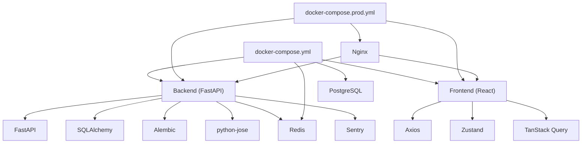

# Architecture Overview

<cite>
**Referenced Files in This Document**
- [README.md](file://README.md)
- [backend/app/main.py](file://backend/app/main.py)
- [backend/app/api/auth.py](file://backend/app/api/auth.py)
- [backend/app/utils/telegram_auth.py](file://backend/app/utils/telegram_auth.py)
- [backend/app/middleware/auth.py](file://backend/app/middleware/auth.py)
- [backend/app/models/user.py](file://backend/app/models/user.py)
- [frontend/src/services/api.ts](file://frontend/src/services/api.ts)
- [frontend/src/hooks/useTelegram.ts](file://frontend/src/hooks/useTelegram.ts)
- [frontend/src/components/auth/TelegramAuthExample.tsx](file://frontend/src/components/auth/TelegramAuthExample.tsx)
- [docker-compose.yml](file://docker-compose.yml)
- [docker-compose.prod.yml](file://docker-compose.prod.yml)
- [nginx/nginx.conf](file://nginx/nginx.conf)
- [frontend/Dockerfile](file://frontend/Dockerfile)
- [backend/Dockerfile](file://backend/Dockerfile)
- [monitoring/docker-compose.monitoring.yml](file://monitoring/docker-compose.monitoring.yml)
- [monitoring/prometheus.yml](file://monitoring/prometheus.yml)
- [frontend/package.json](file://frontend/package.json)
- [backend/requirements.txt](file://backend/requirements.txt)
</cite>

## Table of Contents
1. [Introduction](#introduction)
2. [Project Structure](#project-structure)
3. [Core Components](#core-components)
4. [Architecture Overview](#architecture-overview)
5. [Detailed Component Analysis](#detailed-component-analysis)
6. [Dependency Analysis](#dependency-analysis)
7. [Performance Considerations](#performance-considerations)
8. [Troubleshooting Guide](#troubleshooting-guide)
9. [Conclusion](#conclusion)
10. [Appendices](#appendices)

## Introduction
This document presents the architecture overview of FitTracker Pro, a Telegram Mini App for fitness and health tracking. It describes the high-level system design, including the Telegram WebApp integration, microservices-style backend built with FastAPI, frontend SPA, containerization with Docker, reverse proxy with Nginx, and the monitoring stack. It also documents API communication patterns, state management, authentication and security, error handling, and deployment topology.

## Project Structure
FitTracker Pro follows a clear separation of concerns:
- Frontend: React + TypeScript + Vite, packaged with Nginx in a production container
- Backend: Python FastAPI with asynchronous database access, middleware, and modular API routers
- Database: PostgreSQL with Alembic migrations
- Caching: Redis
- Reverse Proxy: Nginx for routing, SSL termination, rate limiting, and caching
- Monitoring: Prometheus, Grafana, optional Loki/Promtail
- CI/CD: GitHub Actions workflows

**Diagram sources**
- [docker-compose.yml:1-99](file://docker-compose.yml#L1-L99)
- [docker-compose.prod.yml:1-132](file://docker-compose.prod.yml#L1-L132)
- [nginx/nginx.conf:1-144](file://nginx/nginx.conf#L1-L144)
- [frontend/Dockerfile:1-56](file://frontend/Dockerfile#L1-L56)
- [backend/Dockerfile:1-48](file://backend/Dockerfile#L1-L48)
- [backend/app/main.py:1-126](file://backend/app/main.py#L1-L126)
- [monitoring/prometheus.yml:1-49](file://monitoring/prometheus.yml#L1-L49)

**Section sources**
- [README.md:1-237](file://README.md#L1-L237)
- [docker-compose.yml:1-99](file://docker-compose.yml#L1-L99)
- [docker-compose.prod.yml:1-132](file://docker-compose.prod.yml#L1-L132)

## Core Components
- Telegram WebApp integration: Frontend uses Telegram SDK to obtain initData, which is validated by the backend using Telegram’s verification protocol.
- Backend API: Modular FastAPI app with routers for health, auth, users, workouts, exercises, health metrics, analytics, achievements, challenges, and emergency.
- Authentication: JWT-based bearer tokens after Telegram WebApp authentication; refresh tokens supported.
- Frontend state management: Zustand stores for user and home state; TanStack Query for data fetching and caching.
- Data persistence: PostgreSQL with SQLAlchemy ORM; JSONB fields for flexible user profile and settings.
- Caching: Redis for potential caching and rate limiting.
- Reverse proxy and load balancing: Nginx handles SSL/TLS, HTTP/2, rate limiting, and forwards requests to backend and static frontend.
- Monitoring: Prometheus scraping backend metrics; Grafana dashboard; optional Loki/Promtail for logs.

**Section sources**
- [backend/app/main.py:1-126](file://backend/app/main.py#L1-L126)
- [backend/app/api/auth.py:1-345](file://backend/app/api/auth.py#L1-L345)
- [backend/app/utils/telegram_auth.py:1-225](file://backend/app/utils/telegram_auth.py#L1-L225)
- [backend/app/middleware/auth.py:1-251](file://backend/app/middleware/auth.py#L1-L251)
- [backend/app/models/user.py:1-132](file://backend/app/models/user.py#L1-L132)
- [frontend/src/services/api.ts:1-69](file://frontend/src/services/api.ts#L1-L69)
- [frontend/src/hooks/useTelegram.ts:1-47](file://frontend/src/hooks/useTelegram.ts#L1-L47)
- [frontend/src/components/auth/TelegramAuthExample.tsx:1-446](file://frontend/src/components/auth/TelegramAuthExample.tsx#L1-L446)
- [frontend/package.json:1-60](file://frontend/package.json#L1-L60)
- [backend/requirements.txt:1-42](file://backend/requirements.txt#L1-L42)

## Architecture Overview
FitTracker Pro employs a reverse-proxy-first architecture:
- Nginx terminates TLS, applies rate limits, and proxies API traffic to the backend and static frontend traffic to the frontend Nginx.
- The backend FastAPI app exposes REST endpoints under /api/v1 with JWT authentication for protected routes.
- The frontend React app communicates with the backend via Axios, automatically attaching the Bearer token from local storage.
- PostgreSQL stores structured data; Redis supports caching and rate limiting.
- Monitoring stack collects metrics and dashboards for observability.

**Diagram sources**
- [nginx/nginx.conf:1-144](file://nginx/nginx.conf#L1-L144)
- [backend/app/main.py:1-126](file://backend/app/main.py#L1-L126)
- [frontend/src/services/api.ts:1-69](file://frontend/src/services/api.ts#L1-L69)
- [monitoring/prometheus.yml:1-49](file://monitoring/prometheus.yml#L1-L49)

## Detailed Component Analysis

### Telegram WebApp Authentication Flow
The frontend obtains initData from the Telegram SDK and sends it to the backend for validation. The backend verifies the initData using Telegram’s HMAC-SHA256 signature and timestamp rules, then creates or updates a user record and issues JWT access and refresh tokens.

**Diagram sources**
- [frontend/src/components/auth/TelegramAuthExample.tsx:62-122](file://frontend/src/components/auth/TelegramAuthExample.tsx#L62-L122)
- [backend/app/api/auth.py:95-184](file://backend/app/api/auth.py#L95-L184)
- [backend/app/utils/telegram_auth.py:172-204](file://backend/app/utils/telegram_auth.py#L172-L204)
- [backend/app/middleware/auth.py:21-76](file://backend/app/middleware/auth.py#L21-L76)

**Section sources**
- [frontend/src/hooks/useTelegram.ts:1-47](file://frontend/src/hooks/useTelegram.ts#L1-L47)
- [frontend/src/components/auth/TelegramAuthExample.tsx:1-446](file://frontend/src/components/auth/TelegramAuthExample.tsx#L1-L446)
- [backend/app/api/auth.py:1-345](file://backend/app/api/auth.py#L1-L345)
- [backend/app/utils/telegram_auth.py:1-225](file://backend/app/utils/telegram_auth.py#L1-L225)
- [backend/app/middleware/auth.py:1-251](file://backend/app/middleware/auth.py#L1-L251)

### Backend API Communication Patterns
- CORS and rate limiting are applied globally.
- Protected endpoints require a Bearer token; unauthenticated routes include health checks and Telegram auth.
- API routers are mounted under /api/v1 with descriptive tags for grouping.

**Diagram sources**
- [backend/app/main.py:77-106](file://backend/app/main.py#L77-L106)
- [backend/app/middleware/auth.py:133-202](file://backend/app/middleware/auth.py#L133-L202)

**Section sources**
- [backend/app/main.py:1-126](file://backend/app/main.py#L1-L126)
- [backend/app/middleware/auth.py:1-251](file://backend/app/middleware/auth.py#L1-L251)

### Frontend-Backend Separation and State Management
- The frontend uses Axios for HTTP requests and automatically attaches the Bearer token from localStorage.
- State management is handled via Zustand stores for user and home contexts.
- TanStack Query is used for data fetching, caching, and optimistic updates.

**Diagram sources**
- [frontend/src/services/api.ts:1-69](file://frontend/src/services/api.ts#L1-L69)
- [frontend/src/stores/userStore.ts](file://frontend/src/stores/userStore.ts)
- [frontend/src/stores/homeStore.ts](file://frontend/src/stores/homeStore.ts)

**Section sources**
- [frontend/src/services/api.ts:1-69](file://frontend/src/services/api.ts#L1-L69)
- [frontend/package.json:1-60](file://frontend/package.json#L1-L60)

### Data Models and Relationships
The User model encapsulates Telegram identity, profile, and settings. It has relationships to workout logs, glucose logs, wellness entries, achievements, challenges, and emergency contacts.

**Diagram sources**
- [backend/app/models/user.py:1-132](file://backend/app/models/user.py#L1-L132)

**Section sources**
- [backend/app/models/user.py:1-132](file://backend/app/models/user.py#L1-L132)

### Reverse Proxy and Load Balancing
Nginx acts as a reverse proxy:
- HTTP to HTTPS redirect
- SSL/TLS termination with security headers
- Rate limiting zones for API and login
- Upstreams for backend and frontend
- Static asset caching and security hardening

**Diagram sources**
- [nginx/nginx.conf:49-142](file://nginx/nginx.conf#L49-L142)

**Section sources**
- [nginx/nginx.conf:1-144](file://nginx/nginx.conf#L1-L144)
- [docker-compose.prod.yml:102-124](file://docker-compose.prod.yml#L102-L124)

### Monitoring Stack Integration
Prometheus scrapes backend metrics, Grafana visualizes them, and optional Loki/Promtail collect logs.

**Diagram sources**
- [monitoring/prometheus.yml:1-49](file://monitoring/prometheus.yml#L1-L49)
- [monitoring/docker-compose.monitoring.yml:1-124](file://monitoring/docker-compose.monitoring.yml#L1-L124)

**Section sources**
- [monitoring/prometheus.yml:1-49](file://monitoring/prometheus.yml#L1-L49)
- [monitoring/docker-compose.monitoring.yml:1-124](file://monitoring/docker-compose.monitoring.yml#L1-L124)

## Dependency Analysis
- Frontend depends on Telegram SDK, Axios, Zustand, TanStack Query, and React.
- Backend depends on FastAPI, SQLAlchemy, Alembic, Pydantic, JWT libraries, Redis, and Sentry.
- Docker Compose orchestrates services with explicit dependencies and health checks.
- Nginx configuration defines upstreams and proxy behavior.

**Diagram sources**
- [frontend/package.json:1-60](file://frontend/package.json#L1-L60)
- [backend/requirements.txt:1-42](file://backend/requirements.txt#L1-L42)
- [docker-compose.yml:1-99](file://docker-compose.yml#L1-L99)
- [docker-compose.prod.yml:1-132](file://docker-compose.prod.yml#L1-L132)

**Section sources**
- [frontend/package.json:1-60](file://frontend/package.json#L1-L60)
- [backend/requirements.txt:1-42](file://backend/requirements.txt#L1-L42)
- [docker-compose.yml:1-99](file://docker-compose.yml#L1-L99)
- [docker-compose.prod.yml:1-132](file://docker-compose.prod.yml#L1-L132)

## Performance Considerations
- Asynchronous database access with SQLAlchemy and asyncpg reduces blocking.
- Redis can cache frequently accessed data and enforce rate limits.
- Nginx HTTP/2, keepalive, gzip, and static asset caching improve latency and throughput.
- Backend containerization with Gunicorn + Uvicorn workers scales concurrency.
- Prometheus metrics enable capacity planning and bottleneck identification.

[No sources needed since this section provides general guidance]

## Troubleshooting Guide
- Authentication failures: Verify Telegram bot token, initData validity, and timestamp freshness.
- CORS errors: Confirm ALLOWED_ORIGINS and CORS middleware configuration.
- Rate limiting: Review Nginx rate limit zones and backend middleware behavior.
- Health checks: Use Nginx health endpoint and backend /api/v1/health.
- Monitoring: Ensure Prometheus targets are reachable and Grafana dashboards are provisioned.

**Section sources**
- [backend/app/utils/telegram_auth.py:108-155](file://backend/app/utils/telegram_auth.py#L108-L155)
- [backend/app/main.py:77-84](file://backend/app/main.py#L77-L84)
- [nginx/nginx.conf:33-36](file://nginx/nginx.conf#L33-L36)
- [nginx/nginx.conf:122-127](file://nginx/nginx.conf#L122-L127)
- [monitoring/prometheus.yml:31-35](file://monitoring/prometheus.yml#L31-L35)

## Conclusion
FitTracker Pro’s architecture balances modularity, scalability, and developer productivity. The Telegram WebApp integration is tightly coupled with a robust backend API secured by JWT, while the frontend remains stateless and efficient. Containerization and Nginx provide operational simplicity, and the monitoring stack ensures continuous observability. These choices support maintainability and scalability across development and production environments.

[No sources needed since this section summarizes without analyzing specific files]

## Appendices

### Deployment Topology
- Development: docker-compose spins up PostgreSQL, Redis, backend, and frontend with health checks.
- Production: docker-compose.prod.yml adds Nginx, external SSL certificates, resource limits, and deploys images from registry.

**Section sources**
- [docker-compose.yml:1-99](file://docker-compose.yml#L1-L99)
- [docker-compose.prod.yml:1-132](file://docker-compose.prod.yml#L1-L132)
- [frontend/Dockerfile:1-56](file://frontend/Dockerfile#L1-L56)
- [backend/Dockerfile:1-48](file://backend/Dockerfile#L1-L48)

### Technology Stack Choices
- Frontend: React + TypeScript + Vite + Zustand + TanStack Query + Telegram Mini Apps SDK.
- Backend: FastAPI + SQLAlchemy + Alembic + JWT + Redis + Sentry.
- DevOps: Docker + Docker Compose + GitHub Actions + Nginx + Prometheus + Grafana.

**Section sources**
- [README.md:18-43](file://README.md#L18-L43)
- [frontend/package.json:1-60](file://frontend/package.json#L1-L60)
- [backend/requirements.txt:1-42](file://backend/requirements.txt#L1-L42)