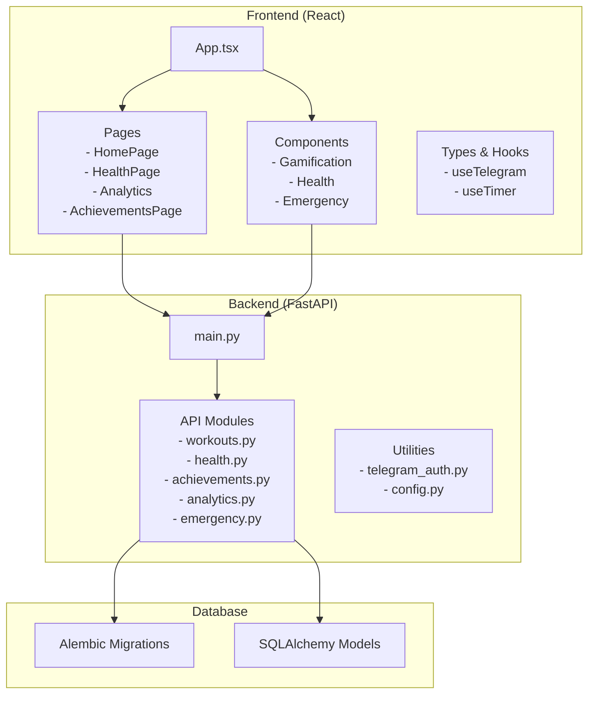
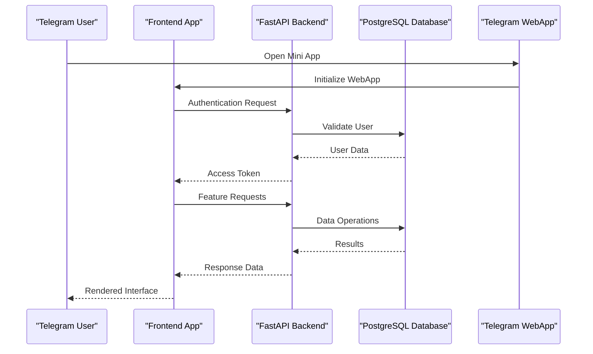
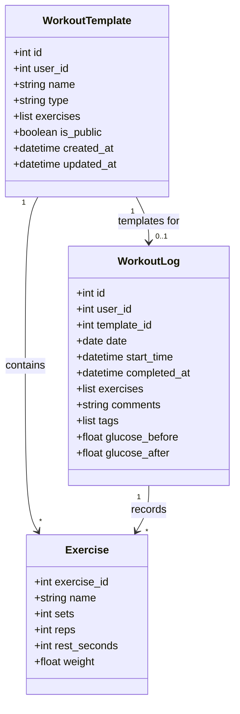
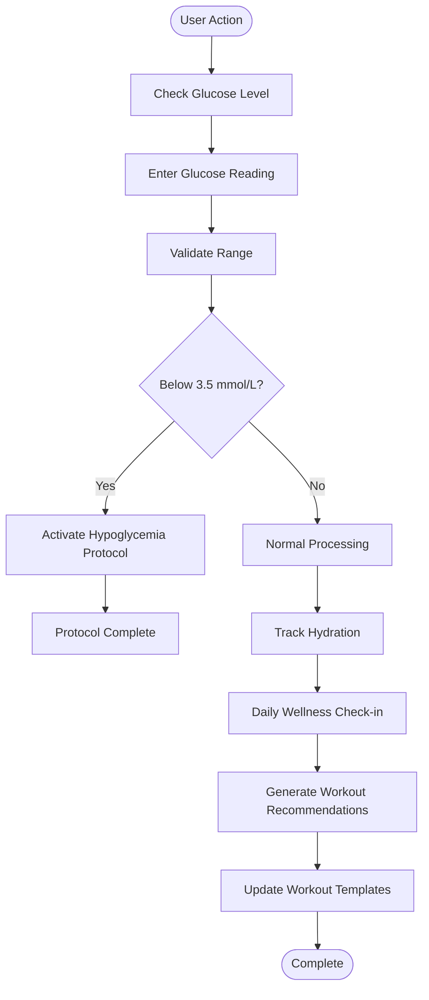
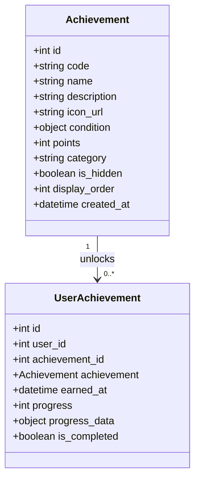
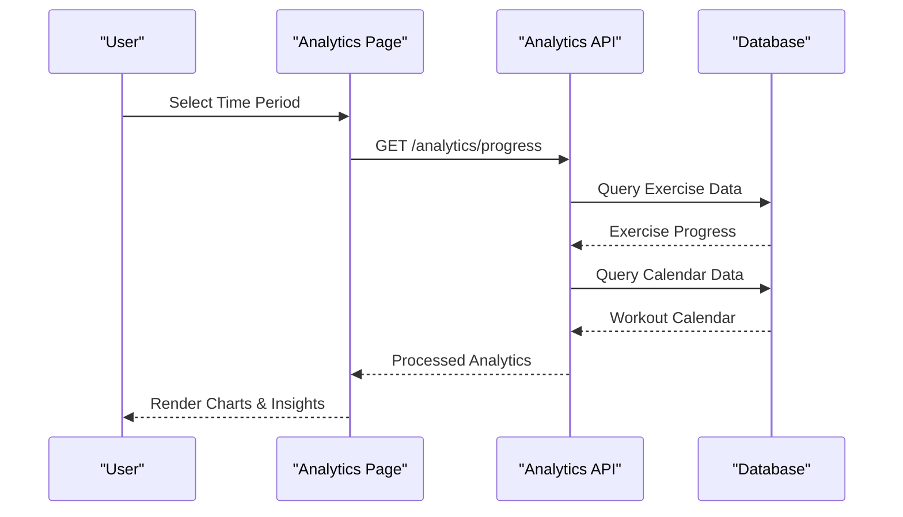
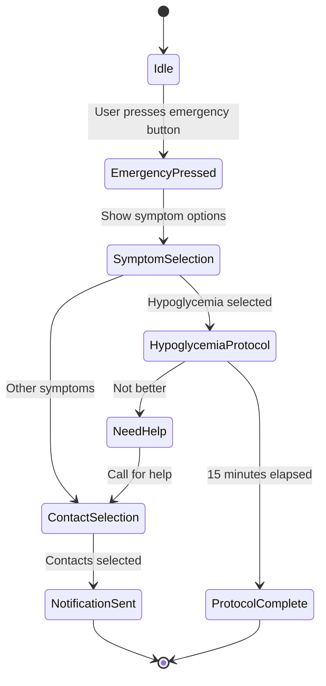
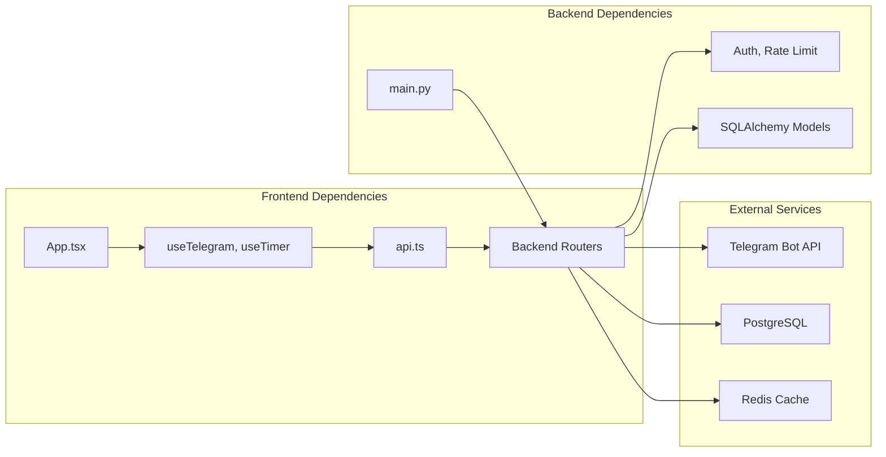

# Feature Highlights

<cite>
**Referenced Files in This Document**
- [README.md](file://README.md)
- [TELEGRAM_SETUP.md](file://TELEGRAM_SETUP.md)
- [backend/app/main.py](file://backend/app/main.py)
- [backend/app/api/workouts.py](file://backend/app/api/workouts.py)
- [backend/app/api/health.py](file://backend/app/api/health.py)
- [backend/app/api/achievements.py](file://backend/app/api/achievements.py)
- [backend/app/api/analytics.py](file://backend/app/api/analytics.py)
- [backend/app/api/emergency.py](file://backend/app/api/emergency.py)
- [frontend/src/App.tsx](file://frontend/src/App.tsx)
- [frontend/src/pages/AchievementsPage.tsx](file://frontend/src/pages/AchievementsPage.tsx)
- [frontend/src/pages/Analytics.tsx](file://frontend/src/pages/Analytics.tsx)
- [frontend/src/pages/HealthPage.tsx](file://frontend/src/pages/HealthPage.tsx)
- [frontend/src/pages/HomePage.tsx](file://frontend/src/pages/HomePage.tsx)
- [frontend/src/components/gamification/Achievements.tsx](file://frontend/src/components/gamification/Achievements.tsx)
- [frontend/src/components/emergency/EmergencyMode.tsx](file://frontend/src/components/emergency/EmergencyMode.tsx)
- [frontend/src/components/health/GlucoseTracker.tsx](file://frontend/src/components/health/GlucoseTracker.tsx)
- [frontend/src/components/health/WaterTracker.tsx](file://frontend/src/components/health/WaterTracker.tsx)
- [frontend/src/components/health/WellnessCheckin.tsx](file://frontend/src/components/health/WellnessCheckin.tsx)
</cite>

## Table of Contents
1. [Introduction](#introduction)
2. [Project Structure](#project-structure)
3. [Core Components](#core-components)
4. [Architecture Overview](#architecture-overview)
5. [Detailed Component Analysis](#detailed-component-analysis)
6. [Dependency Analysis](#dependency-analysis)
7. [Performance Considerations](#performance-considerations)
8. [Troubleshooting Guide](#troubleshooting-guide)
9. [Conclusion](#conclusion)

## Introduction
FitTracker Pro is a comprehensive fitness and health tracking Telegram Mini App featuring workout management, health monitoring, gamification, analytics, and emergency safety. Built with React + TypeScript + Vite for the frontend and FastAPI + PostgreSQL for the backend, it delivers a seamless cross-platform experience through Telegram WebApp integration.

## Project Structure
The application follows a clear separation of concerns with distinct frontend and backend modules, plus database migrations and monitoring infrastructure.

**Diagram sources**
- [backend/app/main.py:1-126](file://backend/app/main.py#L1-L126)
- [frontend/src/App.tsx:1-35](file://frontend/src/App.tsx#L1-L35)

**Section sources**
- [README.md:1-237](file://README.md#L1-L237)
- [backend/app/main.py:1-126](file://backend/app/main.py#L1-L126)
- [frontend/src/App.tsx:1-35](file://frontend/src/App.tsx#L1-L35)

## Core Components
FitTracker Pro provides five major feature areas that work together to create a cohesive fitness and health tracking experience:

### Workout Tracking System
The workout tracking system centers around template-based exercise creation and structured workout sessions. Users can create reusable workout templates with specific exercises, sets, reps, and rest periods, then execute these templates during actual workout sessions.

Key capabilities include:
- Template-based exercise creation with customizable sets and repetitions
- Workout session management with start/complete workflows
- Exercise progression tracking with volume calculations
- Integration with health metrics (glucose levels before/after workouts)

### Health Monitoring Suite
Comprehensive health tracking encompasses glucose monitoring, hydration tracking, and daily wellness check-ins with pain assessment.

Features include:
- Glucose tracking with unit conversion (mmol/L ↔ mg/dL)
- Hydration monitoring with goal setting and reminders
- Daily wellness check-ins with pain zone assessment
- Automated workout recommendations based on health metrics

### Gamification System
The achievements system motivates users through progressive milestones, points, and social recognition.

Capabilities:
- Multi-category achievements (workouts, strength, health, content, general)
- Progress tracking with visual indicators
- Leaderboard functionality
- Achievement unlock notifications with haptic feedback

### Analytics Dashboard
Advanced analytics provide insights into training progress and health trends.

Features:
- Exercise progression charts with volume tracking
- Workout calendar visualization
- Personal record detection
- Data export capabilities

### Emergency Mode
Critical safety features ensure immediate assistance when needed.

Components:
- Emergency button with 3-second hold protection
- Symptom selection with guided protocols
- Automatic contact notification system
- Hypoglycemia protocol with 15-15-15 rule

**Section sources**
- [backend/app/api/workouts.py:1-522](file://backend/app/api/workouts.py#L1-L522)
- [backend/app/api/health.py:1-615](file://backend/app/api/health.py#L1-L615)
- [backend/app/api/achievements.py:1-420](file://backend/app/api/achievements.py#L1-L420)
- [backend/app/api/analytics.py:1-518](file://backend/app/api/analytics.py#L1-L518)
- [backend/app/api/emergency.py:1-543](file://backend/app/api/emergency.py#L1-L543)

## Architecture Overview
The system employs a modern microservice-style architecture with clear separation between frontend, backend, and database layers.

**Diagram sources**
- [backend/app/main.py:56-107](file://backend/app/main.py#L56-L107)
- [TELEGRAM_SETUP.md:56-109](file://TELEGRAM_SETUP.md#L56-L109)

The architecture emphasizes:
- **Security**: JWT-based authentication with Telegram WebApp integration
- **Scalability**: Stateless API design with proper middleware
- **Data Integrity**: SQLAlchemy ORM with Alembic migrations
- **Real-time Updates**: WebSocket-ready structure for future enhancements

**Section sources**
- [backend/app/main.py:1-126](file://backend/app/main.py#L1-L126)
- [TELEGRAM_SETUP.md:1-281](file://TELEGRAM_SETUP.md#L1-L281)

## Detailed Component Analysis

### Workout Tracking Implementation
The workout tracking system provides a complete solution for exercise management and performance monitoring.

**Diagram sources**
- [backend/app/api/workouts.py:29-163](file://backend/app/api/workouts.py#L29-L163)

Key workflow:
1. Template Creation: Users create reusable workout templates
2. Session Start: Templates are executed with real-time tracking
3. Exercise Recording: Sets, reps, and weights are logged
4. Completion: Final metrics and health data are captured

**Section sources**
- [backend/app/api/workouts.py:1-522](file://backend/app/api/workouts.py#L1-L522)

### Health Monitoring Integration
The health monitoring system integrates seamlessly with workout tracking to provide comprehensive fitness insights.

**Diagram sources**
- [frontend/src/components/health/GlucoseTracker.tsx:1-762](file://frontend/src/components/health/GlucoseTracker.tsx#L1-L762)
- [frontend/src/components/health/WaterTracker.tsx:1-1171](file://frontend/src/components/health/WaterTracker.tsx#L1-L1171)
- [frontend/src/components/health/WellnessCheckin.tsx:1-1207](file://frontend/src/components/health/WellnessCheckin.tsx#L1-L1207)

**Section sources**
- [backend/app/api/health.py:1-615](file://backend/app/api/health.py#L1-L615)
- [frontend/src/components/health/GlucoseTracker.tsx:1-762](file://frontend/src/components/health/GlucoseTracker.tsx#L1-L762)
- [frontend/src/components/health/WaterTracker.tsx:1-1171](file://frontend/src/components/health/WaterTracker.tsx#L1-L1171)
- [frontend/src/components/health/WellnessCheckin.tsx:1-1207](file://frontend/src/components/health/WellnessCheckin.tsx#L1-L1207)

### Gamification System Architecture
The achievements system provides motivation through progressive milestones and social recognition.

**Diagram sources**
- [backend/app/api/achievements.py:25-88](file://backend/app/api/achievements.py#L25-L88)

**Section sources**
- [backend/app/api/achievements.py:1-420](file://backend/app/api/achievements.py#L1-L420)
- [frontend/src/components/gamification/Achievements.tsx:1-934](file://frontend/src/components/gamification/Achievements.tsx#L1-L934)

### Analytics Dashboard Implementation
The analytics system provides comprehensive insights into user progress and patterns.

**Diagram sources**
- [backend/app/api/analytics.py:27-197](file://backend/app/api/analytics.py#L27-L197)

**Section sources**
- [backend/app/api/analytics.py:1-518](file://backend/app/api/analytics.py#L1-L518)
- [frontend/src/pages/Analytics.tsx:1-996](file://frontend/src/pages/Analytics.tsx#L1-L996)

### Emergency Mode System
The emergency system provides critical safety features for health emergencies.

**Diagram sources**
- [frontend/src/components/emergency/EmergencyMode.tsx:1-1079](file://frontend/src/components/emergency/EmergencyMode.tsx#L1-L1079)

**Section sources**
- [backend/app/api/emergency.py:1-543](file://backend/app/api/emergency.py#L1-L543)
- [frontend/src/components/emergency/EmergencyMode.tsx:1-1079](file://frontend/src/components/emergency/EmergencyMode.tsx#L1-L1079)

## Dependency Analysis
The system exhibits clean architectural boundaries with minimal coupling between components.

**Diagram sources**
- [backend/app/main.py:13-107](file://backend/app/main.py#L13-L107)

Key dependency characteristics:
- **Frontend-Backend Coupling**: Loose coupling through RESTful API design
- **Database Abstraction**: SQLAlchemy ORM provides abstraction layer
- **External Integrations**: Telegram WebApp integration with proper validation
- **Middleware Layer**: Centralized authentication and rate limiting

**Section sources**
- [backend/app/main.py:1-126](file://backend/app/main.py#L1-L126)

## Performance Considerations
The system is designed with several performance optimization strategies:

### Database Optimization
- **Connection Pooling**: Async SQLAlchemy connections for concurrent requests
- **Query Optimization**: Efficient pagination with COUNT queries
- **Indexing Strategy**: Proper indexing on frequently queried fields
- **Caching Layer**: Redis integration for frequently accessed data

### Frontend Performance
- **Code Splitting**: Route-based lazy loading
- **State Management**: Efficient state updates with minimal re-renders
- **Image Optimization**: SVG icons for crisp rendering
- **Memory Management**: Proper cleanup of timers and intervals

### API Performance
- **Rate Limiting**: Configurable rate limits per endpoint
- **Response Caching**: Static content caching
- **Pagination**: Efficient data pagination with configurable page sizes
- **Compression**: Gzip compression for API responses

## Troubleshooting Guide

### Common Issues and Solutions

**Telegram Authentication Problems**
- Verify bot token configuration in environment variables
- Ensure WebApp URL matches BotFather configuration
- Check that initData validation occurs on backend only
- Confirm HTTPS deployment for production WebApp

**Database Connection Issues**
- Verify DATABASE_URL format and credentials
- Check Alembic migration status
- Ensure PostgreSQL service is running
- Validate connection pool settings

**API Endpoint Failures**
- Check CORS configuration for development vs production
- Verify JWT token validity and expiration
- Monitor rate limit headers for throttled requests
- Review database query performance

**Frontend Integration Issues**
- Ensure Telegram WebApp SDK is properly initialized
- Verify theme integration and CSS variables
- Check haptic feedback availability on devices
- Confirm cloud storage permissions

**Section sources**
- [TELEGRAM_SETUP.md:257-275](file://TELEGRAM_SETUP.md#L257-L275)

## Conclusion
FitTracker Pro delivers a comprehensive fitness and health tracking solution through its integrated approach to workout management, health monitoring, gamification, analytics, and emergency safety. The modular architecture ensures maintainability while the Telegram Mini App integration provides seamless cross-platform accessibility. The system's emphasis on health-first design, particularly through the emergency mode and wellness check-ins, distinguishes it as a responsible fitness application that prioritizes user safety and well-being.

The implementation demonstrates best practices in modern web development with clear separation of concerns, robust security measures, and scalable architecture suitable for production deployment.