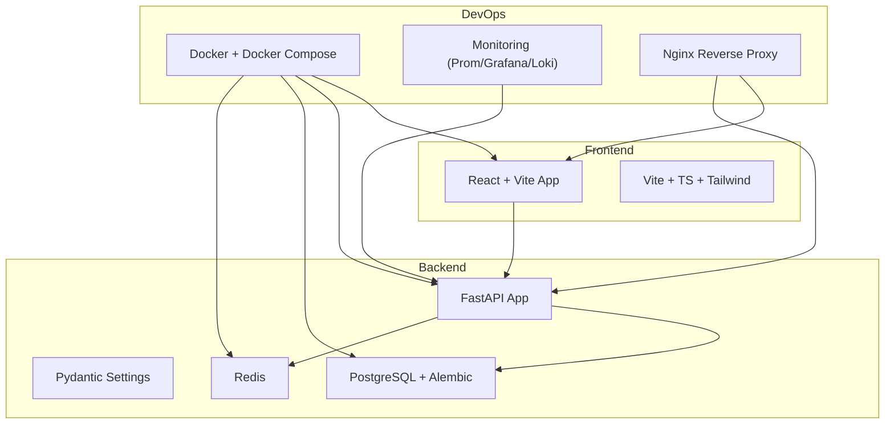
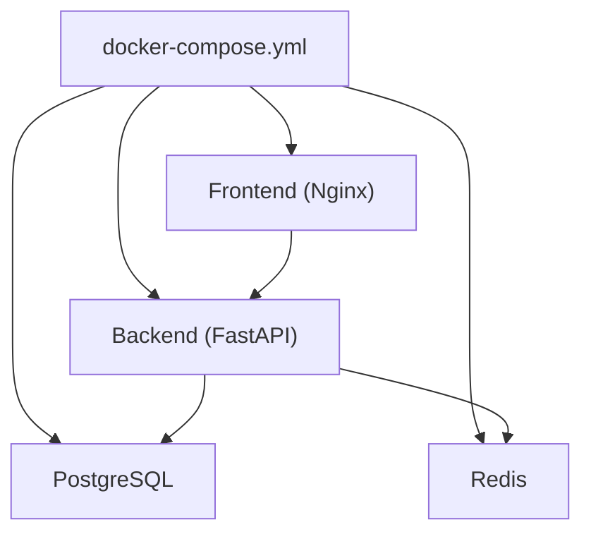
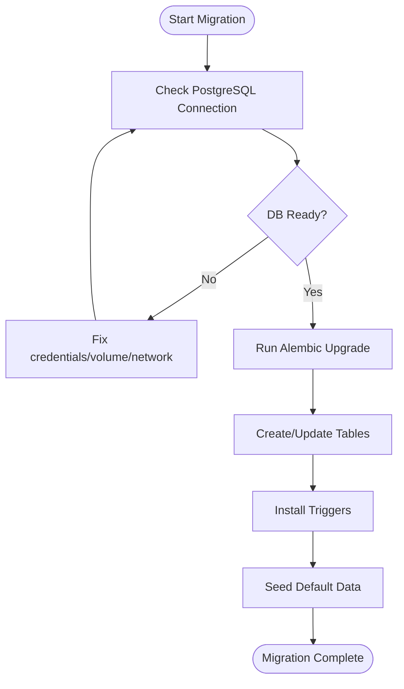
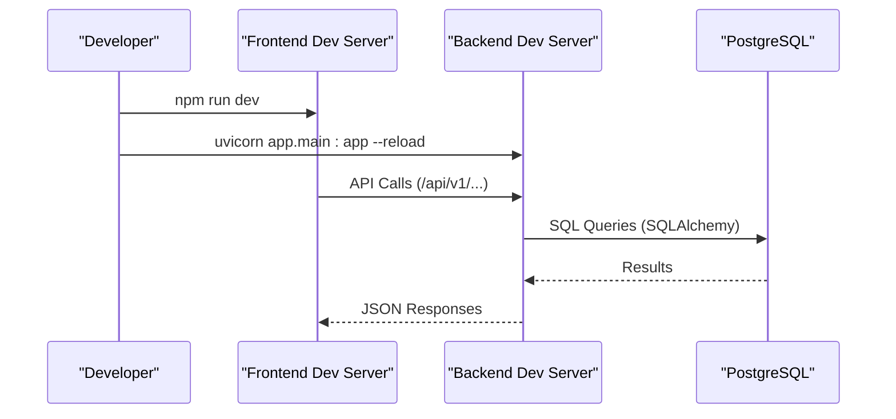

# Getting Started

<cite>
**Referenced Files in This Document**
- [README.md](file://README.md)
- [docs/ENVIRONMENT_SETUP.md](file://docs/ENVIRONMENT_SETUP.md)
- [TELEGRAM_SETUP.md](file://TELEGRAM_SETUP.md)
- [docker-compose.yml](file://docker-compose.yml)
- [backend/Dockerfile](file://backend/Dockerfile)
- [frontend/Dockerfile](file://frontend/Dockerfile)
- [backend/app/utils/config.py](file://backend/app/utils/config.py)
- [backend/app/main.py](file://backend/app/main.py)
- [backend/requirements.txt](file://backend/requirements.txt)
- [frontend/package.json](file://frontend/package.json)
- [backend/pytest.ini](file://backend/pytest.ini)
- [frontend/jest.config.js](file://frontend/jest.config.js)
- [database/migrations/versions/cd723942379e_initial_schema.py](file://database/migrations/versions/cd723942379e_initial_schema.py)
- [backend/app/api/auth.py](file://backend/app/api/auth.py)
</cite>

## Table of Contents
1. [Introduction](#introduction)
2. [Project Structure](#project-structure)
3. [Prerequisites](#prerequisites)
4. [Quick Start](#quick-start)
5. [Environment Configuration](#environment-configuration)
6. [Docker-Based Development Setup](#docker-based-development-setup)
7. [Local Development Alternatives](#local-development-alternatives)
8. [Database Migrations](#database-migrations)
9. [Accessing the Application](#accessing-the-application)
10. [Development Workflow](#development-workflow)
11. [Testing Setup](#testing-setup)
12. [Environment Variables Reference](#environment-variables-reference)
13. [Troubleshooting Guide](#troubleshooting-guide)
14. [Conclusion](#conclusion)

## Introduction
FitTracker Pro is a Telegram Mini App for fitness and health tracking. It includes features like workout logging, exercise catalog, analytics, achievements, challenges, health metrics (glucose, water, wellness), and an emergency mode. The project consists of:
- Frontend: React + TypeScript + Vite
- Backend: Python FastAPI with PostgreSQL, Redis, Alembic migrations
- DevOps: Docker + Docker Compose, GitHub Actions CI/CD, Prometheus + Grafana monitoring

## Project Structure
The repository is organized into modular directories:
- frontend/: React application with TypeScript, Vite, Tailwind CSS, and Telegram Mini Apps integration
- backend/: FastAPI application with SQLAlchemy ORM, Alembic migrations, and Pydantic settings
- database/: PostgreSQL migration scripts and schema definitions
- monitoring/: Prometheus, Grafana, Loki configuration for observability
- nginx/: Nginx reverse proxy configuration
- docs/: Deployment and environment setup guides
- .github/workflows/: CI/CD pipelines

**Diagram sources**
- [docker-compose.yml:1-99](file://docker-compose.yml#L1-L99)
- [backend/app/utils/config.py:15-55](file://backend/app/utils/config.py#L15-L55)
- [backend/app/main.py:56-107](file://backend/app/main.py#L56-L107)

**Section sources**
- [README.md:5-44](file://README.md#L5-L44)

## Prerequisites
- Docker and Docker Compose (recommended for development)
- Node.js (for local frontend development)
- Python 3.11+ (for local backend development)
- Git

These tools enable both Docker-based and local development setups.

**Section sources**
- [README.md:47-88](file://README.md#L47-L88)

## Quick Start
Choose one of the two primary setup paths below.

### Option A: Docker-Based Development (Recommended)
- Clone the repository and copy environment files:
  - backend/.env.example → backend/.env
  - frontend/.env.example → frontend/.env
- Start services:
  - docker-compose up -d
- Apply database migrations:
  - docker-compose exec backend alembic upgrade head

Access points:
- Frontend: http://localhost
- Backend API: http://localhost:8000/api/v1
- API Docs: http://localhost:8000/docs

**Section sources**
- [README.md:47-64](file://README.md#L47-L64)
- [docker-compose.yml:1-99](file://docker-compose.yml#L1-L99)

### Option B: Local Development
- Frontend:
  - cd frontend
  - npm install
  - npm run dev
- Backend:
  - cd backend
  - python -m venv venv
  - source venv/bin/activate  # Windows: venv\Scripts\activate
  - pip install -r requirements.txt
  - cp .env.example .env
  - uvicorn app.main:app --reload

**Section sources**
- [README.md:71-88](file://README.md#L71-L88)

## Environment Configuration
Environment variables are loaded via Pydantic settings in the backend and Vite/Vitest in the frontend. Both Docker and local setups rely on these variables.

Key locations:
- Backend settings loader: [backend/app/utils/config.py:15-55](file://backend/app/utils/config.py#L15-L55)
- Backend runtime configuration: [backend/app/main.py:56-107](file://backend/app/main.py#L56-L107)
- Frontend package scripts: [frontend/package.json:6-14](file://frontend/package.json#L6-L14)

Security checklist:
- Change default SECRET_KEY
- Use strong database passwords
- Set DEBUG=false in production
- Configure ALLOWED_ORIGINS correctly
- Protect .env files

**Section sources**
- [docs/ENVIRONMENT_SETUP.md:112-141](file://docs/ENVIRONMENT_SETUP.md#L112-L141)
- [backend/app/utils/config.py:15-55](file://backend/app/utils/config.py#L15-L55)
- [backend/app/main.py:56-107](file://backend/app/main.py#L56-L107)

## Docker-Based Development Setup
Compose orchestrates:
- PostgreSQL database with health checks
- Redis cache
- Backend API (FastAPI) with Gunicorn + Uvicorn workers
- Frontend (React + Vite) served via Nginx

Build and run:
- docker-compose up -d
- Access frontend at http://localhost and backend at http://localhost:8000

Health checks:
- Backend: curl -f http://localhost:8000/api/v1/health
- Frontend: curl -f http://localhost/health

**Diagram sources**
- [docker-compose.yml:1-99](file://docker-compose.yml#L1-L99)

**Section sources**
- [docker-compose.yml:1-99](file://docker-compose.yml#L1-L99)
- [backend/Dockerfile:1-48](file://backend/Dockerfile#L1-L48)
- [frontend/Dockerfile:1-56](file://frontend/Dockerfile#L1-L56)

## Local Development Alternatives
- Frontend:
  - Install dependencies: npm install
  - Start dev server: npm run dev
- Backend:
  - Create virtual environment and install dependencies
  - Copy .env.example to .env and adjust variables
  - Run with hot reload: uvicorn app.main:app --reload

Frontend dependencies and scripts are defined in [frontend/package.json:16-58](file://frontend/package.json#L16-L58).

**Section sources**
- [README.md:71-88](file://README.md#L71-L88)
- [frontend/package.json:16-58](file://frontend/package.json#L16-L58)
- [backend/requirements.txt:1-42](file://backend/requirements.txt#L1-L42)

## Database Migrations
The project uses Alembic for PostgreSQL migrations. The initial schema includes tables for users, exercises, workout templates/logs, health metrics, achievements, challenges, and emergency contacts. Triggers automatically update timestamps.

Apply migrations:
- Docker: docker-compose exec backend alembic upgrade head
- Production: docker-compose -f docker-compose.prod.yml exec backend alembic upgrade head

Migration file reference:
- Initial schema: [database/migrations/versions/cd723942379e_initial_schema.py:19-446](file://database/migrations/versions/cd723942379e_initial_schema.py#L19-L446)

**Diagram sources**
- [database/migrations/versions/cd723942379e_initial_schema.py:19-446](file://database/migrations/versions/cd723942379e_initial_schema.py#L19-L446)

**Section sources**
- [README.md:62-64](file://README.md#L62-L64)
- [database/migrations/versions/cd723942379e_initial_schema.py:19-446](file://database/migrations/versions/cd723942379e_initial_schema.py#L19-L446)

## Accessing the Application
- Frontend: http://localhost
- Backend API: http://localhost:8000/api/v1
- API Docs: http://localhost:8000/docs

Telegram WebApp integration requires:
- Bot token from BotFather
- WebApp URL configured in BotFather
- HTTPS for production deployments

**Section sources**
- [README.md:66-69](file://README.md#L66-L69)
- [TELEGRAM_SETUP.md:34-45](file://TELEGRAM_SETUP.md#L34-L45)

## Development Workflow
- Frontend:
  - Use Vite dev server for fast iteration
  - Jest for unit tests and coverage reports
- Backend:
  - Uvicorn reload for rapid feedback
  - Pytest with coverage thresholds
- CI/CD:
  - GitHub Actions workflows for testing, building, deploying, and migrations

**Diagram sources**
- [frontend/package.json:7-14](file://frontend/package.json#L7-L14)
- [backend/app/main.py:56-107](file://backend/app/main.py#L56-L107)

**Section sources**
- [README.md:90-102](file://README.md#L90-L102)
- [backend/pytest.ini:17-22](file://backend/pytest.ini#L17-L22)
- [frontend/jest.config.js:30-37](file://frontend/jest.config.js#L30-L37)

## Testing Setup
- Frontend:
  - Run tests: npm test
  - Coverage: npm run test:coverage
- Backend:
  - Run tests: pytest
  - Coverage: pytest --cov=app --cov-report=html

Coverage thresholds:
- Minimum 80% across branches, functions, lines, and statements

**Section sources**
- [README.md:90-102](file://README.md#L90-L102)
- [backend/pytest.ini:11-16](file://backend/pytest.ini#L11-L16)
- [frontend/jest.config.js:30-37](file://frontend/jest.config.js#L30-L37)

## Environment Variables Reference
Backend (.env):
- DATABASE_URL: async PostgreSQL connection
- DATABASE_URL_SYNC: sync PostgreSQL connection
- REDIS_URL: Redis cache connection
- TELEGRAM_BOT_TOKEN: Bot token from BotFather
- TELEGRAM_WEBAPP_URL: Your Mini App URL
- SECRET_KEY: JWT signing key (secure, min 32 chars)
- ENVIRONMENT: development/production
- DEBUG: enable/disable docs and debug features
- ALLOWED_ORIGINS: CORS origins
- SENTRY_DSN: Sentry error tracking

Frontend (.env):
- VITE_API_URL: Backend API URL
- VITE_TELEGRAM_BOT_USERNAME: Bot username (without @)
- VITE_ENVIRONMENT: development/production
- VITE_SENTRY_DSN: Sentry DSN for frontend

**Section sources**
- [README.md:106-128](file://README.md#L106-L128)
- [docs/ENVIRONMENT_SETUP.md:24-110](file://docs/ENVIRONMENT_SETUP.md#L24-L110)

## Troubleshooting Guide
Common issues and resolutions:
- Database connection failed:
  - Ensure PostgreSQL is running
  - Verify credentials in DATABASE_URL
  - Confirm database exists
- Telegram WebApp not loading:
  - Match TELEGRAM_WEBAPP_URL with your domain
  - Check CORS settings in backend
  - Use HTTPS (required by Telegram)
- CORS errors:
  - Add your domain to ALLOWED_ORIGINS
  - Include protocol (http:// or https://)
  - Separate multiple origins with commas

Telegram-specific troubleshooting:
- “Not running in Telegram WebApp”: Ensure you're opening the app through Telegram
- “Invalid hash signature”: Verify TELEGRAM_BOT_TOKEN and that initData hasn't been modified
- Theme not applying: Call tg.init() before accessing theme
- Haptic feedback not working: Ensure device supports haptic feedback

**Section sources**
- [docs/ENVIRONMENT_SETUP.md:122-141](file://docs/ENVIRONMENT_SETUP.md#L122-L141)
- [TELEGRAM_SETUP.md:257-275](file://TELEGRAM_SETUP.md#L257-L275)

## Conclusion
You now have everything needed to set up FitTracker Pro locally or in containers, configure environment variables, apply database migrations, and run the development workflow. For production deployment, consult the deployment documentation and security checklist referenced in the project’s README.