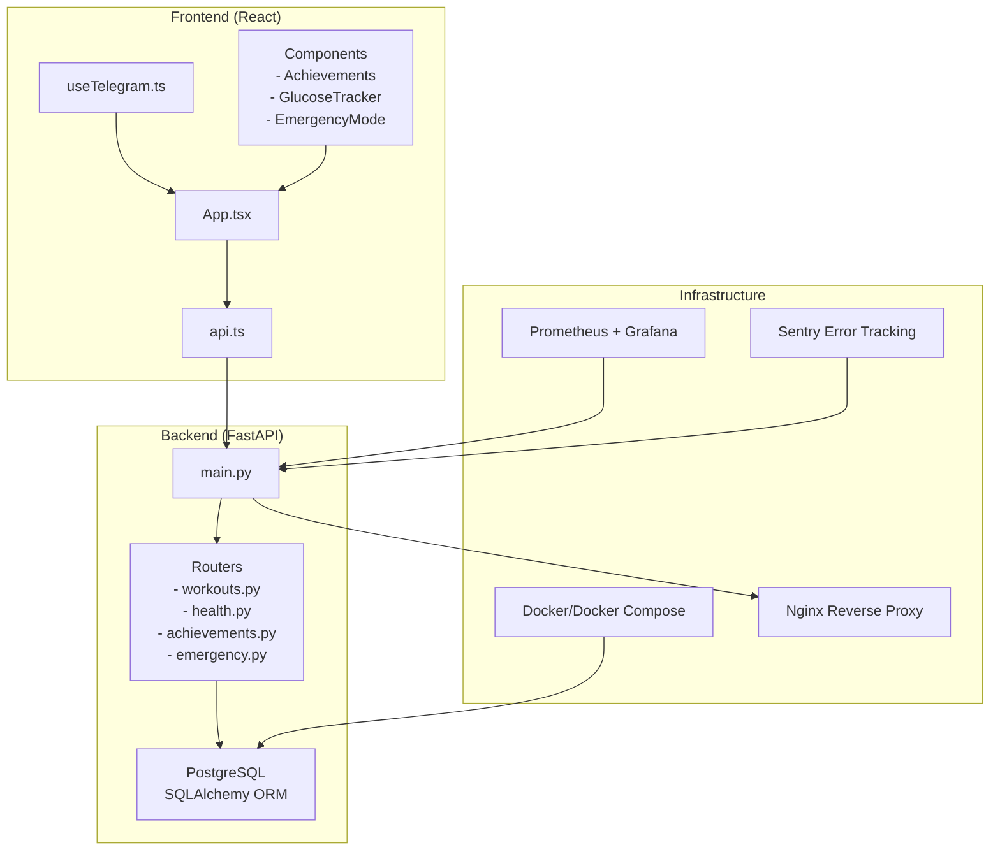
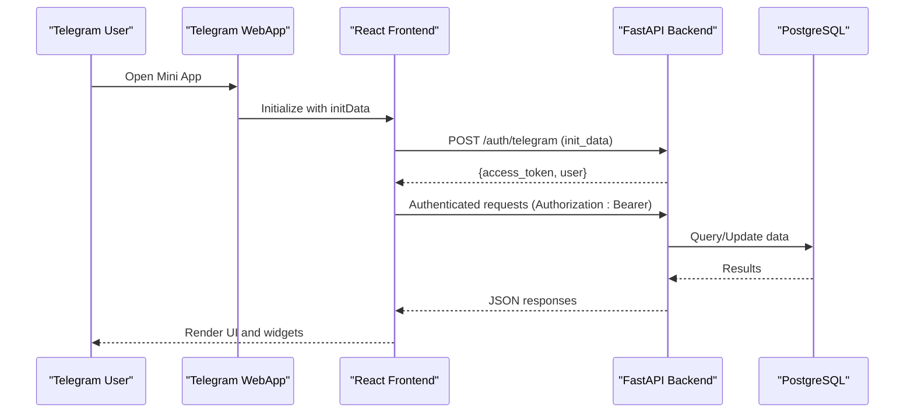
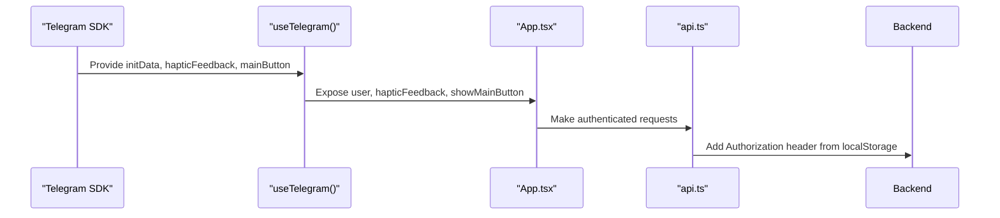
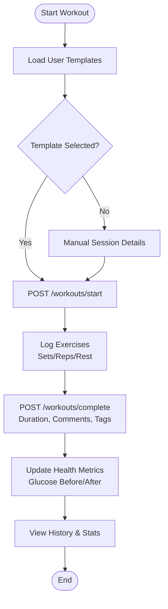
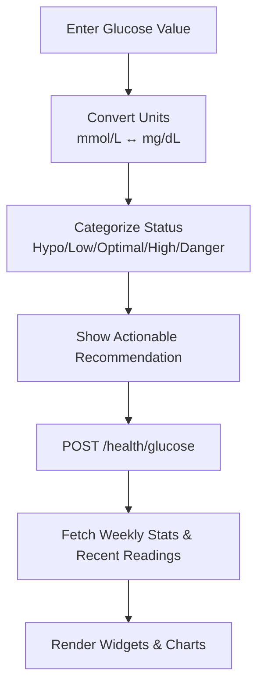
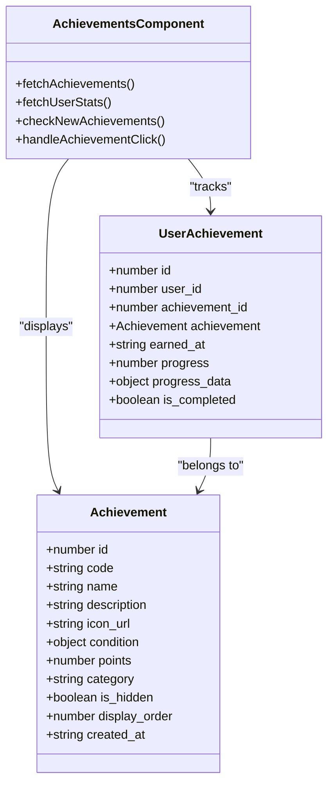
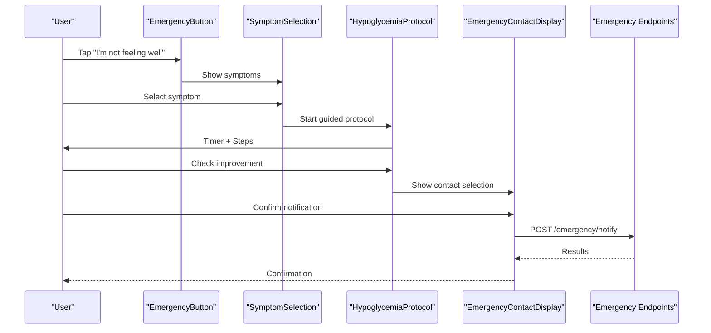
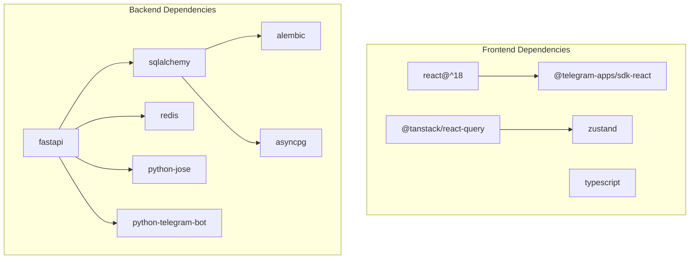

# Project Overview

<cite>
**Referenced Files in This Document**
- [README.md](file://README.md)
- [TELEGRAM_SETUP.md](file://TELEGRAM_SETUP.md)
- [backend/app/main.py](file://backend/app/main.py)
- [backend/requirements.txt](file://backend/requirements.txt)
- [frontend/package.json](file://frontend/package.json)
- [frontend/src/App.tsx](file://frontend/src/App.tsx)
- [frontend/src/pages/HomePage.tsx](file://frontend/src/pages/HomePage.tsx)
- [frontend/src/services/api.ts](file://frontend/src/services/api.ts)
- [frontend/src/hooks/useTelegram.ts](file://frontend/src/hooks/useTelegram.ts)
- [backend/app/api/workouts.py](file://backend/app/api/workouts.py)
- [backend/app/api/health.py](file://backend/app/api/health.py)
- [backend/app/api/achievements.py](file://backend/app/api/achievements.py)
- [backend/app/api/emergency.py](file://backend/app/api/emergency.py)
- [frontend/src/components/gamification/Achievements.tsx](file://frontend/src/components/gamification/Achievements.tsx)
- [frontend/src/components/health/GlucoseTracker.tsx](file://frontend/src/components/health/GlucoseTracker.tsx)
- [frontend/src/components/emergency/EmergencyMode.tsx](file://frontend/src/components/emergency/EmergencyMode.tsx)
</cite>

## Table of Contents
1. [Introduction](#introduction)
2. [Project Structure](#project-structure)
3. [Core Components](#core-components)
4. [Architecture Overview](#architecture-overview)
5. [Detailed Component Analysis](#detailed-component-analysis)
6. [Dependency Analysis](#dependency-analysis)
7. [Performance Considerations](#performance-considerations)
8. [Troubleshooting Guide](#troubleshooting-guide)
9. [Conclusion](#conclusion)

## Introduction
FitTracker Pro is a Telegram Mini App designed to help users track fitness and health metrics while providing an integrated, cross-platform experience. Built for Telegram WebApp environments, it offers workout tracking, health monitoring, a gamification system, and an emergency mode for safety. The app emphasizes accessibility, real-time integration with Telegram’s Mini Apps SDK, and a cohesive user experience across mobile devices.

Key value propositions:
- Seamless Telegram integration with WebApp authentication and theme support
- Comprehensive fitness and health tracking with structured workout sessions and health metrics
- Gamified engagement through achievements and progress visualization
- Safety-first emergency mode with contact notifications and hypoglycemia protocol guidance
- Cross-platform availability via Telegram WebApp, ensuring broad reach and instant access

Target audience:
- Fitness enthusiasts and athletes who want structured workout tracking
- Health-conscious individuals monitoring glucose, wellness, and activity
- Users requiring quick access to emergency assistance and contact notifications

## Project Structure
The project follows a modern full-stack architecture with a clear separation between frontend, backend, and shared concerns:
- Frontend: React 18 with TypeScript, Vite, Tailwind CSS, and Telegram Mini Apps SDK
- Backend: FastAPI with asynchronous database operations, SQLAlchemy ORM, and Alembic migrations
- Database: PostgreSQL with asyncpg driver
- DevOps: Docker and Docker Compose for containerization and deployment orchestration
- Monitoring: Prometheus, Grafana, and Sentry for observability and error tracking

**Diagram sources**
- [backend/app/main.py:1-126](file://backend/app/main.py#L1-L126)
- [frontend/src/App.tsx:1-35](file://frontend/src/App.tsx#L1-L35)
- [frontend/src/services/api.ts:1-69](file://frontend/src/services/api.ts#L1-L69)
- [frontend/src/hooks/useTelegram.ts:1-47](file://frontend/src/hooks/useTelegram.ts#L1-L47)
- [backend/app/api/workouts.py:1-522](file://backend/app/api/workouts.py#L1-L522)
- [backend/app/api/health.py:1-615](file://backend/app/api/health.py#L1-L615)
- [backend/app/api/achievements.py:1-420](file://backend/app/api/achievements.py#L1-L420)
- [backend/app/api/emergency.py:1-543](file://backend/app/api/emergency.py#L1-L543)

**Section sources**
- [README.md:1-237](file://README.md#L1-L237)
- [backend/app/main.py:1-126](file://backend/app/main.py#L1-L126)
- [frontend/src/App.tsx:1-35](file://frontend/src/App.tsx#L1-L35)

## Core Components
FitTracker Pro’s core functionality is organized around four primary pillars:

- Workout Tracking
  - Template-based workout creation and management
  - Session lifecycle: start, complete, and history viewing
  - Exercise logging with sets, reps, and rest timers
  - Integration with health metrics (e.g., glucose before/after)

- Health Monitoring
  - Glucose tracking with unit conversion and status categorization
  - Wellness check-ins with sleep, energy, pain, and mood scoring
  - Historical views and periodic statistics

- Gamification System
  - Achievement catalog with categories (workouts, strength, health, content, general)
  - User progress tracking, unlocking, and leaderboard
  - Haptic feedback and visual rewards for milestones

- Emergency Mode
  - One-tap emergency button with 3-second hold to close
  - Symptom selection and guided hypoglycemia protocol
  - Contact notifications with optional location sharing
  - Event logging for analytics and safety tracking

Practical examples:
- Start a workout session using a saved template, log exercises with sets/reps, and complete the session with notes and glucose measurements.
- Track glucose levels before and after workouts, view weekly trends, and receive actionable recommendations.
- Earn achievements for completing workouts, reaching personal records, or maintaining health streaks.
- Activate emergency mode to notify contacts and follow a structured protocol for hypoglycemia.

**Section sources**
- [backend/app/api/workouts.py:1-522](file://backend/app/api/workouts.py#L1-L522)
- [backend/app/api/health.py:1-615](file://backend/app/api/health.py#L1-L615)
- [backend/app/api/achievements.py:1-420](file://backend/app/api/achievements.py#L1-L420)
- [backend/app/api/emergency.py:1-543](file://backend/app/api/emergency.py#L1-L543)
- [frontend/src/components/gamification/Achievements.tsx:1-934](file://frontend/src/components/gamification/Achievements.tsx#L1-L934)
- [frontend/src/components/health/GlucoseTracker.tsx:1-762](file://frontend/src/components/health/GlucoseTracker.tsx#L1-L762)
- [frontend/src/components/emergency/EmergencyMode.tsx:1-1079](file://frontend/src/components/emergency/EmergencyMode.tsx#L1-L1079)

## Architecture Overview
FitTracker Pro uses a clean, layered architecture:
- Presentation Layer: React frontend with Telegram Mini Apps SDK integration
- API Layer: FastAPI routers handling authentication, CRUD operations, and domain logic
- Persistence Layer: PostgreSQL with SQLAlchemy ORM and Alembic migrations
- Infrastructure: Dockerized services, reverse proxy via Nginx, and observability with Prometheus, Grafana, and Sentry

**Diagram sources**
- [TELEGRAM_SETUP.md:56-109](file://TELEGRAM_SETUP.md#L56-L109)
- [backend/app/main.py:90-106](file://backend/app/main.py#L90-L106)
- [frontend/src/services/api.ts:1-69](file://frontend/src/services/api.ts#L1-L69)

**Section sources**
- [TELEGRAM_SETUP.md:1-281](file://TELEGRAM_SETUP.md#L1-L281)
- [backend/app/main.py:1-126](file://backend/app/main.py#L1-L126)
- [frontend/src/hooks/useTelegram.ts:1-47](file://frontend/src/hooks/useTelegram.ts#L1-L47)

## Detailed Component Analysis

### Telegram Mini App Integration
The frontend integrates tightly with Telegram Mini Apps:
- Initialization and theme synchronization
- Haptic feedback for interactions
- Main button customization and visibility
- Closing confirmation and safe area handling

**Diagram sources**
- [frontend/src/hooks/useTelegram.ts:1-47](file://frontend/src/hooks/useTelegram.ts#L1-L47)
- [frontend/src/App.tsx:1-35](file://frontend/src/App.tsx#L1-L35)
- [frontend/src/services/api.ts:1-69](file://frontend/src/services/api.ts#L1-L69)

**Section sources**
- [TELEGRAM_SETUP.md:1-281](file://TELEGRAM_SETUP.md#L1-L281)
- [frontend/src/hooks/useTelegram.ts:1-47](file://frontend/src/hooks/useTelegram.ts#L1-L47)
- [frontend/src/services/api.ts:1-69](file://frontend/src/services/api.ts#L1-L69)

### Workout Tracking Workflow
The workout tracking system supports template-based sessions, exercise logging, and completion reporting.

**Diagram sources**
- [backend/app/api/workouts.py:337-493](file://backend/app/api/workouts.py#L337-L493)
- [backend/app/api/health.py:29-91](file://backend/app/api/health.py#L29-L91)

**Section sources**
- [backend/app/api/workouts.py:1-522](file://backend/app/api/workouts.py#L1-L522)
- [backend/app/api/health.py:1-615](file://backend/app/api/health.py#L1-L615)

### Health Monitoring and Glucose Tracker
The glucose tracker provides real-time status, recommendations, and historical insights with unit conversion and visual indicators.

**Diagram sources**
- [frontend/src/components/health/GlucoseTracker.tsx:1-762](file://frontend/src/components/health/GlucoseTracker.tsx#L1-L762)
- [backend/app/api/health.py:93-199](file://backend/app/api/health.py#L93-L199)

**Section sources**
- [frontend/src/components/health/GlucoseTracker.tsx:1-762](file://frontend/src/components/health/GlucoseTracker.tsx#L1-L762)
- [backend/app/api/health.py:1-615](file://backend/app/api/health.py#L1-L615)

### Gamification System
Achievements drive engagement through categories, progress tracking, and rewards.

**Diagram sources**
- [frontend/src/components/gamification/Achievements.tsx:1-934](file://frontend/src/components/gamification/Achievements.tsx#L1-L934)
- [backend/app/api/achievements.py:25-171](file://backend/app/api/achievements.py#L25-L171)

**Section sources**
- [frontend/src/components/gamification/Achievements.tsx:1-934](file://frontend/src/components/gamification/Achievements.tsx#L1-L934)
- [backend/app/api/achievements.py:1-420](file://backend/app/api/achievements.py#L1-L420)

### Emergency Mode
Emergency mode provides a guided, safety-focused workflow with contact notifications and protocol steps.

**Diagram sources**
- [frontend/src/components/emergency/EmergencyMode.tsx:1-1079](file://frontend/src/components/emergency/EmergencyMode.tsx#L1-L1079)
- [backend/app/api/emergency.py:249-359](file://backend/app/api/emergency.py#L249-L359)

**Section sources**
- [frontend/src/components/emergency/EmergencyMode.tsx:1-1079](file://frontend/src/components/emergency/EmergencyMode.tsx#L1-L1079)
- [backend/app/api/emergency.py:1-543](file://backend/app/api/emergency.py#L1-L543)

## Dependency Analysis
Technology stack highlights:
- Frontend: React 18, TypeScript, Vite, Tailwind CSS, @telegram-apps/sdk, @telegram-apps/sdk-react, TanStack Query, Zustand
- Backend: FastAPI, SQLAlchemy, Alembic, asyncpg, Redis, python-jose, python-telegram-bot
- DevOps: Docker, Docker Compose, Nginx, GitHub Actions, Prometheus, Grafana, Sentry

**Diagram sources**
- [frontend/package.json:1-60](file://frontend/package.json#L1-L60)
- [backend/requirements.txt:1-42](file://backend/requirements.txt#L1-L42)

**Section sources**
- [frontend/package.json:1-60](file://frontend/package.json#L1-L60)
- [backend/requirements.txt:1-42](file://backend/requirements.txt#L1-L42)

## Performance Considerations
- Asynchronous operations: Backend leverages async SQLAlchemy and FastAPI to minimize blocking I/O.
- Pagination and filtering: Workout history and health logs support pagination and date range filters to reduce payload sizes.
- Caching: Redis can cache frequently accessed data (e.g., user stats, templates) to improve responsiveness.
- Frontend state management: Zustand for lightweight global state and TanStack Query for efficient caching and refetching.
- Observability: Prometheus metrics and Grafana dashboards enable proactive monitoring of latency, throughput, and error rates.

## Troubleshooting Guide
Common issues and resolutions:
- Not running in Telegram WebApp
  - Ensure the app is opened via Telegram and window.Telegram.WebApp is available.
  - Verify initialization and theme configuration via useTelegram hook.
- Invalid hash signature during authentication
  - Confirm TELEGRAM_BOT_TOKEN correctness and that initData has not been modified.
  - Validate timestamp freshness and use constant-time comparison for hash verification.
- Theme not applying
  - Call tg.init() before accessing theme parameters and ensure themeParams are present.
- Haptic feedback not working
  - Confirm device support and availability of HapticFeedback API.
- API authentication failures
  - Ensure Authorization header includes a valid Bearer token stored in localStorage.
  - Verify rate limits and CORS configuration in development vs production.

**Section sources**
- [TELEGRAM_SETUP.md:257-275](file://TELEGRAM_SETUP.md#L257-L275)
- [frontend/src/hooks/useTelegram.ts:1-47](file://frontend/src/hooks/useTelegram.ts#L1-L47)
- [frontend/src/services/api.ts:1-69](file://frontend/src/services/api.ts#L1-L69)

## Conclusion
FitTracker Pro delivers a robust, Telegram-integrated solution for fitness and health tracking. Its modular architecture, comprehensive feature set, and emphasis on safety and engagement make it suitable for a wide range of users. The combination of structured workout tracking, health monitoring, gamification, and emergency capabilities provides a complete digital companion for active lifestyles. The cross-platform accessibility via Telegram Mini App ensures broad reach and seamless user experiences across devices.