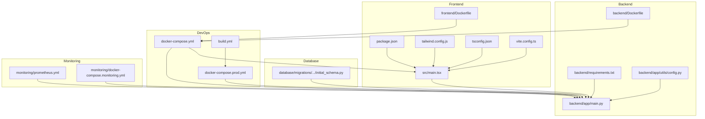
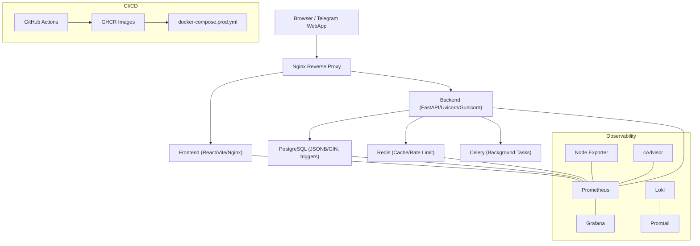
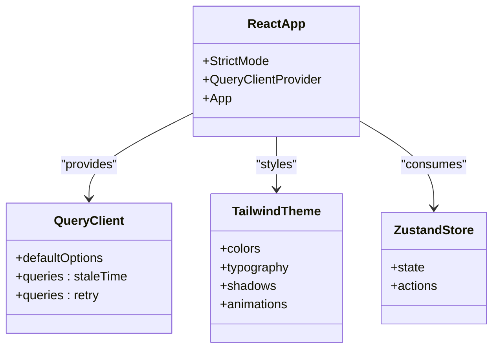
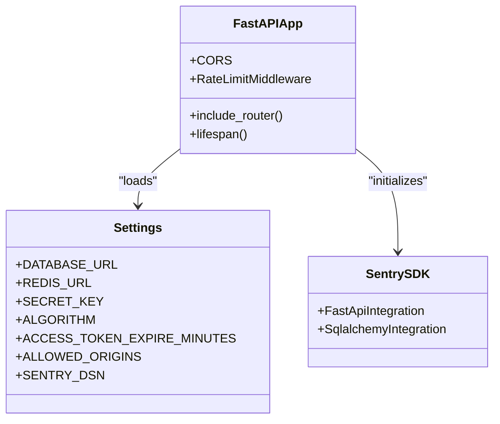
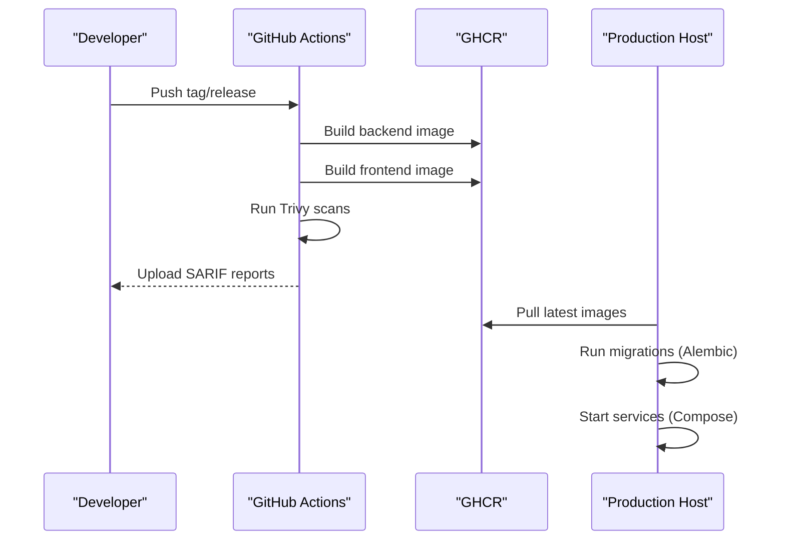
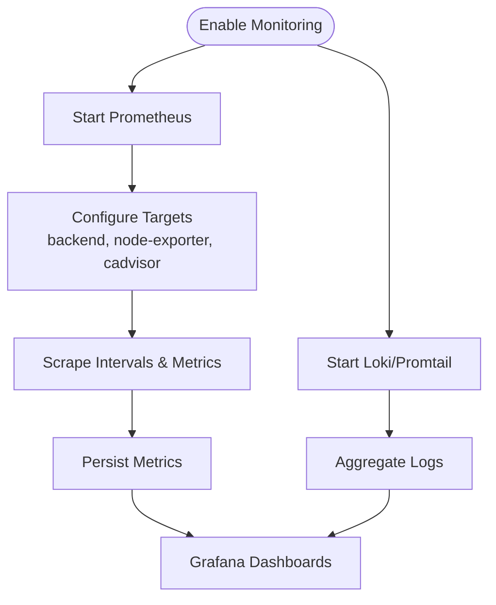
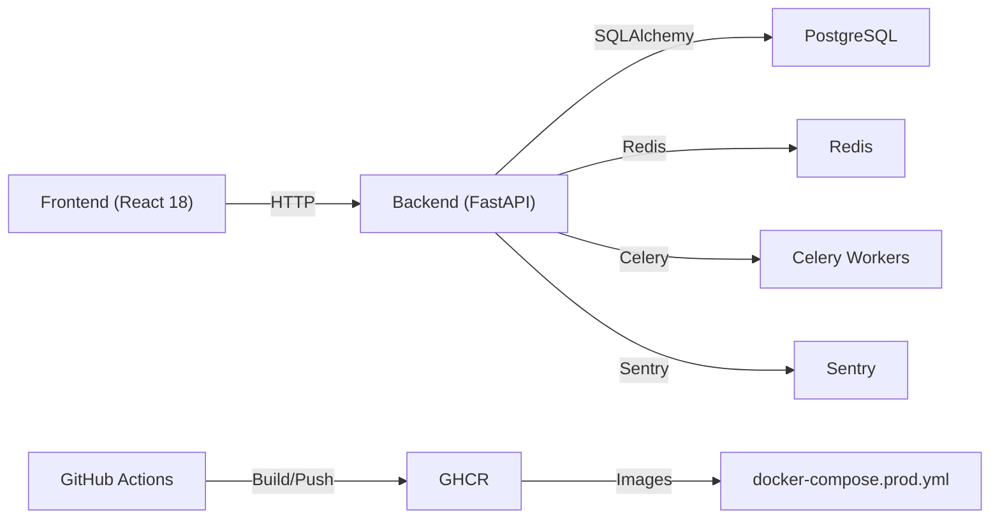

# Technology Stack

<cite>
**Referenced Files in This Document**
- [backend/requirements.txt](file://backend/requirements.txt)
- [backend/app/main.py](file://backend/app/main.py)
- [backend/app/utils/config.py](file://backend/app/utils/config.py)
- [backend/Dockerfile](file://backend/Dockerfile)
- [frontend/package.json](file://frontend/package.json)
- [frontend/src/main.tsx](file://frontend/src/main.tsx)
- [frontend/tailwind.config.js](file://frontend/tailwind.config.js)
- [frontend/tsconfig.json](file://frontend/tsconfig.json)
- [frontend/vite.config.ts](file://frontend/vite.config.ts)
- [frontend/Dockerfile](file://frontend/Dockerfile)
- [docker-compose.yml](file://docker-compose.yml)
- [docker-compose.prod.yml](file://docker-compose.prod.yml)
- [database/migrations/versions/cd723942379e_initial_schema.py](file://database/migrations/versions/cd723942379e_initial_schema.py)
- [.github/workflows/build.yml](file://.github/workflows/build.yml)
- [monitoring/prometheus.yml](file://monitoring/prometheus.yml)
- [monitoring/docker-compose.monitoring.yml](file://monitoring/docker-compose.monitoring.yml)
- [docs/DEPLOYMENT.md](file://docs/DEPLOYMENT.md)
</cite>

## Table of Contents
1. [Introduction](#introduction)
2. [Project Structure](#project-structure)
3. [Core Components](#core-components)
4. [Architecture Overview](#architecture-overview)
5. [Detailed Component Analysis](#detailed-component-analysis)
6. [Dependency Analysis](#dependency-analysis)
7. [Performance Considerations](#performance-considerations)
8. [Troubleshooting Guide](#troubleshooting-guide)
9. [Conclusion](#conclusion)

## Introduction
This document presents the comprehensive technology stack for FitTracker Pro, detailing the frontend, backend, database, containerization, DevOps tooling, and monitoring systems. It explains the rationale behind each choice, integration patterns, version compatibility, and operational guidance for development, testing, and production deployment.

## Project Structure
FitTracker Pro follows a modular monorepo layout with clear separation between frontend, backend, database migrations, monitoring, and deployment assets:
- Frontend: React 18 with TypeScript, Vite, Tailwind CSS, and Telegram WebApp SDK
- Backend: FastAPI with Python, asynchronous PostgreSQL via SQLAlchemy, Redis caching, Celery task queue, Alembic migrations
- Database: PostgreSQL with JSONB/GIN indexing and trigger-based audit fields
- DevOps: Docker Compose for local development and production orchestration, GitHub Actions for CI/CD, optional Prometheus/Grafana for observability
- Monitoring: Prometheus scraping backend metrics, optional Loki/Promtail for logs, Grafana dashboards



**Diagram sources**
- [docker-compose.yml:1-99](file://docker-compose.yml#L1-L99)
- [docker-compose.prod.yml:1-132](file://docker-compose.prod.yml#L1-L132)
- [backend/app/main.py:1-126](file://backend/app/main.py#L1-L126)
- [backend/app/utils/config.py:1-55](file://backend/app/utils/config.py#L1-L55)
- [backend/requirements.txt:1-42](file://backend/requirements.txt#L1-L42)
- [frontend/src/main.tsx:1-23](file://frontend/src/main.tsx#L1-L23)
- [frontend/package.json:1-60](file://frontend/package.json#L1-L60)
- [frontend/tailwind.config.js:1-349](file://frontend/tailwind.config.js#L1-L349)
- [frontend/tsconfig.json:1-61](file://frontend/tsconfig.json#L1-L61)
- [frontend/vite.config.ts:1-40](file://frontend/vite.config.ts#L1-L40)
- [frontend/Dockerfile:1-56](file://frontend/Dockerfile#L1-L56)
- [backend/Dockerfile:1-48](file://backend/Dockerfile#L1-L48)
- [database/migrations/versions/cd723942379e_initial_schema.py:1-460](file://database/migrations/versions/cd723942379e_initial_schema.py#L1-L460)
- [.github/workflows/build.yml:1-132](file://.github/workflows/build.yml#L1-L132)
- [monitoring/prometheus.yml:1-49](file://monitoring/prometheus.yml#L1-L49)
- [monitoring/docker-compose.monitoring.yml:1-124](file://monitoring/docker-compose.monitoring.yml#L1-L124)

**Section sources**
- [docker-compose.yml:1-99](file://docker-compose.yml#L1-L99)
- [docker-compose.prod.yml:1-132](file://docker-compose.prod.yml#L1-L132)
- [backend/app/main.py:1-126](file://backend/app/main.py#L1-L126)
- [frontend/src/main.tsx:1-23](file://frontend/src/main.tsx#L1-L23)

## Core Components
- Frontend: React 18 with TypeScript, Vite build, Tailwind CSS for styling, TanStack React Query for data fetching, Zustand for state management, Telegram WebApp SDK for Mini App integration
- Backend: FastAPI application with CORS, rate-limiting middleware, Sentry for error tracking, SQLAlchemy ORM with asyncpg, Alembic for migrations, Redis for caching, Celery for background tasks
- Database: PostgreSQL with JSONB/GIN indexes, trigger-based updated_at, initial schema covering users, exercises, workout templates/logs, glucose logs, wellness, achievements, challenges, and emergency contacts
- DevOps: Dockerized services orchestrated by Docker Compose, GitHub Actions for building/pushing images and vulnerability scanning, optional Nginx reverse proxy in production
- Monitoring: Prometheus scraping backend metrics, optional Grafana dashboards, Loki/Promtail for logs, Node Exporter and cAdvisor for system/container metrics

**Section sources**
- [frontend/package.json:1-60](file://frontend/package.json#L1-L60)
- [frontend/src/main.tsx:1-23](file://frontend/src/main.tsx#L1-L23)
- [frontend/tailwind.config.js:1-349](file://frontend/tailwind.config.js#L1-L349)
- [frontend/tsconfig.json:1-61](file://frontend/tsconfig.json#L1-L61)
- [frontend/vite.config.ts:1-40](file://frontend/vite.config.ts#L1-L40)
- [backend/requirements.txt:1-42](file://backend/requirements.txt#L1-L42)
- [backend/app/main.py:1-126](file://backend/app/main.py#L1-L126)
- [backend/app/utils/config.py:1-55](file://backend/app/utils/config.py#L1-L55)
- [database/migrations/versions/cd723942379e_initial_schema.py:1-460](file://database/migrations/versions/cd723942379e_initial_schema.py#L1-L460)
- [.github/workflows/build.yml:1-132](file://.github/workflows/build.yml#L1-L132)
- [monitoring/prometheus.yml:1-49](file://monitoring/prometheus.yml#L1-L49)
- [monitoring/docker-compose.monitoring.yml:1-124](file://monitoring/docker-compose.monitoring.yml#L1-L124)

## Architecture Overview
FitTracker Pro uses a container-first architecture with clear separation of concerns:
- Frontend runs in a minimal Nginx container serving static assets
- Backend exposes REST API endpoints under /api/v1, with rate limiting and CORS policies
- PostgreSQL persists structured and semi-structured data (JSONB) with GIN indexes for efficient querying
- Redis caches hot data and supports rate limiting and session-like storage
- GitHub Actions builds and pushes images to GHCR, enabling automated deployments
- Optional monitoring stack collects metrics and logs for observability



**Diagram sources**
- [docker-compose.prod.yml:102-124](file://docker-compose.prod.yml#L102-L124)
- [backend/app/main.py:77-106](file://backend/app/main.py#L77-L106)
- [backend/Dockerfile:46-48](file://backend/Dockerfile#L46-L48)
- [frontend/Dockerfile:20-56](file://frontend/Dockerfile#L20-L56)
- [.github/workflows/build.yml:1-132](file://.github/workflows/build.yml#L1-L132)
- [monitoring/prometheus.yml:15-49](file://monitoring/prometheus.yml#L15-L49)
- [monitoring/docker-compose.monitoring.yml:1-124](file://monitoring/docker-compose.monitoring.yml#L1-L124)

## Detailed Component Analysis

### Frontend Technologies
- React 18 with TypeScript: Strongly-typed UI with strict compiler options and path aliases
- Vite: Fast dev server and optimized production builds with manual code splitting
- Tailwind CSS: Utility-first CSS with a comprehensive design system and Telegram theme integration
- TanStack React Query: Centralized caching, background refetching, and optimistic updates
- Zustand: Lightweight global state management
- Telegram WebApp SDK: Seamless integration with Telegram Mini App environment
- Testing: Jest with React Testing Library and TypeScript support



**Diagram sources**
- [frontend/src/main.tsx:1-23](file://frontend/src/main.tsx#L1-L23)
- [frontend/tailwind.config.js:1-349](file://frontend/tailwind.config.js#L1-L349)
- [frontend/package.json:16-58](file://frontend/package.json#L16-L58)

**Section sources**
- [frontend/package.json:16-58](file://frontend/package.json#L16-L58)
- [frontend/src/main.tsx:1-23](file://frontend/src/main.tsx#L1-L23)
- [frontend/tailwind.config.js:1-349](file://frontend/tailwind.config.js#L1-L349)
- [frontend/tsconfig.json:1-61](file://frontend/tsconfig.json#L1-L61)
- [frontend/vite.config.ts:1-40](file://frontend/vite.config.ts#L1-L40)

### Backend Technologies
- FastAPI: Modern, fast web framework with automatic OpenAPI docs and dependency injection
- SQLAlchemy 2.x: Asynchronous ORM with asyncpg adapter and Pydantic models
- Alembic: Database migration tool integrated with SQLAlchemy models
- Redis: In-memory cache and rate limiting
- Celery: Distributed task queue for background jobs
- Sentry: Error tracking and performance monitoring
- Pydantic Settings: Type-safe configuration loading from environment variables



**Diagram sources**
- [backend/app/main.py:56-106](file://backend/app/main.py#L56-L106)
- [backend/app/utils/config.py:15-55](file://backend/app/utils/config.py#L15-L55)

**Section sources**
- [backend/app/main.py:1-126](file://backend/app/main.py#L1-L126)
- [backend/app/utils/config.py:1-55](file://backend/app/utils/config.py#L1-L55)
- [backend/requirements.txt:1-42](file://backend/requirements.txt#L1-L42)

### Database Schema and Migrations
- PostgreSQL 15: JSONB fields with GIN indexes for flexible data modeling
- Alembic-managed migrations with UUID extension and trigger-based updated_at
- Core entities: users, exercises, workout templates/logs, glucose logs, daily wellness, achievements, challenges, emergency contacts
- Indexes optimized for common filters and JSONB queries

```mermaid
erDiagram
USERS {
integer id PK
bigint telegram_id UK
string username
string first_name
jsonb profile
jsonb settings
timestamptz created_at
timestamptz updated_at
}
EXERCISES {
integer id PK
string name
text description
string category
jsonb equipment
jsonb muscle_groups
jsonb risk_flags
string media_url
string status
integer author_user_id FK
timestamptz created_at
timestamptz updated_at
}
WORKOUT_TEMPLATES {
integer id PK
integer user_id FK
string name
string type
jsonb exercises
boolean is_public
timestamptz created_at
timestamptz updated_at
}
WORKOUT_LOGS {
integer id PK
integer user_id FK
integer template_id FK
date date
integer duration
jsonb exercises
text comments
jsonb tags
numeric glucose_before
numeric glucose_after
timestamptz created_at
timestamptz updated_at
}
GLUCOSE_LOGS {
integer id PK
integer user_id FK
integer workout_id FK
numeric value
string measurement_type
timestamptz timestamp
text notes
timestamptz created_at
}
DAILY_WELLNESS {
integer id PK
integer user_id FK
date date
integer sleep_score
numeric sleep_hours
integer energy_score
jsonb pain_zones
integer stress_level
integer mood_score
text notes
timestamptz created_at
timestamptz updated_at
uq_user_date UK
}
ACHIEVEMENTS {
integer id PK
string code UK
string name
text description
string icon_url
jsonb condition
integer points
string category
boolean is_hidden
integer display_order
timestamptz created_at
}
USER_ACHIEVEMENTS {
integer id PK
integer user_id FK
integer achievement_id FK
timestamptz earned_at
integer progress
jsonb progress_data
}
CHALLENGES {
integer id PK
integer creator_id FK
string name
text description
string type
jsonb goal
date start_date
date end_date
boolean is_public
string join_code UK
integer max_participants
jsonb rules
string banner_url
string status
timestamptz created_at
timestamptz updated_at
}
EMERGENCY_CONTACTS {
integer id PK
integer user_id FK
string contact_name
string contact_username
string phone
string relationship_type
boolean is_active
boolean notify_on_workout_start
boolean notify_on_workout_end
boolean notify_on_emergency
integer priority
timestamptz created_at
timestamptz updated_at
}
USERS ||--o{ WORKOUT_TEMPLATES : "creates"
USERS ||--o{ WORKOUT_LOGS : "logs"
USERS ||--o{ GLUCOSE_LOGS : "records"
USERS ||--o{ DAILY_WELLNESS : "tracks"
USERS ||--o{ USER_ACHIEVEMENTS : "earns"
USERS ||--o{ CHALLENGES : "creates"
USERS ||--o{ EMERGENCY_CONTACTS : "has"
EXERCISES ||--o{ WORKOUT_TEMPLATES : "used_in"
EXERCISES ||--o{ WORKOUT_LOGS : "included_in"
WORKOUT_TEMPLATES ||--o{ WORKOUT_LOGS : "instantiates"
WORKOUT_LOGS ||--o{ GLUCOSE_LOGS : "context_of"
```

**Diagram sources**
- [database/migrations/versions/cd723942379e_initial_schema.py:24-460](file://database/migrations/versions/cd723942379e_initial_schema.py#L24-L460)

**Section sources**
- [database/migrations/versions/cd723942379e_initial_schema.py:1-460](file://database/migrations/versions/cd723942379e_initial_schema.py#L1-L460)

### DevOps and CI/CD
- GitHub Actions workflow builds backend and frontend Docker images, pushes to GHCR, and runs Trivy vulnerability scans
- docker-compose.dev.yml orchestrates local development with PostgreSQL and Redis, while docker-compose.prod.yml defines production images, resource limits, and Nginx reverse proxy
- Deployment guide covers VPS setup, domain/SSL, Telegram bot configuration, and manual/automated deployment



**Diagram sources**
- [.github/workflows/build.yml:1-132](file://.github/workflows/build.yml#L1-L132)
- [docker-compose.prod.yml:54-101](file://docker-compose.prod.yml#L54-L101)
- [docs/DEPLOYMENT.md:305-335](file://docs/DEPLOYMENT.md#L305-L335)

**Section sources**
- [.github/workflows/build.yml:1-132](file://.github/workflows/build.yml#L1-L132)
- [docker-compose.prod.yml:1-132](file://docker-compose.prod.yml#L1-L132)
- [docs/DEPLOYMENT.md:1-397](file://docs/DEPLOYMENT.md#L1-L397)

### Monitoring and Observability
- Prometheus configured to scrape backend metrics endpoint and optional exporters for Node and containers
- Grafana provisioned with admin credentials and dashboards; Loki/Promtail for centralized logging
- Monitoring compose network bridges with the main application network



**Diagram sources**
- [monitoring/prometheus.yml:15-49](file://monitoring/prometheus.yml#L15-L49)
- [monitoring/docker-compose.monitoring.yml:1-124](file://monitoring/docker-compose.monitoring.yml#L1-L124)

**Section sources**
- [monitoring/prometheus.yml:1-49](file://monitoring/prometheus.yml#L1-L49)
- [monitoring/docker-compose.monitoring.yml:1-124](file://monitoring/docker-compose.monitoring.yml#L1-L124)

## Dependency Analysis
- Frontend dependencies include React 18, TanStack Query, Tailwind CSS, Zustand, and Telegram SDKs
- Backend dependencies include FastAPI, SQLAlchemy 2.x, Alembic, asyncpg, Redis, Celery, Sentry, and Pydantic settings
- Dockerfiles define multi-stage builds for optimal production images and health checks
- Environment-driven configuration via Pydantic Settings ensures secure and flexible runtime configuration



**Diagram sources**
- [frontend/package.json:16-58](file://frontend/package.json#L16-L58)
- [backend/requirements.txt:1-42](file://backend/requirements.txt#L1-L42)
- [backend/Dockerfile:1-48](file://backend/Dockerfile#L1-L48)
- [frontend/Dockerfile:1-56](file://frontend/Dockerfile#L1-L56)
- [.github/workflows/build.yml:1-132](file://.github/workflows/build.yml#L1-L132)
- [docker-compose.prod.yml:54-101](file://docker-compose.prod.yml#L54-L101)

**Section sources**
- [frontend/package.json:16-58](file://frontend/package.json#L16-L58)
- [backend/requirements.txt:1-42](file://backend/requirements.txt#L1-L42)
- [backend/Dockerfile:1-48](file://backend/Dockerfile#L1-L48)
- [frontend/Dockerfile:1-56](file://frontend/Dockerfile#L1-L56)
- [.github/workflows/build.yml:1-132](file://.github/workflows/build.yml#L1-L132)
- [docker-compose.prod.yml:1-132](file://docker-compose.prod.yml#L1-L132)

## Performance Considerations
- Frontend
  - Vite’s manual chunking separates vendor bundles (React, Telegram SDKs, charts) to improve caching and load performance
  - React Query staleTime reduces redundant network requests; retry policy balances resilience and bandwidth
- Backend
  - Async SQLAlchemy with asyncpg enables scalable I/O-bound workloads
  - Redis caching for hot reads and rate limiting reduces database load
  - Gunicorn with Uvicorn workers provides concurrency and efficient async handling
- Database
  - JSONB with GIN indexes accelerates filtering and querying of semi-structured data
  - Trigger-based updated_at minimizes application-level timestamp management overhead
- DevOps
  - Multi-platform Docker builds and caching reduce CI/CD cycle times
  - Resource limits in production compose prevent resource contention

[No sources needed since this section provides general guidance]

## Troubleshooting Guide
- Containers fail to start
  - Inspect service logs and verify health checks in production compose
  - Confirm environment variables and volume mounts
- Database connectivity issues
  - Validate DATABASE_URL and network connectivity between backend and PostgreSQL
  - Check PostgreSQL logs and confirm migrations applied
- SSL and domain configuration
  - Ensure Nginx SSL certs are present and permissions are correct
  - Verify domain DNS A records and HTTPS enforcement
- Telegram WebApp not loading
  - Confirm HTTPS is enabled and domain is whitelisted in BotFather
  - Verify TELEGRAM_WEBAPP_URL matches the deployed domain

**Section sources**
- [docs/DEPLOYMENT.md:350-397](file://docs/DEPLOYMENT.md#L350-L397)
- [docker-compose.prod.yml:102-124](file://docker-compose.prod.yml#L102-L124)

## Conclusion
FitTracker Pro leverages modern, battle-tested technologies to deliver a responsive, scalable, and observable fitness tracking solution. The stack balances developer productivity (React 18 + FastAPI), robust data modeling (PostgreSQL + JSONB), operational excellence (Docker + GitHub Actions), and observability (Prometheus + Grafana). The documented integration patterns and deployment procedures enable reliable development and production operations.