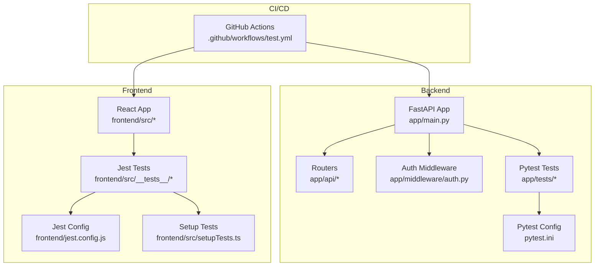
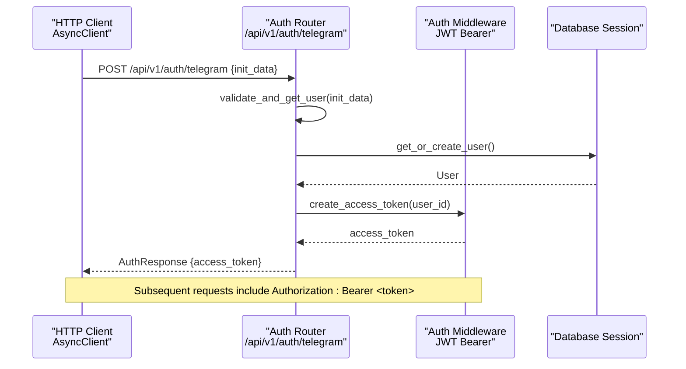
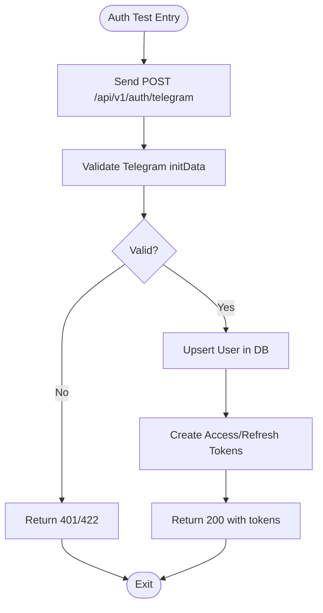
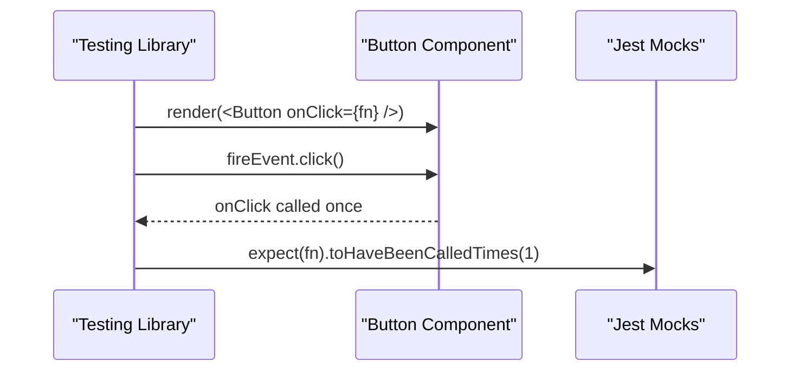
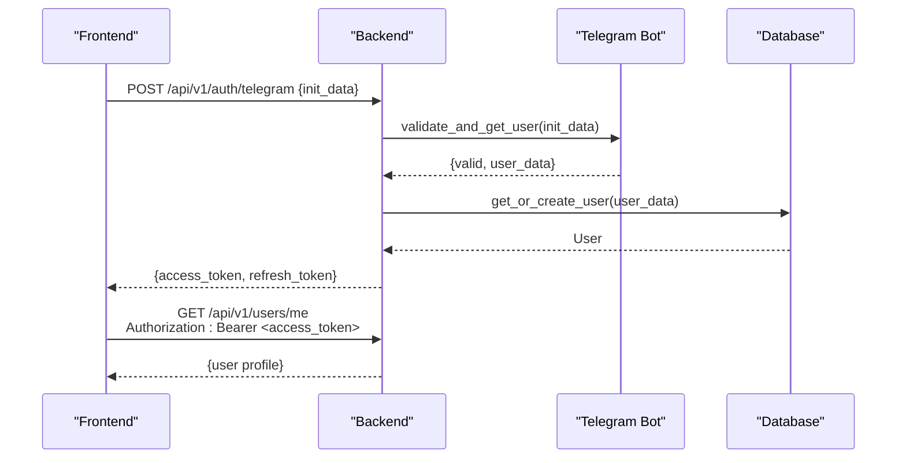
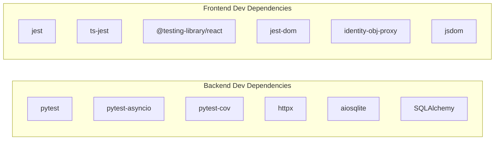
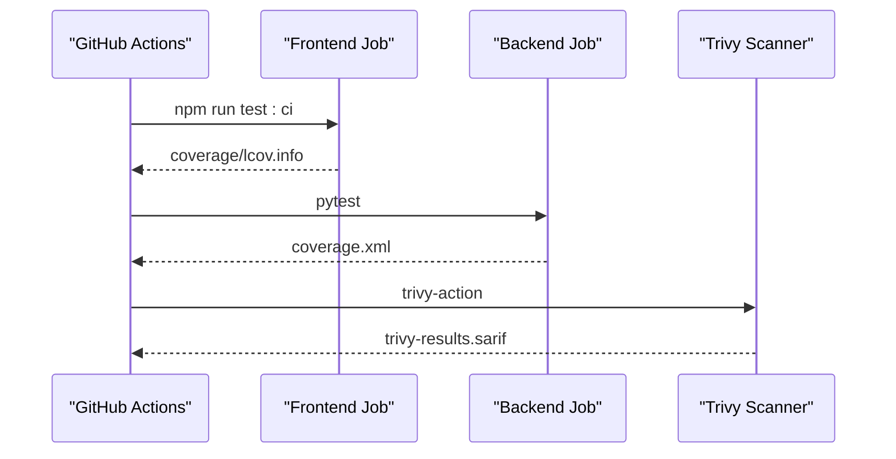

# Testing Strategy & Quality Assurance

<cite>
**Referenced Files in This Document**
- [pytest.ini](file://backend/pytest.ini)
- [conftest.py](file://backend/app/tests/conftest.py)
- [test_auth.py](file://backend/app/tests/test_auth.py)
- [test_users.py](file://backend/app/tests/test_users.py)
- [test_health.py](file://backend/app/tests/test_health.py)
- [auth.py](file://backend/app/api/auth.py)
- [auth_middleware.py](file://backend/app/middleware/auth.py)
- [main.py](file://backend/app/main.py)
- [requirements.txt](file://backend/requirements.txt)
- [jest.config.js](file://frontend/jest.config.js)
- [setupTests.ts](file://frontend/src/setupTests.ts)
- [Button.test.tsx](file://frontend/src/__tests__/components/Button.test.tsx)
- [useTimer.test.ts](file://frontend/src/__tests__/hooks/useTimer.test.ts)
- [package.json](file://frontend/package.json)
- [test.yml](file://.github/workflows/test.yml)
</cite>

## Table of Contents
1. [Introduction](#introduction)
2. [Project Structure](#project-structure)
3. [Core Components](#core-components)
4. [Architecture Overview](#architecture-overview)
5. [Detailed Component Analysis](#detailed-component-analysis)
6. [Dependency Analysis](#dependency-analysis)
7. [Performance Considerations](#performance-considerations)
8. [Security Testing Considerations](#security-testing-considerations)
9. [Continuous Integration Testing](#continuous-integration-testing)
10. [Troubleshooting Guide](#troubleshooting-guide)
11. [Conclusion](#conclusion)

## Introduction
This document outlines FitTracker Pro's comprehensive testing strategy and quality assurance approach. It covers the testing pyramid with unit, integration, and end-to-end tests, details the frameworks and configurations for backend (Pytest) and frontend (Jest), and explains test organization, naming conventions, and coverage requirements. It also provides practical examples for testing authentication flows, API endpoints, React components, and custom hooks, along with mocking strategies, test data management, and CI/CD automation.

## Project Structure
FitTracker Pro follows a clear separation of concerns:
- Backend: FastAPI application with Pytest-based tests, fixtures, and markers for categorizing tests.
- Frontend: React application with Jest and Testing Library tests, TypeScript configuration, and comprehensive mocks for Telegram WebApp and browser APIs.
- CI/CD: GitHub Actions workflows orchestrating frontend and backend tests, coverage reporting, and security scanning.

**Diagram sources**
- [main.py:1-126](file://backend/app/main.py#L1-L126)
- [auth.py:1-345](file://backend/app/api/auth.py#L1-L345)
- [auth_middleware.py:1-251](file://backend/app/middleware/auth.py#L1-L251)
- [pytest.ini:1-25](file://backend/pytest.ini#L1-L25)
- [jest.config.js:1-44](file://frontend/jest.config.js#L1-L44)
- [setupTests.ts:1-103](file://frontend/src/setupTests.ts#L1-L103)
- [test.yml:1-138](file://.github/workflows/test.yml#L1-L138)

**Section sources**
- [main.py:1-126](file://backend/app/main.py#L1-L126)
- [pytest.ini:1-25](file://backend/pytest.ini#L1-L25)
- [jest.config.js:1-44](file://frontend/jest.config.js#L1-L44)
- [setupTests.ts:1-103](file://frontend/src/setupTests.ts#L1-L103)
- [test.yml:1-138](file://.github/workflows/test.yml#L1-L138)

## Core Components
This section summarizes the testing frameworks, configurations, and conventions used across the project.

- Backend (Pytest)
  - Async support via pytest-asyncio
  - Coverage collection for app module with branch coverage
  - Markers for unit, integration, slow, and auth tests
  - Strict marker enforcement and short traceback
  - Test discovery under app/tests with conventional naming

- Frontend (Jest)
  - TypeScript with ts-jest transformer
  - jsdom test environment
  - Coverage thresholds at 80% for branches, functions, lines, and statements
  - Collect coverage from src/**/* excluding types and main entry points
  - Test file discovery via __tests__ and spec/test patterns

- CI/CD
  - Separate jobs for frontend and backend
  - Linting and type checking before tests
  - Coverage upload to Codecov
  - Security scanning with Trivy

**Section sources**
- [pytest.ini:1-25](file://backend/pytest.ini#L1-L25)
- [requirements.txt:32-42](file://backend/requirements.txt#L32-L42)
- [jest.config.js:1-44](file://frontend/jest.config.js#L1-L44)
- [package.json:6-14](file://frontend/package.json#L6-L14)
- [test.yml:1-138](file://.github/workflows/test.yml#L1-L138)

## Architecture Overview
The testing architecture aligns with the application architecture:
- Backend tests validate API endpoints, authentication flows, and middleware behavior using an in-memory SQLite database and HTTP client fixtures.
- Frontend tests validate React components and custom hooks using Testing Library and Jest mocks for Telegram WebApp and browser APIs.

**Diagram sources**
- [auth.py:95-175](file://backend/app/api/auth.py#L95-L175)
- [auth_middleware.py:21-76](file://backend/app/middleware/auth.py#L21-L76)
- [conftest.py:58-61](file://backend/app/tests/conftest.py#L58-L61)

**Section sources**
- [auth.py:95-175](file://backend/app/api/auth.py#L95-L175)
- [auth_middleware.py:21-76](file://backend/app/middleware/auth.py#L21-L76)
- [conftest.py:58-61](file://backend/app/tests/conftest.py#L58-L61)

## Detailed Component Analysis

### Backend Testing Strategy
Backend tests leverage Pytest with async fixtures and markers to categorize tests:
- Fixtures
  - Event loop fixture for async sessions
  - In-memory SQLite database creation/drop via SQLAlchemy async engine
  - HTTP client fixture for endpoint testing
  - Sample data fixtures for users and workouts
  - Telegram auth data fixture for authentication tests
  - Helper class to authenticate and manage bearer tokens for protected endpoints

- Test Categories
  - Unit tests: isolated logic verification (validation, helpers)
  - Integration tests: endpoint-level behavior with database and middleware
  - Auth tests: Telegram auth flow, token validation, protected routes

- Examples
  - Authentication endpoint tests validate missing data, invalid hash, and protected route access without/with invalid tokens.
  - User endpoints test retrieval, updates, stats, and admin-only listing.
  - Health endpoint tests verify service status and production docs configuration.

**Diagram sources**
- [auth.py:95-175](file://backend/app/api/auth.py#L95-L175)
- [test_auth.py:5-61](file://backend/app/tests/test_auth.py#L5-L61)

**Section sources**
- [conftest.py:1-149](file://backend/app/tests/conftest.py#L1-L149)
- [test_auth.py:1-81](file://backend/app/tests/test_auth.py#L1-L81)
- [test_users.py:1-86](file://backend/app/tests/test_users.py#L1-L86)
- [test_health.py:1-45](file://backend/app/tests/test_health.py#L1-L45)
- [auth.py:95-175](file://backend/app/api/auth.py#L95-L175)
- [auth_middleware.py:133-202](file://backend/app/middleware/auth.py#L133-L202)

### Frontend Testing Strategy
Frontend tests use Jest with Testing Library and comprehensive mocks:
- Environment
  - jsdom test environment
  - ts-jest transformer with React JSX
  - Module name mapping for clean imports
  - Setup file defines Telegram WebApp mocks, IntersectionObserver, matchMedia, and console suppression

- Coverage
  - Global threshold: 80% for branches, functions, lines, statements
  - Coverage collected from src/**/* excluding types and main entry points

- Examples
  - Component tests verify rendering, click handlers, loading states, variants, and disabled states.
  - Custom hook tests simulate timers, verify state transitions, and callback invocation.

**Diagram sources**
- [Button.test.tsx:1-44](file://frontend/src/__tests__/components/Button.test.tsx#L1-L44)
- [setupTests.ts:4-54](file://frontend/src/setupTests.ts#L4-L54)

**Section sources**
- [jest.config.js:1-44](file://frontend/jest.config.js#L1-L44)
- [setupTests.ts:1-103](file://frontend/src/setupTests.ts#L1-L103)
- [Button.test.tsx:1-44](file://frontend/src/__tests__/components/Button.test.tsx#L1-L44)
- [useTimer.test.ts:1-114](file://frontend/src/__tests__/hooks/useTimer.test.ts#L1-L114)

### Authentication Flow Testing
End-to-end authentication flow testing involves:
- Validating Telegram initData signature and extracting user data
- Creating/updating user records in the database
- Issuing JWT access and refresh tokens
- Enforcing Bearer token requirement for protected endpoints

**Diagram sources**
- [auth.py:95-175](file://backend/app/api/auth.py#L95-L175)
- [auth_middleware.py:133-202](file://backend/app/middleware/auth.py#L133-L202)
- [test_auth.py:48-60](file://backend/app/tests/test_auth.py#L48-L60)

**Section sources**
- [auth.py:95-175](file://backend/app/api/auth.py#L95-L175)
- [auth_middleware.py:133-202](file://backend/app/middleware/auth.py#L133-L202)
- [test_auth.py:48-60](file://backend/app/tests/test_auth.py#L48-L60)

### API Endpoint Testing Patterns
Common patterns observed in backend tests:
- Using AsyncClient to hit endpoints
- Applying pytest.mark.unit/integration for categorization
- Leveraging authenticated_client fixture for protected routes
- Skipping tests when endpoints are not fully implemented
- Verifying status codes and response shapes

Examples:
- Health check endpoint returns service status
- Root endpoint returns application metadata
- Protected user endpoints return profile data when authenticated

**Section sources**
- [test_health.py:1-45](file://backend/app/tests/test_health.py#L1-L45)
- [test_users.py:1-86](file://backend/app/tests/test_users.py#L1-L86)

### React Component Testing Patterns
Patterns observed in frontend tests:
- Rendering components with Testing Library
- Simulating user interactions (clicks)
- Asserting DOM attributes and classes
- Testing loading/disabled states
- Using beforeEach/afterAll for timer mocks

Examples:
- Button component tests validate text rendering, click handling, loading state, variants, and disabled state
- useTimer hook tests validate initialization, start/pause/reset behavior, and completion callbacks

**Section sources**
- [Button.test.tsx:1-44](file://frontend/src/__tests__/components/Button.test.tsx#L1-L44)
- [useTimer.test.ts:1-114](file://frontend/src/__tests__/hooks/useTimer.test.ts#L1-L114)

### Custom Hooks Testing
The useTimer hook is thoroughly tested:
- Initialization with default values
- Starting, pausing, resetting behavior
- Time decrementing with fake timers
- Completion callback invocation
- Proper cleanup of timers

**Section sources**
- [useTimer.test.ts:1-114](file://frontend/src/__tests__/hooks/useTimer.test.ts#L1-L114)

## Dependency Analysis
Testing dependencies and their roles:
- Backend
  - Pytest and pytest-asyncio for async test execution
  - pytest-cov for coverage reports
  - httpx for async HTTP client testing
  - aiosqlite for in-memory database during tests
  - SQLAlchemy async engine/session for database fixtures

- Frontend
  - Jest with ts-jest for TypeScript transformation
  - @testing-library/react and jest-dom for DOM assertions
  - identity-obj-proxy for CSS modules mocking
  - jsdom for DOM environment simulation

**Diagram sources**
- [requirements.txt:32-42](file://backend/requirements.txt#L32-L42)
- [jest.config.js:1-44](file://frontend/jest.config.js#L1-L44)
- [package.json:36-58](file://frontend/package.json#L36-L58)

**Section sources**
- [requirements.txt:32-42](file://backend/requirements.txt#L32-L42)
- [jest.config.js:1-44](file://frontend/jest.config.js#L1-L44)
- [package.json:36-58](file://frontend/package.json#L36-L58)

## Performance Considerations
- Backend
  - Use pytest.mark.slow to isolate heavy tests and avoid running them in CI by default.
  - Prefer in-memory SQLite for fast database tests; keep integration tests minimal and focused.
  - Use async fixtures to reduce test startup overhead.

- Frontend
  - Keep component tests small and deterministic; avoid real network calls.
  - Use fake timers for hooks to prevent flaky timing-dependent tests.
  - Limit coverage collection to relevant files to speed up reporting.

[No sources needed since this section provides general guidance]

## Security Testing Considerations
- Backend
  - Validate JWT token generation and verification logic.
  - Test unauthorized and invalid token scenarios.
  - Ensure production disables API docs and debug features.

- Frontend
  - Mock sensitive environment variables and Telegram initData during tests.
  - Avoid asserting secrets or tokens in tests; assert behavior instead.

**Section sources**
- [test_health.py:27-45](file://backend/app/tests/test_health.py#L27-L45)
- [setupTests.ts:56-67](file://frontend/src/setupTests.ts#L56-L67)

## Continuous Integration Testing
The CI pipeline automates testing and coverage reporting:
- Frontend job
  - Node.js setup, dependency installation
  - Linting and type checking
  - Running tests with coverage
  - Uploading coverage to Codecov

- Backend job
  - Python setup, dependency installation
  - PostgreSQL and Redis service containers
  - Running tests with environment variables
  - Uploading coverage to Codecov

- Security scanning
  - Trivy vulnerability scan with SARIF output for GitHub Code Scanning

**Diagram sources**
- [test.yml:1-138](file://.github/workflows/test.yml#L1-L138)

**Section sources**
- [test.yml:1-138](file://.github/workflows/test.yml#L1-L138)

## Troubleshooting Guide
Common issues and resolutions:
- Backend
  - Missing or invalid Telegram hash leads to 422/401 responses; adjust test data accordingly.
  - Protected endpoints require Bearer token; use authenticated_client fixture.
  - Database session rollbacks ensure test isolation; avoid committing outside tests.

- Frontend
  - Telegram WebApp mocks must be defined in setupTests.ts; ensure all required methods are mocked.
  - CSS modules cause import errors without identity-obj-proxy; configure moduleNameMapper.
  - Fake timers must be cleared between tests; use beforeEach/afterAll for proper lifecycle.

**Section sources**
- [test_auth.py:1-81](file://backend/app/tests/test_auth.py#L1-L81)
- [conftest.py:142-149](file://backend/app/tests/conftest.py#L142-L149)
- [setupTests.ts:4-54](file://frontend/src/setupTests.ts#L4-L54)
- [jest.config.js:17-20](file://frontend/jest.config.js#L17-L20)

## Conclusion
FitTracker Pro employs a robust testing strategy aligned with the testing pyramid. Backend tests use Pytest with async fixtures and comprehensive markers, while frontend tests leverage Jest and Testing Library with extensive mocks. CI/CD ensures automated testing, coverage reporting, and security scanning. By following the documented patterns and conventions, contributors can maintain high-quality, reliable code across the stack.