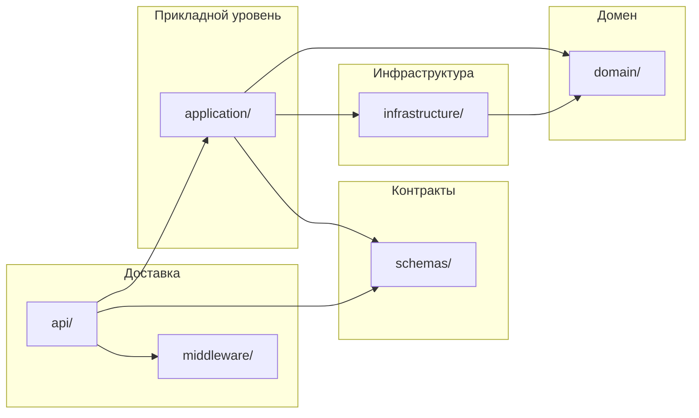

# Архитектура backend (FitTracker Pro)

Документ описывает слои Python-приложения в `backend/app`, направление зависимостей, основные bounded contexts и правила добавления новых модулей. Пути указаны относительно `backend/app`.

## 1. Слои

| Слой | Назначение | Типичные пакеты |
|------|------------|-----------------|
| **Доставка / HTTP** | Маршруты FastAPI, зависимости (`Depends`), коды ответов, тонкая маршрутизация к сценариям | `api/`, `middleware/` |
| **Прикладной уровень (application)** | Оркестрация use case: вызов репозиториев, кэша, валидация сценария, сборка ответов из Pydantic-схем | `application/` |
| **Домен** | Модели данных (SQLAlchemy ORM), доменные исключения без HTTP-смысла | `domain/` |
| **Инфраструктура** | Доступ к БД, Redis, внешним сервисам, реализации репозиториев | `infrastructure/` |
| **Контракты API** | Pydantic-модели запросов/ответов и ошибок | `schemas/` |
| **Пересекающиеся возможности** | Логирование, метрики, токены, безопасность без привязки к одному домену | `core/` |
| **Конфигурация** | Настройки из окружения | `settings/` |
| **Интеграции** | Telegram-бот, webhook | `bot/` |

Слой **middleware** и точка входа в `main.py` относятся к доставке: они оборачивают запрос (CORS, rate limit, логирование, контекст Sentry) и вызывают обработчики API.

## 2. Направление зависимостей

Правило: **внутрь к домену**, без обратных импортов из «низких» слоёв в «высокие».

Кратко:

- **`api/*`** → `application`, `schemas`, `middleware`, `infrastructure.database` (сессия БД), при необходимости `domain` только для типов вроде `User` в сигнатурах зависимостей.
- **`application/*`** → `domain` (сущности, исключения), `infrastructure.repositories` (и при необходимости `infrastructure.cache`, `feature_flags`), `schemas` для DTO.
- **`infrastructure.repositories`** → `domain` (ORM-модели), SQLAlchemy `AsyncSession`.
- **`domain/*`** → не содержит импортов из `api`, `application`, `infrastructure` (кроме общих технических зависимостей вроде SQLAlchemy `Base` в `domain/base.py`).
- **`schemas/*`** → по возможности не тянет домен и инфраструктуру; только типы и валидация для границы HTTP.

Доменные ошибки (`domain.exceptions`) переводятся в HTTP в `api/exception_handlers` — исключения не должны знать про `HTTPException` внутри слоя домена.

## 3. Основные bounded contexts

Контексты — логические границы продукта; в коде они отражаются парами/тройками **API-маршрут → сервис → репозиторий** и сущностями в `domain`.

| Контекст | Смысл | Роуты (под ` /api/v1`) | Сервисы | Ключевые сущности / артефакты |
|----------|--------|-------------------------|---------|-------------------------------|
| **Identity & Users** | Аутентификация (JWT, Telegram), профиль пользователя | `users/auth`, `users` | `auth_service`, `users_service` | `User` |
| **Training** | Шаблоны и сессии тренировок, упражнения | `workouts`, `exercises` | `workouts_service`, `exercises_service` | `WorkoutTemplate`, `WorkoutLog`, `Exercise` |
| **Health & Wellness** | Метрики здоровья, нагрузка, восстановление, глюкоза и др. | `health-metrics` | `health_service` | `DailyWellness`, `GlucoseLog`, `TrainingLoadDaily`, `MuscleLoad`, `RecoveryState` |
| **Analytics & Gamification** | Агрегаты, достижения, челленджи | `analytics`, `analytics/achievements`, `analytics/challenges` | `analytics_service`, `achievements_service`, `challenges_service` | `Achievement`, `UserAchievement`, `Challenge` |
| **System & Safety** | Здоровье API, фичефлаги, экстренные контакты | `system`, `system/emergency` | `system_service`, `emergency_service`, `health_service` (часть метрик) | `EmergencyContact` |
| **Integrations** | Внешний контур Telegram | `main.py` (`/telegram/webhook`), `bot/` | логика бота отдельно от REST-слоёв | — |

Регистрация всех HTTP-маршрутов v1 — в `api/v1/registration.py`; при добавлении нового роутера его нужно подключить там.

## 4. Правила для новых модулей

### Новая фича в существующем контексте

1. **Сущность БД** — модель в `domain/<name>.py`, наследование от `Base` из `domain/base.py`; при необходимости зарегистрировать модель в `domain/registry.py`, чтобы Alembic/миграции видели метаданные.
2. **Доступ к данным** — класс в `infrastructure/repositories/<name>_repository.py`, по образцу существующих репозиториев (часто через `SQLAlchemyRepository` из `infrastructure/repositories/base.py`).
3. **Сценарии** — методы в `application/<name>_service.py` или расширение существующего сервиса; бизнес-правила и композиция вызовов — здесь, не в роутере.
4. **HTTP** — эндпоинты в `api/v1/<name>.py`, подключение роутера в `registration.py`, теги OpenAPI — в `openapi_tags.py`.
5. **Контракты** — Pydantic-схемы в `schemas/<name>.py`.
6. **Ошибки смысла домена** — подклассы `DomainError` в `domain/exceptions.py`, маппинг на HTTP — в `api/exception_handlers.py` при необходимости.

### Новый bounded context (крупная область)

- Выделить отдельные `*_service`, репозиторий(и), схемы и роутер с префиксом под `api/v1`.
- Не смешивать чужие сущности в одном сервисе без явной причины; общие вещи (пользователь, кэш аналитики) подключать через зависимости и явные вызовы, а не через «общий god-service».

### Тесты

- Размещать в `app/tests/`; для БД использовать фикстуры из `conftest.py` и паттерн проекта.

### Технические ограничения

- Сессия БД: `get_async_db` из `infrastructure.database`.
- Аутентификация пользователя: `get_current_user` / `get_current_user_id` из `middleware.auth`.
- Кэш аналитики и инвалидация — через `infrastructure.cache`, по аналогии с существующими вызовами из сервисов.

Этого достаточно, чтобы новые модули оставались согласованными с текущей структурой `backend/app`.
