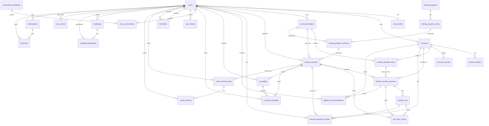

# ERD (logical) — FitTracker Pro

Источник (source of truth): **SQLAlchemy модели** (`backend/app/domain/*`) + **Alembic миграции** (`database/migrations`). Ниже — **логическое ERD**: ключевые сущности, связи и бизнес-смысл.

## Высокоуровневые домены

- **Identity**: пользователи и профиль.
- **Exercise library**: каталог упражнений и их семантика (алиасы, покрытие мышц).
- **Workout planning & tracking**: шаблоны тренировок и фактически выполненные сессии (упражнения, подходы, таймер отдыха).
- **Progress**: персональные рекорды, streak’и, достижения.
- **Programs**: планы/программы тренировок (недели → тренировки).
- **Adaptation & AI**: рекомендации по прогрессии и AI-инсайты/сообщения коуча.
- **Social**: друзья, посты о тренировках, реакции, челленджи.
- **Sync**: журнал событий синхронизации между клиентом и сервером.
- **Billing**: подписки и платежи.
- **Ops**: feature flags.

## Основные сущности и бизнес-смысл

### `users`
Пользователь Telegram (идентификация, роль, локаль/таймзона, статус). Поддерживает **soft-delete** через `deleted_at`.

- **Ключи**: `id` (UUID), `telegram_user_id` (unique).
- **Владелец данных**: почти все пользовательские данные связаны через `user_id`.

### `user_profiles`
Профиль пользователя (антропометрия, пол/дата рождения, цели/предпочтения в JSON).

- **Связь**: 1:1 с `users` (уникальный `user_id`).
- **Удаление**: cascade при удалении пользователя.

### `exercises`
Каталог упражнений: системные, пользовательские и импортированные (`source`). Поддерживает публичность/архивацию.

- **Ключи**: `id` (UUID), `(owner_id, slug)` unique.
- **Смысл**: единый справочник для шаблонов/сессий/PR/рекомендаций.

### `exercise_aliases`
Альтернативные названия упражнения (поиск/локали), с нормализацией для уникальности.

- **Связь**: M:1 к `exercises` (cascade).

### `exercise_muscles`
Покрытие мышечных групп упражнением + коэффициент нагрузки (`load_factor`).

- **Связь**: M:1 к `exercises` (cascade).
- **Смысл**: аналитика нагрузки/дисбалансов, рекомендации.

### `workout_templates`, `workout_template_items`
Шаблон тренировки и элементы (упражнение, порядок, блоки: supersets/circuits и т.п., цели по сетам/повторам/весу/RPE/отдыху).

- **Связь**: `users` 1:M `workout_templates`.
- **Связи**: `workout_templates` 1:M `workout_template_items`; `workout_template_items` M:1 `exercises`.
- **Смысл**: «план» тренировки, который может порождать сессии и входить в программы.

### `workout_sessions`, `workout_session_exercises`, `workout_sets`
Фактически выполненная тренировка (сессия) → выполненные упражнения → подходы.

- **Связь**: `users` 1:M `workout_sessions`.
- **Шаблонность**: `workout_sessions.template_id` опционально (сессия может быть создана из шаблона).
- **Упражнения в сессии**: 1:M `workout_session_exercises` (с порядком/блоками).
- **Подходы**: 1:M `workout_sets` (reps/weight/RPE/RIR, время/дистанция, отдых, флаги завершения).
- **Смысл**: основная «факт-таблица» для прогресса/аналитики/AI.

### `rest_timer_events`
События таймера отдыха (старт/пауза/завершение/скип), привязанные к сессии/упражнению/подходу (опционально).

- **Связи**: может ссылаться на `workout_sessions`, `workout_session_exercises`, `workout_sets`.
- **Смысл**: поведенческие метрики и реальный отдых vs планируемый.

### `set_history`
Аудит изменений по подходам/упражнениям: состояние «до/после», список изменённых полей, кто изменил.

- **Связи**: хранит ссылки на `workout_sets` и/или `workout_session_exercises` (оба опциональны).
- **Смысл**: трассируемость правок, отладка синка, аналитика «что меняют пользователи».

### `exercise_personal_records`
Персональные рекорды пользователя по упражнению (макс вес, 1RM, объём и т.д.) с опциональной ссылкой на источник (сет/сессия).

- **Связи**: M:1 к `users`, M:1 к `exercises`; опционально к `workout_sets` и `workout_sessions`.
- **Особенность**: уникальность по `(user_id, exercise_id, metric, unit)`.

### `training_programs`, `training_program_weeks`, `training_program_workouts`
Программа тренировок (автор, цель/сложность, публичность/маркетплейс) → недели → тренировки недели.

- **Связи**: `training_programs` 1:M `training_program_weeks` 1:M `training_program_workouts`.
- **Связь с шаблоном**: `training_program_workouts.template_id` опционально → `workout_templates`.
- **Связь с фактом**: `workout_sessions.training_program_workout_id` опционально.

### `adaptive_recommendations`
Рекомендации прогрессии/адаптации (нагрузка/повторы/отдых/делоад/свап упражнения) на пользователя, опционально на упражнение или конкретное упражнение в сессии.

- **Связи**: M:1 к `users`; опционально M:1 к `exercises` и/или `workout_session_exercises`.
- **Смысл**: слой «решений», которые пользователь может применить/отклонить.

### `ai_insights`, `ai_coach_messages`
AI-инсайты (резюме сессии, предупреждения, советы) и сообщения в диалоге «коуча».

- **Связи**: `ai_insights` M:1 к `users`, опционально M:1 к `workout_sessions`.
- **Сообщения**: `ai_coach_messages` M:1 к `users`, опционально к `ai_insights` и/или `workout_sessions`.

### `achievement_definitions`, `user_achievements`, `user_streaks`
Определения достижений и полученные достижения пользователя + счётчики streak’ов (тип, текущий/максимальный, даты).

- **Связи**: `achievement_definitions` 1:M `user_achievements`; `users` 1:M `user_achievements`.
- **Streak**: `users` 1:M `user_streaks` с уникальностью `(user_id, streak_type)`.

### `friendships`
Связь «пользователь ↔ пользователь» со статусом (pending/accepted/blocked и т.п.).

- **Связи**: две ссылки на `users` (requester/addressee), уникальность пары.

### `social_workout_posts`, `social_reactions`
Социальные публикации о тренировке (опционально связаны с `workout_sessions`) и реакции на них.

- **Связи**: `users` 1:M `social_workout_posts`; опционально M:1 к `workout_sessions`.
- **Реакции**: `social_workout_posts` 1:M `social_reactions`; `users` 1:M `social_reactions`.
- **Особенность**: уникальная реакция пользователя на пост `(post_id, user_id)`.

### `challenges`, `challenge_participants`
Челленджи (тип/период/цель/правила) и участие пользователей с прогрессом/рангом.

- **Связи**: `challenges` 1:M `challenge_participants`; `users` 1:M `challenge_participants`.
- **Создатель**: `creator_id` у `challenges` опционален (set null).

### `sync_events`
Журнал синхронизации (клиентские события) для offline-first: тип сущности, операция, направление, статус, payload/конфликт.

- **Связи**: M:1 к `users`.
- **Особенность**: уникальность `(user_id, client_event_id)`.

### `subscriptions`, `payments`
Подписки пользователя и связанные платежи (provider ids, статусы, период, суммы/валюта).

- **Связи**: `users` 1:M `subscriptions`, `users` 1:M `payments`, `subscriptions` 1:M `payments` (опционально).

### `feature_flags`
Фича-флаги (простая операционная таблица для включения/выключения поведения).

## Ключевые связи (кардинальности)

Нотация: `A ||--o{ B` означает «A 1 → N B», `A ||--|| B` означает «1 → 1».

## Практические заметки

- **Soft-delete**: `users.deleted_at`, `workout_sessions.deleted_at` (и часть сущностей имеют `is_archived`/`is_deleted` флаги). В запросах важно учитывать «живые» записи.
- **Денормализация метрик**: у `workout_sessions` и `workout_session_exercises` есть агрегаты (`total_volume_kg`, `volume_kg`, `performed_sets` и т.п.) — это ускоряет выдачу и аналитику.
- **Опциональные связи источника**: PR/AI/посты/рекомендации могут ссылаться на сессию/сет/упражнение, но не обязаны — это позволяет создавать сущности «вне контекста» (например, общий совет).
